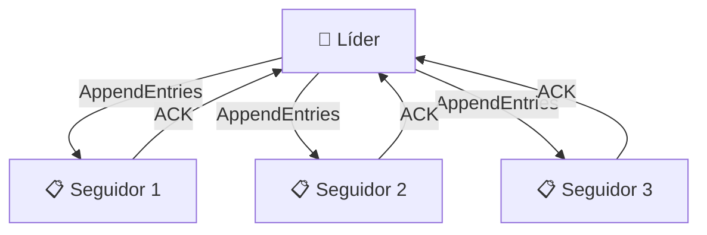
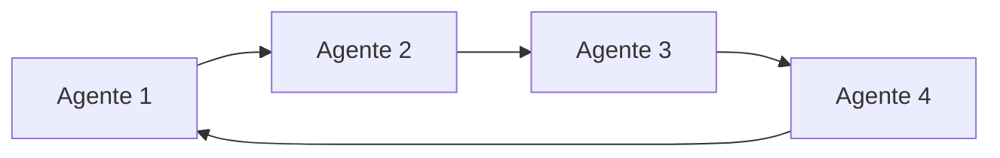
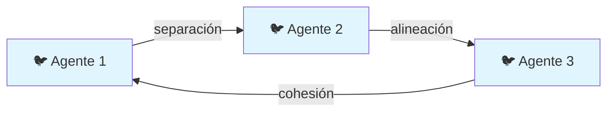

# ⚖️ Coordinación y Consenso

Un sistema multi-agente (MAS) no es meramente una colección de entidades comunicativas; es una organización que debe **coordinar acciones** y **alcanzar acuerdos** para que sus esfuerzos individuales converjan hacia un objetivo global. La coordinación aborda el *"qué hacemos juntos"*, mientras que el consenso resuelve el *"en qué estamos de acuerdo"*. En el contexto de ML e IA, estos problemas son especialmente agudos cuando los agentes operan con modelos diferentes, datos parciales o incentivos potencialmente divergentes.

---

## 1. El Problema de Coordinación

El problema de coordinación surge cuando múltiples agentes intentan ejecutar acciones que interfieren entre sí, compiten por recursos escasos o deben sincronizarse para lograr un efecto conjunto.

**Ejemplo clásico:** Dos agentes robóticos en un almacén intentan mover la misma caja simultáneamente desde direcciones opuestas. Sin coordinación, la caja no se mueve o los robots colisionan.

Formalmente, sea $A = \{a_1, a_2, \ldots, a_n\}$ el conjunto de agentes y $\mathcal{A}_i$ el conjunto de acciones posibles para el agente $a_i$. El espacio de acciones conjuntas es:

$$\mathcal{A} = \mathcal{A}_1 \times \mathcal{A}_2 \times \ldots \times \mathcal{A}_n$$

Una asignación de acciones $\vec{a} = (a_1, \ldots, a_n) \in \mathcal{A}$ es **coordinada** si maximiza una función de utilidad global $U: \mathcal{A} \to \mathbb{R}$ o satisface un conjunto de restricciones de consistencia $\mathcal{C}$.

⚠️ **Advertencia:** Maximizar la utilidad global puede requerir que agentes individuales acepten acciones subóptimas desde su perspectiva local. Esto introduce tensiones entre racionalidad individual y racionalidad grupal.

---

## 2. Mecanismos de Coordinación

### 2.1 Voting (Votación)

Cuando los agentes deben elegir entre un conjunto discreto de opciones $\mathcal{O} = \{o_1, \ldots, o_m\}$, la votación es el mecanismo más directo.

**Mayoría simple:**

$$o^* = \arg\max_{o \in \mathcal{O}} \sum_{i=1}^{n} \mathbb{I}[v_i = o]$$

Donde $v_i$ es el voto del agente $i$ y $\mathbb{I}$ es la función indicadora.

**Votación ponderada:** Cada agente tiene un peso $w_i$ según su confianza, historial o especialización:

$$o^* = \arg\max_{o \in \mathcal{O}} \sum_{i=1}^{n} w_i \cdot \mathbb{I}[v_i = o]$$

> 💡 **Tip:** En MAS heterogéneos, asigna pesos mayores a agentes cuya especialización es más relevante para la decisión actual. Por ejemplo, en análisis financiero, el agente técnico podría tener mayor peso en decisiones de corto plazo.

**Caso real:** Los sistemas de recomendación federada utilizan votación ponderada de múltiples modelos locales (agentes) para producir una recomendación global sin centralizar datos privados de usuarios.

### 2.2 Algoritmos de Consenso

El consenso distribuido garantiza que todos los agentes no fallidos acuerden un valor común, incluso ante la presencia de agentes maliciosos o fallos de comunicación.

#### Raft (adaptado para agentes)

Raft es un algoritmo de consenso que elige un **líder** para gestionar el log de operaciones. Los seguidores replican el log del líder.



**Propiedades de seguridad:**
- Election Safety: como máximo un líder por término.
- Log Matching: si dos logs tienen una entrada con el mismo índice y término, son idénticos hasta ese punto.
- Leader Completeness: si un log entry está comprometido en un término, estará presente en los líderes futuros.

⚠️ **Advertencia:** Raft asume un modelo de fallos por detención (*fail-stop*). Si los agentes pueden comportarse de manera bizantina (enviar información maliciosa), Raft no es suficiente.

#### PBFT (Practical Byzantine Fault Tolerance)

PBFT tolera hasta $f$ agentes bizantinos si el total de agentes es $n \geq 3f + 1$. Funciona en tres fases: `REQUEST`, `PRE-PREPARE`, `PREPARE`, `COMMIT`.

$$n > 3f \implies \text{consenso seguro es posible}$$

**Caso real:** Hyperledger Fabric utiliza PBFT (y sus variantes) para alcanzar consenso entre nodos validadores en redes blockchain empresariales. En MAS financieros, esto permite que agentes de diferentes instituciones compartan el estado de un libro mayor sin confiar mutuamente.

### 2.3 Leader Election

La elección de líder distribuye la autoridad de decisión. Algoritmos como *Bully* o *Ring* son clásicos:

- **Bully Algorithm:** El agente con el ID más alto reclama el liderazgo. Si el líder actual falla, los agentes detectan la ausencia de heartbeats y eligen al siguiente ID más alto.

$$\text{Líder} = \arg\max_{i \in \text{activos}} \text{ID}_i$$

- **Ring Algorithm:** Los agentes se organizan en un anillo lógico. Un token de elección circula hasta que un agente con mayor prioridad lo captura.



---

## 3. Asignación de Tareas y Balanceo de Carga

### 3.1 Task Allocation

Dado un conjunto de tareas $\mathcal{T}$ y un conjunto de agentes $\mathcal{A}$, la asignación óptima minimiza el costo global:

$$\min_{\sigma: \mathcal{T} \to \mathcal{A}} \sum_{t \in \mathcal{T}} C(\sigma(t), t)$$

Sujeto a:
- Capacidad: $\sum_{t: \sigma(t)=a} \text{load}(t) \leq \text{capacity}(a)$
- Compatibilidad: $\text{skills}(a) \cap \text{reqs}(t) \neq \emptyset$

Donde $C(a, t)$ es el costo de asignar la tarea $t$ al agente $a$.

**Algoritmos:**
- **Hungarian Algorithm:** Para asignación bipartita óptima en tiempo $O(n^3)$.
- **Contract Net Protocol:** Ver [[02 - Comunicacion entre Agentes]] para negociación descentralizada.
- **Market-based:** Los agentes pujan por tareas en una subasta continua.

### 3.2 Load Balancing

Distribuir dinámicamente la carga de trabajo para evitar que algunos agentes se saturen mientras otros están ociosos.

**Métrica de desbalance:**

$$\text{Imbalance} = \frac{\max_i L_i - \min_i L_i}{\bar{L}}$$

Donde $L_i$ es la carga del agente $i$ y $\bar{L}$ es la carga promedio.

> 💡 **Tip:** En MAS con LLMs, el "costo" de una tarea puede medirse en tokens de entrada/salida o tiempo de inferencia. Un agente que procesa prompts largos requiere mayor capacidad computacional que uno que ejecuta regex simples.

---

## 4. Resolución de Conflictos

Los conflictos surgen cuando:
- Dos agentes reclaman el mismo recurso exclusivo.
- Sus objetivos locales son mutuamente excluyentes.
- Sus creencias sobre el estado del mundo son inconsistentes.

### 4.1 Estrategias de Resolución

| Estrategia | Descripción | Cuándo Usar |
|------------|-------------|-------------|
| **Negociación** | Intercambio de concesiones hasta acuerdo | Recursos divisibles, relación a largo plazo |
| **Mediación** | Tercero neutral propone solución | Alta polarización, poder asimétrico |
| **Arbitraje** | Tercero impone solución vinculante | Urgencia, negociación fallida |
| **Prioridad estática** | Reglas predefinidas rompen empates | Sistemas críticos de tiempo real |
| **Subasta** | Mercado determina asignación | Recursos escasos con valoraciones claras |

**Caso real:** En sistemas de tráfico aéreo automatizado, los conflictos de trayectoria entre aeronomas (agentes) se resuelven mediante mediación de un controlador central que impone restricciones de altitud o velocidad basadas en prioridades de llegada.

---

## 5. Teoría de Juegos en MAS

La teoría de juegos proporciona el lenguaje matemático para analizar interacciones estratégicas entre agentes racionales.

### 5.1 Juegos No Cooperativos y Equilibrio de Nash

Un **juego** se define como $G = \langle N, (S_i)_{i \in N}, (u_i)_{i \in N} \rangle$, donde:
- $N$ es el conjunto de jugadores (agentes).
- $S_i$ es el conjunto de estrategias del agente $i$.
- $u_i: S_1 \times \ldots \times S_n \to \mathbb{R}$ es la función de utilidad del agente $i$.

Un perfil de estrategias $(s_1^*, \ldots, s_n^*)$ es un **Equilibrio de Nash** si:

$$u_i(s_i^*, s_{-i}^*) \geq u_i(s_i, s_{-i}^*) \quad \forall s_i \in S_i, \forall i \in N$$

Es decir, ningún agente puede mejorar su utilidad unilateralmente cambiando de estrategia.

**Ejemplo: Dilema del Prisionero en MAS**

| | Cooperar | Traicionar |
|---|---|---|
| **Cooperar** | (3, 3) | (0, 5) |
| **Traicionar** | (5, 0) | (1, 1) |

El único equilibrio de Nash es (Traicionar, Traicionar), aunque (Cooperar, Cooperar) es socialmente óptimo. Esto ilustra por qué los mecanismos de coordinación explícitos son necesarios.

⚠️ **Advertencia:** En MAS diseñados para cooperar, un equilibrio de Nash deficiente puede destruir valor agregado. Los diseñadores deben crear **mecanismos de incentivos** que alineen los equilibrios de Nash con el óptimo social.

### 5.2 Juegos Cooperativos

Cuando los agentes pueden formar **coaliciones** y redistribuir la ganancia conjunta, el problema se modela como un juego cooperativo $(N, v)$, donde $v: 2^N \to \mathbb{R}$ es la función característica que asigna un valor a cada coalición.

El **valor de Shapley** asigna a cada agente su contribución marginal promedio:

$$\phi_i(v) = \sum_{S \subseteq N \setminus \{i\}} \frac{|S|!(n - |S| - 1)!}{n!} \left[ v(S \cup \{i\}) - v(S) \right]$$

> 💡 **Tip:** El valor de Shapley es la métrica justa para atribuir crédito en equipos de agentes. Por ejemplo, si un agente de datos y un agente de modelo generan una predicción exitosa, el Shapley value evita que el último agente en la cadena se lleve todo el crédito.

**Caso real:** Los mercados de electricidad distribuida utilizan juegos cooperativos para que microrredes (agentes) formen coaliciones de compra/venta de energía, maximizando beneficios conjuntos mediante el reparto justo basado en Shapley.

---

## 6. Comportamiento Emergente y Autoorganización

Uno de los fenómenos más fascinantes de los MAS es que comportamientos complejos pueden **emerger** de reglas locales simples sin planificación central.

### 6.1 Emergent Behavior

El comportamiento emergente no está programado explícitamente en ningún agente individual, sino que es una propiedad del sistema completo.

$$B_{\text{emergente}} = f(A, \mathcal{I}) \not\in \bigcup_{i} \text{Program}(a_i)$$

Donde $f$ es la dinámica del sistema, $A$ es el conjunto de agentes, $\mathcal{I}$ son las interacciones y $\text{Program}(a_i)$ es el comportamiento explícito del agente $i$.

**Ejemplo clásico:** Las bandadas de aves (modelo Boids) siguen tres reglas locales:
1. Separación: evitar congestión local.
2. Alineación: dirigirse al vector promedio de velocidad de los vecinos.
3. Cohesión: dirigirse al centro de masa de los vecinos.

Resultado emergente: formaciones de vuelo realistas sin un "liderazgo" central explícito.



### 6.2 Self-Organization

La autoorganización es la capacidad de un sistema para reorganizar su estructura interna en respuesta a cambios ambientales sin intervención externa directa.

**Mecanismos de autoorganización en MAS:**
- **Stigmergia:** Los agentes modifican el entorno (por ejemplo, dejando feromonas virtuales) y otros agentes responden a esas modificaciones.
- **Gossip protocols:** Los agentes intercambian información con pares aleatorios hasta que el conocimiento se homogeniza.
- **Reinforcement Learning colectivo:** Los agentes aprenden políticas locales que, en conjunto, optimizan una recompensa global.

**Caso real:** El algoritmo de routing de redes de telecomunicaciones *AntNet* utiliza stigmergia digital para que paquetes de datos (agentes) encuentren rutas óptimas de forma autoorganizada, adaptándose a congestiones en tiempo real.

---

## 7. Implementación de Coordinación y Consenso

El siguiente código implementa votación ponderada y un esquema simplificado de consenso por mayoría con detección de quorum:

```python
from typing import List, Dict
from collections import defaultdict
import statistics

class Vote:
    def __init__(self, agent_id: str, option: str, weight: float = 1.0):
        self.agent_id = agent_id
        self.option = option
        self.weight = weight

class ConsensusEngine:
    def __init__(self, quorum_ratio: float = 0.5):
        self.quorum_ratio = quorum_ratio

    def weighted_vote(self, votes: List[Vote]) -> Dict:
        scores = defaultdict(float)
        total_weight = 0.0
        for v in votes:
            scores[v.option] += v.weight
            total_weight += v.weight
        winner = max(scores, key=scores.get)
        return {
            "winner": winner,
            "scores": dict(scores),
            "total_weight": total_weight,
            "confidence": scores[winner] / total_weight
        }

    def byzantine_quorum(self, votes: List[Vote], total_agents: int) -> Dict:
        n_byzantine = (total_agents - 1) // 3  # Tolerancia máxima PBFT
        required = int(total_agents * self.quorum_ratio)
        if len(votes) < required:
            return {"status": "INSUFFICIENT_VOTES", "required": required}

        result = self.weighted_vote(votes)
        # Heurística: si el ganador supera 2/3, asumimos consenso seguro
        if result["confidence"] >= 0.66:
            return {"status": "CONSENSUS_REACHED", **result}
        return {"status": "NO_CONSENSUS", **result}

# Simulación de consenso entre analistas de mercado
votes = [
    Vote("TechAnalyst", "BUY", weight=0.4),
    Vote("FundAnalyst", "BUY", weight=0.3),
    Vote("Sentiment", "HOLD", weight=0.3),
]

engine = ConsensusEngine(quorum_ratio=0.6)
result = engine.byzantine_quorum(votes, total_agents=3)
print(result)
```

---

📦 **Código de compresión:**

```python
# Micro-biblioteca de coordinación
class Quorum:
    def __init__(self, n, f=None):
        self.n = n
        self.f = f or (n - 1) // 3

    def check(self, votes):
        if len(votes) < 2 * self.f + 1:
            return False
        return max(votes.count(x) for x in set(votes)) >= self.n - self.f

class TaskAllocator:
    def __init__(self, agents, tasks):
        self.agents = agents
        self.tasks = tasks

    def greedy_assign(self):
        assign = {}
        free = set(self.agents)
        for t in sorted(self.tasks, key=lambda x: -x['load']):
            if not free:
                break
            best = min(free, key=lambda a: a.get('load', 0))
            assign[t['id']] = best['id']
            best['load'] = best.get('load', 0) + t['load']
        return assign

# Uso
q = Quorum(5)
print("Quorum válido?", q.check(['A','A','A','B','B']))
```

---

🎯 **Proyecto documentado — Paso 3: Coordinación y Consenso del Equipo de Análisis de Mercado**

Para nuestro sistema financiero multi-agente, definimos los siguientes mecanismos de coordinación:

1. **Asignación de tareas:** El `Coordinator` utiliza un modelo de mercado continuo. Cuando un símbolo bursátil requiere análisis, el Coordinador publica un "contrato" en el tópico `tasks/auction`. Cada analista puja con un costo estimado (tiempo de procesamiento). El Coordinador adjudica la tarea al postor con mejor ratio confianza/costo.

2. **Consenso de recomendación:** Tras recibir los informes individuales (`BUY`, `HOLD`, `SELL`), el Coordinador ejecuta votación ponderada:
   - Peso técnico: $w_{\text{tech}} = 0.35$
   - Peso fundamental: $w_{\text{fund}} = 0.35$
   - Peso sentimiento: $w_{\text{sent}} = 0.30$

   La recomendación final se determina por:

   $$R = \arg\max_{r \in \{BUY, HOLD, SELL\}} \sum_{i} w_i \cdot \mathbb{I}[\text{vote}_i = r]$$

   Se requiere un quorum del 60% para emitir una recomendación con confianza alta. Si no se alcanza, el sistema emite `HOLD` como fallback conservador.

3. **Resolución de conflictos:** Si el agente técnico emite `SELL` y el fundamental `BUY`, el Coordinador activa un protocolo de debate interno donde cada agente proporciona su justificación. El Coordinador evalúa las argumentaciones mediante un LLM evaluador (*Judge-Evaluator pattern*) y ajusta los pesos dinámicamente para esa decisión específica.

→ Continúa en [[04 - Caso Practico - Equipo de Agentes para Analisis de Mercado]] para la integración completa.
