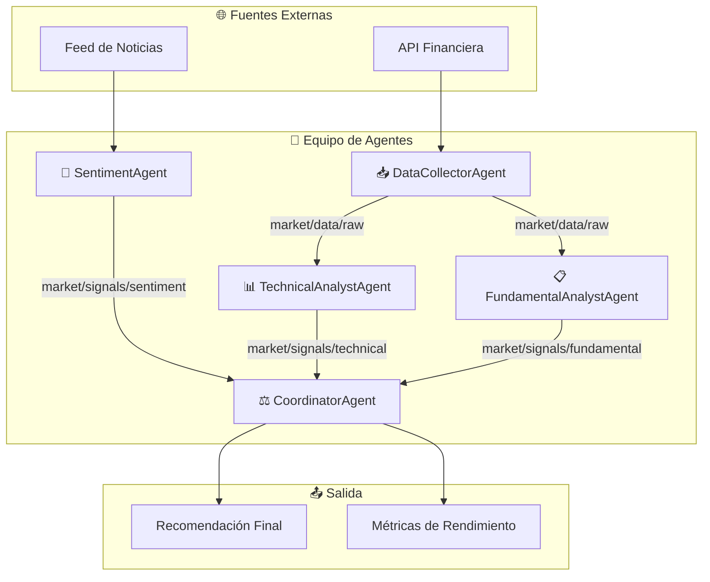
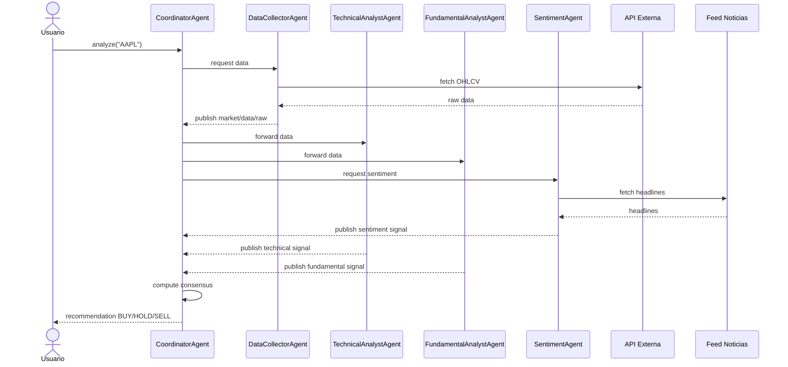

# 📈 Caso Práctico: Equipo de Agentes para Análisis de Mercado

Esta nota integra los conceptos de arquitectura, comunicación y coordinación en un proyecto funcional: un **equipo de agentes autónomos** que analiza mercados financieros y emite recomendaciones de inversión consensuadas. En el contexto de la ingeniería de ML e IA, este caso práctico demuestra cómo descomponer un problema complejo (predicción de mercado) en agentes especializados que operan de forma concurrente, se comunican mediante un bus de mensajes y convergen en una decisión colectiva mediante votación ponderada.

---

## 1. Visión General del Sistema

El sistema simula un equipo de analistas financieros donde cada "analista" es un agente independiente con responsabilidades bien definidas. Un agente coordinador orquesta el flujo de trabajo, recopila opiniones y sintetiza la recomendación final.



**Caso real:** Las firmas de *quantitative trading* como Renaissance Technologies y Two Sigma utilizan pipelines de datos donde múltiples modelos especializados (técnicos, fundamentales, de sentimiento) generan señales que un modelo de combinación (meta-modelo) pondera para decisiones de trading. Nuestro MAS replica esta arquitectura con agentes autónomos comunicativos.

---

## 2. Agentes Especializados

### 2.1 DataCollectorAgent

Responsable de adquirir datos de mercado desde APIs externas (simuladas en este ejemplo). Publica datos crudos en el bus de mensajes.

**Entradas:** Símbolo bursátil (ticker), rango de fechas.
**Salidas:** Mensajes en `market/data/raw` con precios OHLCV.

```python
import random
from datetime import datetime, timedelta

class DataCollectorAgent:
    def __init__(self, agent_id: str, bus):
        self.agent_id = agent_id
        self.bus = bus

    def fetch(self, symbol: str, days: int = 30):
        data = []
        base_price = random.uniform(100, 300)
        for i in range(days):
            date = datetime.utcnow() - timedelta(days=days - i)
            noise = random.gauss(0, base_price * 0.02)
            close = max(1.0, base_price + noise)
            data.append({
                "date": date.strftime("%Y-%m-%d"),
                "open": round(close * random.uniform(0.98, 1.00), 2),
                "high": round(close * random.uniform(1.00, 1.03), 2),
                "low": round(close * random.uniform(0.97, 1.00), 2),
                "close": round(close, 2),
                "volume": int(random.uniform(1e6, 5e7))
            })
            base_price = close
        self.bus.publish("market/data/raw", {
            "sender": self.agent_id,
            "symbol": symbol,
            "data": data
        })
        return data
```

> 💡 **Tip:** En producción, reemplaza el generador aleatorio por integraciones con APIs reales como Alpha Vantage, Yahoo Finance o Polygon.io. Implementa un mecanismo de caché para evitar rate limits.

### 2.2 TechnicalAnalystAgent

Analiza los datos crudos para calcular indicadores técnicos y emitir una señal discreta.

**Indicadores implementados:**
- **RSI (Relative Strength Index):** Momentum de precios.
- **MACD (Moving Average Convergence Divergence):** Tendencia y momentum combinados.

**Señal de salida:**

$$\text{signal}_{\text{tech}} = \begin{cases}
BUY & \text{if RSI} < 30 \text{ y MACD} > 0 \\
SELL & \text{if RSI} > 70 \text{ y MACD} < 0 \\
HOLD & \text{en otro caso}
\end{cases}$$

```python
class TechnicalAnalystAgent:
    def __init__(self, agent_id: str, bus):
        self.agent_id = agent_id
        self.bus = bus
        bus.subscribe("market/data/raw", self.on_data)

    def on_data(self, msg):
        if msg.get("topic") != "market/data/raw":
            return
        symbol = msg["payload"]["symbol"]
        closes = [d["close"] for d in msg["payload"]["data"]]
        signal = self._analyze(closes)
        self.bus.publish("market/signals/technical", {
            "sender": self.agent_id,
            "symbol": symbol,
            "signal": signal["action"],
            "rsi": signal["rsi"],
            "macd": signal["macd"],
            "confidence": signal["confidence"]
        })

    def _analyze(self, closes: list) -> dict:
        # RSI simplificado (ventana de 14)
        rsi = self._rsi(closes, 14)
        macd = self._macd(closes)
        if rsi < 30 and macd > 0:
            action, conf = "BUY", min(1.0, (30 - rsi) / 30 + macd)
        elif rsi > 70 and macd < 0:
            action, conf = "SELL", min(1.0, (rsi - 70) / 30 + abs(macd))
        else:
            action, conf = "HOLD", 0.5
        return {"action": action, "rsi": round(rsi, 2), "macd": round(macd, 4), "confidence": round(conf, 2)}

    def _rsi(self, closes, window=14):
        if len(closes) < window + 1:
            return 50.0
        deltas = [closes[i] - closes[i-1] for i in range(1, len(closes))]
        gains = [d if d > 0 else 0 for d in deltas[-window:]]
        losses = [-d if d < 0 else 0 for d in deltas[-window:]]
        avg_gain = sum(gains) / window
        avg_loss = sum(losses) / window
        if avg_loss == 0:
            return 100.0
        rs = avg_gain / avg_loss
        return 100 - (100 / (1 + rs))

    def _macd(self, closes, fast=12, slow=26):
        if len(closes) < slow:
            return 0.0
        ema_fast = sum(closes[-fast:]) / fast
        ema_slow = sum(closes[-slow:]) / slow
        return (ema_fast - ema_slow) / ema_slow
```

### 2.3 FundamentalAnalystAgent

Evalúa métricas fundamentales simuladas (P/E ratio, crecimiento de EPS) para emitir señales de largo plazo.

```python
class FundamentalAnalystAgent:
    def __init__(self, agent_id: str, bus):
        self.agent_id = agent_id
        self.bus = bus
        bus.subscribe("market/data/raw", self.on_data)

    def on_data(self, msg):
        symbol = msg["payload"]["symbol"]
        price = msg["payload"]["data"][-1]["close"]
        # Métricas simuladas
        eps = random.uniform(5, 20)
        pe_ratio = price / eps if eps else float('inf')
        eps_growth = random.uniform(-0.2, 0.5)

        if pe_ratio < 15 and eps_growth > 0.1:
            action, conf = "BUY", min(1.0, 0.5 + eps_growth)
        elif pe_ratio > 30 or eps_growth < -0.1:
            action, conf = "SELL", min(1.0, 0.5 + abs(eps_growth))
        else:
            action, conf = "HOLD", 0.5

        self.bus.publish("market/signals/fundamental", {
            "sender": self.agent_id,
            "symbol": symbol,
            "signal": action,
            "pe_ratio": round(pe_ratio, 2),
            "eps_growth": round(eps_growth, 2),
            "confidence": round(conf, 2)
        })
```

### 2.4 SentimentAgent

Procesa feeds de noticias simulados y produce un score de sentimiento en el rango $[-1, 1]$.

```python
class SentimentAgent:
    def __init__(self, agent_id: str, bus):
        self.agent_id = agent_id
        self.bus = bus

    def analyze(self, symbol: str, headlines: list):
        # Simulación: score promedio de headlines
        scores = [random.uniform(-1, 1) for _ in headlines]
        avg_score = sum(scores) / len(scores) if scores else 0.0

        if avg_score > 0.3:
            action = "BUY"
        elif avg_score < -0.3:
            action = "SELL"
        else:
            action = "HOLD"

        self.bus.publish("market/signals/sentiment", {
            "sender": self.agent_id,
            "symbol": symbol,
            "signal": action,
            "sentiment_score": round(avg_score, 3),
            "source_count": len(headlines),
            "confidence": round(abs(avg_score), 2)
        })
```

### 2.5 CoordinatorAgent

El cerebro del sistema. Recibe señales, ejecuta consenso ponderado y emite la recomendación final.

```python
from collections import defaultdict

class CoordinatorAgent:
    def __init__(self, agent_id: str, bus, weights=None):
        self.agent_id = agent_id
        self.bus = bus
        self.weights = weights or {"technical": 0.35, "fundamental": 0.35, "sentiment": 0.30}
        self.votes = defaultdict(list)
        self.expected_signals = 3
        bus.subscribe("market/signals/technical", self.on_signal)
        bus.subscribe("market/signals/fundamental", self.on_signal)
        bus.subscribe("market/signals/sentiment", self.on_signal)

    def on_signal(self, msg):
        topic = msg.get("topic", "")
        payload = msg.get("payload", {})
        self.votes[payload["symbol"]].append({
            "type": topic.split("/")[-1],
            "signal": payload["signal"],
            "confidence": payload.get("confidence", 0.5)
        })
        if len(self.votes[payload["symbol"]]) >= self.expected_signals:
            self._decide(payload["symbol"])

    def _decide(self, symbol: str):
        votes = self.votes[symbol]
        scores = defaultdict(float)
        total_conf = 0.0
        for v in votes:
            w = self.weights.get(v["type"], 0.33)
            scores[v["signal"]] += w * v["confidence"]
            total_conf += w * v["confidence"]

        if not scores:
            return

        winner = max(scores, key=scores.get)
        confidence = scores[winner] / total_conf if total_conf > 0 else 0.0

        # Fallback a HOLD si confianza insuficiente
        if confidence < 0.55:
            winner = "HOLD"

        result = {
            "symbol": symbol,
            "recommendation": winner,
            "confidence": round(confidence, 3),
            "breakdown": dict(scores)
        }
        self.bus.publish("market/recommendation/final", {
            "sender": self.agent_id,
            "payload": result
        })
        print(f"🎯 Coordinator: {symbol} -> {winner} (conf={confidence:.2f})")
```

---

## 3. Pipeline de Datos y Comunicación

El pipeline completo conecta las fases de recolección, análisis y decisión. Utilizamos el bus de mensajes implementado en la Nota 02.

```python
from typing import Dict, List, Callable

class MessageBus:
    def __init__(self):
        self._subscriptions: Dict[str, List[Callable]] = {}
        self._history: List[dict] = []

    def subscribe(self, topic: str, callback: Callable):
        self._subscriptions.setdefault(topic, []).append(callback)

    def publish(self, topic: str, payload: dict):
        msg = {"topic": topic, "payload": payload}
        self._history.append(msg)
        for cb in self._subscriptions.get(topic, []):
            cb(msg)

# Inicialización del sistema
bus = MessageBus()
collector = DataCollectorAgent("Collector-01", bus)
tech = TechnicalAnalystAgent("Tech-01", bus)
fund = FundamentalAnalystAgent("Fund-01", bus)
sentiment = SentimentAgent("Sent-01", bus)
coordinator = CoordinatorAgent("Coord-01", bus)

# Ejecución
symbol = "AAPL"
collector.fetch(symbol, days=60)

# Simulación de noticias para el agente de sentimiento
sentiment.analyze(symbol, headlines=["Earnings beat expectations", "New product launch", "Regulatory concerns"])
```

> 💡 **Tip:** Para hacer el pipeline robusto, envuelve cada `on_data` en un bloque try/except y publica errores en un tópico de dead-letter como `system/errors`. Esto evita que un agente malformado detenga todo el flujo.

⚠️ **Advertencia:** El ejemplo anterior es síncrono para claridad didáctica. En producción, cada agente debe ejecutarse en su propio hilo/proceso o contenedor, y el bus debe ser un broker real (Redis, RabbitMQ) con persistencia de mensajes.

---

## 4. Consenso de Recomendación

El Coordinador implementa un consenso ponderado donde los pesos reflejan la fiabilidad histórica de cada especialidad. Si la confianza del consenso es insuficiente, el sistema puede activar un mecanismo de **debate iterativo**:

1. El Coordinador publica `market/debate/start` con las señales disidentes.
2. Cada agente analista recibe las argumentaciones de los demás y puede ajustar su señal.
3. Tras un máximo de 3 rondas, el Coordinador vuelve a computar el consenso.

**Fórmula de consenso ponderado con confianza adaptativa:**

$$\text{score}(r) = \sum_{i \in \{\text{tech}, \text{fund}, \text{sent}\}} w_i \cdot c_i \cdot \mathbb{I}[s_i = r]$$

Donde $w_i$ es el peso base del agente, $c_i$ es su confianza auto-reportada y $s_i$ es su señal.

---

## 5. Métricas de Rendimiento

Evaluamos al equipo de agentes con métricas financieras estándar simuladas.

### 5.1 Precisión de Predicción Direccional

$$\text{Accuracy} = \frac{\text{predicciones correctas}}{\text{total de predicciones}}$$

Una predicción es correcta si la recomendación (`BUY`/`SELL`) coincide con la dirección real del precio en el siguiente período.

### 5.2 Sharpe Ratio Simulado

El Sharpe ratio mide el retorno ajustado por riesgo. Simulamos un backtest donde seguimos las recomendaciones del MAS:

$$S = \frac{E[R_p - R_f]}{\sigma_p}$$

Donde:
- $R_p$ es el retorno del portafolio siguiendo al MAS.
- $R_f$ es la tasa libre de riesgo (asumida 0 para simplicidad).
- $\sigma_p$ es la desviación estándar de los retornos.

```python
import random
import statistics

def simulate_backtest(recommendations, prices, initial_capital=10000):
    capital = initial_capital
    returns = []
    for rec, next_ret in zip(recommendations, [random.gauss(0, 0.02) for _ in recommendations]):
        if rec == "BUY":
            capital *= (1 + next_ret)
        elif rec == "SELL":
            capital *= (1 - next_ret)  # Simula posición corta
        # HOLD mantiene capital
        returns.append((capital - initial_capital) / initial_capital)

    avg_ret = statistics.mean(returns)
    std_ret = statistics.stdev(returns) if len(returns) > 1 else 1e-6
    sharpe = avg_ret / std_ret
    return {
        "final_capital": round(capital, 2),
        "total_return": round((capital - initial_capital) / initial_capital, 4),
        "sharpe_ratio": round(sharpe, 4)
    }

# Ejemplo de evaluación
recs = ["BUY", "HOLD", "SELL", "BUY", "BUY"]
result = simulate_backtest(recs, [])
print(result)
```

| Métrica | Descripción | Objetivo |
|---------|-------------|----------|
| Precisión direccional | % de aciertos en BUY/SELL vs movimiento real | > 55% (superar azar) |
| Sharpe ratio | Retorno ajustado por volatilidad | > 1.0 (atractivo para inversión) |
| Latencia de decisión | Tiempo desde datos hasta recomendación | < 500 ms por símbolo |
| Quorum alcanzado | % de decisiones con los 3 analistas | > 95% |

**Caso real:** Los fondos de inversión cuantitativos reportan Sharpe ratios entre 0.8 y 2.5 dependiendo de la estrategia. Un MAS multi-agente bien calibrado puede acercarse a estos rangos al diversificar las fuentes de alpha (señales técnicas, fundamentales y de sentimiento).

---

## 6. Diagrama de Secuencia Completo



---

## 7. Escalabilidad y Robustez

Para escalar este sistema a cientos de símbolos y decenas de agentes por especialidad:

- **Particionamiento por símbolo:** Cada símbolo puede tener su propio pipeline aislado, evitando cuellos de botella.
- **Replicación de agentes:** Múltiples `TechnicalAnalystAgent` con diferentes parámetros (ventanas de RSI, estrategias de MACD) pueden operar en paralelo y sus votos se agregan.
- **Circuit breakers:** Si un agente falla repetidamente, el Coordinador reduce su peso a cero y alerta al operador humano.

⚠️ **Advertencia:** En mercados reales, el sobreajuste (*overfitting*) a datos históricos es el enemigo principal. Un MAS con muchos agentes es propenso a sobreajuste si no se valida con *walk-forward analysis* y datos fuera de muestra.

---

📦 **Código de compresión (sistema completo):**

```python
import random, statistics
from collections import defaultdict

class Bus:
    def __init__(self):
        self.subs = defaultdict(list)
    def on(self, t, cb):
        self.subs[t].append(cb)
    def emit(self, t, p):
        [cb({"topic": t, "payload": p}) for cb in self.subs.get(t, [])]

class Agent:
    def __init__(self, aid, bus):
        self.aid = aid
        self.bus = bus

class MarketMAS:
    def __init__(self):
        self.bus = Bus()
        self.dc = Agent("DC", self.bus)
        self.tech = Agent("Tech", self.bus)
        self.fund = Agent("Fund", self.bus)
        self.sent = Agent("Sent", self.bus)
        self.coord = Agent("Coord", self.bus)
        self.votes = defaultdict(list)
        self.bus.on("sig", self._vote)

    def _vote(self, m):
        p = m["payload"]
        self.votes[p["sym"]].append((p["src"], p["sig"], p["conf"]))
        if len(self.votes[p["sym"]]) == 3:
            self._decide(p["sym"])

    def _decide(self, sym):
        s = defaultdict(float)
        w = {"Tech": 0.35, "Fund": 0.35, "Sent": 0.30}
        for src, sig, conf in self.votes[sym]:
            s[sig] += w.get(src, 0.33) * conf
        winner = max(s, key=s.get)
        print(f"{sym} -> {winner} {dict(s)}")

    def run(self, sym):
        # Simular señales
        for src in ["Tech", "Fund", "Sent"]:
            sig = random.choice(["BUY", "HOLD", "SELL"])
            self.bus.emit("sig", {"sym": sym, "src": src, "sig": sig, "conf": random.random()})

mas = MarketMAS()
mas.run("AAPL")
```

---

🎯 **Proyecto final documentado:**

Has construido un **sistema multi-agente funcional para análisis de mercado financiero** que integra:

1. **Arquitectura jerárquica estrella** (Nota 01) con un Coordinador central y agentes especializados en las hojas.
2. **Protocolo de comunicación pub-sub** (Nota 02) con mensajes JSON estructurados y tópicos semánticos.
3. **Mecanismo de consenso ponderado** (Nota 03) con quorum implícito y fallback conservador.
4. **Pipeline de datos end-to-end** con recolección simulada, análisis técnico, fundamental y de sentimiento.
5. **Métricas de evaluación** (precisión direccional y Sharpe ratio simulado) para cuantificar el rendimiento del equipo.

**Próximos pasos recomendados:**
- Conectar el `DataCollectorAgent` a una API real como Yahoo Finance.
- Implementar persistencia de históricos en PostgreSQL o TimescaleDB.
- Añadir un agente de *risk management* que vete recomendaciones que excedan umbrales de exposición.
- Desplegar cada agente en contenedores Docker conectados por Redis Pub/Sub.

**Caso real:** La plataforma *Kavout* combina análisis técnico, fundamental y de sentimiento impulsado por IA para generar scores de acciones. Nuestro MAS replica su lógica de combinación multi-factor con una arquitectura distribuida extensible.


→ Regresa al índice: [[00 - Bienvenida]]
