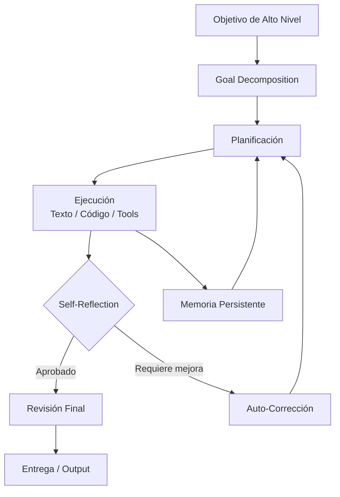

# 🤖 14 - Agentes Autónomos y Auto-Mejora

Bienvenida al módulo 14 del programa de **ML & AI Engineering**. En este curso exploraremos la frontera de los sistemas agenticos: aquellos que no solo responden, sino que **actúan, planifican, aprenden de sus errores y se mejoran a sí mismos** sin intervención humana constante.

Para un ML/AI Engineer, dominar estos conceptos es esencial porque representa la evolución de los modelos desde simples predictores hacia **sistemas autónomos capaces de resolver problemas complejos de extremo a extremo**, integrando planificación, ejecución de código, reflexión crítica y adaptación continua.

---

## 1. Índice del Módulo

Este módulo está organizado en 5 notas técnicas que cubren el espectro completo de la autonomía agentica:

| # | Nota | Enlace | Enfoque principal |
|---|------|--------|-------------------|
| 00 | Bienvenida | [[00 - Bienvenida]] | Contexto, glosario y objetivos |
| 01 | AutoGPT y Agentes Autónomos | [[01 - AutoGPT y Agentes Autonomos]] | Arquitecturas clásicas y loops autónomos |
| 02 | Reflexión y Auto-Mejora | [[02 - Reflexion y Auto-Mejora]] | Self-reflection, iterative refinement y meta-learning |
| 03 | Agentes con Acceso a Código | [[03 - Agentes con Acceso a Codigo]] | Code interpreter, sandboxing y tool creation |
| 04 | Caso Práctico | [[04 - Caso Practico - Agente de Investigacion Cientifica]] | Agente de investigación científica end-to-end |

---

## 2. Glosario Técnico

| Término | Definición | Relevancia en ML/AI Engineering |
|---------|-----------|--------------------------------|
| **Autonomous agent** | Sistema que percibe su entorno, toma decisiones y ejecuta acciones para alcanzar objetivos sin supervisión humana continua. | Permite automatizar pipelines completos de ML, desde ETL hasta deployment. |
| **AutoGPT** | Framework open-source que envuelve un LLM en un loop de pensamiento-planificación-ejecución-crítica con memoria persistente. | Referencia arquitectónica para construir agentes con memoria a largo plazo. |
| **BabyAGI** | Agente autónomo minimalista que crea, prioriza y ejecuta tareas de forma recursiva usando embeddings para memoria. | Modelo de task decomposition y priorización dinámica. |
| **Self-reflection** | Capacidad de un agente para evaluar críticamente sus propias acciones, razonamientos y resultados. | Fundamental para reducir alucinaciones y mejorar la calidad de salidas en sistemas de producción. |
| **Self-improvement** | Proceso por el cual un agente modifica su comportamiento futuro basándose en experiencias pasadas. | Habilita el aprendizaje continuo (continual learning) sin reentrenamiento del modelo base. |
| **Code interpreter** | Entorno de ejecución de código (típicamente Python) al que el agente tiene acceso como herramienta. | Extensión de capacidades del LLM más allá del texto: matemáticas, análisis de datos, visualización. |
| **Tool creation** | Capacidad del agente para escribir y definir nuevas herramientas/functions on-the-fly durante su ejecución. | Meta-cognición: el agente expande su propio action space dinámicamente. |
| **Recursive agent** | Agente que se invoca a sí mismo de forma recursiva para descomponer objetivos en sub-objetivos. | Patrón de diseño para resolver problemas jerárquicos y decomposición de tareas. |
| **Goal decomposition** | Proceso de dividir un objetivo complejo en sub-objetivos manejables y secuenciales. | Estrategia central en planificación automatizada (automated planning) e HTN (Hierarchical Task Networks). |
| **Termination condition** | Criterio lógico que determina cuándo un agente autónomo debe detener su ejecución. | Crítico para evitar loops infinitos y controlar costos operativos en producción. |

---

## 3. Objetivos de Aprendizaje

Al finalizar este módulo serás capaz de:

1. **Diseñar arquitecturas de agentes autónomos** comprendiendo los ciclos de pensamiento, planificación, ejecución y crítica.

2. **Implementar mecanismos de self-reflection** que permitan a un agente evaluar y corregir sus propias salidas iterativamente.

3. **Integrar entornos de ejecución de código seguros** (sandbox, Docker, e2b) dentro de pipelines agenticos.

4. **Construir un agente de investigación científica** que combine RAG, ejecución de código y generación de reportes con auto-corrección.

5. **Evaluar tradeoffs críticos** entre autonomía, seguridad, costo y calidad en sistemas agenticos de producción.

---

## 4. Arquitectura General del Módulo

El siguiente diagrama muestra cómo se interconectan los conceptos de este módulo:

💡 **Tip:** Guarda este diagrama como referencia rápida mientras avanzas por las notas. Los flujos de auto-mejora son cíclicos por naturaleza.

---

## 5. Relevancia para ML/AI Engineering

Los agentes autónomos y auto-mejorables representan el siguiente escalón en la evolución de los sistemas de ML:

- **Automatización de pipelines:** Un agente puede orquestar todo el ciclo de vida de un modelo, desde la ingesta de datos hasta el monitoreo post-deployment.

- **Reducción de intervención humana:** En sistemas de producción, la capacidad de auto-corregir reduce el MTTR (Mean Time To Recovery) y mejora la confiabilidad.

- **Escalabilidad cognitiva:** A través de la decomposition recursiva, un agente puede abordar problemas que exceden el contexto o las capacidades de un solo prompt.

⚠️ **Advertencia:** La autonomía incrementa la superficie de riesgo. Un agente con acceso a APIs, bases de datos o código puede causar daños si no está debidamente restringido (principle of least privilege).

---

## 6. Recursos Adicionales

- Documentación oficial de AutoGPT: [github.com/Significant-Gravitas/AutoGPT](https://github.com/Significant-Gravitas/AutoGPT)
- Paper original de ReAct: *ReAct: Synergizing Reasoning and Acting in Language Models* (Yao et al., 2022)
- SWE-bench: benchmark para agentes de ingeniería de software
- e2b: [e2b.dev](https://e2b.dev) - sandboxing para agentes de código

---

**Notas del módulo:**

- [[01 - AutoGPT y Agentes Autonomos]]
- [[02 - Reflexion y Auto-Mejora]]
- [[03 - Agentes con Acceso a Codigo]]
- [[04 - Caso Practico - Agente de Investigacion Cientifica]]
