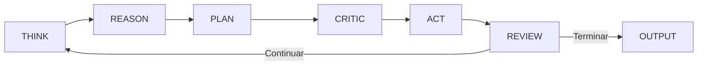
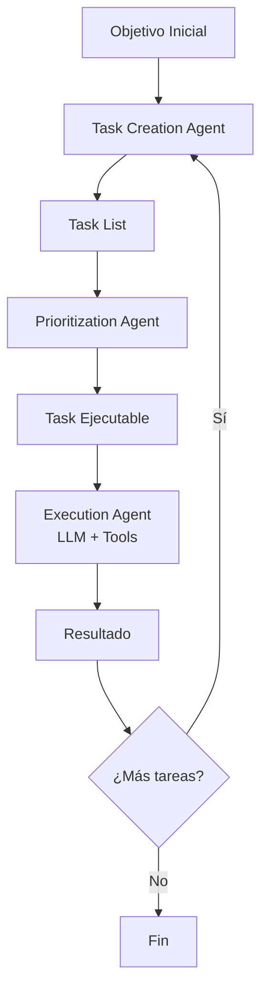
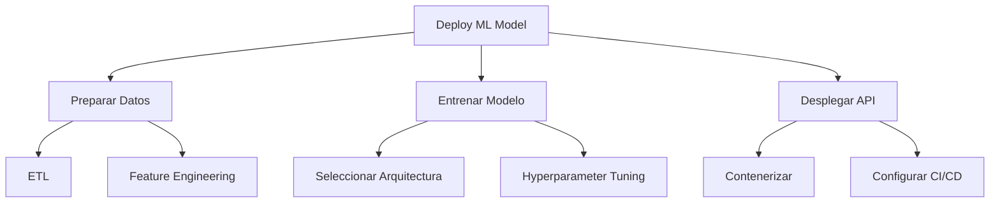

# 🚀 01 - AutoGPT y Agentes Autónomos

Los agentes autónomos marcan la transición de los LLM desde generadores de texto pasivos hacia **sistemas ciber-físicos capaces de percibir, razonar, planificar y actuar** en entornos digitales. Para un ML/AI Engineer, comprender estas arquitecturas es fundamental para diseñar sistemas que operen con mínima supervisión en producción.


---

## 1. Fundamentos de la Autonomía Agentica

Un agente autónomo, en el marco de la inteligencia artificial, es una entidad computacional que:

1. **Percibe** su entorno a través de inputs (texto, APIs, lecturas de sensores virtuales).
2. **Razona** sobre el estado actual y las acciones posibles.
3. **Planea** una secuencia de acciones para alcanzar un objetivo.
4. **Ejecuta** acciones en el entorno.
5. **Aprende** o se adapta basándose en los resultados de sus acciones.

Matemáticamente, podemos modelar un agente autónomo como una tupla:

$$
\mathcal{A} = (S, A, T, R, \pi, M)
$$

Donde:
- $S$: espacio de estados (estado del entorno + estado interno).
- $A$: espacio de acciones disponibles.
- $T: S \times A \rightarrow S$: función de transición.
- $R: S \times A \rightarrow \mathbb{R}$: función de recompensa.
- $\pi$: política del agente (determinada por el LLM + lógica de prompting).
- $M$: memoria persistente (vector DB, logs, estado de ejecución).

💡 **Tip:** Piensa en $M$ como el equivalente agentico de un feature store en ML: almacena estado relevante entre iteraciones.

---

## 2. Arquitectura de AutoGPT

AutoGPT es uno de los frameworks pioneros que demostró la viabilidad de envolver un LLM en un loop autónomo completo. Su arquitectura sigue un ciclo estructurado:



### 2.1. Think → Reason → Plan

El agente recibe un objetivo de alto nivel (ej: "Desarrolla una API REST para gestionar inventario"). En la fase de *Think*, el LLM genera una representación interna del problema. En *Reason*, explora posibles estrategias. En *Plan*, descompone el objetivo en tareas atómicas.

La función de planificación puede formalizarse como:

$$
P(g, M_t) = \{t_1, t_2, ..., t_n\}
$$

Donde $g$ es el goal, $M_t$ la memoria en el timestep $t$, y $P$ retorna un conjunto ordenado de tareas.

### 2.2. Critic → Act → Review

La fase **Critic** evalúa el plan propuesto considerando restricciones, riesgos y coherencia con el objetivo final. **Act** ejecuta la tarea seleccionada (llamar una API, escribir código, buscar en la web). **Review** compara el resultado observado contra el resultado esperado.

⚠️ **Advertencia:** Sin una fase de Critic robusta, los agentes tienden a sufrir *confirmation bias*: ejecutan planes defectuosos sin cuestionarlos, generando cascadas de errores.

### 2.3. Memoria Persistente

AutoGPT utiliza una arquitectura de memoria dual:

| Tipo | Implementación | Propósito | Tradeoff |
|------|---------------|-----------|----------|
| Memoria a corto plazo | Context window del LLM | Razonamiento inmediato, coherencia local | Limitada por el contexto (~128k tokens) |
| Memoria a largo plazo | Vector DB (Pinecone, Weaviate, Chroma) | Recuperación de experiencias pasadas, aprendizaje acumulativo | Latencia de retrieval, relevancia depende del embedding |

La recuperación de memoria sigue:

$$
M_{relevant} = \text{TopK}(\text{embed}(query) \cdot \text{embed}(M_{store}), k=5)
$$

---

## 3. BabyAGI: Task Creation, Prioritization y Execution

BabyAGI, creado por [@yoheinakajima](https://twitter.com/yoheinakajima), es una arquitectura minimalista que ilustra los principios esenciales de la autonomía. Su loop principal consta de tres operaciones:



### 3.1. Task Creation

Dado un objetivo y el resultado de la tarea anterior, el agente genera nuevas tareas necesarias. Formalmente:

$$
T_{new} = \text{LLM}(g, r_{t-1}, T_{pendientes})
$$

### 3.2. Prioritization

Las tareas se ordenan por relevancia y dependencias. BabyAGI usa embeddings para comparar la similitud semántica entre el objetivo y cada tarea:

$$
\text{score}(t_i) = \cos(\text{embed}(g), \text{embed}(t_i)) + \alpha \cdot \text{urgencia}(t_i)
$$

### 3.3. Execution

El agente ejecuta la tarea prioritaria y almacena el resultado en memoria vectorial. Este ciclo continúa hasta que no quedan tareas pendientes o se alcanza una condición de terminación.

---

## 4. Otros Agentes Relevantes

### 4.1. GPT-Engineer

GPT-Engineer se especializa en la generación de bases de código completas a partir de especificaciones en lenguaje natural. A diferencia de AutoGPT, que es genérico, GPT-Engineer:

- Utiliza un flujo de **clarificación** donde el agente hace preguntas al usuario antes de codificar.
- Genera archivos de código estructurados, no solo snippets.
- Implementa un patrón de **identity prompting** donde el LLM asume el rol de senior engineer.

Caso real: **GPT-Engineer fue utilizado para generar el scaffolding completo de aplicaciones web**, reduciendo el tiempo de setup inicial de horas a minutos, aunque requiere revisión humana para lógica de negocio compleja.

### 4.2. Devin (Cognition AI)

Devin representa el estado del arte en agentes de ingeniería de software. Sus capacidades incluyen:

- Acceso a un entorno de desarrollo completo (shell, editor, navegador).
- Planificación de tickets de Jira/GitHub Issues de forma autónoma.
- Debugging iterativo con breakpoints y ejecución paso a paso.
- Deployment automático a entornos de staging.

⚠️ **Advertencia:** Devin opera en un espacio de alta libertad. En entornos empresariales reales, conceder tal nivel de acceso a un agente requiere auditoría completa, RBAC estricto y sandboxing total.

---

## 5. Goal Decomposition Recursiva

La descomposición recursiva es el mecanismo mediante el cual un agente divide un objetivo hasta alcanzar primitivas ejecutables. Es análogo a la descomposición de funciones en ingeniería de software.



La profundidad de descomposición puede controlarse con un hiperparámetro $\delta_{max}$:

$$
\text{decompose}(g, d) =
\begin{cases}
\text{ejecutar}(g) & \text{si } d \geq \delta_{max} \text{ o } g \text{ es atómico} \\
\bigcup_{i} \text{decompose}(g_i, d+1) & \text{en otro caso}
\end{cases}
$$

💡 **Tip:** Un $\delta_{max}$ muy alto genera overhead de planificación; uno muy bajo produce tareas ambiguas. En producción, valores entre 3 y 5 suelen ser óptimos.

---

## 6. Manejo de Errores en Autonomía

Los agentes autónomos enfrentan errores que no están en su distribución de entrenamiento. Un sistema robusto debe implementar:

| Estrategia | Descripción | Cuándo usarla |
|-----------|-------------|---------------|
| Retry con backoff | Reintentar la acción con espera exponencial | Errores transitorios (rate limits, timeouts) |
| Fallback a herramienta alternativa | Usar una tool diferente para el mismo objetivo | APIs caídas o deprecated |
| Escalamiento humano | Detener y notificar a un operador humano | Errores críticos de seguridad o negocio |
| Auto-debugging | El agente analiza el stack trace y genera un fix | Errores de código en entornos sandboxed |

---

## 7. Límites y Riesgos

### 7.1. Infinite Loops

Un agente sin condición de terminación explícita puede caer en loops. La detección requiere:

- **Cycle detection en memoria:** si el estado $(M_t, A_t)$ se repite, detener.
- **Límite de iteraciones:** $t < t_{max}$.
- **Budget de costos:** $costo_{acumulado} < budget_{max}$.

### 7.2. Cost Explosion

Cada iteración del loop consume tokens. Un agente autónomo descontrolado puede generar costos inesperados:

$$
\text{Costo}_{total} = \sum_{t=1}^{T} (\text{tokens}_{in}^{(t)} + \text{tokens}_{out}^{(t)}) \cdot \text{tarifa}
$$

⚠️ **Advertencia:** Siempre implementa un presupuesto por sesión. En producción, un agente sin límites de costo es un riesgo financiero.

### 7.3. Safety y Alineación

Un agente con acceso a herramientas puede:
- Ejecutar código malicioso si un input es envenenado.
- Filtrar datos sensibles a través de APIs externas.
- Tomar decisiones no alineadas con los valores humanos.

La estrategia de mitigación incluye:
- Sandboxing de ejecución.
- Human-in-the-loop para acciones destructivas.
- Output filtering y guardrails.

---

## 8. Código de Agente Autónomo Simplificado

El siguiente código ilustra un agente autónomo minimalista con memoria, planificación y terminación:

```python
import openai
from typing import List, Dict, Optional

class SimpleAutonomousAgent:
    def __init__(self, goal: str, max_iterations: int = 10):
        self.goal = goal
        self.memory: List[Dict] = []
        self.max_iterations = max_iterations
        self.iteration = 0

    def think(self) -> str:
        """Genera un plan basado en el goal y la memoria."""
        context = "\n".join([f"- {m['action']}: {m['result']}" for m in self.memory])
        prompt = f"""Objective: {self.goal}
Previous actions and results:
{context}

What is the next single best action to take? Respond with one sentence."""
        return self._llm_call(prompt)

    def act(self, action: str) -> str:
        """Simula la ejecución de una acción."""
        # En un sistema real, aquí se ejecutaría código, llamadas API, etc.
        return f"Executed: {action} (simulated result)"

    def review(self, action: str, result: str) -> bool:
        """Determina si el objetivo ha sido alcanzado."""
        prompt = f"""Objective: {self.goal}
Action: {action}
Result: {result}

Has the objective been fully achieved? Answer only YES or NO."""
        response = self._llm_call(prompt)
        return "YES" in response.upper()

    def _llm_call(self, prompt: str) -> str:
        response = openai.chat.completions.create(
            model="gpt-4o",
            messages=[{"role": "user", "content": prompt}],
            temperature=0.2
        )
        return response.choices[0].message.content

    def run(self) -> List[Dict]:
        while self.iteration < self.max_iterations:
            self.iteration += 1
            action = self.think()
            result = self.act(action)
            self.memory.append({"action": action, "result": result})
            if self.review(action, result):
                print(f"✅ Goal achieved in {self.iteration} iterations.")
                break
        else:
            print("⚠️ Max iterations reached without achieving goal.")
        return self.memory

# Uso
# agent = SimpleAutonomousAgent("Find the capital of France")
# agent.run()
```

---

## 9. Casos Reales

Caso real: **AutoGPT fue utilizado por startups para automatizar la creación de sitios web de marketing**, pero los usuarios reportaron que el agente frecuentemente se distraía en subtareas no relevantes o caía en loops de "mejora continua" sin entregar un producto final usable.

Caso real: **BabyAGI inspiró arquitecturas en startups de automatización de workflows** como respaldo a sistemas de orchestración donde las tareas no están predefinidas, sino que emergen dinámicamente del objetivo.

---

## 10. 📦 Código de Compresión

```python
# Patrón mínimo de agente autónomo (compresión)
class MicroAgent:
    def __init__(self, goal, max_i=10):
        self.g, self.m, self.i, self.mx = goal, [], 0, max_i
    def step(self):
        a = llm(f"Goal: {self.g}\nHistory: {self.m}\nNext action?")
        r = execute(a)
        self.m.append((a, r))
        done = "YES" in llm(f"Goal: {self.g}\nResult: {r}\nDone?")
        return done
    def run(self):
        while self.i < self.mx:
            self.i += 1
            if self.step():
                return self.m
        return self.m
```

---

## 11. 🎯 Proyecto Documentado

**Proyecto: AutoTasker**

- **Descripción:** Sistema autónomo que recibe objetivos de productividad (ej: "Organiza mi semana de trabajo") y genera, prioriza y ejecuta tareas en herramientas como Notion, Calendar y Email.
- **Arquitectura:** Think→Plan→Act→Review con memoria en ChromaDB.
- **Tecnologías:** Python, LangChain, OpenAI API, Chroma, REST APIs.
- **Reto principal:** Prevención de loops infinitos al priorizar tareas conflictivas.
- **Solución:** Implementación de un "task deduplication layer" usando embeddings + threshold de similitud > 0.92.

**Siguiente nota:** [[02 - Reflexion y Auto-Mejora]]
