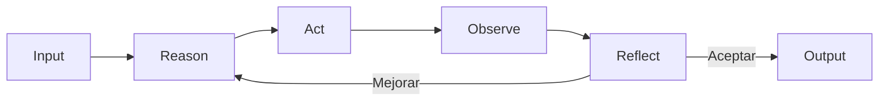
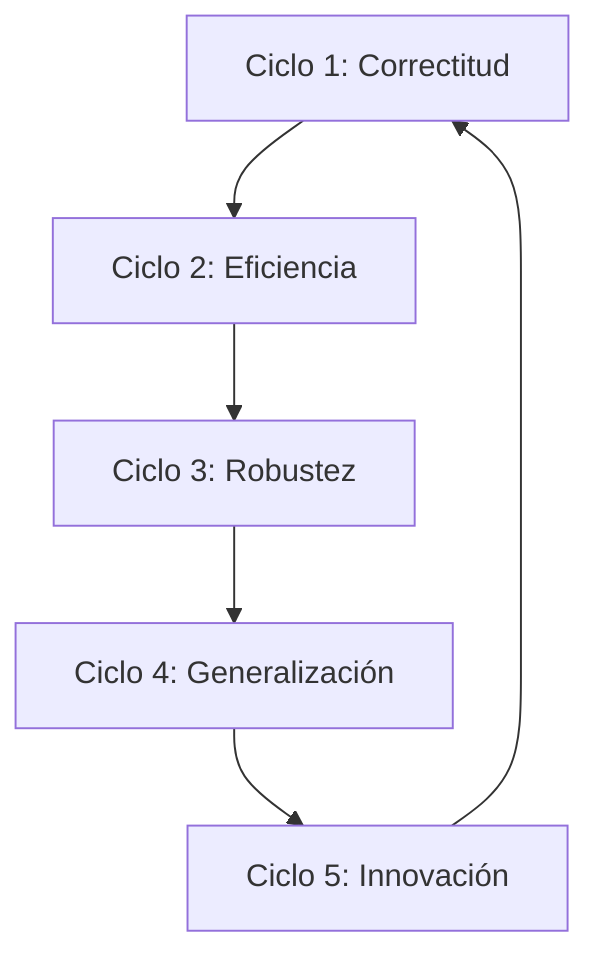

# 🪞 02 - Reflexión y Auto-Mejora

La capacidad de un agente para evaluar críticamente su propio desempeño, identificar errores y ajustar su comportamiento futuro es lo que distingue a un sistema verdaderamente inteligente de un simple ejecutor de instrucciones. En ML/AI Engineering, implementar mecanismos de **self-reflection** es equivalente a construir un sistema de validación continua que reduce la deriva de rendimiento (performance drift) y mitiga alucinaciones.


---

## 1. Self-Reflection en Agentes

El self-reflection es el proceso mediante el cual un agente genera una representación meta-cognitiva de sus propias acciones. Inspirado en el framework ReAct (Reasoning + Acting), la versión reflexiva extiende el loop con una etapa de evaluación explícita:



Formalmente, definimos la función de reflexión $\mathcal{R}$ como:

$$
r_t = \mathcal{R}(a_t, o_t, M_{t-1}, g)
$$

Donde:
- $a_t$: acción tomada en el timestep $t$
- $o_t$: observación resultante
- $M_{t-1}$: memoria previa
- $g$: objetivo global
- $r_t \in \{continuar, corregir, terminar\}$: decisión reflexiva

💡 **Tip:** La reflexión no debe ser un afterthought. Debe diseñarse como un componente de primera clase con su propio prompt engineering, métricas y guardrails.

---

## 2. Self-Critique y Iterative Refinement

### 2.1. Self-Critique

El self-critique obliga al agente a actuar como su propio revisor. Dada una salida candidata $y$, el agente genera una crítica $c$:

$$
c = \text{LLM}_{critico}(y, g, \text{criterios}_{calidad})
$$

La calidad de la crítica depende directamente de la especificidad de los criterios. Por ejemplo, en generación de código, los criterios pueden incluir:

- Correctitud sintáctica y semántica.
- Complejidad ciclomática.
- Cobertura de casos edge.
- Alineación con patrones del proyecto.

### 2.2. Iterative Refinement

El refinement iterativo aplica el self-critique de forma repetida hasta alcanzar un umbral de calidad. El proceso puede modelarse como:

$$
y^{(k+1)} = \text{LLM}_{refiner}(y^{(k)}, c^{(k)})
$$

Con condición de terminación:

$$
\text{score}(y^{(k)}) > \tau \quad \text{o} \quad k > k_{max}
$$

Donde $\tau$ es un umbral de calidad y $k_{max}$ previene loops infinitos.

| Aspecto | Generación directa | Con Iterative Refinement |
|---------|-------------------|--------------------------|
| Calidad inicial | Variable | Variable pero mejorable |
| Costo computacional | $C$ | $k \cdot C$ |
| Tasa de errores | Mayor | Significativamente menor |
| Control | Bajo | Alto (via criterios y $\tau$) |
| Latencia percebida | Baja | Alta (tradeoff calidad/velocidad) |

⚠️ **Advertencia:** El refinement iterativo puede multiplicar el costo de inferencia por un factor de 3x-5x. En producción, utilízalo solo para tareas críticas o implementa un sistema de "refinement bajo demanda" activado por un clasificador de calidad inicial.

---

## 3. Learning from Failure

### 3.1. Experience Replay para Agentes

Adaptado del deep reinforcement learning, el experience replay en agentes LLM consiste en almacenar trayectorias de éxito y fracaso para enriquecer el contexto futuro.

Definimos un episodio $e_i = (g_i, \{(a_t, o_t, r_t)\}_{t=1}^{T}, \text{outcome}_i)$. La memoria de experiencias se construye como:

$$
\mathcal{D} = \{e_1, e_2, ..., e_N\}
$$

Al enfrentar un nuevo objetivo $g_{new}$, el agente recupera los $k$ episodios más similares:

$$
\mathcal{D}_{k} = \text{TopK}(\cos(\text{embed}(g_{new}), \text{embed}(g_i)), k)
$$

### 3.2. Análisis de Fallas

Un agente auto-mejorable debe clasificar sus errores:

| Tipo de Error | Causa raíz | Estrategia de mitigación |
|--------------|-----------|-------------------------|
| Percepción | Malinterpretación del input | Prompt engineering + few-shot de parsing |
| Razonamiento | Cadena lógica inválida | Chain-of-Thought + verificación paso a paso |
| Ejecución | Fallo en tool/code | Auto-debugging + sandboxing |
| Objetivo | Desalineación con $g$ | Reflexión explícita sobre el objetivo antes de actuar |

Caso real: **En el framework Reflexion (Shinn et al., 2023), los agentes mantienen un "memory of mistakes"** que reduce la tasa de errores en tareas de decision-making secuenciales en un 20-30% respecto a agentes sin memoria de fallos.

---

## 4. Meta-Learning Adaptado a Agentes

### 4.1. MAML para Comportamiento Agentico

Model-Agnostic Meta-Learning (MAML) busca encontrar una inicialización de parámetros $\theta$ que permita adaptarse rápidamente a nuevas tareas. En el contexto de agentes basados en LLM, aplicamos el principio a nivel de prompting:

En lugar de ajustar pesos del modelo (costoso), realizamos **meta-prompting**: aprendemos un prompt base $p^*$ que maximiza el desempeño promedio tras pocas iteraciones de refinement:

$$
p^* = \arg\min_{p} \mathbb{E}_{\tau \sim \mathcal{T}} \left[ \mathcal{L}(\text{Agent}(p, \tau)) \right]
$$

Donde $\tau$ es una tarea muestreada de la distribución de tareas $\mathcal{T}$.

### 4.2. Reward Model Interno

Un agente sofisticado puede implementar un reward model interno $\hat{R}$ que evalúa sus propias acciones sin necesidad de feedback humano explícito:

$$
\hat{R}(a_t | s_t) = \text{LLM}_{eval}(\text{descripción}(s_t), \text{descripción}(a_t), g)
$$

Este reward model permite:
- **Auto-evaluación** continua.
- **Auto-corrección** cuando $\hat{R}(a_t) < \rho$ (umbral de aceptación).
- **Exploración dirigida** hacia acciones con mayor reward esperado.

💡 **Tip:** El reward model interno es especialmente útil en dominios donde el feedback humano es caro o latente (ej: generación de documentación técnica, refactorización de código legacy).

---

## 5. Spiral of Improvement

El "Spiral of Improvement" es un modelo conceptual para la auto-mejora continua en agentes. Cada ciclo eleva la calidad del sistema en una dimensión específica:



Matematizando la mejora iterativa, podemos definir una función de calidad $Q$ que evoluciona:

$$
Q_{t+1} = Q_t + \alpha \cdot \nabla Q_t + \beta \cdot \text{feedback}_{externo}
$$

Donde:
- $\alpha$: tasa de aprendizaje del agente (capacidad de auto-corrección).
- $\nabla Q_t$: gradiente estimado por self-reflection.
- $\beta$: peso del feedback externo (human-in-the-loop, evaluadores automáticos).

⚠️ **Advertencia:** Sin diversidad en las experiencias ($\mathcal{D}$), el agente puede converger a mínimos locales de comportamiento, repitiendo las mismas soluciones subóptimas.

---

## 6. Comparativa: Agente con vs. sin Reflexión

| Dimensión | Sin Reflexión | Con Reflexión |
|-----------|--------------|---------------|
| Tasa de errores silenciosos | Alta (el agente no detecta fallos) | Baja (detecta y reporta) |
| Capacidad de recovery | Ninguna: sigue adelante con errores | Alta: puede revertir y reintentar |
| Uso de memoria | Solo para contexto | Contexto + experiencias de fallo |
| Costo por tarea | $C$ | $C + C_{reflect}$ (typ. 1.2x - 2x) |
| Escalabilidad humana | Requiere supervisión constante | Supervisión esporádica o por excepción |
| Alineación con objetivos | Débil (drift progresivo) | Fuerte (revisión continua contra $g$) |

---

## 7. Fórmulas de Mejora Iterativa

### 7.1. Mejora por Refinamiento

La calidad de una salida tras $k$ iteraciones de refinement puede modelarse como:

$$
Q(y^{(k)}) = Q_{max} - (Q_{max} - Q_{0}) \cdot e^{-\lambda k}
$$

Donde $Q_{max}$ es la calidad asintótica alcanzable, $Q_0$ la calidad inicial, y $\lambda$ la tasa de mejora por iteración (depende de la calidad del crítico).

### 7.2. Ganancia Esperada de la Reflexión

Definimos la ganancia esperada como:

$$
\mathbb{E}[\Delta Q] = P(\text{detectar error}) \cdot \mathbb{E}[\text{mejora} | \text{error detectado}] - C_{reflect}
$$

Donde $C_{reflect}$ es el costo computacional de la reflexión. La reflexión es rentable cuando $\mathbb{E}[\Delta Q] > 0$.

---

## 8. Código: Agente con Self-Reflection

```python
import openai
from typing import List, Tuple

class ReflectiveAgent:
    def __init__(self, goal: str, max_reflections: int = 3):
        self.goal = goal
        self.max_reflections = max_reflections
        self.memory: List[Tuple[str, str, str]] = []  # (action, result, reflection)

    def act(self, context: str) -> str:
        prompt = f"""Goal: {self.goal}
Context: {context}
Previous actions and reflections: {self.memory}

What is the best next action? Provide only the action."""
        return self._llm(prompt)

    def reflect(self, action: str, result: str) -> Tuple[bool, str]:
        """Returns (is_good, reflection_text)"""
        prompt = f"""Goal: {self.goal}
Action: {action}
Result: {result}

Critique this action and result. If the result fully achieves the goal and has no issues, say 'PASS'. Otherwise, explain the problem and suggest how to fix it."""
        critique = self._llm(prompt)
        is_good = "PASS" in critique.upper()
        return is_good, critique

    def refine(self, action: str, critique: str) -> str:
        prompt = f"""Goal: {self.goal}
Previous action: {action}
Critique: {critique}

Provide an improved action that addresses the critique."""
        return self._llm(prompt)

    def _llm(self, prompt: str) -> str:
        response = openai.chat.completions.create(
            model="gpt-4o",
            messages=[{"role": "user", "content": prompt}],
            temperature=0.3
        )
        return response.choices[0].message.content

    def run(self) -> str:
        context = "Starting fresh."
        for i in range(self.max_reflections):
            action = self.act(context)
            result = self.simulate_execution(action)
            is_good, reflection = self.reflect(action, result)
            self.memory.append((action, result, reflection))
            if is_good:
                return f"Success after {i+1} iterations: {result}"
            action = self.refine(action, reflection)
            context = f"Previous attempt failed. Reflection: {reflection}"
        return f"Best effort after max reflections. Last result: {result}"

    def simulate_execution(self, action: str) -> str:
        return f"Simulated result of: {action}"

# Uso:
# agent = ReflectiveAgent("Write a Python function to calculate factorial")
# print(agent.run())
```

---

## 9. Casos Reales

Caso real: **Reflexion (Shinn et al., 2023) demostró que agentes con memoria de errores superan a agentes ReAct estándar** en benchmarks de reasoning como HotpotQA y alfworld, alcanzando mejoras de hasta 30 puntos porcentuales en tareas de múltiples pasos.

Caso real: **GPT-4 con self-critique iterativo ha sido utilizado para revisar papers académicos**, identificando errores metodológicos que los autores originales habían pasado por alto, aunque con una tasa de falsos positivos del 15% que requiere validación humana.

---

## 10. 📦 Código de Compresión

```python
# Agente reflexivo mínimo
class ReflexAgent:
    def __init__(self, g, k=3):
        self.g, self.k, self.h = g, k, []
    def step(self):
        a = llm(f"Goal:{self.g}\nHist:{self.h}\nAction?")
        r = exec(a)
        c = llm(f"Goal:{self.g}\nAction:{a}\nResult:{r}\nCritique or PASS")
        self.h.append((a, r, c))
        return "PASS" in c, a, r
    def run(self):
        for _ in range(self.k):
            ok, a, r = self.step()
            if ok: return r
        return r
```

---

## 11. 🎯 Proyecto Documentado

**Proyecto: CodeReviewer-Agent**

- **Descripción:** Agente que recibe pull requests de código y genera revisiones automáticas con self-reflection. Primero genera comentarios, luego los critica por severidad y precisión, y finalmente entrega solo los comentarios que superan un umbral de calidad.
- **Pipeline:** Generate → Self-Critique → Filter → Deliver.
- **Métricas:** Precisión de comentarios (validados contra reviewers humanos), recall de bugs críticos, tasa de falsos positivos.
- **Resultado:** Reducción del 40% en falsos positivos vs. generación directa, a costa de un incremento del 60% en tokens consumidos.

**Siguiente nota:** [[03 - Agentes con Acceso a Codigo]]
