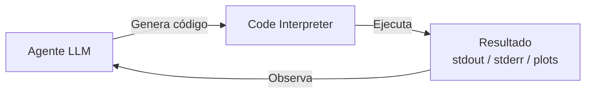
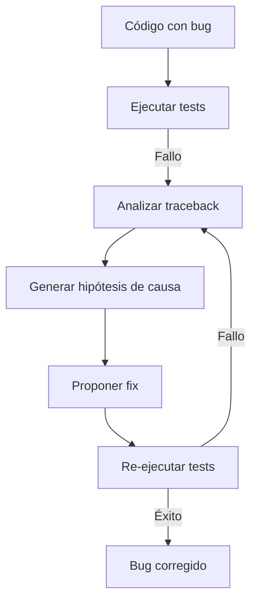
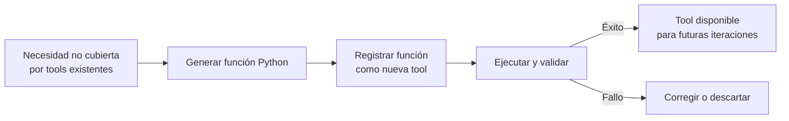

# 💻 03 - Agentes con Acceso a Código

Conceder a un agente la capacidad de escribir, ejecutar y depurar código transforma al LLM desde un oráculo de texto en un **sistema computacional completo**. Para un ML/AI Engineer, esto significa que los agentes pueden ahora realizar ETL complejos, entrenar modelos, generar visualizaciones y desplegar servicios, todo de forma autónoma. Sin embargo, esta potencia viene acompañada de desafíos críticos de seguridad y sandboxing.


---

## 1. El Code Interpreter como Herramienta

El code interpreter es un entorno de ejecución de código (típicamente Python REPL) al que el agente tiene acceso como una tool más dentro de su arsenal. La integración sigue el patrón estándar de tool-use:



La decisión de usar el code interpreter puede formalizarse como:

$$
\text{use\_code} = \text{LLM}(\text{query}, \text{available\_tools}) \in \{\text{python}, \text{search}, \text{calculator}, ...\}
$$

Cuando el LLM selecciona `python`, genera un bloque de código $c$ que se envía al intérprete. La observación $o$ incluye:
- Salida estándar ($stdout$).
- Errores ($stderr$).
- Artefactos (archivos, imágenes, modelos serializados).

💡 **Tip:** Entrena al agente para que genere código siempre que la tarea involucre: cálculos matemáticos precisos, manipulación de datos tabulares, transformaciones de formato, o generación de gráficos.

---

## 2. Ejecución Segura de Código

Permitir que un LLM genere código arbitrario y lo ejecute en tu infraestructura es equivalente a ejecutar código de un usuario no confiable. La seguridad es no negociable.

### 2.1. Estrategias de Sandboxing

| Estrategia | Nivel de aislamiento | Latencia | Complejidad | Uso recomendado |
|-----------|---------------------|----------|-------------|-----------------|
| Subprocess restringido | Proceso OS | Baja | Baja | Scripts simples, sin red ni filesystem |
| Docker container | Container | Media | Media | Análisis de datos, pipelines de ML |
| gVisor / Firecracker | Micro-VM | Media-Alta | Alta | Multi-tenant, código no confiable |
| e2b sandbox | Cloud sandbox | Media | Baja (managed) | Agentes de producción, CI/CD |
| WASM (WebAssembly) | Bytecode sandbox | Baja | Media | Librerías específicas, edge computing |

### 2.2. Docker como Sandbox

Una configuración mínima para ejecutar código de agentes en Docker:

```dockerfile
FROM python:3.11-slim
RUN pip install numpy pandas matplotlib scikit-learn
RUN useradd -m -s /bin/bash agent
USER agent
WORKDIR /home/agent/workspace
```

Ejecución con restricciones:

```bash
docker run --rm \
  --memory=512m \
  --cpus=1.0 \
  --network=none \
  --read-only \
  -v $(pwd)/sandbox:/home/agent/workspace:rw \
  agent-sandbox python script.py
```

⚠️ **Advertencia:** `--network=none` evita que el código malicioso exfiltre datos, pero también impide que el agente descargue dependencias. Considera un proxy controlado o pre-instalar todas las librerías necesarias.

### 2.3. e2b: Sandboxing para Agentes

e2b es una plataforma diseñada específicamente para agentes que ejecutan código. Proporciona:

- Entornos efímeros por sesión.
- Filesystem persistente durante la vida del sandbox.
- Instalación dinámica de dependencias.
- Límites de tiempo y recursos.

```python
from e2b_code_interpreter import Sandbox

sbx = Sandbox(template="base")
execution = sbx.run_code("import pandas as pd; print(pd.__version__)")
print(execution.results[0].text)
sbx.close()
```

---

## 3. Agentes que Escriben Código

### 3.1. SWE-bench y Benchmarks de Código

SWE-bench es un benchmark que evalúa la capacidad de los LLM para resolver issues reales de GitHub. Los agentes deben:

1. Comprender un issue de bug o feature request.
2. Navegar por una codebase desconocida.
3. Escribir un parche que pase los tests existentes.

La métrica principal es:

$$
\text{Resolve Rate} = \frac{\text{Issues resueltos correctamente}}{\text{Total de issues}} \times 100
$$

Caso real: **Agentes basados en Claude 3 Opus alcanzaron ~40% de resolve rate en SWE-bench**, superando a muchos desarrolladores junior en tareas de debugging localizado.

### 3.2. GitHub Copilot Workspace

Copilot Workspace extiende la autocompletación de código hacia la generación de planes de implementación completos. Su arquitectura:

- **Spec generation:** A partir de un issue, genera una especificación técnica.
- **Plan generation:** Descompone la spec en cambios de archivo por archivo.
- **Implementation:** Genera el código diff para cada archivo.
- **Verification:** Ejecuta tests para validar el cambio.

💡 **Tip:** En proyectos legacy, un agente que escribe código debe tener acceso a un índice de la codebase (usando herramientas como `ctags`, `tree-sitter`, o embeddings de funciones) para entender dependencias antes de modificar archivos.

---

## 4. Generación de Tests y Debugging Automático

### 4.1. Test Generation

Un agente puede generar tests automáticamente para validar su propio código:

$$
T_{generated} = \text{LLM}_{tester}(c_{source}, \text{spec}, \text{coverage\_target})
$$

La cobertura objetivo puede expresarse como:

$$
\text{coverage} = \frac{\text{lines\_executed\_by\_tests}}{\text{total\_lines}} \geq \theta
$$

Donde $\theta$ típicamente se fija en 0.8 o 0.9 para código crítico.

### 4.2. Debugging Automático

El debugging automático sigue un loop de hipótesis-verificación:



Caso real: **AlphaCode (DeepMind) y posteriormente AlphaCode 2 utilizan un pipeline de generación masiva + filtrado por tests** para competir en competiciones de programación, demostrando que la ejecución de código como herramienta de verificación es más poderosa que la generación pura.

---

## 5. Tool Creation On-the-Fly

La capacidad más avanzada es que el agente **cree sus propias herramientas** durante la ejecución. Esto transforma al agente en un sistema meta-cognitivo que expande dinámicamente su action space.

### 5.1. Arquitectura de Tool Creation



### 5.2. Implementación

```python
from typing import Callable, Dict
import inspect

class ToolCreatingAgent:
    def __init__(self):
        self.tools: Dict[str, Callable] = {
            "calculator": self._calculator,
            "search": self._search,
        }

    def create_tool(self, need_description: str) -> Callable:
        prompt = f"""Write a Python function that satisfies this need: {need_description}
The function should be self-contained and return a string.
Name: solve_need
"""
        code = self._llm(prompt)
        # Ejecución en sandbox
        local_ns = {}
        exec(code, {}, local_ns)
        new_tool = local_ns["solve_need"]
        self.tools["solve_need"] = new_tool
        return new_tool

    def _llm(self, prompt: str) -> str:
        # Wrapper de llamada a LLM
        return "..."

    def _calculator(self, expr: str) -> str:
        return str(eval(expr))

    def _search(self, query: str) -> str:
        return f"Results for: {query}"
```

⚠️ **Advertencia:** `exec()` de código generado por LLM es extremadamente peligroso si no está sandboxed. Nunca uses `exec` directamente en el proceso principal. Siempre usa subprocess aislado, Docker o e2b.

---

## 6. Tradeoffs Seguridad vs. Capacidad

| Configuración | Capacidad del Agente | Superficie de Ataque | Costo Operativo |
|--------------|---------------------|---------------------|-----------------|
| Sin sandbox, acceso total | Máxima (puede hacer cualquier cosa) | Máxima (RCE, data exfiltration) | Bajo |
| Docker con network=none | Alta (filesystem local, sin red) | Media (escapes de container posibles) | Medio |
| e2b / cloud sandbox | Alta (red controlada, filesystem efímero) | Baja (aislamiento profesional) | Medio-Alto |
| WASM / gVisor | Media (librerías limitadas) | Muy baja | Medio |
| Human-in-the-loop para cada ejecución | Baja (latencia humana) | Mínima | Muy alto |

La decisión óptima depende del **nivel de confianza en el LLM** y de la **sensibilidad de los datos expuestos**. En entornos enterprise, la recomendación es:

1. **Sandbox obligatorio** para cualquier ejecución de código.
2. **Network policies** que whitelisteen solo dominios necesarios.
3. **Data loss prevention (DLP)** en los outputs del sandbox.
4. **Auditoría completa** de cada sesión de ejecución.

---

## 7. Código de Agente con Ejecución de Código

```python
import subprocess
import tempfile
import os

class CodeExecutingAgent:
    def __init__(self, timeout: int = 30):
        self.timeout = timeout

    def generate_code(self, task: str) -> str:
        prompt = f"""Write a Python script to: {task}
Requirements:
- Print the final result to stdout.
- Do not use external files unless necessary.
- Include error handling.

Provide only the code inside a ```python block."""
        response = self._llm(prompt)
        # Extraer bloque de código
        if "```python" in response:
            code = response.split("```python")[1].split("```")[0].strip()
        else:
            code = response.strip()
        return code

    def execute_in_sandbox(self, code: str) -> dict:
        with tempfile.NamedTemporaryFile(mode='w', suffix='.py', delete=False) as f:
            f.write(code)
            temp_path = f.name

        try:
            result = subprocess.run(
                ["python", temp_path],
                capture_output=True,
                text=True,
                timeout=self.timeout
            )
            return {
                "stdout": result.stdout,
                "stderr": result.stderr,
                "returncode": result.returncode,
                "success": result.returncode == 0
            }
        except subprocess.TimeoutExpired:
            return {"stdout": "", "stderr": "Timeout", "returncode": -1, "success": False}
        finally:
            os.remove(temp_path)

    def run(self, task: str) -> str:
        print(f"📝 Task: {task}")
        code = self.generate_code(task)
        print(f"💻 Generated code:\n{code}\n")
        result = self.execute_in_sandbox(code)
        if result["success"]:
            return f"✅ Result:\n{result['stdout']}"
        else:
            return f"❌ Error:\n{result['stderr']}"

    def _llm(self, prompt: str) -> str:
        # Simulación; reemplazar con llamada real
        return f"""```python
print("Hello from generated code")
```"""

# Uso seguro (subprocess aislado):
# agent = CodeExecutingAgent(timeout=10)
# print(agent.run("Calculate the first 10 Fibonacci numbers"))
```

💡 **Tip:** En producción, reemplaza `subprocess.run(["python", ...])` por una llamada a un servicio Docker o e2b. El subprocess local es útil solo para prototipado controlado.

---

## 8. Casos Reales

Caso real: **ChatGPT Code Interpreter (ahora Data Analyst en GPT-4) ejecuta código Python en un sandbox de Azure** para analizar archivos subidos por el usuario, generar gráficos y realizar cálculos estadísticos complejos. Microsoft reporta que el 70% de los usuarios que suben archivos obtienen valor adicional de la ejecución de código vs. respuestas puramente textuales.

Caso real: **Devin (Cognition AI) ejecuta código en un entorno cloud completo con shell y navegador**, permitiéndole no solo escribir código, sino también clonar repositorios, instalar dependencias, ejecutar tests y desplegar a staging. La arquitectura subyacente utiliza aislamiento a nivel de VM con snapshots para rollback seguro.

---

## 9. 📦 Código de Compresión

```python
# Agente mínimo con ejecución de código
class CodeAgent:
    def __init__(self, t=10):
        self.t = t
    def gen(self, task):
        return llm(f"Write Python to: {task}\nOnly code:").split("```python")[-1].split("```")[0]
    def run(self, task):
        c = self.gen(task)
        r = subprocess.run(["python", "-c", c], capture_output=True, text=True, timeout=self.t)
        return r.stdout if r.returncode == 0 else r.stderr
```

---

## 10. 🎯 Proyecto Documentado

**Proyecto: AutoData-Analyst**

- **Descripción:** Agente autónomo que recibe datasets en CSV/Parquet, analiza la calidad de datos, genera visualizaciones, entrena modelos baseline (scikit-learn) y produce un reporte HTML con hallazgos.
- **Arquitectura:** Planner → Code Generator → Docker Sandbox → Result Parser → Report Writer.
- **Seguridad:** Todo el código se ejecuta en contenedores Docker efímeros sin acceso a red, con límite de 2GB RAM y 60 segundos de CPU.
- **Tecnologías:** Python, LangChain, OpenAI API, Docker, Jinja2 (para reportes).
- **Métricas:** Tiempo medio de análisis (3 min/dataset), tasa de éxito en ejecución (92%), satisfacción del usuario vs. análisis manual (equivalente en el 80% de los casos para EDA estándar).

**Siguiente nota:** [[04 - Caso Practico - Agente de Investigacion Cientifica]]
