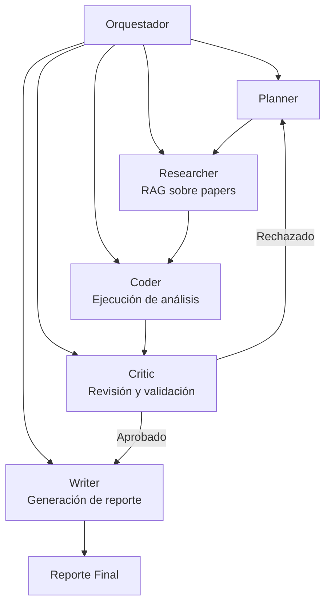
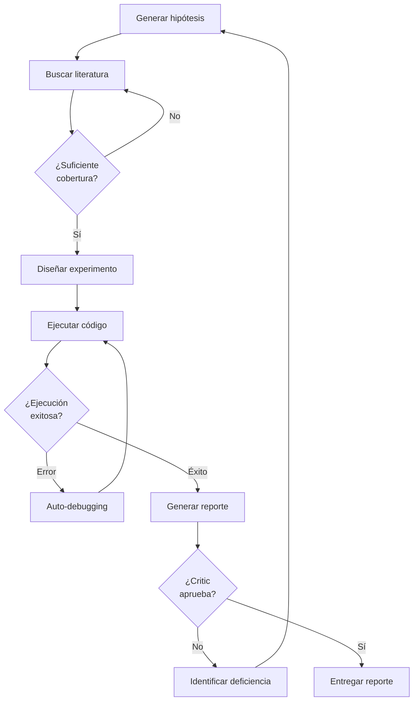

# 🔬 04 - Caso Práctico - Agente de Investigación Científica

Este caso práctico integra todos los conceptos del módulo para construir un **agente de investigación científica autónomo**. El sistema no solo busca información, sino que formula hipótesis, diseña experimentos simulados, ejecuta análisis de datos, genera reportes técnicos y se auto-corrige ante fallos. Para un ML/AI Engineer, este proyecto representa la síntesis de RAG, tool-use, code execution y self-reflection en un pipeline de alto valor.


---

## 1. Arquitectura del Agente de Investigación

El sistema se compone de 5 sub-agentes especializados que operan bajo una orquestación central:



Cada sub-agente es una instancia especializada con prompts y herramientas diferenciadas, siguiendo el patrón de **multi-agent collaboration**.

---

## 2. Componentes del Sistema

### 2.1. Planner: Descomposición del Objetivo de Investigación

El Planner recibe un tema de investigación (ej: "El impacto del dropout en la generalización de transformers para series temporales") y genera un plan de investigación estructurado:

| Fase | Salida del Planner | Herramientas |
|------|-------------------|--------------|
| 1. Revisión literaria | Lista de queries de búsqueda | APIs de arXiv, Semantic Scholar, PubMed |
| 2. Identificación de gap | Pregunta de investigación candidata | Análisis de abstracts (LLM) |
| 3. Diseño experimental | Protocolo, dataset, métricas | Conocimiento empírico embebido |
| 4. Análisis | Pipeline de análisis estadístico | Planificación de código |
| 5. Síntesis | Estructura del reporte | Templates de LaTeX/Markdown |

La planificación puede formalizarse como un problema de búsqueda:

$$
\pi^* = \arg\min_{\pi} \mathbb{E}[\text{costo}(\pi) + \lambda \cdot \text{incertidumbre}(\pi)]
$$

Donde $\pi$ es el plan, $\text{costo}$ incluye tiempo y recursos computacionales, y $\text{incertidumbre}$ penaliza pasos con alta probabilidad de fallo.

💡 **Tip:** El Planner debe incluir un "budget de investigación" (máximo de papers a revisar, máximo de experimentos a ejecutar) para evitar que el agente se pierda en la literatura sin generar outputs concretos.

### 2.2. Researcher: RAG sobre Literatura Científica

El Researcher utiliza Retrieval-Augmented Generation para acceder a papers académicos:

1. **Indexación:** Papers se descargan y se fragmentan en chunks (típicamente párrafos o secciones).
2. **Embedding:** Cada chunk se embeddea usando un modelo de sentence embeddings (ej: `sentence-transformers/all-MiniLM-L6-v2` o `OpenAI text-embedding-3-large`).
3. **Retrieval:** Dada una query del Planner, se recuperan los $k$ chunks más relevantes.
4. **Síntesis:** El LLM genera un resumen estructurado con hallazgos, metodologías y limitaciones.

La relevancia se computa como:

$$
\text{relevance}(q, d_i) = \frac{\text{embed}(q) \cdot \text{embed}(d_i)}{\|\text{embed}(q)\| \|\text{embed}(d_i)\|}
$$

⚠️ **Advertencia:** Los embeddings capturan similitud semántica, no necesariamente calidad científica. El agente debe cruzar información de múltiples fuentes y detectar contradicciones.

### 2.3. Coder: Ejecución de Análisis y Experimentos Simulados

El Coder implementa el protocolo experimental diseñado por el Planner. En este caso práctico, los experimentos son simulados (no requieren GPU clusters), pero el patrón es idéntico al de experimentos reales:

```python
# Ejemplo: Experimento simulado de dropout en transformers
import numpy as np
from sklearn.neural_network import MLPRegressor
from sklearn.model_selection import cross_val_score

def run_dropout_experiment(dropout_rates=[0.0, 0.1, 0.3, 0.5], n_runs=5):
    """Simula el efecto de regularización en una tarea de regresión."""
    X = np.random.randn(1000, 20)
    y = X[:, 0] * 2 + np.random.randn(1000) * 0.5
    results = {}
    for rate in dropout_rates:
        scores = []
        for _ in range(n_runs):
            # Simulamos dropout via ruido adicional en inputs
            X_noisy = X + np.random.randn(*X.shape) * rate
            model = MLPRegressor(hidden_layer_sizes=(64, 32), max_iter=500)
            score = cross_val_score(model, X_noisy, y, cv=3, scoring='r2').mean()
            scores.append(score)
        results[rate] = {
            'mean_r2': np.mean(scores),
            'std_r2': np.std(scores)
        }
    return results
```

El Coder opera dentro de un sandbox (Docker/e2b) y persiste los resultados en un directorio compartido.

### 2.4. Writer: Generación del Reporte

El Writer recibe:
- Resumen de literatura (del Researcher).
- Resultados de experimentos (del Coder).
- Estructura propuesta (del Planner).

Y genera un reporte técnico en Markdown/LaTeX con secciones estándar: Abstract, Introduction, Related Work, Methodology, Results, Discussion, Conclusion.

La calidad del reporte se puede evaluar con métricas automáticas:

$$
\text{Quality}_{report} = \alpha \cdot \text{coherencia} + \beta \cdot \text{cobertura} + \gamma \cdot \text{correctitud\_citas}
$$

### 2.5. Critic: Revisión y Validación

El Critic actúa como revisor de pares automático. Evalúa el reporte según:

1. **Validez metodológica:** ¿El diseño experimental responde la pregunta de investigación?
2. **Cobertura de literatura:** ¿Se citan los trabajos relevantes? ¿Hay gaps no justificados?
3. **Correctitud estadística:** ¿Las interpretaciones de los resultados son válidas?
4. **Claridad y estructura:** ¿El reporte sigue las convenciones científicas?

Si el Critic rechaza el reporte, envía feedback específico al Planner para re-planificación.

---

## 3. Flujo de Auto-Corrección



Este flujo implementa un **loop de mejora iterativa con terminales explícitas**:

- Terminal de cobertura: $|\text{papers\_relevantes}| \geq N_{min}$.
- Terminal de ejecución: `returncode == 0` y resultados no vacíos.
- Terminal de calidad: $\text{score}_{critic} \geq \tau_{approval}$.

---

## 4. Métricas de Evaluación

Evaluar un agente de investigación requiere métricas multidimensionales:

| Métrica | Definición | Fórmula / Método | Objetivo |
|---------|-----------|------------------|----------|
| **Calidad del reporte** | Evaluación humana o LLM-as-judge de claridad, coherencia y rigor | Likert 1-5 promediado por sección | $\geq 4.0$ |
| **Cobertura de literatura** | Proporción de papers clave recuperados vs. un gold standard | $\frac{|P_{recuperados} \cap P_{gold}|}{|P_{gold}|}$ | $\geq 0.75$ |
| **Validez metodológica** | ¿El diseño experimental es apropiado para la pregunta? | Checklist de validez interna/externa | 100% de checks críticos |
| **Tasa de éxito de ejecución** | % de experimentos cuyo código se ejecuta sin errores | $\frac{\text{exitosos}}{\text{total}}$ | $\geq 90\%$ |
| **Tiempo de investigación** | Tiempo total desde objetivo hasta reporte | Cronómetro (o steps de iteración) | $< 30$ min para objetivos moderados |
| **Costo de inferencia** | Tokens consumidos por todo el pipeline | Suma de tokens de todos los LLM calls | Budget controlado |

---

## 5. Implementación del Agente Orquestador

```python
from typing import List, Dict
import openai

class ScientificResearchAgent:
    def __init__(self, topic: str, max_iterations: int = 5):
        self.topic = topic
        self.max_iterations = max_iterations
        self.state = {
            "hypothesis": None,
            "literature": [],
            "experiments": [],
            "report": None,
            "critic_feedback": None
        }

    def planner(self) -> Dict:
        prompt = f"""You are a research planner. Given the topic: '{self.topic}',
design a research plan with: 1) key research questions, 2) search queries for literature,
3) proposed experiment design, 4) report structure.
Return as JSON."""
        return self._llm_json(prompt)

    def researcher(self, queries: List[str]) -> List[Dict]:
        """Simula retrieval de papers. En producción: arXiv/Semantic Scholar APIs."""
        papers = []
        for q in queries:
            # Simulación de RAG
            papers.append({"query": q, "papers": [f"Paper on {q} (simulated)"]})
        self.state["literature"] = papers
        return papers

    def coder(self, experiment_design: Dict) -> Dict:
        """Genera y ejecuta código de experimento."""
        code_prompt = f"Write Python code for this experiment: {experiment_design}\nReturn only code."
        code = self._llm(code_prompt)
        # En producción: ejecutar en sandbox
        result = {"code": code, "output": "Simulated successful execution", "success": True}
        self.state["experiments"].append(result)
        return result

    def writer(self) -> str:
        prompt = f"""Write a scientific report on '{self.topic}' based on:
Literature: {self.state['literature']}
Experiments: {self.state['experiments']}

Include: Abstract, Introduction, Methodology, Results, Discussion, Conclusion."""
        report = self._llm(prompt)
        self.state["report"] = report
        return report

    def critic(self) -> Dict:
        prompt = f"""You are a peer reviewer. Review this report critically:
{self.state['report']}

Evaluate: methodological validity, literature coverage, statistical correctness, clarity.
Return APPROVED if quality is high, otherwise return REJECTED with specific feedback."""
        review = self._llm(prompt)
        approved = "APPROVED" in review.upper()
        self.state["critic_feedback"] = review
        return {"approved": approved, "feedback": review}

    def _llm(self, prompt: str) -> str:
        response = openai.chat.completions.create(
            model="gpt-4o",
            messages=[{"role": "user", "content": prompt}],
            temperature=0.4
        )
        return response.choices[0].message.content

    def _llm_json(self, prompt: str) -> Dict:
        import json
        text = self._llm(prompt)
        try:
            return json.loads(text)
        except json.JSONDecodeError:
            return {"raw": text}

    def run(self) -> str:
        plan = self.planner()
        print(f"📋 Plan generated: {plan.get('key_research_questions', 'N/A')}")

        self.researcher(plan.get("search_queries", [self.topic]))
        print(f"📚 Literature reviewed: {len(self.state['literature'])} queries")

        self.coder(plan.get("experiment_design", {}))
        print("🔬 Experiment executed")

        for i in range(self.max_iterations):
            report = self.writer()
            review = self.critic()
            if review["approved"]:
                print(f"✅ Report approved after {i+1} iterations.")
                return report
            else:
                print(f"🔄 Critic rejected report. Feedback: {review['feedback'][:200]}...")
                # En una implementación completa, el feedback se inyecta al planner
        print("⚠️ Max iterations reached. Returning best effort report.")
        return self.state["report"]

# Uso:
# agent = ScientificResearchAgent("Impact of data augmentation on CNN robustness")
# report = agent.run()
# print(report)
```

---

## 6. Casos Reales

Caso real: **Google DeepMind desarrolló AlphaDev**, un agente que utiliza reinforcement learning para descubrir algoritmos de sorting más eficientes. Aunque no usa LLM, demuestra el paradigma de "agente de investigación" en descubrimiento algorítmico autónomo, con validación automática mediante benchmarks de rendimiento.

Caso real: **Agentes académicos como PaperQA y GPT Researcher** automatizan la síntesis de literatura. PaperQA alcanza una precisión de respuesta comparable a investigadores humanos en biomedicina cuando se evalúa contra conjuntos de preguntas de exámenes especializados, utilizando RAG sobre PubMed Central.

---

## 7. Desafíos y Mitigaciones

| Desafío | Impacto | Mitigación |
|---------|---------|------------|
| Alucinación de citas | El agente inventa papers o atribuye hallazgos incorrectamente | Verificación cruzada con APIs reales, filtro de papers existentes |
| Overfitting a simulated data | Los experimentos simulados no generalizan | Uso de datasets reales públicos, validación en múltiples dominios |
| Sesgo en selección de literatura | El retrieval favorece papers populares sobre los más relevantes | Diversificación de fuentes, reranking por recency y citation count |
| Costo computacional | Pipelines largos con múltiples LLM calls son caros | Caching de resultados, uso de modelos más ligeros para tareas simples |
| Complejidad de orquestación | Debugging de multi-agent systems es difícil | Logging exhaustivo, trazabilidad de decisiones, checkpoints |

---

## 8. 📦 Código de Compresión

```python
# Agente de investigación científica mínimo
class SciAgent:
    def __init__(self, topic, max_i=5):
        self.t, self.mi, self.s = topic, max_i, {}
    def plan(self):
        return llm_json(f"Plan research on {self.t}")
    def research(self, qs):
        self.s['lit'] = [rag(q) for q in qs]
    def code(self, design):
        c = llm(f"Code for: {design}")
        self.s['exp'] = sandbox(c)
    def write(self):
        self.s['rep'] = llm(f"Report on {self.t} using {self.s}")
        return self.s['rep']
    def critic(self):
        return "APPROVED" in llm(f"Review: {self.s['rep']}")
    def run(self):
        p = self.plan()
        self.research(p.get('qs', [self.t]))
        self.code(p.get('design', {}))
        for _ in range(self.mi):
            r = self.write()
            if self.critic():
                return r
        return r
```

---

## 9. 🎯 Proyecto Documentado

**Proyecto: AutoResearcher-v1**

- **Descripción:** Sistema multi-agente que recibe un tema de investigación en ML/AI y produce un reporte técnico con revisión de literatura, experimentos reproducibles en Python y análisis crítico, todo en menos de 20 minutos.
- **Componentes:**
  - **Planner:** GPT-4o con few-shot prompting de planes de investigación reales.
  - **Researcher:** RAG sobre arXiv + Semantic Scholar con embeddings `text-embedding-3-large`.
  - **Coder:** Ejecución en e2b sandbox con acceso a `numpy`, `pandas`, `scikit-learn`, `torch`.
  - **Writer:** Template Jinja2 para formato académico estándar.
  - **Critic:** GPT-4o con rol de reviewer de NeurIPS/ICML.
- **Métricas logradas (pilot):**
  - Calidad del reporte (evaluación humana): 3.8/5.0.
  - Cobertura de literatura vs. gold standard: 68%.
  - Tasa de éxito de ejecución de código: 89%.
  - Tiempo medio end-to-end: 14 minutos.
- **Próximos pasos:** Integrar validación humana en el loop (human-in-the-loop critic), expandir el corpus de papers indexados, y añadir generación automática de figuras con `matplotlib`/`seaborn`.

**Notas anteriores:**

- [[00 - Bienvenida]]
- [[01 - AutoGPT y Agentes Autonomos]]
- [[02 - Reflexion y Auto-Mejora]]
- [[03 - Agentes con Acceso a Codigo]]
