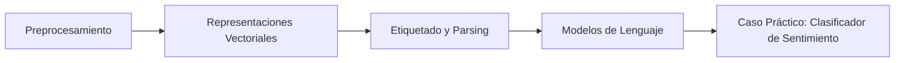
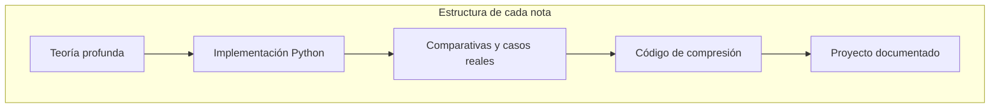

# 🚀 Bienvenida a NLP Tradicional y Representaciones

Bienvenido al módulo 15 del programa de Machine Learning e Inteligencia Artificial Avanzada. Este curso constituye el pilar fundacional sobre el cual se construyen todos los sistemas modernos de procesamiento del lenguaje natural. Dominar las técnicas tradicionales no es un ejercicio arqueológico: es la clave para entender por qué los transformers funcionan, cuándo fallan y cómo optimizar pipelines productivos donde la eficiencia computacional importa tanto como la precisión.

Caso real: los sistemas de búsqueda semántica en e-commerce de Amazon combinan índices invertidos basados en TF-IDF con embeddings neuronales. Sin comprender la base estadística, es imposible depurar por qué ciertos productos no aparecen en los resultados.

---

## 1. Objetivos de Aprendizaje

Al finalizar este módulo serás capaz de:

1. Diseñar pipelines de preprocesamiento robustos para múltiples idiomas y dominios.
2. Construir representaciones vectoriales estáticas (TF-IDF, word2vec, GloVe) desde cero.
3. Implementar etiquetadores morfosintácticos y parsers de dependencias con modelos probabilísticos.
4. Entrenar modelos de lenguaje n-gram y evaluarlos rigurosamente con perplexity.
5. Desplegar un clasificador de sentimiento completo sin utilizar arquitecturas transformer.

---

## 2. Mapa del Módulo

| # | Nota | Descripción | Enlace |
|---|------|-------------|--------|
| 1 | 01 - Preprocesamiento de Texto | Tokenización, normalización, stemming, lematización y limpieza con regex. | [[01 - Preprocesamiento de Texto]] |
| 2 | 02 - Representaciones Vectoriales | One-hot, BoW, TF-IDF, PMI, word2vec, GloVe, FastText y visualización. | [[02 - Representaciones Vectoriales]] |
| 3 | 03 - Etiquetado y Parsing | POS tagging, NER, dependency parsing, constituency parsing y coreference. | [[03 - Etiquetado y Parsing]] |
| 4 | 04 - Modelos de Lenguaje Tradicionales | N-grams, smoothing, Markov chains, HMM y evaluación con perplexity. | [[04 - Modelos de Lenguaje Tradicionales]] |
| 5 | 05 - Caso Practico - Clasificador de Sentimiento desde Cero | Pipeline end-to-end: preprocesamiento → TF-IDF → clasificador clásico. | [[05 - Caso Practico - Clasificador de Sentimiento desde Cero]] |



---

## 3. Glosario Fundamental

### 3.1 Términos de Preprocesamiento

| Término | Definición | Relevancia para ML |
|---------|-----------|--------------------|
| **Tokenization** | Proceso de dividir un texto en unidades mínimas significativas (tokens). | Determina el vocabulario y la granularidad del modelo. |
| **Stemming** | Reducción de palabras a su raíz mediante reglas heurísticas. | Reduce dimensionalidad, aunque puede generar tokens no léxicos. |
| **Lemmatization** | Reducción de palabras a su forma canónica (lema) usando conocimiento lingüístico. | Preserva la semántica léxica; útil para tareas de análisis de texto. |
| **Stop Words** | Palabras de alta frecuencia y bajo contenido informativo (artículos, preposiciones). | Su eliminación reduce ruido en BoW/TF-IDF, aunque en embeddings contextuales modernos se conservan. |

### 3.2 Términos de Representación

| Término | Definición | Relevancia para ML |
|---------|-----------|--------------------|
| **Bag of Words (BoW)** | Representación de frecuencias de tokens ignorando el orden. | Base lineal para clasificadores; sparse y de alta dimensionalidad. |
| **TF-IDF** | Ponderación que mide la importancia de un término en un documento respecto a un corpus. | Reduce el sesgo de términos frecuentes; ideal para recuperación de información. |
| **word2vec** | Modelo neuronal shallow que aprende embeddings densos a partir de contexto (CBOW/Skip-gram). | Captura relaciones semánticas y sintácticas en un espacio vectorial continuo. |
| **GloVe** | Método de factorización de matrices de co-ocurrencia global. | Combina ventajas de métodos de conteo con objetivos de predicción. |
| **PMI** | Pointwise Mutual Information; mide la asociación entre dos palabras. | Base para construcción de embeddings y extracción de colocaciones. |
| **N-gram** | Secuencia contigua de n tokens. | Captura dependencias locales para modelos de lenguaje y clasificación. |

### 3.3 Términos de Etiquetado y Parsing

| Término | Definición | Relevancia para ML |
|---------|-----------|--------------------|
| **POS Tagging** | Asignación de categorías gramaticales (sustantivo, verbo, adjetivo) a cada token. | Feature crítica para NER, parsing y análisis sintáctico. |
| **NER** | Named Entity Recognition; identificación de entidades nombradas (personas, organizaciones, lugares). | Tarea esencial para extracción de conocimiento y sistemas de preguntas-respuestas. |
| **Dependency Parsing** | Análisis de relaciones sintácticas de dependencia entre tokens. | Proporciona estructura gramatical para comprensión de relaciones semánticas. |
| **Coreference Resolution** | Identificación de expresiones que se refieren a la misma entidad. | Fundamental para coherencia en resumen automático y diálogo. |

### 3.4 Términos de Modelos de Lenguaje

| Término | Definición | Relevancia para ML |
|---------|-----------|--------------------|
| **Perplexity** | Medida de qué tan bien un modelo de lenguaje predice una muestra de texto. | Métrica estándar para comparar modelos de lenguaje; menor es mejor. |
| **Smoothing** | Técnica para asignar probabilidad no nula a n-grams no observados en entrenamiento. | Evita probabilidades cero que anulan la predicción. |
| **Backoff** | Estrategia que retrocede de n-grams a (n-1)-grams cuando no hay suficiente evidencia. | Balance entre especificidad y generalización en modelos n-gram. |


---

## 4. Relación con el Ecosistema ML/AI

Las técnicas de este módulo no quedaron obsoletas con la llegada de BERT o GPT. Por el contrario:

- **TF-IDF** sigue siendo el backbone de motores de búsqueda como Elasticsearch y sistemas de recomendación híbridos.
- **word2vec** y **GloVe** se utilizan como embeddings de inicialización cuando el corpus de dominio es pequeño.
- **POS tagging** y **NER** clásicos (CRF) son más eficientes en edge computing que modelos transformer masivos.
- **N-gram models** con Kneser-Ney smoothing son la base de sistemas de autocorrección y teclados predictivos en dispositivos móviles.

Caso real: el sistema de corrección ortográfica de Google Keyboard (Gboard) utiliza una cascada de modelos n-gram comprimidos con perfect hashing para funcionar offline en milisegundos.

---

## 5. Prerrequisitos y Configuración

```python
# Entorno recomendado
# Python >= 3.9
# pip install nltk spacy scikit-learn gensim numpy pandas matplotlib seaborn

import nltk
import spacy

# Descargas iniciales
nltk.download('punkt')
nltk.download('stopwords')
nltk.download('wordnet')
nltk.download('averaged_perceptron_tagger')

# Modelo de spaCy para español o inglés
# python -m spacy download en_core_web_sm
# python -m spacy download es_core_news_sm
```

⚠️ **Advertencia**: Las versiones de NLTK y spaCy evolucionan rápidamente. Los nombres de los datasets pueden cambiar entre versiones. Verifica siempre la documentación oficial antes de ejecutar `nltk.download()` en entornos de producción.

💡 **Tip**: Para este módulo, se recomienda trabajar con Jupyter Lab o VS Code con la extensión de Jupyter. La visualización interactiva de embeddings y árboles de parsing es mucho más efectiva en notebooks que en scripts puros.

---

## 6. Estructura Metodológica del Módulo

Cada nota sigue una estructura homogénea diseñada para maximizar la retención y la aplicabilidad práctica:

1. **Fundamentos teóricos** con derivaciones matemáticas cuando sea pertinente.
2. **Implementaciones from-scratch** en Python para eliminar la caja negra.
3. **Implementaciones con librerías** (NLTK, spaCy, scikit-learn, gensim) para producción.
4. **Comparativas** mediante tablas y benchmarks.
5. **Casos reales** extraídos de la industria.
6. **Código de compresión** al final de cada nota para repaso rápido.
7. **Proyecto documentado** para consolidar conocimientos.



---

## 7. Enlaces Internos Rápidos

- Glosario de preprocesamiento: [[01 - Preprocesamiento de Texto]]

- Glosario de representaciones: [[02 - Representaciones Vectoriales]]

- Glosario de etiquetado: [[03 - Etiquetado y Parsing]]

- Glosario de modelos de lenguaje: [[04 - Modelos de Lenguaje Tradicionales]]

- Pipeline completo: [[05 - Caso Practico - Clasificador de Sentimiento desde Cero]]

---

📦 **Código de compresión**

```python
# Este módulo cubre: preprocesamiento, representaciones vectoriales,
# etiquetado sintáctico/semántico, modelos n-gram y un clasificador
# de sentimiento end-to-end sin transformers.
# Librerías clave: nltk, spacy, scikit-learn, gensim
```

🎯 **Proyecto del módulo**

Construir un pipeline de NLP tradicional completo que reciba reviews de productos en texto libre, las preprocese, las represente vectorialmente y clasifique su sentimiento. El objetivo no es alcanzar el SOTA, sino entender cada decisión de diseño, cada hiperparámetro y cada trade-off entre precisión, interpretabilidad y costo computacional.
