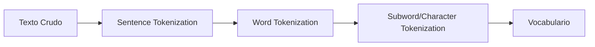
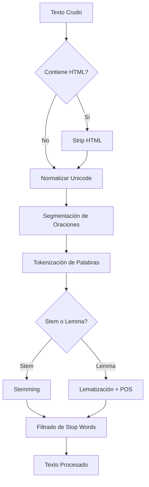

# 🔧 Preprocesamiento de Texto

El preprocesamiento es la fase más infravalorada y simultáneamente más crítica de cualquier pipeline de NLP. Un modelo de clasificación con embeddings de 768 dimensiones no salvará un texto cuya tokenización haya separado incorrectamente negaciones («no me gustó» → ['no', 'me', 'gustó'] vs ['no me gustó']), o cuyas URLs no hayan sido normalizadas. En ML industrial, se estima que entre el 60 % y el 80 % del tiempo de un proyecto de NLP se invierte en limpieza, validación y transformación de datos textuales.

Caso real: en Kaggle competitions de NLP, los equipos top-1 consistentemente invierten más tiempo en preprocesamiento (expansión de contracciones, corrección ortográfica, manejo de emojis) que en arquitecturas de modelo. La competición «Toxic Comment Classification» demostró que un TF-IDF + Logistic Regression con preprocesamiento agresivo superaba a LSTM mal entrenadas.

---

## 1. Tokenización

La tokenización es la segmentación de un texto en unidades atómicas llamadas tokens. La elección del nivel de granularidad impacta directamente en el tamaño del vocabulario, la cobertura del modelo y la capacidad de generalización.

### 1.1 Tokenización a Nivel de Palabra

Es la forma más común. Separa por espacios y puntuación.

```python
import nltk
from nltk.tokenize import word_tokenize

text = "El estado del arte en NLP avanza rápidamente; ¿lo sabías?"
tokens = word_tokenize(text, language='spanish')
print(tokens)
# ['El', 'estado', 'del', 'arte', 'en', 'NLP', 'avanza', 'rápidamente', ';', '¿', 'lo', 'sabías', '?']
```

⚠️ **Advertencia**: La tokenización por simple `split()` destruye información. «Don't» se convierte en ['Don', "'t"] en lugar de ['Do', "n't"], alterando la semántica de negación.

### 1.2 Tokenización a Nivel de Oración

Fundamental para análisis de sentimiento por documento y para modelos de lenguaje que requieren oraciones completas.

```python
from nltk.tokenize import sent_tokenize

text = "Dr. Smith compró 2.5 kg. de manzanas. Luego se fue."
sentences = sent_tokenize(text, language='spanish')
print(sentences)
# ['Dr. Smith compró 2.5 kg. de manzanas.', 'Luego se fue.']
```

💡 **Tip**: Los tokenizadores de oración dependen de abreviaturas locales. NLTK incluye listas de abreviaturas por idioma, pero siempre valida con tu dominio (ej. «art.» puede ser «artículo» en legal o «arte» en humanidades).

### 1.3 Tokenización a Nivel de Subword

BPE (Byte Pair Encoding), WordPiece y SentencePiece son los estándares en modelos transformer. Sin embargo, en NLP tradicional, las técnicas de subword se aplican mediante **morfemas** o **sílabas**.

```python
# Ejemplo simple de segmentación silábica como proxy de subword
import re

def syllable_tokenize(word):
    # Heurística simplificada para español
    pattern = r'[^aeiouáéíóúü]*[aeiouáéíóúü]+(?:[^aeiouáéíóúü]*$)?'
    return re.findall(pattern, word, flags=re.IGNORECASE)

print(syllable_tokenize("constitucionalmente"))
# ['cons', 'ti', 'tu', 'cio', 'nal', 'men', 'te']
```

| Método | Vocabulario | Generalización | Pérdida Semántica | Uso Típico |
|--------|-------------|----------------|-------------------|-----------|
| Word | Grande | Baja | Mínima | BoW, TF-IDF, word2vec |
| Sentence | N/A | N/A | Contextual | Análisis de sentimiento por oración |
| Subword/BPE | Controlado | Alta | Moderada | Modelos neuronales modernos |
| Character | Pequeño | Muy alta | Alta | Modelos robustos a errores ortográficos |



---

## 2. Normalización

### 2.1 Lowercasing y Case Folding

```python
text = "Apple Inc. vendió 50 iPhones"
lower = text.lower()
# "apple inc. vendió 50 iphones"
```

⚠️ **Advertencia**: El lowercasing elimina información semántica. «US» (Estados Unidos) ≠ «us» (nosotros). En NER, conservar el casing es crítico para detectar nombres propios.

### 2.2 Eliminación de Acentos y Unicode Normalization

```python
import unicodedata

def normalize_accents(text):
    nfkd = unicodedata.normalize('NFKD', text)
    return ''.join(c for c in nfkd if not unicodedata.combining(c))

print(normalize_accents("café, niño, jalapeño"))
# "cafe, nino, jalapeno"
```

La forma **NFKD** descompone caracteres en su forma base + combinaciones. Para búsquedas difusas (fuzzy matching) es ideal; para tareas de generación de texto, puede ser destructiva.

### 2.3 Manejo de URLs, Emojis y Hashtags

Los textos provenientes de redes sociales requieren normalizaciones específicas:

```python
import re

def clean_social_text(text):
    # URLs
    text = re.sub(r'http\S+|www\S+', '<URL>', text)
    # Hashtags: conservar el texto, opcionalmente separar camelCase
    text = re.sub(r'#(\w+)', lambda m: ' '.join(re.findall(r'[A-Z]?[a-z]+', m.group(1))), text)
    # Emojis a descripción textual (simplificado)
    text = re.sub(r'[\U0001F600-\U0001F64F]', '<EMOJI>', text)
    # Menciones
    text = re.sub(r'@\w+', '<USER>', text)
    return text

sample = "Visita https://example.com 😀 #MachineLearning es genial @user"
print(clean_social_text(sample))
# "Visita <URL> <EMOJI> Machine Learning es genial <USER>"
```

Caso real: el sistema de moderación de contenido de Meta aplica más de 200 reglas de normalización antes de que cualquier modelo neuronal vea el texto. Esto incluye la estandarización de gírias, expansión de abreviaturas regionales y la homologación de caracteres homogléficos (caracteres Unicode que lucen idénticos pero tienen diferentes codepoints).

---

## 3. Stemming

El stemming reduce las palabras a su raíz mediante reglas heurísticas sin consultar un diccionario.

### 3.1 Algoritmo de Porter

Desarrollado por Martin Porter en 1980. Es el más utilizado para inglés.

```python
from nltk.stem import PorterStemmer

stemmer = PorterStemmer()
words = ["running", "runs", "ran", "easily", "fairly"]
for w in words:
    print(f"{w} -> {stemmer.stem(w)}")
# running -> run
# runs -> run
# ran -> ran
# easily -> easili
# fairly -> fairli
```

### 3.2 Algoritmo Snowball (Porter2)

Mejora del original, soporta múltiples idiomas.

```python
from nltk.stem.snowball import SnowballStemmer

stemmer_es = SnowballStemmer('spanish')
words = ["corriendo", "corrió", "correr", "rápidamente"]
for w in words:
    print(f"{w} -> {stemmer_es.stem(w)}")
```

| Algoritmo | Idiomas | Velocidad | Precisión Lingüística | Uso Recomendado |
|-----------|---------|-----------|----------------------|-----------------|
| Porter | Inglés | Muy alta | Baja-Moderada | Recuperación de información rápida |
| Snowball | 15+ idiomas | Alta | Moderada | Prototipado multilingüe |
| Lancaster | Inglés | Alta | Muy baja | Cuando se necesita agresividad máxima |

⚠️ **Advertencia**: «Universidad» y «universal» pueden stemmizarse a «univers» en algunas configuraciones, perdiendo la distinción semántica crucial. Nunca uses stemming sin validar el impacto en tu vocabulario final.


---

## 4. Lematización

A diferencia del stemming, la lematización utiliza un lexicon (WordNet) y análisis morfológico para reducir una palabra a su lema canónico.

### 4.1 WordNet Lemmatizer

```python
from nltk.stem import WordNetLemmatizer
from nltk.corpus import wordnet
from nltk import pos_tag

lemmatizer = WordNetLemmatizer()

# Sin POS tag, asume sustantivo
print(lemmatizer.lemmatize("running"))      # running
print(lemmatizer.lemmatize("running", pos='v'))  # run

# Lematización con POS tags
words = [("better", 'a'), ("rocks", 'n'), ("running", 'v')]
for w, p in words:
    print(f"{w} -> {lemmatizer.lemmatize(w, pos=p)}")
```

💡 **Tip**: Para obtener mejores resultados, primero aplica POS tagging (ver Sección 5 de [[03 - Etiquetado y Parsing]]) y luego lematiza con el tag correcto. La conversión de tags Penn Treebank a WordNet es necesaria:

```python
def get_wordnet_pos(treebank_tag):
    if treebank_tag.startswith('J'):
        return wordnet.ADJ
    elif treebank_tag.startswith('V'):
        return wordnet.VERB
    elif treebank_tag.startswith('N'):
        return wordnet.NOUN
    elif treebank_tag.startswith('R'):
        return wordnet.ADV
    else:
        return wordnet.NOUN
```

| Aspecto | Stemming | Lematización |
|---------|----------|--------------|
| Velocidad | Muy rápido | Más lento (consulta lexicon) |
| Salida | Puede no ser una palabra real | Siempre es una pal válida |
| Precisión morfológica | Baja | Alta |
| Requiere POS tag | No | Recomendado |
| Caso de uso | IR, clustering rápido | NLP semántico, análisis lingüístico |

---

## 5. Stop Words

Las stop words son términos de alta frecuencia y bajo valor discriminativo.

```python
from nltk.corpus import stopwords

stop_words_es = set(stopwords.words('spanish'))
tokens = ["el", "gato", "corre", "rápidamente", "sobre", "el", "tejado"]
filtered = [w for w in tokens if w.lower() not in stop_words_es]
print(filtered)  # ['gato', 'corre', 'rápidamente', 'tejado']
```

⚠️ **Advertencia**: La eliminación de stop words es perjudicial en tareas de análisis de sentimiento cuando las negaciones están involucradas. «No me gusta» sin «no» se convierte en «me gusta», invirtiendo completamente la polaridad.

Caso real: los sistemas de retrieval-augmented generation (RAG) como los utilizados por Perplexity AI no eliminan stop words de los queries porque términos como «cómo», «por qué» y «cuál» contienen intención informativa crucial para el ranking de pasajes.

---

## 6. Limpieza Avanzada con Expresiones Regulares

```python
import re

def advanced_clean(text):
    # Eliminar HTML tags
    text = re.sub(r'<[^>]+>', ' ', text)
    # Normalizar espacios múltiples
    text = re.sub(r'\s+', ' ', text)
    # Expandir contracciones en inglés (ejemplo simplificado)
    contractions = {
        "n't": " not", "'re": " are", "'s": " is",
        "'d": " would", "'ll": " will", "'ve": " have"
    }
    for k, v in contractions.items():
        text = text.replace(k, v)
    # Eliminar caracteres no alfabéticos excepto puntuación básica
    text = re.sub(r"[^a-zA-ZáéíóúüñÁÉÍÓÚÜÑ.,;:!?¿¡\s]", "", text)
    return text.strip()

print(advanced_clean("<p>Hello!!!   It's great!!! 123</p>"))
# "Hello. It is great."
```

---

## 7. Segmentación de Oraciones

La segmentación no trivial cuando hay abreviaturas ambiguas.

```python
from nltk.tokenize import PunktSentenceTokenizer

# Entrenar un tokenizador propio si el dominio es especializado
train_text = "Dr. Stone trabaja en la U.N. Es un experto. Sr. Gómez llegó tarde."
tokenizer = PunktSentenceTokenizer(train_text)
print(tokenizer.tokenize(train_text))
```

| Idioma | Tokenizador Recomendado | Consideraciones Especiales |
|--------|------------------------|---------------------------|
| Inglés | NLTK Punkt, spaCy | Abreviaturas como «Dr.», «Mr.», «Inc.» |
| Español | spaCy es_core_news_sm | Uso de «¿» y «¡» como delimitadores fuertes |
| Alemán | spaCy de_core_news_sm | Compuestos nominales largos |
| Chino | jieba + reglas | No hay espacios entre palabras |
| Japonés | MeCab, Sudachi | Sistemas de escritura mixtos (kanji, hiragana, katakana) |



---

📦 **Código de compresión**

```python
import re
import unicodedata
from nltk.tokenize import word_tokenize, sent_tokenize
from nltk.stem import SnowballStemmer, WordNetLemmatizer
from nltk.corpus import stopwords

# Pipeline completo de preprocesamiento NLP tradicional
def preprocess_pipeline(text, language='spanish', use_lemma=False):
    # Normalización Unicode
    text = unicodedata.normalize('NFKC', text)
    # Limpieza básica
    text = re.sub(r'http\S+', '<URL>', text)
    text = re.sub(r'@\w+', '<USER>', text)
    text = re.sub(r'\s+', ' ', text)
    # Tokenización
    tokens = word_tokenize(text, language=language)
    # Lowercasing
    tokens = [t.lower() for t in tokens if t.isalpha()]
    # Stop words
    stops = set(stopwords.words(language))
    tokens = [t for t in tokens if t not in stops]
    # Stemming o Lemmatización
    if use_lemma:
        lemmatizer = WordNetLemmatizer()
        tokens = [lemmatizer.lemmatize(t) for t in tokens]
    else:
        stemmer = SnowballStemmer(language)
        tokens = [stemmer.stem(t) for t in tokens]
    return tokens
```

🎯 **Proyecto documentado: Preprocesador Multilingüe Industrial**

Diseña una clase `MultilingualPreprocessor` que acepte configuraciones por idioma y dominio. Debe incluir:

- Diccionarios de abreviaturas personalizables por dominio (legal, médico, financiero).
- Pipeline condicional: lematización para tareas semánticas, stemming para recuperación de información.
- Módulo de estadísticas: reporte de reducción de vocabulario, distribución de longitudes de tokens y detección de idioma automática (usando `langdetect`).
- Manejo de errores robusto: si un texto no puede tokenizarse, debe loguear el error y devolver una lista vacía en lugar de lanzar una excepción no controlada.

Salida esperada: un script ejecutable que procese un CSV de reviews multilingües y genere un CSV limpio con una columna adicional `processed_tokens`.
