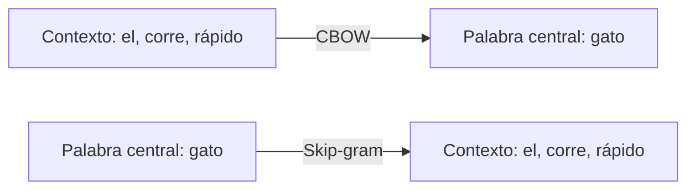
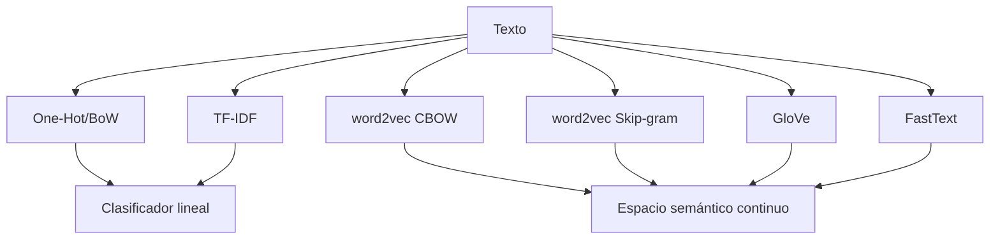

# 🧮 Representaciones Vectoriales

La representación numérica del lenguaje es el puente entre el texto simbólico y las operaciones algebraicas que los modelos de ML ejecutan. La calidad de esta representación determina el techo de rendimiento de cualquier downstream task, desde la clasificación de documentos hasta la recuperación de información semántica. En este módulo, exploramos el espectro completo: desde vectores sparse de alta dimensionalidad hasta embeddings densos que capturan analogías lingüísticas en espacios vectoriales continuos.

Caso real: el sistema de recomendación de noticias de Google News, en su versión original, utilizaba word2vec para agrupar artículos relacionados semánticamente. La famosa operación vectorial $\vec{Rey} - \vec{Hombre} + \vec{Mujer} \approx \vec{Reina}$ no es una curiosidad: es la base de motores de búsqueda semántica que funcionan en producción.

---

## 1. One-Hot Encoding

La representación más simple: cada palabra del vocabulario $V$ se representa como un vector de dimensión $|V|$ con un único 1 en la posición correspondiente.

Para una palabra $w_i$ en un vocabulario ordenado $\{w_1, w_2, \dots, w_{|V|}\}$:

$$
\text{one\_hot}(w_i) = \left[ 0, \dots, 0, \underbrace{1}_{i\text{-ésima posición}}, 0, \dots, 0 \right]^T
$$

```python
import numpy as np

vocab = ['el', 'gato', 'corre', 'rápido']
word_to_idx = {w: i for i, w in enumerate(vocab)}

def one_hot(word, vocab_size):
    vec = np.zeros(vocab_size)
    vec[word_to_idx[word]] = 1
    return vec

print(one_hot('gato', len(vocab)))
# [0. 1. 0. 0.]
```

⚠️ **Advertencia**: One-hot encoding sufre de la maldición de la dimensionalidad. Un vocabulario de 100 000 palabras genera vectores de 100 000 dimensiones. Además, la similitud coseno entre cualquier par de palabras distintas es cero, por lo que no captura relación semántica alguna.

---

## 2. Bag of Words (BoW)

BoW representa un documento como el vector de frecuencias de sus tokens, ignorando el orden.

Para un corpus con vocabulario $V$, el documento $d$ se representa como:

$$
\text{BoW}(d) = \left[ \text{count}(w_1, d), \text{count}(w_2, d), \dots, \text{count}(w_{|V|}, d) \right]
$$

```python
from sklearn.feature_extraction.text import CountVectorizer

corpus = [
    "el gato corre rápido",
    "el perro corre lento",
    "el gato y el perro corren"
]

vectorizer = CountVectorizer()
X = vectorizer.fit_transform(corpus)
print(vectorizer.get_feature_names_out())
print(X.toarray())
# ['corre' 'corren' 'el' 'gato' 'lento' 'perro' 'rápido' 'y']
# [[0 0 1 1 0 0 1 0]
#  [1 0 1 0 1 1 0 0]
#  [0 1 2 1 0 1 0 1]]
```

| Propiedad | One-Hot | BoW |
|-----------|---------|-----|
| Dimensión | $|V|$ | $|V|$ |
| Información de frecuencia | No | Sí |
| Esparsidad | Máxima | Alta |
| Captura orden | No | No |
| Uso típico | Capa de entrada básica | Clasificación de texto tradicional |


---

## 3. TF-IDF

TF-IDF (Term Frequency - Inverse Document Frequency) pondera cada término por su importancia relativa en el documento y en el corpus.

### 3.1 Definiciones Matemáticas

**Term Frequency** (frecuencia del término en el documento):

$$
\text{TF}(t, d) = \frac{f_{t,d}}{\sum_{t' \in d} f_{t',d}}
$$

Donde $f_{t,d}$ es la frecuencia bruta del término $t$ en el documento $d$.

**Inverse Document Frequency** (inversa de la frecuencia en documentos):

$$
\text{IDF}(t, D) = \log \frac{|D|}{|\{ d \in D : t \in d \}|}
$$

**TF-IDF combinado**:

$$
\text{TF-IDF}(t, d, D) = \text{TF}(t, d) \times \text{IDF}(t, D)
$$

💡 **Tip**: La versión suavizada de IDF (como la de scikit-learn) añade 1 al denominador y al argumento del logaritmo para evitar división por cero:

$$
\text{IDF}(t, D) = \log \frac{1 + |D|}{1 + |\{d \in D : t \in d\}|} + 1
$$

```python
from sklearn.feature_extraction.text import TfidfVectorizer

corpus = [
    "el gato corre rápido",
    "el perro corre lento",
    "el gato y el perro corren"
]

vectorizer = TfidfVectorizer()
X = vectorizer.fit_transform(corpus)
print(X.toarray().round(3))
```

Caso real: los motores de búsqueda clásicos (Elasticsearch, Solr, Whoosh) implementan variantes de TF-IDF con normalización coseno como función de scoring por defecto. La mejora de BM25, aunque más moderna, comparte la intuición fundamental de penalizar términos ubicuos y premiar términos discriminativos.


---

## 4. Matriz de Co-ocurrencia y PMI

### 4.1 Matriz de Co-ocurrencia

Captura la frecuencia con la que dos palabras aparecen dentro de una ventana de contexto.

Para una ventana de tamaño $k$, la matriz $M$ de tamaño $|V| \times |V|$ se define como:

$$
M_{ij} = \sum_{d \in D} \sum_{t_i, t_j \in d} \mathbb{1}\left( |\text{pos}(t_i) - \text{pos}(t_j)| \leq k \right)
$$

```python
from collections import defaultdict, Counter
import numpy as np

def build_cooccurrence(corpus_tokens, vocab, window=2):
    word_to_idx = {w: i for i, w in enumerate(vocab)}
    M = np.zeros((len(vocab), len(vocab)))
    for tokens in corpus_tokens:
        for i, w in enumerate(tokens):
            start = max(0, i - window)
            end = min(len(tokens), i + window + 1)
            for j in range(start, end):
                if i != j:
                    M[word_to_idx[w], word_to_idx[tokens[j]]] += 1
    return M, word_to_idx
```

### 4.2 Pointwise Mutual Information (PMI)

PMI mide cuánto más frecuentemente dos palabras co-ocurren de lo esperado bajo independencia estadística.

$$
\text{PMI}(w_i, w_j) = \log \frac{P(w_i, w_j)}{P(w_i) P(w_j)} = \log \frac{M_{ij} \cdot |D|}{\sum_k M_{ik} \cdot \sum_k M_{kj}}
$$

**Positive PMI (PPMI)** trunca valores negativos a cero, ya que los valores negativos son ruidosos con corpus pequeños:

$$
\text{PPMI}(w_i, w_j) = \max(0, \text{PMI}(w_i, w_j))
$$

```python
def ppmi(M):
    total = M.sum()
    row_sums = M.sum(axis=1, keepdims=True)
    col_sums = M.sum(axis=0, keepdims=True)
    # Evitar división por cero
    expected = (row_sums @ col_sums) / total
    pmi = np.log2((M / total) / (expected + 1e-12) + 1e-12)
    ppmi = np.maximum(0, pmi)
    return ppmi
```

⚠️ **Advertencia**: PMI tiene un sesgo hacia eventos raros. Palabras que co-ocurren una única vez pueden tener PMI muy alto. La técnica de smoothing con $\alpha$ (elevar las probabilidades a una potencia menor que 1) mitiga este problema.

---

## 5. word2vec

word2vec aprende representaciones densas mediante una red neuronal shallow que predice contextos (Skip-gram) o palabras centrales (CBOW).

### 5.1 CBOW (Continuous Bag of Words)

Predice la palabra central $w_t$ a partir de su contexto $C_t$:

$$
P(w_t | C_t) = \frac{\exp(\mathbf{v'}_{w_t}^\top \cdot \mathbf{h})}{\sum_{w \in V} \exp(\mathbf{v'}_w^\top \cdot \mathbf{h})}
$$

Donde $\mathbf{h} = \frac{1}{|C_t|} \sum_{w \in C_t} \mathbf{v}_w$ es el promedio de los vectores de contexto.

### 5.2 Skip-gram

Predice el contexto a partir de la palabra central. Maximiza:

$$
J(\theta) = \frac{1}{T} \sum_{t=1}^{T} \sum_{-c \leq j \leq c, j \neq 0} \log P(w_{t+j} | w_t)
$$

Con la probabilidad softmax:

$$
P(w_O | w_I) = \frac{\exp(\mathbf{v'}_{w_O}^\top \cdot \mathbf{v}_{w_I})}{\sum_{w \in V} \exp(\mathbf{v'}_w^\top \cdot \mathbf{v}_{w_I})}
$$

### 5.3 Negative Sampling

El cálculo del denominador softmax sobre todo el vocabulario es prohibitivo. Negative Sampling reformula el problema como una serie de clasificaciones binarias.

Para un par $(w_O, w_I)$ positivo y $k$ pares negativos $(\tilde{w}, w_I)$ muestreados de una distribución $P_n(w)$:

$$
\log \sigma(\mathbf{v'}_{w_O}^\top \cdot \mathbf{v}_{w_I}) + \sum_{i=1}^{k} \mathbb{E}_{\tilde{w} \sim P_n(w)} \left[ \log \sigma(-\mathbf{v'}_{\tilde{w}}^\top \cdot \mathbf{v}_{w_I}) \right]
$$

Donde $\sigma(x) = \frac{1}{1 + e^{-x}}$.

```python
from gensim.models import Word2Vec

sentences = [
    ["el", "gato", "corre", "rápido"],
    ["el", "perro", "corre", "lento"],
    ["el", "gato", "y", "el", "perro", "corren"]
]

model = Word2Vec(sentences, vector_size=100, window=5,
                 min_count=1, workers=4, sg=1, negative=5)

# Palabras más similares a 'gato'
print(model.wv.most_similar('gato'))
```

💡 **Tip**: El parámetro `sg=1` activa Skip-gram; `sg=0` activa CBOW. Skip-gram funciona mejor con corpus pequeños y palabras raras. CBOW es más rápido y robusto para palabras frecuentes.




---

## 6. GloVe (Global Vectors)

GloVe combina el enfoque de conteo global (matrices de co-ocurrencia) con el enfoque predictivo de word2vec.

La función objetivo minimiza la diferencia entre el producto interno de dos vectores y el logaritmo de su probabilidad de co-ocurrencia:

$$
J = \sum_{i,j=1}^{V} f(X_{ij}) \left( \mathbf{w}_i^\top \mathbf{\tilde{w}}_j + b_i + \tilde{b}_j - \log X_{ij} \right)^2
$$

Donde:
- $X_{ij}$ es el número de veces que la palabra $j$ aparece en el contexto de la palabra $i$.
- $f(X_{ij})$ es una función de peso que evita que palabras muy frecuentes dominen:

$$
f(x) = \begin{cases} (x / x_{\max})^\alpha & \text{if } x < x_{\max} \\ 1 & \text{otherwise} \end{cases}
$$

```python
import gensim.downloader as api

# Cargar GloVe preentrenado (convertido a word2vec format)
model = api.load("glove-wiki-gigaword-100")
print(model.most_similar("king"))
```

Caso real: Stanford NLP mantiene los vectores GloVe preentrenados, que son utilizados como embeddings estáticos en tareas donde entrenar word2vec desde cero es computacionalmente inviable. Muchos sistemas de NER clásicos combinan características one-hot con embeddings GloVe como input a CRFs.

---

## 7. FastText

FastText, desarrollado por Facebook AI, extiende word2vec al representar cada palabra como una bolsa de n-gramas de caracteres.

Para una palabra $w$ con secuencia de caracteres $c_1, c_2, \dots, c_n$, el conjunto de n-gramas $\mathcal{G}_w$ se define como:

$$
\mathcal{G}_w = \{ c_1 c_2 \dots c_n, c_2 c_3 \dots c_{n+1}, \dots \}
$$

El vector de la palabra es la suma del vector de la palabra completa más la suma de los vectores de sus n-gramas:

$$
\mathbf{v}_w = \sum_{g \in \mathcal{G}_w \cup \{w\}} \mathbf{z}_g
$$

Esto permite generar vectores para palabras fuera del vocabulario (OOV) descomponiéndolas en subunidades conocidas.

```python
from gensim.models import FastText

sentences = [
    ["correr", "corriendo", "corredor"],
    ["saltar", "saltando", "saltador"]
]

model = FastText(sentences, vector_size=100, window=3,
                 min_count=1, min_n=3, max_n=6)

# Palabra OOV
print(model.wv['corredora'])  # Funciona gracias a subword info
```

⚠️ **Advertencia**: FastText aumenta significativamente el uso de memoria porque almacena vectores para cada n-grama, no solo para palabras. En vocabularios de millones de palabras, esto puede ser un cuello de botella en hardware limitado.

---

## 8. Comparativa: Representaciones Estáticas vs. Contextuales

| Característica | One-Hot / BoW / TF-IDF | word2vec / GloVe / FastText | BERT / GPT (Contextuales) |
|----------------|----------------------|---------------------------|--------------------------|
| Dimensión | Alta (sparse) | Baja (densa) | Muy alta (densa) |
| Polisemia | No resuelta | No resuelta | Resuelta por contexto |
| OOV handling | Ninguna | FastText sí; resto no | Subword tokenization |
| Entrenamiento | No requiere | Requiere corpus grande | Requiere corpus masivo |
| Interpretabilidad | Alta | Media | Baja |
| Costo computacional | Bajo | Bajo | Muy alto |
| Uso en producción | Búsqueda, clustering | Inicialización, IR híbrido | Generación, comprensión profunda |



---

## 9. Visualización de Embeddings

### 9.1 t-SNE

t-Distributed Stochastic Neighbor Embedding preserva la estructura local de vecinos en alta dimensión.

```python
from sklearn.manifold import TSNE
import matplotlib.pyplot as plt

# Supongamos vectors: array (n_words, dim) y labels: list of words
tsne = TSNE(n_components=2, random_state=42, perplexity=5)
vectors_2d = tsne.fit_transform(vectors)

plt.scatter(vectors_2d[:, 0], vectors_2d[:, 1])
for label, x, y in zip(labels, vectors_2d[:, 0], vectors_2d[:, 1]):
    plt.annotate(label, (x, y))
plt.show()
```

### 9.2 UMAP

Uniform Manifold Approximation and Projection es más rápido que t-SNE y preserva mejor la estructura global.

```python
import umap

reducer = umap.UMAP(n_neighbors=5, min_dist=0.1, random_state=42)
vectors_2d = reducer.fit_transform(vectors)
```

💡 **Tip**: La perplexity de t-SNE (típicamente 5-50) controla el balance entre estructura local y global. Valores muy bajos exageran clusters; valores muy altos difuminan la estructura local.

---

📦 **Código de compresión**

```python
# Pipeline de representaciones: BoW → TF-IDF → word2vec → GloVe → FastText
from sklearn.feature_extraction.text import TfidfVectorizer
from gensim.models import Word2Vec, FastText
import numpy as np

# TF-IDF
vectorizer = TfidfVectorizer(max_features=5000)
X_tfidf = vectorizer.fit_transform(corpus)

# word2vec Skip-gram
w2v = Word2Vec(tokenized_corpus, vector_size=100, sg=1, negative=5)

# FastText (con subword info para OOV)
ft = FastText(tokenized_corpus, vector_size=100, min_n=3, max_n=6)
```

🎯 **Proyecto documentado: Explorador Semántico de Embeddings**

Construye una aplicación CLI que:

1. Entrene word2vec, GloVe (vía `gensim`) y FastText sobre un corpus de noticias en español.
2. Calcule las analogías más frecuentes ($\vec{A} - \vec{B} + \vec{C}$) y compare los resultados entre los tres modelos.
3. Genere visualizaciones UMAP de clusters semánticos (deportes, política, tecnología).
4. Implemente un sistema de búsqueda de sinónimos por similitud coseno, con fallback a FastText cuando la palabra query esté fuera del vocabulario de word2vec.

Salida: un notebook o script que genere un reporte comparativo en HTML con tablas y gráficos interactivos.
