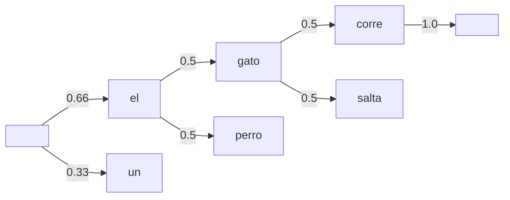

# 📊 Modelos de Lenguaje Tradicionales

Un modelo de lenguaje asigna una probabilidad a una secuencia de palabras. Esta capacidad, aparentemente simple, es la columna vertebral de la corrección ortográfica, la traducción automática, el reconocimiento de voz y la generación de texto. Antes de que los transformers dominaran el panorama, los modelos n-gram, las cadenas de Markov y los HMM constituían el estado del arte. Comprenderlos no es un ejercicio histórico: estos modelos siguen operando en mil millones de dispositivos móviles como teclados predictivos, y sus principios de smoothing y backoff informan las técnicas de regularización modernas.

Caso real: el teclado SwiftKey, antes de su adquisición por Microsoft, utilizaba modelos n-gram de 5-gramas comprimidos mediante estructuras de trie y técnicas de quantization para predecir la siguiente palabra en menos de 10 ms en hardware de 2013. La eficiencia era tan crítica que un modelo neuronal no podía cumplir las restricciones de latencia y consumo energético.

---

## 1. Modelos N-gram

Un modelo n-gram aproxima la probabilidad conjunta de una secuencia mediante la suposición de Markov de orden $n-1$:

$$
P(w_1, w_2, \dots, w_m) = \prod_{i=1}^{m} P(w_i | w_{i-n+1}, \dots, w_{i-1})
$$

### 1.1 Unigram, Bigram y Trigram

**Unigram**: asume independencia total.

$$
P(w_1, \dots, w_m) = \prod_{i=1}^{m} P(w_i)
$$

**Bigram**: dependencia del token inmediatamente anterior.

$$
P(w_i | w_1, \dots, w_{i-1}) \approx P(w_i | w_{i-1})
$$

**Trigram**: dependencia de los dos tokens anteriores.

$$
P(w_i | w_1, \dots, w_{i-1}) \approx P(w_i | w_{i-2}, w_{i-1})
$$

### 1.2 Estimación de Máxima Verosimilitud (MLE)

Las probabilidades condicionales se estiman por conteo:

$$
P_{\text{MLE}}(w_i | w_{i-1}) = \frac{C(w_{i-1}, w_i)}{C(w_{i-1})}
$$

```python
from collections import defaultdict, Counter
import numpy as np

class BigramLM:
    def __init__(self):
        self.bigrams = defaultdict(Counter)
        self.unigrams = Counter()
    
    def train(self, tokenized_sentences):
        for sent in tokenized_sentences:
            sent = ['<s>'] + sent + ['</s>']
            for i in range(len(sent) - 1):
                self.unigrams[sent[i]] += 1
                self.bigrams[sent[i]][sent[i+1]] += 1
    
    def prob(self, w_prev, w):
        return self.bigrams[w_prev][w] / self.unigrams[w_prev]

# Uso
corpus = [
    ["el", "gato", "corre"],
    ["el", "perro", "corre"],
    ["el", "gato", "salta"]
]
lm = BigramLM()
lm.train(corpus)
print(lm.prob("el", "gato"))  # 0.666...
```

⚠️ **Advertencia**: El modelo MLE asigna probabilidad cero a cualquier n-gram no visto en entrenamiento. Esto es catastrófico porque una única probabilidad cero anula todo el producto de la secuencia. El smoothing es obligatorio.

---

## 2. Técnicas de Smoothing

### 2.1 Laplace (Add-One) Smoothing

Añade 1 a todos los conteos:

$$
P_{\text{Laplace}}(w_i | w_{i-1}) = \frac{C(w_{i-1}, w_i) + 1}{C(w_{i-1}) + |V|}
$$

Donde $|V|$ es el tamaño del vocabulario.

```python
def prob_laplace(self, w_prev, w, vocab_size):
    return (self.bigrams[w_prev][w] + 1) / (self.unigrams[w_prev] + vocab_size)
```

⚠️ **Advertencia**: Laplace smoothing es demasiado agresivo. Roba demasiada masa probabilística de los n-grams frecuentes para dársela a los eventos no vistos. En la práctica, Add-One nunca se usa en sistemas de producción.

### 2.2 Kneser-Ney Smoothing

El smoothing más efectivo para modelos n-gram. Se basa en la idea de **continuación**: la probabilidad de una palabra no debe depender solo de cuántas veces aparece, sino de cuántos contextos distintos la preceden.

La probabilidad interpolada Kneser-Ney para un bigram es:

$$
P_{\text{KN}}(w_i | w_{i-1}) = \frac{\max(C(w_{i-1}, w_i) - d, 0)}{C(w_{i-1})} + \lambda(w_{i-1}) P_{\text{continuation}}(w_i)
$$

Donde:
- $d$ es un descuento absoluto (típicamente 0.75).
- $\lambda(w_{i-1})$ es un factor de normalización que distribuye la masa descuento.
- La probabilidad de continuación mide la diversidad de contextos:

$$
P_{\text{continuation}}(w_i) = \frac{|\{w_{i-1} : C(w_{i-1}, w_i) > 0\}|}{\sum_{w'} |\{w_{i-1} : C(w_{i-1}, w') > 0\}|}
$$

💡 **Tip**: Kneser-Ney requiere almacenar estadísticas adicionales (número de contextos distintos), lo que incrementa el uso de memoria. Sin embargo, su rendimiento en perplexity suele superar a Laplace y a métodos de backoff simples por márgenes significativos.

---

## 3. Backoff e Interpolación

### 3.1 Backoff

Si un n-gram no ha sido observado, se «retrocede» a un modelo de orden inferior:

$$
P_{\text{backoff}}(w_i | w_{i-2}, w_{i-1}) = \begin{cases}
P(w_i | w_{i-2}, w_{i-1}) & \text{if } C(w_{i-2}, w_{i-1}, w_i) > 0 \\
\alpha(w_{i-2}, w_{i-1}) P_{\text{backoff}}(w_i | w_{i-1}) & \text{otherwise}
\end{cases}
$$

### 3.2 Interpolación Lineal

Combina modelos de diferentes órdenes con pesos fijos:

$$
\hat{P}(w_i | w_{i-2}, w_{i-1}) = \lambda_1 P_{\text{MLE}}(w_i | w_{i-2}, w_{i-1}) + \lambda_2 P_{\text{MLE}}(w_i | w_{i-1}) + \lambda_3 P_{\text{MLE}}(w_i)
$$

Con la restricción $\sum \lambda_i = 1$. Los lambdas se optimizan típicamente mediante un held-out validation set.

| Técnica | Complejidad | Precisión | Uso en Producción |
|---------|-------------|-----------|-------------------|
| Laplace | Baja | Baja | Solo educativo |
| Jelinek-Mercer (Interpolación) | Media | Media | Moderado |
| Katz Backoff | Media | Media-Alta | Alto (srilm, kenlm) |
| Kneser-Ney | Alta | Alta | Estándar en teclados predictivos |
| Modified Kneser-Ney | Muy alta | Muy alta | Sistemas de speech recognition |

---

## 4. Cadenas de Markov en NLP

Una cadena de Markov de primer orden es equivalente a un modelo de lenguaje bigram. Los estados son palabras del vocabulario y las transiciones son las probabilidades condicionales.

La matriz de transición $\mathbf{P}$ para un vocabulario de tamaño $|V|$ es:

$$
P_{ij} = P(w_j | w_i) = \frac{C(w_i, w_j)}{C(w_i)}
$$

Propiedades:
- $\sum_{j} P_{ij} = 1$ para todo $i$.
- La distribución estacionaria $\boldsymbol{\pi}$ satisface $\boldsymbol{\pi} \mathbf{P} = \boldsymbol{\pi}$.

```python
import numpy as np

# Generar texto con una cadena de Markov (bigram)
def generate_text(lm, start_word, length=20):
    text = [start_word]
    current = start_word
    for _ in range(length):
        candidates = list(lm.bigrams[current].keys())
        probs = np.array(list(lm.bigrams[current].values()), dtype=float)
        probs /= probs.sum()
        current = np.random.choice(candidates, p=probs)
        text.append(current)
    return ' '.join(text)

# lm es una instancia de BigramLM entrenada
# print(generate_text(lm, 'el'))
```

Caso real: los generadores de texto Markovianos de orden 2-3 fueron populares en los años 90 para crear bots de IRC y spammers de email. Su textos eran gramaticalmente coherentes a nivel local pero semánticamente absurdos a nivel global, lo que los hacía detectables por filtros bayesianos.



---

## 5. Hidden Markov Models para Secuencias

Aunque los HMM ya fueron introducidos para POS tagging, su aplicación como modelos de lenguaje secuencial merece profundización matemática.

### 5.1 Forward Algorithm

Calcula la probabilidad de una secuencia de observaciones $\mathbf{o} = (o_1, \dots, o_T)$ sumando sobre todas las secuencias de estados ocultos posibles.

Definimos $\alpha_t(i) = P(o_1, \dots, o_t, q_t = S_i | \lambda)$ como la probabilidad forward parcial.

Inicialización:

$$
\alpha_1(i) = \pi_i b_i(o_1)
$$

Inducción:

$$
\alpha_{t+1}(j) = \left[ \sum_{i=1}^{N} \alpha_t(i) a_{ij} \right] b_j(o_{t+1})
$$

Terminación:

$$
P(\mathbf{o} | \lambda) = \sum_{i=1}^{N} \alpha_T(i)
$$

### 5.2 Viterbi Algorithm

Encuentra la secuencia de estados ocultos más probable.

Definimos $\delta_t(i)$ como la probabilidad del camino más probable que termina en el estado $S_i$ en el tiempo $t$.

$$
\delta_t(j) = \max_{i} \left[ \delta_{t-1}(i) a_{ij} \right] b_j(o_t)
$$

```python
import numpy as np

def viterbi(obs, states, start_p, trans_p, emit_p):
    V = [{}]
    for st in states:
        V[0][st] = {"prob": start_p[st] * emit_p[st][obs[0]], "prev": None}
    
    for t in range(1, len(obs)):
        V.append({})
        for st in states:
            max_tr_prob = max(
                V[t-1][prev_st]["prob"] * trans_p[prev_st][st]
                for prev_st in states
            )
            for prev_st in states:
                if V[t-1][prev_st]["prob"] * trans_p[prev_st][st] == max_tr_prob:
                    max_prob = max_tr_prob * emit_p[st][obs[t]]
                    V[t][st] = {"prob": max_prob, "prev": prev_st}
                    break
    
    # Backtracking
    opt = []
    max_prob = max(value["prob"] for value in V[-1].values())
    previous = next(st for st, data in V[-1].items() if data["prob"] == max_prob)
    opt.append(previous)
    for t in range(len(V) - 2, -1, -1):
        opt.insert(0, V[t+1][previous]["prev"])
        previous = V[t+1][previous]["prev"]
    return opt, max_prob
```

---

## 6. Evaluación de Modelos de Lenguaje: Perplexity

La perplexity mide qué tan «sorprendido» está el modelo ante un texto de test. Formalmente, es la entropía cruzada exponenciada:

$$
\text{PP}(W) = P(w_1, w_2, \dots, w_N)^{-1/N} = \exp\left( -\frac{1}{N} \sum_{i=1}^{N} \log P(w_i | w_1 \dots w_{i-1}) \right)
$$

Para un modelo bigram:

$$
\text{PP}(W) = \exp\left( -\frac{1}{N} \sum_{i=1}^{N} \log P(w_i | w_{i-1}) \right)
$$

Interpretación: una perplexity de 100 equivale a elegir la siguiente palabra entre 100 opciones equiprobables. **Menor perplexity indica un modelo mejor**.

```python
import math

def perplexity(test_sentences, lm, vocab_size, smoothing='laplace'):
    log_prob = 0.0
    N = 0
    for sent in test_sentences:
        sent = ['<s>'] + sent + ['</s>']
        for i in range(1, len(sent)):
            if smoothing == 'laplace':
                p = lm.prob_laplace(sent[i-1], sent[i], vocab_size)
            else:
                p = lm.prob(sent[i-1], sent[i])
            log_prob += math.log2(p)
            N += 1
    return 2 ** (-log_prob / N)
```

💡 **Tip**: La perplexity no es una métrica de tarea final. Un modelo puede tener baja perplexity y sin embargo generar textos tóxicos o factualmente incorrectos. Siempre complementa con evaluación humana o métricas de downstream task (BLEU, ROUGE, accuracy de clasificación).


---

## 7. Comparativa de Arquitecturas de Modelos de Lenguaje

| Característica | N-gram (Kneser-Ney) | HMM | RNN/LSTM | Transformer |
|----------------|---------------------|-----|----------|-------------|
| Dependencia a largo plazo | Limitada a $n-1$ | Limitada | Buena | Excelente |
| Costo entrenamiento | Muy bajo | Bajo | Alto | Muy alto |
| Costo inferencia | Muy bajo | Bajo | Medio | Alto |
| Memoria requerida | Media (tablas de conteo) | Media | Alta | Muy alta |
| Interpretabilidad | Alta | Alta | Baja | Muy baja |
| Uso en edge/mobile | Dominante | Moderado | Raro | Muy raro |

Caso real: los modelos n-gram con modified Kneser-Ney smoothing, entrenados en corpus de decenas de miles de millones de palabras, siguen siendo componentes fundamentales en los sistemas de speech-to-text de Google y Amazon. Los decoders finales de estos sistemas frecuentemente combinan scores de un modelo neuronal con scores de un modelo n-gram para garantizar que las hipótesis generadas sean gramaticalmente coherentes a nivel local.

---

📦 **Código de compresión**

```python
# Modelo de lenguaje bigram con Laplace smoothing y cálculo de perplexity
from collections import defaultdict, Counter
import math

class BigramLM:
    def __init__(self):
        self.bigrams = defaultdict(Counter)
        self.unigrams = Counter()
    
    def train(self, sentences):
        for s in sentences:
            s = ['<s>'] + s + ['</s>']
            for i in range(len(s)-1):
                self.unigrams[s[i]] += 1
                self.bigrams[s[i]][s[i+1]] += 1
    
    def prob_laplace(self, w1, w2, V):
        return (self.bigrams[w1][w2] + 1) / (self.unigrams[w1] + V)
    
    def perplexity(self, sentences, V):
        log_prob, N = 0.0, 0
        for s in sentences:
            s = ['<s>'] + s + ['</s>']
            for i in range(1, len(s)):
                log_prob += math.log2(self.prob_laplace(s[i-1], s[i], V))
                N += 1
        return 2 ** (-log_prob / N)
```

🎯 **Proyecto documentado: Teclado Predictivo N-gram desde Cero**

Implementa un sistema de autocompletado que:

1. Entrene un modelo trigram con Kneser-Ney smoothing (simplificado) sobre un corpus de conversaciones de WhatsApp exportado (formato txt).
2. Implemente una interfaz CLI donde el usuario escribe palabra por palabra y el sistema sugiere las 3 siguientes palabras más probables.
3. Mida la perplexity del modelo en un held-out test set (último 10 % de las conversaciones).
4. Compare el rendimiento (perplexity y tiempo de predicción) entre unigram, bigram y trigram.
5. Implemente una variante con interpolación lineal que combine los tres órdenes y optimice los lambdas en el validation set.

Restricción: no utilices librerías especializadas como `kenlm` o `srilm`; implementa todo en Python puro para entender cada fórmula.
