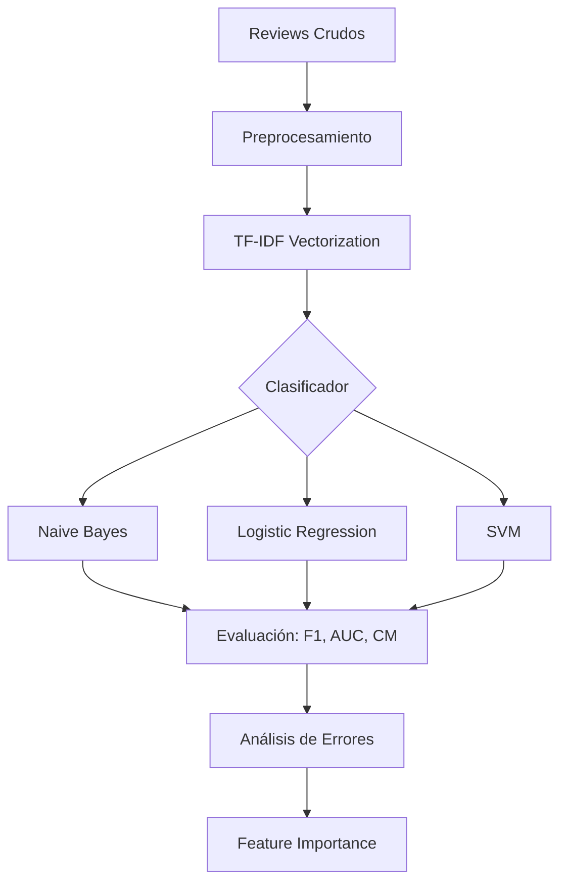

# 🛠️ Caso Práctico: Clasificador de Sentimiento desde Cero

Este proyecto consolida todas las técnicas del módulo en un pipeline end-to-end de clasificación de sentimiento. El objetivo es demostrar que, antes de recurrir a BERT o GPT, un sistema bien diseñado con preprocesamiento clásico, representaciones TF-IDF y clasificadores lineales puede alcanzar resultados competitivos con una fracción del costo computacional. En entornos productivos donde la latencia, el costo de inferencia y la interpretabilidad son críticos, esta arquitectura sigue siendo la opción por defecto.

Caso real: el sistema de clasificación de reviews de Yelp para detección de spam y sentimiento extremo utiliza un ensemble de TF-IDF + Logistic Regression como modelo base. Solo los casos ambiguos (donde la confianza del modelo base está por debajo de 0.6) se envían a un modelo transformer masivo. Esta cascada reduce el costo de inferencia en un 85 % manteniendo el 98 % de la accuracy del sistema puro transformer.

---

## 1. Definición del Problema y Dataset

**Tarea**: Clasificación binaria de reviews de productos en Positivo (1) o Negativo (0).

**Dataset**: Utilizaremos el clásico IMDB Reviews (50 000 reviews etiquetadas) o, alternativamente, un dataset de reviews de Amazon en español.

```python
import pandas as pd
from sklearn.datasets import load_files

# Cargar IMDB (estructura: pos/ y neg/)
# reviews = load_files('aclImdb/train', categories=['pos', 'neg'])
# X, y = reviews.data, reviews.target

# Alternativa: dataset sintético para demostración
data = {
    'text': [
        "Este producto es excelente, superó mis expectativas",
        "Pésima calidad, se rompió al segundo día",
        "No está mal, pero esperaba más por el precio",
        "Increíble, lo recomiendo totalmente",
        "Una total decepción, dinero desperdiciado",
        "Cumple su función correctamente",
        "El peor producto que he comprado en mi vida",
        "Me encanta, funciona perfectamente",
    ],
    'label': [1, 0, 0, 1, 0, 1, 0, 1]
}
df = pd.DataFrame(data)
```

---

## 2. Pipeline de Preprocesamiento

Reutilizamos y extendemos el pipeline de [[01 - Preprocesamiento de Texto]]:

```python
import re
import unicodedata
from nltk.tokenize import word_tokenize
from nltk.corpus import stopwords
from nltk.stem import SnowballStemmer
import nltk
nltk.download('punkt')
nltk.download('stopwords')

class SentimentPreprocessor:
    def __init__(self, language='spanish'):
        self.stemmer = SnowballStemmer(language)
        self.stop_words = set(stopwords.words(language))
        # Conservar negaciones en análisis de sentimiento
        self.negations = {'no', 'ni', 'nunca', 'jamas', 'tampoco'}
        self.stop_words -= self.negations
    
    def clean(self, text):
        text = str(text).lower()
        text = unicodedata.normalize('NFKC', text)
        text = re.sub(r'http\S+|www\S+', '', text)
        text = re.sub(r'[^a-záéíóúüñ\s]', '', text)
        text = re.sub(r'\s+', ' ', text).strip()
        return text
    
    def tokenize_and_stem(self, text):
        tokens = word_tokenize(text, language='spanish')
        tokens = [self.stemmer.stem(t) for t in tokens
                  if t not in self.stop_words and len(t) > 2]
        return ' '.join(tokens)
    
    def transform(self, texts):
        return [self.tokenize_and_stem(self.clean(t)) for t in texts]

preprocessor = SentimentPreprocessor()
df['processed'] = preprocessor.transform(df['text'])
print(df[['text', 'processed']].head())
```

⚠️ **Advertencia**: En clasificación de sentimiento, **nunca elimines stop words de negación** sin un tratamiento especial. «No me gustó» sin «no» invierte la polaridad. Una técnica avanzada es la **detección de bigramas de negación**: marcar todas las palabras entre una negación y un signo de puntuación con un prefijo `NEG_`.

---

## 3. Representación Vectorial: TF-IDF

```python
from sklearn.feature_extraction.text import TfidfVectorizer

vectorizer = TfidfVectorizer(
    max_features=5000,
    ngram_range=(1, 2),  # Unigramas + bigramas
    min_df=2,            # Ignorar términos que aparecen en menos de 2 documentos
    max_df=0.95,         # Ignorar términos que aparecen en más del 95% de docs
    sublinear_tf=True    # Aplicar escala logarítmica a tf
)

X = vectorizer.fit_transform(df['processed'])
y = df['label']

print(f"Dimensiones de la matriz TF-IDF: {X.shape}")
print(f"Densidad: {X.nnz / (X.shape[0] * X.shape[1]):.4f}")
```

La fórmula de TF-IDF aplicada por scikit-learn (con `sublinear_tf=True`) utiliza:

$$
\text{tf}(t, d) = 1 + \log(\text{frecuencia}(t, d))
$$

Esto comprime el rango de frecuencias y reduce el impacto de términos que aparecen 50 veces en un documento frente a los que aparecen 5 veces.

💡 **Tip**: El rango de n-gramas $(1, 2)$ captura tanto palabras individuales como expresiones como «no_recomiendo» o «muy_bueno» (tras preprocesamiento). Los bigramas incrementan el poder discriminatorio pero también la dimensionalidad.

---

## 4. Entrenamiento de Clasificadores

### 4.1 Naive Bayes Multinomial

El clasificador más rápido para texto. Asume independencia condicional entre features dada la clase:

$$
P(c | d) \propto P(c) \prod_{i=1}^{|V|} P(w_i | c)^{\text{count}(w_i, d)}
$$

```python
from sklearn.naive_bayes import MultinomialNB
from sklearn.model_selection import cross_val_score

nb = MultinomialNB(alpha=1.0)
scores = cross_val_score(nb, X, y, cv=5, scoring='f1')
print(f"Naive Bayes F1: {scores.mean():.3f} (+/- {scores.std():.3f})")
```

### 4.2 Regresión Logística

Modelo lineal que estima la probabilidad de clase mediante la función sigmoide:

$$
P(y=1 | \mathbf{x}) = \sigma(\mathbf{w}^\top \mathbf{x} + b) = \frac{1}{1 + e^{-(\mathbf{w}^\top \mathbf{x} + b)}}
$$

La función de pérdida es la entropía cruzada binaria:

$$
\mathcal{L}(\mathbf{w}, b) = -\frac{1}{N} \sum_{i=1}^{N} \left[ y_i \log(\hat{y}_i) + (1 - y_i) \log(1 - \hat{y}_i) \right] + \lambda \|\mathbf{w}\|_2^2
$$

```python
from sklearn.linear_model import LogisticRegression

lr = LogisticRegression(max_iter=1000, C=1.0, class_weight='balanced')
scores = cross_val_score(lr, X, y, cv=5, scoring='f1')
print(f"Logistic Regression F1: {scores.mean():.3f} (+/- {scores.std():.3f})")
```

### 4.3 Support Vector Machine (SVM)

SVM busca el hiperplano de máximo margen en el espacio de características TF-IDF. Con el kernel lineal, es especialmente efectivo en espacios de alta dimensionalidad como el de texto.

```python
from sklearn.svm import LinearSVC

svm = LinearSVC(C=0.5, class_weight='balanced', max_iter=5000)
scores = cross_val_score(svm, X, y, cv=5, scoring='f1')
print(f"SVM F1: {scores.mean():.3f} (+/- {scores.std():.3f})")
```

| Clasificador | Velocidad Entrenamiento | Velocidad Inferencia | Interpretabilidad | Rendimiento Típico |
|--------------|------------------------|---------------------|-------------------|-------------------|
| Naive Bayes | Instantánea | Instantánea | Alta (log-probabilidades) | Bueno baseline |
| Logistic Regression | Rápido | Rápido | Alta (coeficientes) | Muy bueno |
| SVM Lineal | Medio | Rápido | Media (vectores soporte) | Excelente |
| Random Forest | Lento | Medio | Media | Regular en texto sparse |

---

## 5. Evaluación y Métricas

```python
from sklearn.model_selection import train_test_split
from sklearn.metrics import (accuracy_score, f1_score, confusion_matrix,
                             classification_report, roc_auc_score)
import seaborn as sns
import matplotlib.pyplot as plt

# Split
X_train, X_test, y_train, y_test = train_test_split(
    X, y, test_size=0.2, random_state=42, stratify=y
)

# Entrenar mejor modelo
lr.fit(X_train, y_train)
y_pred = lr.predict(X_test)
y_proba = lr.predict_proba(X_test)[:, 1]

# Métricas
print("Accuracy:", accuracy_score(y_test, y_pred))
print("F1-Score:", f1_score(y_test, y_pred))
print("ROC-AUC:", roc_auc_score(y_test, y_proba))
print("\nClassification Report:\n", classification_report(y_test, y_pred))

# Matriz de confusión
cm = confusion_matrix(y_test, y_pred)
sns.heatmap(cm, annot=True, fmt='d', cmap='Blues')
plt.xlabel('Predicción')
plt.ylabel('Real')
plt.title('Matriz de Confusión')
plt.show()
```

⚠️ **Advertencia**: En datasets desbalanceados (ej. 90 % positivos, 10 % negativos), la accuracy es una métrica engañosa. Un clasificador que siempre predice positivo obtiene 90 % de accuracy. Siempre reporta **F1-score**, **precision/recall por clase** y **matriz de confusión**.

Caso real: el sistema de detección de toxicidad de Jigsaw (Google) descubrió que optimizar por accuracy solía producir modelos que simplemente nunca etiquetaban comentarios como tóxicos, alcanzando 95 % de accuracy pero 0 % de recall en la clase minoritaria. La métrica de evaluación final fue AUC-ROC ponderado por subgrupos demográficos.



---

## 6. Análisis de Errores

El análisis de errores es donde un ingeniero de ML demuestra su valor. No basta con reportar métricas; hay que entender **por qué** el modelo falla.

```python
# Identificar predicciones incorrectas
test_indices = X_test.index if hasattr(X_test, 'index') else range(len(y_test))
df_test = df.iloc[y_test.index if hasattr(y_test, 'index') else range(len(y_test))].copy()
df_test['pred'] = y_pred
df_test['proba'] = y_proba

# Falsos Positivos: predijo 1, era 0
fp = df_test[(df_test['label'] == 0) & (df_test['pred'] == 1)]
print("Falsos Positivos:")
print(fp[['text', 'proba']].head())

# Falsos Negativos: predijo 0, era 1
fn = df_test[(df_test['label'] == 1) & (df_test['pred'] == 0)]
print("\nFalsos Negativos:")
print(fn[['text', 'proba']].head())
```

Patrones comunes de error en sentimiento:

- **Sarcasmo**: «¡Qué maravilla, otra vez se rompió!» → Predicción positiva por palabras como «maravilla».
- **Negación compleja**: «No es que no me guste, pero...» → La polaridad se diluye.
- **Contexto de dominio**: «La batería explotó» en reviews de electrónica es negativo; en reviews de videojuegos («el juego explotó en ventas») es positivo.

---

## 7. Feature Importance e Interpretabilidad

Una ventaja crucial de los modelos lineales es la interpretabilidad directa de sus coeficientes.

```python
import numpy as np

# Obtener coeficientes y vocabulario
feature_names = vectorizer.get_feature_names_out()
coef = lr.coef_.flatten()

# Top features positivos
top_positive = np.argsort(coef)[-10:]
print("Top 10 features POSITIVOS:")
for idx in reversed(top_positive):
    print(f"{feature_names[idx]:20} {coef[idx]:.3f}")

# Top features negativos
top_negative = np.argsort(coef)[:10]
print("\nTop 10 features NEGATIVOS:")
for idx in top_negative:
    print(f"{feature_names[idx]:20} {coef[idx]:.3f}")
```

💡 **Tip**: Los coeficientes de Logistic Regression en espacio TF-IDF pueden interpretarse como log-odds ratios. Un coeficiente de 2.5 para la palabra «excelente» significa que, manteniendo todo lo demás constante, la presencia de «excelente» aumenta el log-odds de clasificación positiva en 2.5 unidades.

---

## 8. Comparativa con Enfoque Moderno (Transformer)

| Aspecto | TF-IDF + Logistic Regression | BERT fine-tuned |
|---------|------------------------------|-----------------|
| Tiempo de entrenamiento | Segundos | Horas (GPU) |
| Tiempo de inferencia | < 1 ms / doc | 50-200 ms / doc |
| Hardware requerido | CPU | GPU/TPU recomendado |
| Datos necesarios | Miles de ejemplos | Cientos (transfer learning) |
| Captura de contexto | Limitada (n-gramas) | Profunda (bidireccional) |
| Manejo de sarcasmo | Débil | Moderado |
| Interpretabilidad | Alta | Baja (black box) |
| Costo cloud inferencia | Muy bajo | Alto |
| Accuracy (IMDB) | ~88-90 % | ~94-96 % |

Caso real: la startup de atención al cliente Intercom desplegó inicialmente un clasificador de intenciones basado en TF-IDF + SVM. Alcanzaron 87 % de F1 con latencia de 5 ms. Un experimento con BERT mejoró a 91 % F1 pero la latencia subió a 120 ms, lo que degradó la experiencia de usuario en el chat en tiempo real. La solución final fue mantener el modelo clásico para las 10 intenciones más frecuentes y usar BERT solo para las consultas ambiguas.

---

📦 **Código de compresión**

```python
# Pipeline completo: Clasificador de sentimiento tradicional
from sklearn.feature_extraction.text import TfidfVectorizer
from sklearn.linear_model import LogisticRegression
from sklearn.pipeline import Pipeline
from sklearn.metrics import f1_score, confusion_matrix

pipeline = Pipeline([
    ('tfidf', TfidfVectorizer(ngram_range=(1,2), sublinear_tf=True)),
    ('clf', LogisticRegression(max_iter=1000, class_weight='balanced'))
])

pipeline.fit(train_texts, train_labels)
preds = pipeline.predict(test_texts)
print("F1:", f1_score(test_labels, preds))
print("CM:\n", confusion_matrix(test_labels, preds))
```

🎯 **Proyecto documentado: Sistema de Clasificación de Reviews de E-commerce**

Desarrolla un sistema completo que:

1. **Ingesta**: Acepte un archivo CSV con columnas `review_text` y `rating` (1-5 estrellas).
2. **Preprocesamiento**: Implemente la estrategia de negación (prefijo `NEG_` para palabras en ventana de negación), lematización opcional, y manejo de emojis mediante un diccionario de polaridad.
3. **Ingeniería de features**:
   - TF-IDF unigram/bigram.
   - Features manuales: longitud del texto, número de signos de exclamación, presencia de mayúsculas.
4. **Modelado**:
   - Baseline: Naive Bayes.
   - Modelo principal: Logistic Regression con búsqueda de hiperparámetros (`GridSearchCV` sobre `C` y `max_features`).
   - Comparación con LinearSVM.
5. **Evaluación**:
   - Métricas: accuracy, macro-F1, weighted-F1, AUC-ROC.
   - Curva precision-recall por clase.
   - Análisis de errores con 20 ejemplos de falsos positivos/negativos documentados.
6. **Interpretabilidad**:
   - Gráfico de las 20 features más positivas y 20 más negativas.
   - Función `explain_prediction(text)` que devuelva las palabras que más contribuyeron a la predicción.
7. **Deployment-ready**:
   - Serialización del pipeline con `joblib`.
   - Script `predict.py` que acepte un string por línea de comandos y devuelva la clase predicha y la probabilidad.

Salida esperada: un repositorio con `train.py`, `predict.py`, `requirements.txt`, y un notebook `analysis.ipynb` con el análisis exploratorio completo.
