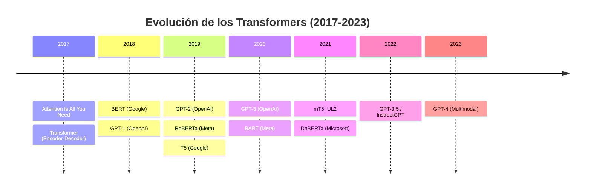
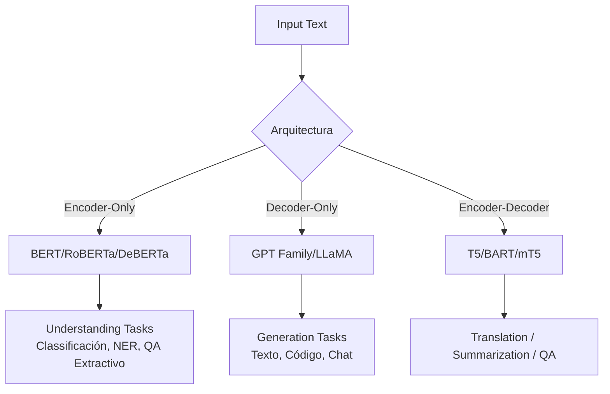

# 🤖 00 - Bienvenida al Curso: NLP con Transformers

La revolución de los Transformers ha redefinido por completo el panorama del Procesamiento de Lenguaje Natural (NLP) y la Inteligencia Artificial moderna. Desde la aparición de BERT en 2018 y GPT en 2019, hemos pasado de modelos basados en RNN y LSTM —secuenciales y difíciles de paralelizar— a arquitecturas puramente atencionales capaces de capturar dependencias a larga distancia y escalar a miles de millones de parámetros. Este curso profundiza en la mecánica interna, los objetivos de preentrenamiento y las técnicas de fine-tuning que hacen posibles sistemas de comprensión y generación de lenguaje de nivel humano.

---

## 1. Objetivos del Curso

Al finalizar este módulo, serás capaz de:

1.  Explicar las diferencias arquitectónicas fundamentales entre modelos encoder-only, decoder-only y encoder-decoder.
2.  Derivar matemáticamente los mecanismos de atención (self-attention, causal/masked attention) y sus variantes modernas.
3.  Comparar objetivos de preentrenamiento como Masked LM, Causal LM y Span Corruption desde una perspectiva teórica y práctica.
4.  Implementar pipelines de fine-tuning para clasificación, NER, Question Answering y summarization usando Hugging Face Transformers.
5.  Diseñar sistemas de Question Answering híbridos (retriever + reader + generador) sobre corpus técnicos propios.
6.  Evaluar modelos con métricas específicas (Exact Match, F1, BLEU, ROUGE) y diagnosticar problemas como el catastrophic forgetting.

---

## 2. Estructura del Curso

| Nota | Tema | Enlace |
|------|------|--------|
| 00 | Bienvenida | [[00 - Bienvenida]] |
| 01 | Arquitecturas Encoder-Only | [[01 - Arquitecturas Encoder-Only]] |
| 02 | Arquitecturas Decoder-Only | [[02 - Arquitecturas Decoder-Only]] |
| 03 | Arquitecturas Encoder-Decoder | [[03 - Arquitecturas Encoder-Decoder]] |
| 04 | Fine-Tuning para NLP Tasks | [[04 - Fine-Tuning para NLP Tasks]] |
| 05 | Caso Práctico: Sistema de QA | [[05 - Caso Practico - Sistema de Question Answering]] |

---

## 3. Glosario Esencial

A continuación, definimos los términos clave que recorrerán todo el curso.

### 3.1 Modelos y Arquitecturas

- **BERT (Bidirectional Encoder Representations from Transformers)**: Arquitectura encoder-only introducida por Google en 2018. Se preentrena con Masked Language Modeling (MLM) y Next Sentence Prediction (NSP). Diseñado para aprender representaciones bidireccionales profundas del lenguaje.

- **GPT (Generative Pre-trained Transformer)**: Familia de modelos decoder-only desarrollada por OpenAI. Se basa en Causal Language Modeling (CLM), donde cada token solo puede atender a tokens anteriores. GPT-1 estableció el paradigma de preentrenamiento generalista + fine-tuning específico.

- **T5 (Text-to-Text Transfer Transformer)**: Modelo encoder-decoder de Google que recodifica todas las tareas NLP como problemas de texto-a-texto. Usa span corruption como objetivo de preentrenamiento.

- **RoBERTa**: Reentrenamiento robusto de BERT (Facebook AI, 2019). Elimina NSP, usa batch sizes masivos, más datos y entrenamiento más largo. Demuestra que muchas "optimizaciones menores" de BERT subestimaban su potencial.

- **DeBERTa (Decoding-enhanced BERT with Disentangled Attention)**: Modelo de Microsoft que desacopla la atención por contenido y posición relativa, alcanzando el estado del arte en GLUE y SuperGLUE en su época.

- **ELECTRA**: Modelo de Google que introduce "replaced token detection" en lugar de MLM. Es más eficiente computacionalmente porque aprende de todos los tokens, no solo los enmascarados.

- **ALBERT**: Versión "lite" de BERT que usa factorización de embeddings y compartición de parámetros cross-layer, además de reemplazar NSP por Sentence Order Prediction (SOP).

### 3.2 Objetivos de Preentrenamiento

- **Masked Language Modeling (MLM)**: Se enmascaran aleatoriamente tokens de entrada y el modelo debe predecirlos. Fuerza al modelo a aprender representaciones bidireccionales.

- **Causal Language Modeling (CLM / Autoregressive LM)**: El modelo predice el siguiente token dado el contexto previo. La máscara causal evita que el token $i$ vea tokens $j > i$.

- **Span Corruption**: Variante de MLM donde se enmascaran spans continuos de tokens en lugar de tokens individuales. Usado por T5 y UL2. Mejora la capacidad de generación coherente de secuencias.

### 3.3 Conceptos Clave

- **Transfer Learning en NLP**: Parámetros aprendidos durante el preentrenamiento en corpus masivos se transfieren a tareas downstream mediante fine-tuning. Reduce drásticamente la necesidad de datos etiquetados.

- **GLUE (General Language Understanding Evaluation)**: Benchmark que agrupa 9 tareas de comprensión del lenguaje (clasificación, NLI, similitud textual). Es el estándar de facto para evaluar encoders.

- **SQuAD (Stanford Question Answering Dataset)**: Dataset de lectura comprensiva donde la respuesta es un span extraído del contexto. Métricas: Exact Match (EM) y F1.

- **NER (Named Entity Recognition)**: Tarea de clasificación a nivel de token que identifica entidades nombradas (personas, organizaciones, localizaciones) en texto.

- **QA (Question Answering)**: Tarea de responder preguntas naturales. Puede ser extractiva (respuesta en el texto) o abstractiva/generativa (el modelo genera la respuesta).

---

## 4. El Transformer: Fundamento de Todo

Antes de entrar en variantes, recordemos la ecuación fundamental del mecanismo de atención escalada (Scaled Dot-Product Attention):

$$
\text{Attention}(Q, K, V) = \text{softmax}\left(\frac{QK^T}{\sqrt{d_k}}\right)V
$$

Donde:
- $Q \in \mathbb{R}^{n \times d_k}$ son las queries.
- $K \in \mathbb{R}^{m \times d_k}$ son las keys.
- $V \in \mathbb{R}^{m \times d_v}$ son los values.
- $\sqrt{d_k}$ es el factor de escalado para evitar que los productos punto crezcan demasiado en dimensionalidades altas, suavizando el gradiente del softmax.

Multi-Head Attention proyecta $Q, K, V$ en $h$ subespacios:

$$
\text{MultiHead}(Q, K, V) = \text{Concat}(\text{head}_1, \ldots, \text{head}_h)W^O
$$

$$
\text{head}_i = \text{Attention}(QW_i^Q, KW_i^K, VW_i^V)
$$

⚠️ **Advertencia**: La complejidad computacional de self-attention es $O(n^2 \cdot d)$, donde $n$ es la longitud de la secuencia. Esto limita el context window de modelos densos y motiva técnicas como sparse attention, linear attention o flash attention.

---

## 5. Evolución del Ecosistema Transformer



Caso real: La evolución de GPT-3 (175B parámetros) a GPT-4 no solo implicó escalar parámetros, sino mejoras arquitectónicas no reveladas, técnicas de alineamiento RLHF y capacidades multimodales, consolidando el paradigma decoder-only como base de los LLMs modernos.

---

## 6. Diagrama General de Arquitecturas



---

## 7. ¿Cómo Navegar este Curso?

1.  Lee la nota 00 (esta) para familiarizarte con el vocabulario.
2.  Avanza secuencialmente del 01 al 03 para comprender las arquitecturas base.
3.  La nota 04 conecta teoría con práctica de fine-tuning.
4.  La nota 05 es el proyecto integrador: un sistema QA de producción.

💡 **Tip**: Mantén abierta esta nota como referencia rápida mientras avanzas. Los enlaces internos ([[...]]) te permiten saltar entre conceptos relacionados.

---

## 8. Imagen de Referencia: El Transformer Original

El diagrama clásico del paper "Attention Is All You Need" ilustra la arquitectura encoder-decoder original que dio origen a toda esta familia.


---

## 9. Recursos y Referencias Clave

- Vaswani et al. (2017). "Attention Is All You Need". NeurIPS.
- Devlin et al. (2018). "BERT: Pre-training of Deep Bidirectional Transformers". NAACL.
- Radford et al. (2019). "Language Models are Unsupervised Multitask Learners" (GPT-2).
- Brown et al. (2020). "Language Models are Few-Shot Learners" (GPT-3).
- Raffel et al. (2019). "Exploring the Limits of Transfer Learning with a Unified Text-to-Text Transformer" (T5).

---

## 📦 Código de Compresión

Script para listar todos los modelos mencionados y sus IDs en Hugging Face:

```python
models = {
    "BERT": "bert-base-uncased",
    "RoBERTa": "roberta-base",
    "ALBERT": "albert-base-v2",
    "ELECTRA": "google/electra-base-discriminator",
    "DeBERTa": "microsoft/deberta-base",
    "DistilBERT": "distilbert-base-uncased",
    "GPT-2": "gpt2",
    "T5": "t5-small",
    "BART": "facebook/bart-base",
    "mT5": "google/mt5-small"
}

for name, hf_id in models.items():
    print(f"{name}: https://huggingface.co/{hf_id}")
```

---

## 🎯 Proyecto Documentado: Índice del Sistema QA

El proyecto final de este curso es construir un sistema de Question Answering sobre documentos técnicos. El flujo de trabajo abarca:

1.  **Indexación**: Procesar PDFs/Markdown y chunking de documentos.
2.  **Retriever**: Híbrido BM25 + dense retrieval ( embeddings de sentence-transformers).
3.  **Reader**: Modelo extractivo (BERT/RoBERTa fine-tuned en SQuAD).
4.  **Generador** (opcional): T5 o BART para respuestas abstractive cuando no haya span claro.
5.  **Evaluación**: Métricas EM y F1 contra corpus de validación.

Ver detalles completos en [[05 - Caso Practico - Sistema de Question Answering]].
