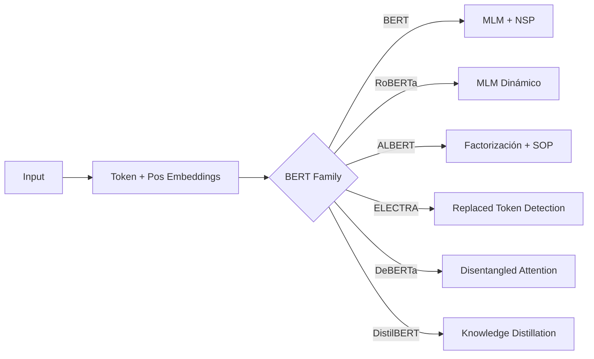

# 🔒 01 - Arquitecturas Encoder-Only

Los modelos encoder-only constituyen la columna vertebral de las tareas de **comprensión del lenguaje natural**. A diferencia de los decoders, que generan texto de forma autoregresiva, los encoders procesan la secuencia completa de manera bidireccional, produciendo representaciones contextuales enriquecidas para cada token. Esto los hace ideales para clasificación, extracción de información y tareas de comprensión lectora donde el contexto futuro es tan relevante como el pasado.

---

## 1. Fundamentos del Encoder

Un encoder Transformer apila capas de **Multi-Head Self-Attention** seguidas de feed-forward networks. La clave arquitectónica es que **no existe máscara causal**: cada token puede atender a todos los demás tokens de la secuencia.

$$
h_i^{(l)} = \text{LayerNorm}\left(h_i^{(l-1)} + \text{MHSA}(h_i^{(l-1)}, H^{(l-1)})\right)
$$

$$
h_i^{(l)} = \text{LayerNorm}\left(h_i^{(l)} + \text{FFN}(h_i^{(l)})\right)
$$

Donde $H^{(l-1)}$ representa todos los estados ocultos de la capa anterior.


---

## 2. BERT: Bidirectional Encoder Representations from Transformers

### 2.1 Arquitectura Base

BERT utiliza la pila de encoders del Transformer original. Existen dos variantes principales:

- **BERT-Base**: 12 capas, 768 dim oculta, 12 heads, 110M parámetros.
- **BERT-Large**: 24 capas, 1024 dim oculta, 16 heads, 340M parámetros.

### 2.2 Masked Language Modeling (MLM)

En MLM, el 15% de los tokens de entrada se seleccionan para predicción. De estos:
- 80% se reemplazan por `[MASK]`.
- 10% se reemplazan por un token aleatorio.
- 10% se dejan sin cambios.

El objetivo es minimizar la entropía cruzada sobre los tokens enmascarados:

$$
\mathcal{L}_{\text{MLM}} = - \mathbb{E}_{x \sim \mathcal{D}} \sum_{i \in \mathcal{M}} \log P(x_i \mid x_{\setminus \mathcal{M}}; \theta)
$$

Donde $\mathcal{M}$ es el conjunto de posiciones enmascaradas y $x_{\setminus \mathcal{M}}$ representa el contexto observado.

⚠️ **Advertencia**: El desajuste entre preentrenamiento (presencia de `[MASK]`) y fine-tuning (ausencia de `[MASK]`) fue una de las motivaciones para técnicas como span corruption en T5.

### 2.3 Next Sentence Prediction (NSP)

BERT original se preentrenaba también con NSP: dado un par de oraciones $(A, B)$, predecir si $B$ es la continuación lógica de $A$.

$$
\mathcal{L}_{\text{NSP}} = - \mathbb{E}_{(A,B)} \left[ y \log P(\text{IsNext}) + (1-y) \log P(\text{NotNext}) \right]
$$

Sin embargo, investigaciones posteriores (RoBERTa, ALBERT) demostraron que NSP aportaba poco o nada, siendo reemplazado por tareas más difíciles como SOP.

Caso real: Google utilizó BERT para mejorar la comprensión de búsquedas en Google Search en 2019, permitiendo entender consultas con preposiciones y contexto conversacional.

---

## 3. RoBERTa: Robustly Optimized BERT Pretraining

RoBERTa (Liu et al., 2019) cuestionó muchas decisiones de diseño de BERT mediante un análisis sistemático:

| Hiperparámetro | BERT | RoBERTa |
|----------------|------|---------|
| Batch size | 256 secuencias | 8,192 secuencias |
| Datos de preentrenamiento | BookCorpus + Wikipedia | BookCorpus + Wikipedia + CC-News + OpenWebText + STORIES |
| Tamaño vocabulario | 30K (WordPiece) | 50K (BPE) |
| NSP | Sí | No |
| MLM | Estático (una vez) | Dinámico (máscara cambia cada epoch) |
| Training steps | 1M | 500K (Large: 2M) |

💡 **Tip**: RoBERTa demostró que el preentrenamiento de BERT estaba lejos de estar "saturado". Simplemente entrenar más tiempo, con más datos y batches grandes mejoró drásticamente los resultados en GLUE.

---

## 4. ALBERT: A Lite BERT

ALBERT reduce la huella de parámetros mediante dos técnicas clave:

### 4.1 Factorized Embedding Parameterization

En BERT, la matriz de embeddings de vocabulario $V \times H$ es costosa cuando $H$ es grande (ej. 4096). ALBERT descompone:

$$
E \in \mathbb{R}^{V \times H} \quad \rightarrow \quad E_1 \in \mathbb{R}^{V \times H_{small}}, \; E_2 \in \mathbb{R}^{H_{small} \times H}
$$

Reduciendo parámetros de $O(V \times H)$ a $O(V \times H_{small} + H_{small} \times H)$.

### 4.2 Cross-Layer Parameter Sharing

Todas las capas del encoder comparten los mismos pesos. Aunque esto reduce la capacidad expresiva por parámetro, ALBERT compensa aumentando el número de capas.

### 4.3 Sentence Order Prediction (SOP)

Reemplaza NSP. Dados dos segmentos consecutivos $S_1, S_2$, SOP predice si están en el orden correcto o invertido. Es una tarea más difícil que NSP y fuerza al modelo a aprender coherencia discursiva real.

```python
from transformers import AlbertTokenizer, AlbertForSequenceClassification
import torch

tokenizer = AlbertTokenizer.from_pretrained('albert-base-v2')
model = AlbertForSequenceClassification.from_pretrained('albert-base-v2')

inputs = tokenizer("Hello, my dog is cute", return_tensors="pt")
labels = torch.tensor([1]).unsqueeze(0)
outputs = model(**inputs, labels=labels)
loss = outputs.loss
logits = outputs.logits
```

---

## 5. ELECTRA: Replaced Token Detection

ELECTRA introduce un enfoque discriminatorio: en lugar de predecir tokens enmascarados, el modelo distingue si cada token es original o fue reemplazado por una generadora pequeña.

### 5.1 Arquitectura GAN-like

- **Generadora pequeña** (típicamente un BERT-small): Predice tokens para reemplazar los enmascarados.
- **Discriminadora** (el modelo real): Clasifica cada token como "original" o "reemplazado".

### 5.2 Función de Pérdida

$$
\mathcal{L}_{\text{RTD}} = \sum_{x_i \in x} \left[ \mathbb{I}(x_i = \hat{x}_i) \log D(x_i) + \mathbb{I}(x_i \neq \hat{x}_i) \log (1 - D(x_i)) \right]
$$

Donde $\hat{x}_i$ es el token generado y $D(x_i)$ es la probabilidad de que el token sea original.

⚠️ **Advertencia**: ELECTRA es significativamente más eficiente porque aprende de **todos los tokens** de la secuencia, no solo del 15% enmascarado.

Caso real: ELECTRA alcanzó resultados comparables a RoBERTa en GLUE con ~1/4 del costo computacional de preentrenamiento.

---

## 6. DeBERTa: Disentangled Attention

DeBERTa (He et al., 2020) descompone el vector de atención en dos componentes separados:

### 6.1 Atención Desacoplada

Tradicionalmente, la atención se calcula como:

$$
A_{i,j} = \frac{(x_i + p_i)^T (x_j + p_j)}{\sqrt{d}}
$$

Donde $x$ es el contenido y $p$ la posición. DeBERTa separa explícitamente:

$$
A_{i,j} = \frac{x_i^T x_j + x_i^T p_j + p_i^T x_j + p_i^T p_j}{\sqrt{d}} \; \rightarrow \; \text{solo } x_i^T x_j + x_i^T p_{j-i} + p_{i-j}^T x_j
$$

Usa posiciones relativas $p_{j-i}$ en lugar de absolutas, eliminando el término $p_i^T p_j$ que no aporta información semántica.

### 6.2 Enhanced Mask Decoder

DeBERTa añade una capa adicional después de los transformers para reintroducir información posicional absoluta antes de la predicción MLM, resolviendo la ambigüedad de "¿dónde estoy en la oración?".

---

## 7. DistilBERT: Compresión por Destilación

DistilBERT entrena un modelo estudiante (40% menos parámetros, 60% más rápido) usando **knowledge distillation** sobre BERT-base:

$$
\mathcal{L}_{\text{distill}} = \alpha \cdot \mathcal{L}_{\text{CE}} + \beta \cdot \mathcal{L}_{\text{cos}} + \gamma \cdot \mathcal{L}_{\text{soft}}
$$

Donde:
- $\mathcal{L}_{\text{CE}}$: Entropía cruzada sobre los hard labels.
- $\mathcal{L}_{\text{cos}}$: Pérdida de coseno entre estados ocultos.
- $\mathcal{L}_{\text{soft}}$: KL-divergencia entre distribuciones softmax del teacher y student (temperature-scaled).

💡 **Tip**: DistilBERT retiene el 97% de la capacidad de BERT en GLUE siendo ~2x más rápido. Es ideal para producción con latencia restrictiva.

---

## 8. Comparativa de Encoders

| Modelo | Parámetros (Base) | Atención | Pretraining Task | NSP/SOP | Ventaja Clave |
|--------|-------------------|----------|------------------|---------|---------------|
| BERT | 110M | Absoluta + contenido | MLM + NSP | NSP | Pionero bidireccional |
| RoBERTa | 125M | Absoluta + contenido | MLM | No | Más datos, batch grande |
| ALBERT | 12M (shared) | Absoluta + contenido | MLM + SOP | SOP | Factorización + sharing |
| ELECTRA | 110M | Absoluta + contenido | RTD | No | Aprende de todos tokens |
| DeBERTa | 139M | **Relativa desacoplada** | MLM + EMD | No | Estado del arte GLUE |
| DistilBERT | 66M | Absoluta + contenido | Distillation de BERT | No | Velocidad + eficiencia |



---

## 9. Fine-Tuning Downstream

Para tareas de clasificación, se añade una capa lineal sobre el embedding del token `[CLS]`:

```python
from transformers import BertForSequenceClassification, BertTokenizer
import torch

model = BertForSequenceClassification.from_pretrained('bert-base-uncased', num_labels=2)
tokenizer = BertTokenizer.from_pretrained('bert-base-uncased')

inputs = tokenizer("This movie was absolutely fantastic!", return_tensors="pt", padding=True)
outputs = model(**inputs)
predictions = torch.argmax(outputs.logits, dim=-1)
```

Para NER (token classification):

```python
from transformers import BertForTokenClassification

model = BertForTokenClassification.from_pretrained('bert-base-cased', num_labels=9)
# Labels: B-PER, I-PER, B-ORG, I-ORG, B-LOC, I-LOC, B-MISC, I-MISC, O
```

Para Extractive QA (SQuAD):

```python
from transformers import BertForQuestionAnswering

model = BertForQuestionAnswering.from_pretrained('bert-large-uncased-whole-word-masking-finetuned-squad')
# Predice start_logits y end_logits sobre el contexto
```

---

## 📦 Código de Compresión

Pipeline completo para comparar embeddings de diferentes encoders en una misma frase:

```python
from transformers import AutoTokenizer, AutoModel
import torch
import torch.nn.functional as F

models = {
    "BERT": "bert-base-uncased",
    "RoBERTa": "roberta-base",
    "DeBERTa": "microsoft/deberta-base",
    "ELECTRA": "google/electra-base-discriminator"
}

text = "Transformers have revolutionized NLP."

def get_embedding(name, model_id, text):
    tok = AutoTokenizer.from_pretrained(model_id)
    mod = AutoModel.from_pretrained(model_id)
    inputs = tok(text, return_tensors="pt")
    with torch.no_grad():
        out = mod(**inputs)
    # Mean pooling
    emb = out.last_hidden_state.mean(dim=1)
    return F.normalize(emb, p=2, dim=1)

embeddings = {k: get_embedding(k, v, text) for k, v in models.items()}

# Compute pairwise cosine similarities
for m1 in embeddings:
    for m2 in embeddings:
        if m1 < m2:
            sim = F.cosine_similarity(embeddings[m1], embeddings[m2]).item()
            print(f"{m1} <-> {m2}: {sim:.4f}")
```

---

## 🎯 Proyecto Documentado: Benchmark de Encoders

**Objetivo**: Evaluar BERT, RoBERTa, DeBERTa y ELECTRA en una tarea de clasificación de sentimiento de reseñas de productos técnicos.

**Dataset**: 5,000 reseñas etiquetadas (positivo/negativo).

**Métricas**: Accuracy, F1-macro, tiempo de inferencia por batch.

**Flujo**:
1. Cargar dataset con `datasets`.
2. Tokenizar con cada tokenizer específico.
3. Fine-tuning por 3 epochs con learning rate $2e-5$.
4. Evaluar en test set.
5. Generar tabla comparativa y gráfico de barras.

Ver extensión en [[04 - Fine-Tuning para NLP Tasks]] y aplicación en [[05 - Caso Practico - Sistema de Question Answering]].
