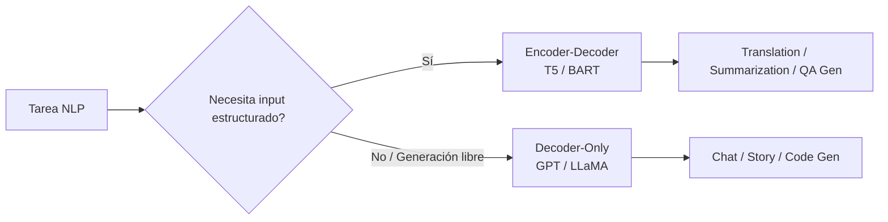

# 🔄 03 - Arquitecturas Encoder-Decoder

Las arquitecturas encoder-decoder combinan el poder de comprensión bidireccional del encoder con la capacidad generativa autoregresiva del decoder. Este diseño, heredado directamente del Transformer original de Vaswani et al. (2017), se consolida como el estándar de facto para tareas de **traducción automática**, **resumen de textos** y cualquier problema que requiera transformar una secuencia de entrada en una secuencia de salida potencialmente diferente en longitud y estructura.

---

## 1. El Encoder-Decoder Clásico

### 1.1 Forward Pass Matemático

El encoder procesa la secuencia de entrada $x = (x_1, \ldots, x_n)$ produciendo representaciones contextuales:

$$
H_{\text{enc}} = \text{Encoder}(x)
$$

El decoder genera la secuencia de salida $y = (y_1, \ldots, y_m)$ de forma autoregresiva, usando **cross-attention** para consultar el encoder:

$$
\text{CrossAttn}(Q_{\text{dec}}, K_{\text{enc}}, V_{\text{enc}}) = \text{softmax}\left(\frac{Q_{\text{dec}} K_{\text{enc}}^T}{\sqrt{d_k}}\right) V_{\text{enc}}
$$

Cada capa del decoder contiene:
1. Masked self-attention (causal).
2. Cross-attention sobre $H_{\text{enc}}$.
3. Feed-forward network.

```mermaid
graph TD
    subgraph Encoder
        A[Input: "Hola mundo"] --> B[Self-Attention]
        B --> C[FFN]
        C --> D[Encoder Output]
    end
    subgraph Decoder
        E[Output: "Hello"] --> F[Masked Self-Attn]
        F --> G[Cross-Attn<br/>Queries from Decoder<br/>Keys/Values from Encoder]
        G --> H[FFN]
        H --> I[Next Token: "world"]
    end
    D --> G
```

---

## 2. T5: Text-to-Text Transfer Transformer

T5 (Raffel et al., 2019) de Google propone la filosofía radical de que **toda tarea NLP es un problema de texto-a-texto**.

### 2.1 Formato Unificado

- Clasificación de sentimiento: `"sentiment: This movie is great" -> "positive"`
- Traducción: `"translate English to German: The house is wonderful" -> "Das Haus ist wunderbar"`
- Resumen: `"summarize: <articulo>" -> "<resumen>"`
- Question Answering: `"question: What is the capital? context: France is..." -> "Paris"`

### 2.2 Span Corruption

En lugar de enmascarar tokens individuales (MLM), T5 enmascara spans continuos y el decoder debe reconstruirlos:

$$
\mathcal{L}_{\text{SpanCorruption}} = - \sum_{k=1}^{K} \log P(s_k \mid x_{\text{corrupted}}, s_{<k}; \theta)
$$

Donde $s_k$ es el $k$-ésimo span enmascarado y $x_{\text{corrupted}}$ es la entrada con tokens especiales `<extra_id_i>`.

Ejemplo:
- Original: `Thank you for inviting me to your party last week .`
- Corrupted: `Thank you <extra_id_0> me to your party <extra_id_1> .`
- Target: `<extra_id_0> for inviting <extra_id_1> last week`

⚠️ **Advertencia**: La longitud promedio de los spans y la tasa de corrupson son hiperparámetros críticos. T5 usa spans de longitud media 3 con una tasa de corrupción del 15%.

### 2.3 Escalamiento de T5

| Variante | Parámetros | Capas | $d_{model}$ | $d_{ff}$ | Heads |
|----------|------------|-------|-------------|----------|-------|
| T5-Small | 60M | 6 | 512 | 2048 | 8 |
| T5-Base | 220M | 12 | 768 | 3072 | 12 |
| T5-Large | 770M | 24 | 1024 | 4096 | 16 |
| T5-3B | 3B | 24 | 1024 | 4096 | 32 |
| T5-11B | 11B | 24 | 1024 | 65536 | 128 |

Caso real: Google Search utiliza variantes de T5 para mejorar la comprensión de consultas complejas y generar respuestas directas (featured snippets) en múltiples idiomas.

---

## 3. BART: Denoising Autoencoder

BART (Lewis et al., 2020) de Meta también usa encoder-decoder, pero con una filosofía de preentrenamiento más flexible basada en **denoising**.

### 3.1 Estrategias de Corrupción

BART prueba múltiples transformaciones no destructivas:

1. **Token Masking**: Enmascarar tokens aleatorios (como BERT).
2. **Token Deletion**: Eliminar tokens; el modelo decide qué posiciones faltan.
3. **Text Infilling**: Enmascarar spans (como T5).
4. **Sentence Permutation**: Reordenar oraciones aleatoriamente.
5. **Document Rotation**: Rotar el documento para que empiece por un token aleatorio.

La función de pérdida es la log-verosimilitud del documento original:

$$
\mathcal{L}_{\text{BART}} = - \log P(x \mid \tilde{x}; \theta)
$$

Donde $\tilde{x}$ es la versión corrupta de $x$.

💡 **Tip**: BART es particularmente efectivo para tareas de **summarization** y **corrección gramatical** gracias a su naturaleza seq2seq y la capacidad del decoder para reescribir secuencias libremente.

---

## 4. UL2: Mixture of Denoisers

UL2 (Tay et al., 2022) generaliza los objetivos de preentrenamiento proponiendo un **mixture of denoisers (MoD)**.

### 4.1 Modos de Denoising

| Modo | Estructura | Tarea subyacente |
|------|------------|------------------|
| S-denoiser | Causal (prefix LM) | Completar a partir de prefijo |
| R-denoiser | Span corruption corto | Reconstrucción local |
| X-denoiser | Span corruption extremo | Comprensión + síntesis larga |

UL2 alterna aleatoriamente entre estos modos durante el preentrenamiento, forzando al modelo a aprender representaciones universales transferibles a cualquier downstream task sin cambiar la arquitectura.

$$
\mathcal{L}_{\text{UL2}} = \mathbb{E}_{\text{mode} \sim \mathcal{M}} \left[ -\log P(x \mid \tilde{x}_{\text{mode}}; \theta) \right]
$$

---

## 5. Modelos Multilingües: mT5 y mBART

### 5.1 mT5

Extensión multilingüe de T5 entrenada en **mC4** (Common Crawl en 101 idiomas). No requiere tokenización específica por idioma; el modelo aprende a transferir conocimiento entre lenguas relacionadas.

### 5.2 mBART

Preentrenado en texto monolingüe de 25 idiomas, mBART es especialmente potente para traducción zero-shot (idiomas no vistos en pares de traducción durante fine-tuning).

Caso real: mBART ha sido desplegado en sistemas de traducción para lenguas de bajos recursos (low-resource languages) como swahili o tamazight, donde la disponibilidad de corpus paralelos es mínima.

---

## 6. Comparativa: Encoder-Decoder vs Decoder-Only para Generación

| Criterio | Encoder-Decoder (T5/BART) | Decoder-Only (GPT) |
|----------|---------------------------|-------------------|
| Atención sobre input | Bidireccional completa | Limitada a prefix (si existe) |
| Atención cruzada | Sí, explícita | No (todo es self-attention) |
| Longitud output | Controlada por decoder | Autoregresiva pura |
| Pretraining | Span corruption / Denoising | Causal LM |
| Fine-tuning | Requiere pares (input, target) | Prompting o fine-tuning CLM |
| Summarization | **Excelente** (input-aware) | Bueno, pero menos anclado |
| Traducción | **Estado del arte** hasta ~2022 | Competitivo con scale |
| Costo inferencia | 2x (encode + decode) | 1x |



---

## 7. Código de Fine-Tuning T5

Fine-tuning de T5-Base para resumen de textos técnicos:

```python
from transformers import T5Tokenizer, T5ForConditionalGeneration
from transformers import Trainer, TrainingArguments
from datasets import load_dataset

model_name = "t5-base"
tokenizer = T5Tokenizer.from_pretrained(model_name)
model = T5ForConditionalGeneration.from_pretrained(model_name)

# Cargar dataset (ejemplo con CNN/DailyMail)
dataset = load_dataset("cnn_dailymail", "3.0.0")

prefix = "summarize: "

def preprocess_function(examples):
    inputs = [prefix + doc for doc in examples["article"]]
    model_inputs = tokenizer(inputs, max_length=512, truncation=True)
    labels = tokenizer(examples["highlights"], max_length=128, truncation=True)
    model_inputs["labels"] = labels["input_ids"]
    return model_inputs

tokenized_datasets = dataset.map(preprocess_function, batched=True)

training_args = TrainingArguments(
    output_dir="./results",
    evaluation_strategy="epoch",
    learning_rate=2e-5,
    per_device_train_batch_size=8,
    per_device_eval_batch_size=8,
    num_train_epochs=3,
    weight_decay=0.01,
    save_total_limit=2,
)

trainer = Trainer(
    model=model,
    args=training_args,
    train_dataset=tokenized_datasets["train"].shuffle(seed=42).select(range(10000)),
    eval_dataset=tokenized_datasets["validation"].shuffle(seed=42).select(range(1000)),
)

trainer.train()
```

💡 **Tip**: Para datasets pequeños, congelar las primeras 6 capas del encoder y solo entrenar las capas superiores + decoder reduce overfitting y acelera el entrenamiento.

---

## 📦 Código de Compresión

Pipeline de inferencia con T5 para múltiples tareas sin reentrenar:

```python
from transformers import T5Tokenizer, T5ForConditionalGeneration

model = T5ForConditionalGeneration.from_pretrained("t5-base")
tokenizer = T5Tokenizer.from_pretrained("t5-base")

def run_t5_task(prompt, max_length=50):
    inputs = tokenizer(prompt, return_tensors="pt", max_length=512, truncation=True)
    outputs = model.generate(**inputs, max_length=max_length, num_beams=4)
    return tokenizer.decode(outputs[0], skip_special_tokens=True)

# Tarea 1: Traducción
print(run_t5_task("translate English to German: The transformer architecture is powerful."))

# Tarea 2: QA
print(run_t5_task("question: What is the capital of France? context: France is a country in Europe. Its capital is Paris."))

# Tarea 3: CoLA (grammatical acceptability)
print(run_t5_task("cola sentence: The cat sat on the mat."))
```

---

## 🎯 Proyecto Documentado: Resumidor de Documentación Técnica

**Objetivo**: Fine-tunear mT5-Base para resumir páginas de documentación técnica (ej. ReadTheDocs) a bullet points estructurados.

**Dataset**: 3,000 pares (página markdown, resumen estructurado) scrapeados de documentación de Python/ML.

**Pipeline**:
1. Preprocesar markdown a texto plano, eliminando CSS/JS.
2. Chunking por secciones (máx 512 tokens input).
3. Fine-tuning con span corruption + supervised fine-tuning mix.
4. Evaluación con ROUGE-L y evaluación humana de fidelidad técnica.
5. Despliegue como API REST con `transformers.pipeline`.

Ver integración con sistemas de QA en [[05 - Caso Practico - Sistema de Question Answering]].
