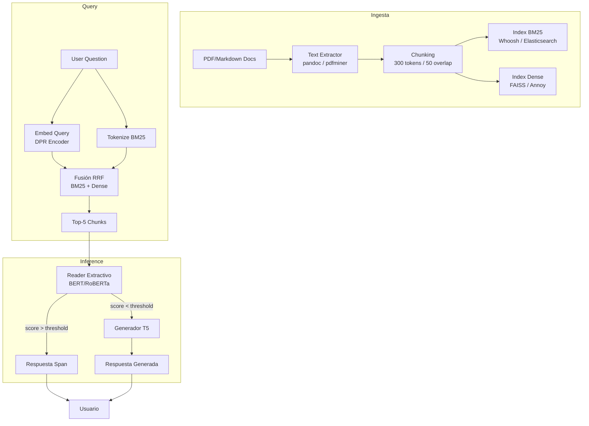

# 🎯 05 - Caso Práctico: Sistema de Question Answering

Este proyecto integra todo el conocimiento del curso para construir un **sistema de Question Answering (QA) híbrido** sobre documentos técnicos. A diferencia de un modelo QA puro que asume que la respuesta está en un contexto corto proporcionado, este sistema opera sobre **corpus masivos**: primero recupera los documentos relevantes y luego extrae o genera la respuesta. Es el patrón arquitectónico utilizado por productos como Bing Chat, Google Bard (SGE) y sistemas enterprise de bases de conocimiento.

---

## 1. Arquitectura del Pipeline

El sistema sigue el paradigma **Retriever-Reader-Generator**:


### 1.1 Flujo de Datos

1. **Indexación Offline**: Documentos técnicos (PDFs, Markdown, HTML) se segmentan en chunks semánticos.
2. **Retriever**: Dada una pregunta, recupera los $k$ chunks más relevantes.
3. **Reader**: Un modelo extractivo identifica el span exacto de respuesta dentro del chunk.
4. **Fallback Generativo**: Si el reader no tiene confianza suficiente, un modelo seq2seq genera una respuesta condensada.

---

## 2. Retriever: De Esparso a Denso

### 2.1 BM25 (Sparse Retrieval)

BM25 es un algoritmo clásico de ranking basado en frecuencia de términos. Para un término $q_i$ en query $Q$ y documento $D$:

$$
\text{BM25}(D, Q) = \sum_{i=1}^{n} \text{IDF}(q_i) \cdot \frac{f(q_i, D) \cdot (k_1 + 1)}{f(q_i, D) + k_1 \cdot \left(1 - b + b \cdot \frac{|D|}{\text{avgdl}}\right)}
$$

Donde $f(q_i, D)$ es la frecuencia del término, $|D|$ la longitud del documento, y $k_1$, $b$ hiperparámetros (típicamente $k_1=1.5$, $b=0.75$).

Caso real: Elasticsearch y Solr implementan BM25 como scoring por defecto para búsqueda textual empresarial, manejando índices de miles de millones de documentos.

### 2.2 Dense Retrieval (DPR)

Dense Passage Retrieval (Karpukhin et al., 2020) usa encoders duales para proyectar preguntas y pasajes en un espacio vectorial denso:

$$
sim(q, p) = E_Q(q)^T \cdot E_P(p)
$$

Donde $E_Q$ y $E_P$ son encoders BERT/RoBERTa entrenados para maximizar la similitud entre pares (pregunta, pasaje positivo) y minimizarla con pasajes negativos.

```python
from transformers import DPRQuestionEncoder, DPRContextEncoder, DPRQuestionEncoderTokenizer, DPRContextEncoderTokenizer
import torch

q_encoder = DPRQuestionEncoder.from_pretrained("facebook/dpr-question_encoder-single-nq-base")
q_tokenizer = DPRQuestionEncoderTokenizer.from_pretrained("facebook/dpr-question_encoder-single-nq-base")

ctx_encoder = DPRContextEncoder.from_pretrained("facebook/dpr-ctx_encoder-single-nq-base")
ctx_tokenizer = DPRContextEncoderTokenizer.from_pretrained("facebook/dpr-ctx_encoder-single-nq-base")

def encode_query(text):
    inputs = q_tokenizer(text, return_tensors="pt")
    return q_encoder(**inputs).pooler_output

def encode_passage(text):
    inputs = ctx_tokenizer(text, return_tensors="pt")
    return ctx_encoder(**inputs).pooler_output

# Ejemplo
question = "What is backpropagation?"
passage = "Backpropagation is an algorithm for computing gradients..."

q_emb = encode_query(question)
p_emb = encode_passage(passage)
similarity = torch.nn.functional.cosine_similarity(q_emb, p_emb)
print(f"Similarity: {similarity.item():.4f}")
```

### 2.3 Fusión Híbrida

Para combinar BM25 y dense retrieval se usa **Reciprocal Rank Fusion (RRF)**:

$$
\text{RRF}(d) = \sum_{r \in R} \frac{1}{k + r_r(d)}
$$

Donde $r_r(d)$ es el ranking del documento $d$ en el método $r$, y $k=60$ es una constante de suavizado.

⚠️ **Advertencia**: Dense retrieval puede fallar con entidades nombradas raras o fechas específicas donde BM25 es superior. La fusión híbrida mitiga las debilidades de cada enfoque.

---

## 3. Reader Extractivo

El reader es un modelo BERT/RoBERTa fine-tuneado en SQuAD o corpus propio. Predice inicio ($s$) y fin ($e$) del span respuesta:

$$
P(s, e \mid q, c) = P(s \mid q, c) \cdot P(e \mid q, c)
$$

### 3.1 Fine-Tuning en Corpus Propio

```python
from transformers import BertForQuestionAnswering, BertTokenizerFast, Trainer, TrainingArguments
from datasets import Dataset
import json

# Supongamos datos en formato SQuAD-like
with open("tech_qa_dataset.json") as f:
    data = json.load(f)

def convert_to_squad_format(data):
    # Transformar tu corpus a formato {context, question, answers: {text: [...], answer_start: [...]}}
    pass

tokenizer = BertTokenizerFast.from_pretrained("bert-base-uncased")
model = BertForQuestionAnswering.from_pretrained("bert-base-uncased")

def preprocess(examples):
    questions = [q.strip() for q in examples["question"]]
    inputs = tokenizer(
        questions,
        examples["context"],
        max_length=384,
        truncation="only_second",
        stride=128,
        return_overflowing_tokens=True,
        return_offsets_mapping=True,
        padding="max_length",
    )
    
    offset_mapping = inputs.pop("offset_mapping")
    sample_map = inputs.pop("overflow_to_sample_mapping")
    answers = examples["answers"]
    start_positions = []
    end_positions = []
    
    for i, offset in enumerate(offset_mapping):
        sample_idx = sample_map[i]
        answer = answers[sample_idx]
        start_char = answer["answer_start"][0]
        end_char = answer["answer_start"][0] + len(answer["text"][0])
        
        sequence_ids = inputs.sequence_ids(i)
        idx = 0
        while sequence_ids[idx] != 1:
            idx += 1
        context_start = idx
        while sequence_ids[idx] == 1:
            idx += 1
        context_end = idx - 1
        
        if offset[context_start][0] > start_char or offset[context_end][1] < end_char:
            start_positions.append(0)
            end_positions.append(0)
        else:
            idx = context_start
            while idx <= context_end and offset[idx][0] <= start_char:
                idx += 1
            start_positions.append(idx - 1)
            
            idx = context_end
            while idx >= context_start and offset[idx][1] >= end_char:
                idx -= 1
            end_positions.append(idx + 1)
    
    inputs["start_positions"] = start_positions
    inputs["end_positions"] = end_positions
    return inputs

dataset = Dataset.from_dict(convert_to_squad_format(data))
tokenized = dataset.map(preprocess, batched=True, remove_columns=dataset.column_names)

training_args = TrainingArguments(
    output_dir="./tech_qa_reader",
    evaluation_strategy="no",
    learning_rate=3e-5,
    per_device_train_batch_size=16,
    num_train_epochs=4,
    weight_decay=0.01,
)

trainer = Trainer(model=model, args=training_args, train_dataset=tokenized)
trainer.train()
```

💡 **Tip**: Usar `stride` en el tokenizador permite crear ventanas solapadas del contexto, aumentando la probabilidad de que la respuesta completa caiga dentro de al menos un chunk.

---

## 4. Generador Abstractive (Fallback)

Cuando el extractive reader devuelve baja confianza (ej. `start_logit + end_logit < threshold`), el sistema recurre a T5/BART:

```python
from transformers import T5ForConditionalGeneration, T5Tokenizer

generator = T5ForConditionalGeneration.from_pretrained("t5-base")
gen_tokenizer = T5Tokenizer.from_pretrained("t5-base")

def generate_answer(question, context):
    input_text = f"question: {question} context: {context}"
    inputs = gen_tokenizer(input_text, return_tensors="pt", max_length=512, truncation=True)
    outputs = generator.generate(**inputs, max_length=64, num_beams=4, early_stopping=True)
    return gen_tokenizer.decode(outputs[0], skip_special_tokens=True)

# Ejemplo
context = "Backpropagation computes gradients via chain rule. It requires a forward pass to store activations."
print(generate_answer("How does backpropagation work?", context))
```

---

## 5. Métricas de Evaluación

### 5.1 Extractivo: Exact Match (EM) y F1

- **Exact Match**: La respuesta predicha coincide exactamente (caracter a caracter, normalizado) con la gold answer.
- **F1**: Calculado a nivel de token (usualmente palabras). Para predicción $P$ y gold $G$:

$$
\text{Precision} = \frac{|P \cap G|}{|P|}, \quad \text{Recall} = \frac{|P \cap G|}{|G|}
$$

$$
\text{F1} = 2 \cdot \frac{\text{Precision} \cdot \text{Recall}}{\text{Precision} + \text{Recall}}
$$

### 5.2 Generativo: BLEU y ROUGE

Para respuestas abstractive:
- **BLEU**: N-gram precision con brevity penalty.
- **ROUGE-L**: Longest Common Subsequence entre predicción y referencia.

```python
from datasets import load_metric

squad_metric = load_metric("squad")
bleu_metric = load_metric("bleu")
rouge_metric = load_metric("rouge")

# Para evaluación extractiva
def evaluate_extractive(predictions, references):
    # predictions: list of dicts {'id': str, 'prediction_text': str}
    # references: list of dicts {'id': str, 'answers': {'text': list, 'answer_start': list}}
    return squad_metric.compute(predictions=predictions, references=references)
```

| Métrica | Tipo | Uso Principal |
|---------|------|---------------|
| Exact Match | Extractivo | SQuAD, respuestas factuales |
| F1 | Extractivo | SQuAD, tolerancia a paráfrasis |
| BLEU | Generativo | Traducción, QA abstractive |
| ROUGE-L | Generativo | Summarization, QA abstractive |

⚠️ **Advertencia**: En QA técnico, una respuesta parcialmente correcta puede ser peor que un "no sé". Considera añadir un threshold de confianza para rechazar respuestas de baja calidad.

---

## 6. Evaluación en SQuAD y Corpus Propio

### 6.1 Benchmark en SQuAD v2.0

SQuAD v2.0 introduce preguntas **imposibles de responder** dado el párrafo. El modelo debe aprender a devolver una respuesta vacía cuando no hay span válido:

```python
from transformers import pipeline

# Modelo entrenado en SQuAD v2
qa_pipeline = pipeline("question-answering", model="deepset/roberta-base-squad2")

result = qa_pipeline({
    "question": "What is the speed of light in a vacuum?",
    "context": "The document discusses machine learning architectures but does not mention physics."
})
print(result)  # Esperado: answer vacío o muy bajo score
```

### 6.2 Construcción de Corpus Propio

Para documentación técnica:
1. **Extracción**: Pandoc/BeautifulSoup para convertir HTML/Markdown a texto plano.
2. **Chunking**: Segmentar en párrafos de ~300-400 tokens con solapamiento de 50 tokens.
3. **Anotación**: Usar herramientas como Label Studio o Prodigy para crear pares (pregunta, respuesta, contexto).
4. **División**: 70% entrenamiento, 15% validación, 15% test. Asegurar que preguntas similares no se filtren entre splits.

Caso real: La documentación de Stripe (stripe.com/docs) utiliza un sistema QA interno basado en retrieval + reader para que desarrolladores encuentren respuestas sin navegar manualmente cientos de páginas de API reference.

---

## 7. Diagrama del Sistema Completo



---

## 📦 Código de Compresión

Pipeline completo de QA híbrido en una función:

```python
from rank_bm25 import BM25Okapi
from sentence_transformers import SentenceTransformer
import faiss
import numpy as np
from transformers import pipeline

class HybridQASystem:
    def __init__(self, passages):
        self.passages = passages
        # BM25
        tokenized = [p.lower().split() for p in passages]
        self.bm25 = BM25Okapi(tokenized)
        # Dense
        self.encoder = SentenceTransformer('all-MiniLM-L6-v2')
        self.dense_embeddings = self.encoder.encode(passages)
        index = faiss.IndexFlatIP(self.dense_embeddings.shape[1])
        index.add(self.dense_embeddings)
        self.faiss_index = index
        # Reader
        self.reader = pipeline("question-answering", model="deepset/roberta-base-squad2")
    
    def retrieve(self, query, top_k=5, alpha=0.5):
        # BM25 scores
        bm25_scores = np.array(self.bm25.get_scores(query.lower().split()))
        # Dense scores
        q_emb = self.encoder.encode([query])
        dense_scores, _ = self.faiss_index.search(q_emb, len(self.passages))
        dense_scores = dense_scores[0]
        # Normalize and fuse
        bm25_norm = (bm25_scores - bm25_scores.min()) / (bm25_scores.max() - bm25_scores.min() + 1e-9)
        dense_norm = (dense_scores - dense_scores.min()) / (dense_scores.max() - dense_scores.min() + 1e-9)
        combined = alpha * bm25_norm + (1 - alpha) * dense_norm
        top_indices = np.argsort(combined)[-top_k:][::-1]
        return [self.passages[i] for i in top_indices]
    
    def answer(self, question):
        contexts = self.retrieve(question)
        best = {"score": 0, "answer": None}
        for ctx in contexts:
            result = self.reader(question=question, context=ctx)
            if result["score"] > best["score"]:
                best = result
        return best

# Uso
passages = [
    "Backpropagation is an algorithm to compute gradients.",
    "Transformers use self-attention mechanisms.",
    "CUDA is a parallel computing platform by NVIDIA."
]
qa = HybridQASystem(passages)
print(qa.answer("What is backpropagation?"))
```

---

## 🎯 Proyecto Documentado: Sistema QA para Documentación ML

**Objetivo**: Implementar un sistema end-to-end que responda preguntas sobre la documentación de scikit-learn, PyTorch y Hugging Face.

**Componentes**:
1. **Data Collection**: Scrapear docs con Sphinx/ReadTheDocs (10,000 páginas).
2. **Preprocessing**: Limpiar HTML, extraer texto estructurado, chunking por secciones.
3. **Indexación**:
   - BM25 con `whoosh`.
   - Dense con `sentence-transformers` + `faiss`.
4. **Reader**: Fine-tunear `roberta-base` en corpus de QA técnico (2,000 pares anotados).
5. **Generador Fallback**: T5-small para respuestas cuando el reader falla.
6. **Evaluación**:
   - Métricas EM/F1 en test set propio.
   - Evaluación humana: relevancia, factualidad, completitud.
   - Latencia: target < 500ms por query.
7. **Despliegue**: FastAPI + Docker. Interfaz web opcional con Streamlit.

**Referencias Internas**:
- Arquitecturas de encoders para el reader: [[01 - Arquitecturas Encoder-Only]]
- Fundamentos de decoders para el generador: [[02 - Arquitecturas Decoder-Only]]
- Encoder-decoder para T5 fallback: [[03 - Arquitecturas Encoder-Decoder]]
- Técnicas de fine-tuning: [[04 - Fine-Tuning para NLP Tasks]]

**Próximos Pasos**:
- Integrar feedback del usuario para mejorar el retriever (RLHF ligero).
- Soportar preguntas multilingües con mBERT/mT5.
- Añadir citas: devolver la fuente exacta (URL del chunk) junto a la respuesta.
