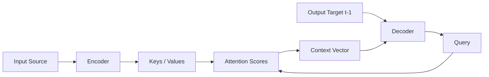
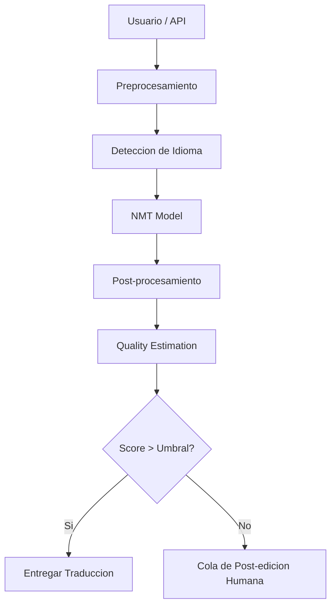

# 🌐 Traducción y Multilingüismo

La traducción automática (MT) es una de las aplicaciones industriales más maduras del NLP. Desde los sistemas basados en reglas hasta los actuales modelos neuronales multilingües, la capacidad de cruzar barreras idiomáticas con ML ha transformado la comunicación global, el comercio electrónico y la atención al cliente.


---

## 1. Machine Translation: SMT vs NMT

### 1.1 Statistical Machine Translation (SMT)

SMT modela la traducción como un problema de inferencia probabilística. El modelo busca la oración más probable en el idioma objetivo $t$ dada una oración fuente $s$:

$$
\hat{t} = \arg\max_{t} P(t \mid s) = \arg\max_{t} P(s \mid t) P(t)
$$

Donde:
- $P(s \mid t)$ es el **modelo de traducción** (aprendido de corpus paralelos).
- $P(t)$ es el **modelo de lenguaje** del idioma objetivo.

SMT depende fuertemente de características de alineación a nivel de frase y requiere pipelines complejos de preprocesamiento.

### 1.2 Neural Machine Translation (NMT)

NMT utiliza una arquitectura encoder-decoder que aprende una representación distribuida continua del texto fuente y genera la secuencia objetivo de forma autoregresiva:

$$
P(t \mid s) = \prod_{i=1}^{m} P(t_i \mid t_{<i}, s)
$$

Las ventajas de NMT sobre SMT incluyen:

| Aspecto | SMT | NMT |
|---|---|---|
| Representación | Discreta (frases) | Densa (embeddings) |
| Generalización | Limitada | Alta |
| Fluidez | Fragmentada | Fluida y coherente |
| Requerimiento de datos | Moderado | Masivo |
| Entrenamiento | Modular | End-to-end |

💡 **Tip**: En producción industrial, NMT domina casi por completo, pero SMT aún se usa en dominios muy específicos con pocos datos paralelos cuando se combina con técnicas de back-off.

---

## 2. Attention en NMT

El mecanismo de atención revolucionó NMT al permitir que el decoder accediera a todas las posiciones del encoder en cada paso de generación, resolviendo el cuello de botella de la representación de contexto fija.

La atención escalada (scaled dot-product attention) se define como:

$$
\text{Attention}(Q, K, V) = \text{softmax}\left( \frac{QK^T}{\sqrt{d_k}} \right) V
$$

Donde $Q$, $K$ y $V$ son las matrices de consulta, clave y valor derivadas de las representaciones del encoder y decoder.



⚠️ **Advertencia**: La atención pura tiene complejidad cuadrática $O(n^2)$ respecto a la longitud de secuencia. Para documentos largos, considera sparse attention o modelos segmentados.

---

## 3. Modelos Multilingües

### 3.1 mBERT (Multilingual BERT)

mBERT es el modelo BERT base entrenado conjuntamente en 104 idiomas con un vocabulario compartido de ~110k tokens. Utiliza tokenización WordPiece y comparte parámetros entre todos los idiomas.

💡 **Tip**: mBERT funciona sorprendentemente bien para cross-lingual transfer en tareas de clasificación, pero para generación (traducción) es inferior a modelos seq2seq dedicados.

### 3.2 XLM-RoBERTa (XLM-R)

XLM-R se entrena con Masked Language Modeling (MLM) en 2.5TB de datos de CommonCrawl en 100 idiomas. A diferencia de mBERT:

- Usa SentencePiece en lugar de WordPiece.
- No requiere tokenización de lenguaje explícita.
- Mejora significativamente en tareas de cross-lingual understanding (XNLI, MLQA).

### 3.3 mT5 (Multilingual T5)

mT5 extiende la arquitectura encoder-decoder de T5 al multilingüismo. Es particularmente poderoso porque:

- Soporta generación y comprensión en el mismo modelo.
- Permite fine-tuning para traducción específica de dominio.
- Soporta zero-shot translation entre pares no vistos explícitamente.

```python
from transformers import MT5ForConditionalGeneration, MT5Tokenizer

model_name = "google/mt5-base"
tokenizer = MT5Tokenizer.from_pretrained(model_name)
model = MT5ForConditionalGeneration.from_pretrained(model_name)

src = "translate English to French: The cat sat on the mat."
inputs = tokenizer(src, return_tensors="pt")
outputs = model.generate(**inputs, max_length=40)
print(tokenizer.decode(outputs[0], skip_special_tokens=True))
```

---

## 4. Zero-Shot Cross-Lingual Transfer

El zero-shot cross-lingual transfer es la capacidad de un modelo entrenado en un idioma (típicamente inglés) para generalizar a otros idiomas sin datos etiquetados en el idioma objetivo.

La hipótesis subyacente es que los modelos multilingües aprenden un **espacio de representación compartido** donde conceptos semánticamente equivalentes en diferentes idiomas se mapean a vectores cercanos.

Caso real: **Google Search** utiliza zero-shot transfer para expandir clasificadores de intención de consulta a más de 100 idiomas sin reentrenar por idioma.

⚠️ **Advertencia**: El zero-shot funciona mejor entre idiomas tipológicamente similares y con alta representación en el pre-entrenamiento. Idiomas de bajos recursos suelen degradarse significativamente.

---

## 5. Back-Translation para Data Augmentation

La back-translation es una técnica de aumento de datos donde se traduce texto monolingüe del idioma objetivo al idioma fuente (usando un modelo NMT inverso) para generar pares paralelos sintéticos.

Formalmente, dado un corpus monolingüe $T$ en el idioma objetivo:

1. Entrenar o usar un modelo $M_{t \to s}$.
2. Generar $\tilde{S} = M_{t \to s}(T)$.
3. Usar pares $(\tilde{S}, T)$ como datos de entrenamiento adicionales.

Esta técnica mejora significativamente la fluidez y robustez del modelo, especialmente en dominios con pocos datos paralelos.

```python
from transformers import MarianMTModel, MarianTokenizer

# Modelo de back-translation: inglés -> español -> inglés
back_model_name = "Helsinki-NLP/opus-mt-en-es"
back_tokenizer = MarianTokenizer.from_pretrained(back_model_name)
back_model = MarianMTModel.from_pretrained(back_model_name)

mono_text = "This is a synthetic example for back-translation."
inputs = back_tokenizer(mono_text, return_tensors="pt", padding=True)
translated = back_model.generate(**inputs)
back_text = back_tokenizer.decode(translated[0], skip_special_tokens=True)
print(back_text)
```

💡 **Tip**: Aplica filtrado de calidad (por ejemplo, usando COMET o BLEU del par sintético) para descartar ejemplos de back-translation de baja calidad antes de entrenar.

---

## 6. Quality Estimation (QE)

El Quality Estimation predice la calidad de una traducción sin necesidad de una referencia humana. Es crítico en producción para:

- Decidir si una traducción automática es suficiente o requiere post-edición humana.
- Priorizar qué contenido revisar primero.
- Detectar errores sistemáticos del modelo.

Un enfoque común es entrenar un regresor sobre características del modelo NMT (probabilidades, atención, embeddings) para predecir scores como:

$$
\text{BLEU} = \text{BP} \cdot \exp\left( \sum_{n=1}^{N} w_n \log p_n \right)
$$

Donde $p_n$ es la precisión de n-gramas y BP es el brevity penalty:

$$
\text{BP} = \begin{cases} 1 & \text{if } c > r \\ e^{(1 - r/c)} & \text{if } c \leq r \end{cases}
$$

Caso real: **eBay** utiliza QE basado en transformers para enrutar automáticamente descripciones de productos a traductores humanos solo cuando el score de calidad es inferior a un umbral configurable.

---

## 7. Comparativa de Calidad por Par de Idiomas

| Par de Idiomas | Modelo Recomendado | BLEU Aprox. | Consideraciones |
|---|---|---|---|
| En-Es | mT5-large / NLLB-200 | 35-40 | Alto recurso, muy estable |
| En-Zh | mT5 / DeepL API | 30-35 | Caracteres vs tokens, segmentación crítica |
| Es-Ca | NLLB-200 / Apertium | 38-45 | Lenguas romances cercanas, zero-shot funciona |
| En-Sw | NLLB-200 | 20-25 | Bajo recurso, back-translation esencial |
| Ja-En | mT5 / DeepL | 28-33 | Orden SOV vs SVO, morfología aglutinante |

⚠️ **Advertencia**: Los valores BLEU son orientativos y dependen fuertemente del dominio (noticias, médico, técnico). Nunca compares BLEU entre datasets diferentes sin normalizar.

---

## 8. Código de Pipeline con Hugging Face

```python
import torch
from transformers import AutoTokenizer, AutoModelForSeq2SeqLM

class MultilingualNMT:
    def __init__(self, model_name="facebook/nllb-200-distilled-600M"):
        self.device = "cuda" if torch.cuda.is_available() else "cpu"
        self.tokenizer = AutoTokenizer.from_pretrained(model_name)
        self.model = AutoModelForSeq2SeqLM.from_pretrained(model_name).to(self.device)

    def translate(self, text: str, src_lang: str = "eng_Latn", tgt_lang: str = "spa_Latn", max_length: int = 200):
        self.tokenizer.src_lang = src_lang
        inputs = self.tokenizer(text, return_tensors="pt", padding=True).to(self.device)
        forced_bos_token_id = self.tokenizer.lang_code_to_id[tgt_lang]
        outputs = self.model.generate(
            **inputs,
            forced_bos_token_id=forced_bos_token_id,
            max_length=max_length,
            num_beams=4,
            early_stopping=True
        )
        return self.tokenizer.decode(outputs[0], skip_special_tokens=True)

# Ejemplo de uso
nmt = MultilingualNMT()
translation = nmt.translate(
    "Neural machine translation has revolutionized global communication.",
    src_lang="eng_Latn",
    tgt_lang="spa_Latn"
)
print(translation)
```

💡 **Tip**: NLLB-200 soporta más de 200 idiomas con códigos FLORES+. Revisa la documentación de idiomas soportados antes de desplegar.

---

## 9. Arquitectura de un Sistema NMT Industrial



---

🎯 **Proyecto documentado**: Diseña un microservicio de traducción empresarial que exponga una API REST con detección automática de idioma, traducción mediante NLLB-200, quality estimation con COMET, y encaminamiento a post-edición humana para scores bajos. Documenta latencias p95 y estrategias de caching.

📦 **Código de compresión**:

```python
# Dependencias para este módulo
!pip install transformers torch sacrebleu comet-ml fastapi uvicorn
```
