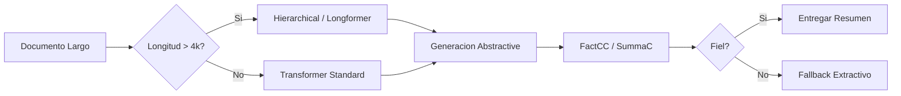

# 📝 Resumen y Generación de Texto

La generación automática de resúmenes es una de las aplicaciones NLP más demandadas en la industria: desde resumir noticias y reportes financieros hasta condensar conversaciones de soporte técnico. Dominar esta tarea implica entender no solo cómo comprimir texto, sino cómo garantizar que el resumen sea fiel al original.


---

## 1. Resumen Extractivo

### 1.1 TextRank

TextRank es un algoritmo basado en grafos no supervisado inspirado en PageRank. Cada oración es un nodo y las aristas representan similitud (típicamente coseno entre embeddings TF-IDF).

El score de una oración $S_i$ se define iterativamente como:

$$
\text{Score}(S_i) = (1 - d) + d \cdot \sum_{S_j \in \text{In}(S_i)} \frac{\text{sim}(S_i, S_j)}{\sum_{S_k \in \text{Out}(S_j)} \text{sim}(S_j, S_k)} \text{Score}(S_j)
$$

Donde $d$ es el factor de amortiguación (típicamente 0.85).

### 1.2 LexRank

LexRank es similar a TextRank pero utiliza similitud coseno normalizada y matriz de conectividad para calcular eigenvectores centrales. Las oraciones con mayor eigenvector centrality se seleccionan para el resumen.

| Característica | TextRank | LexRank |
|---|---|---|
| Base | PageRank | Eigenvector centrality |
| Similitud | Coseno TF-IDF | Coseno TF-IDF |
| Supervisión | No | No |
| Dominio | General | General |

```python
from sumy.parsers.plaintext import PlaintextParser
from sumy.nlp.tokenizers import Tokenizer
from sumy.summarizers.text_rank import TextRankSummarizer
from sumy.summarizers.lex_rank import LexRankSummarizer

text = """La inteligencia artificial está transformando industrias enteras.
Los modelos de lenguaje grandes permiten automatizar tareas complejas.
Sin embargo, su implementación requiere consideraciones éticas y técnicas."""

parser = PlaintextParser.from_string(text, Tokenizer("spanish"))

summarizer = TextRankSummarizer()
summary = summarizer(parser.document, sentences_count=2)
print("TextRank:", " ".join([str(s) for s in summary]))
```

💡 **Tip**: Los resúmenes extractivos preservan la literalidad del texto original, lo que los hace inherentemente más fiables para dominios regulados (legal, médico), aunque menos fluidos.

---

## 2. Resumen Abstractive

### 2.1 Seq2seq con Atención

Los primeros modelos abstractive utilizaron LSTM encoder-decoder con atención de Bahdanau:

$$
c_t = \sum_{j=1}^{T} \alpha_{tj} h_j \quad \text{donde} \quad \alpha_{tj} = \frac{\exp(e_{tj})}{\sum_{k=1}^{T} \exp(e_{tk})}
$$

Donde $e_{tj} = a(s_{t-1}, h_j)$ es la función de alineación entre el estado del decoder $s_{t-1}$ y el estado oculto del encoder $h_j$.

### 2.2 Transformers para Sumarización

Modelos como BART, T5 y PEGASUS utilizan arquitecturas transformer puras. PEGASUS, por ejemplo, se pre-entrena con un objetivo de masking de oraciones completas (Gap-Sentences Generation), lo que lo hace especialmente efectivo para summarization.

```python
from transformers import pipeline

summarizer = pipeline("summarization", model="facebook/bart-large-cnn")

text = (
    "Artificial intelligence (AI) is transforming the way businesses operate. "
    "From customer service chatbots to predictive analytics, AI applications are endless. "
    "However, implementing AI requires careful planning and ethical considerations."
)

summary = summarizer(text, max_length=50, min_length=10, do_sample=False)
print(summary[0]["summary_text"])
```

⚠️ **Advertencia**: Los modelos abstractive pueden "alucinar" hechos no presentes en el texto fuente. Esto es crítico en aplicaciones médicas o legales donde la fidelidad factual es obligatoria.

---

## 3. Control de Longitud

El control de longitud permite ajustar el resumen a restricciones del producto (previews, notificaciones push, tweets).

Técnicas principales:

1. **Length penalty**: Modifica la función de scoring durante beam search:

$$
\text{score}(y) = \frac{\log P(y \mid x)}{|y|^\alpha}
$$

Donde $\alpha$ controla la penalización por longitud.

2. **Token de control**: Prependear tokens como `<short>`, `<medium>`, `<long>` durante el entrenamiento para condicionar la generación.

```python
from transformers import AutoTokenizer, AutoModelForSeq2SeqLM

tokenizer = AutoTokenizer.from_pretrained("google/pegasus-xsum")
model = AutoModelForSeq2SeqLM.from_pretrained("google/pegasus-xsum")

inputs = tokenizer(text, return_tensors="pt")
outputs = model.generate(
    **inputs,
    max_length=30,
    min_length=10,
    length_penalty=2.0,
    num_beams=4
)
print(tokenizer.decode(outputs[0], skip_special_tokens=True))
```

---

## 4. Faithfulness: FactCC y SummaC

La **faithfulness** (fidelidad factual) mide si el resumen es consistente con el documento fuente.

### 4.1 FactCC

FactCC entrena un clasificador BERT para verificar si un claim en el resumen está soportado por el texto fuente. El proceso:

1. Extraer claims del resumen.
2. Para cada claim, encontrar la evidencia relevante en el texto fuente.
3. Clasificar la relación claim-evidencia como SUPPORTED o NOT SUPPORTED.

### 4.2 SummaC

SummaC (Summary Consistency) utiliza modelos de inferencia de lenguaje natural (NLI) para evaluar consistencia a nivel de oración y agrega los scores:

$$
\text{SummaC} = \frac{1}{|S|} \sum_{s \in S} \max_{d \in D} \text{NLI}(s, d)
$$

Donde $S$ son las oraciones del resumen y $D$ las del documento.

| Métrica | Enfoque | Granularidad | Requiere Referencia |
|---|---|---|---|
| FactCC | Clasificación BERT | Claim-level | No |
| SummaC | NLI agregado | Oración-level | No |
| BERTScore | Similitud de embeddings | Token-level | Sí |

Caso real: **CNN** utiliza sistemas de verificación factual basados en NLI para resúmenes generados automáticamente de artículos de noticias, evitando la propagación de información errónea.

---

## 5. Document-Level Summarization

### 5.1 Hierarchical Transformers

Los transformers estándar tienen complejidad cuadrática $O(n^2)$ respecto a la longitud de secuencia. Para documentos largos, los modelos jerárquicos procesan el texto en dos niveles:

1. **Nivel de oración**: Un encoder transformer procesa cada oración individualmente.
2. **Nivel de documento**: Un segundo encoder agrega las representaciones de oración para capturar estructura global.

### 5.2 Longformer

Longformer utiliza attention patterns lineales:

- **Sliding window attention**: Cada token atiende a $w$ tokens a su alrededor.
- **Global attention**: Tokens específicos (ej. `[CLS]`) atienden a toda la secuencia.

Esto reduce la complejidad a $O(n \cdot w)$, permitiendo procesar documentos de miles de tokens.

```python
from transformers import AutoTokenizer, AutoModelForSeq2SeqLM

tokenizer = AutoTokenizer.from_pretrained("allenai/led-base-16384")
model = AutoModelForSeq2SeqLM.from_pretrained("allenai/led-base-16384")

long_text = " " * 10000  # Documento largo de ejemplo
inputs = tokenizer(long_text, return_tensors="pt", truncation=True, max_length=4096)
outputs = model.generate(**inputs)
print(tokenizer.decode(outputs[0], skip_special_tokens=True))
```

⚠️ **Advertencia**: Aunque Longformer soporta 16k tokens, la memoria GPU puede ser un cuello de botella. Considera gradient checkpointing o procesamiento por chunks.

---

## 6. Comparativa de Métricas

### 6.1 ROUGE

ROUGE (Recall-Oriented Understudy for Gisting Evaluation) mide la superposición de n-gramas entre el resumen generado y la referencia.

$$
\text{ROUGE-N} = \frac{\sum_{S \in \text{References}} \sum_{\text{gram}_n \in S} \text{Count}_{\text{match}}(\text{gram}_n)}{\sum_{S \in \text{References}} \sum_{\text{gram}_n \in S} \text{Count}(\text{gram}_n)}
$$

ROUGE-L considera la subsecuencia común más larga (LCS):

$$
\text{ROUGE-L} = \frac{(1 + \beta^2) R_{\text{lcs}} P_{\text{lcs}}}{R_{\text{lcs}} + \beta^2 P_{\text{lcs}}}
$$

### 6.2 BERTScore

BERTScore computa la similitud coseno entre embeddings de tokens del candidato y la referencia, usando alineamiento óptimo:

$$
\text{Recall} = \frac{1}{|x|} \sum_{x_i \in x} \max_{\hat{x}_j \in \hat{x}} x_i^T \hat{x}_j
$$

### 6.3 MoverScore

MoverScore utiliza Earth Mover's Distance (EMD) sobre embeddings contextuales:

$$
\text{MoverScore}(R, H) = \min_{F \geq 0} \frac{\sum_{i,j} F_{ij} c(i,j)}{\sum_{i,j} F_{ij}}
$$

Donde $F$ es el flujo de transporte óptimo y $c(i,j)$ es la distancia entre embeddings.

| Métrica | Tipo | Ventaja | Limitación |
|---|---|---|---|
| ROUGE | N-gram overlap | Rápida, interpretable | Ignora sinónimos y paráfrasis |
| BERTScore | Embedding similarity | Captura semántica | Computacionalmente costosa |
| MoverScore | Optimal transport | Robustez semántica | Más lenta que BERTScore |

```python
from rouge_score import rouge_scorer
from bert_score import score

scorer = rouge_scorer.RougeScorer(['rouge1', 'rougeL'], use_stemmer=True)
candidate = "The cat sat on the mat."
reference = "A cat was sitting on a mat."
scores = scorer.score(reference, candidate)
print(scores)

P, R, F1 = score([candidate], [reference], lang="en", verbose=True)
print(f"BERTScore F1: {F1.item():.4f}")
```

💡 **Tip**: En producción, usa ROUGE para monitoreo rápido durante entrenamiento y BERTScore para evaluación final de calidad semántica. Nunca uses métricas automáticas como único criterio de calidad sin evaluación humana.

---

## 7. Pipeline Completo de Sumarización



---

🎯 **Proyecto documentado**: Construye un pipeline de resumen de reportes financieros que procese documentos de hasta 10,000 palabras. Utiliza LED para abstractive summarization, SummaC para verificación factual, y ROUGE-L + BERTScore para evaluación continua. Incluye control de longitud para generar versiones de 50, 100 y 250 palabras según el canal de salida.

📦 **Código de compresión**:

```python
!pip install transformers rouge-score bert-score sumy torch
```
