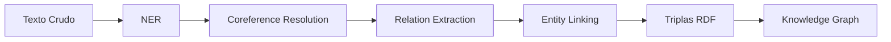

# 🔗 Extracción de Información y Grafos de Conocimiento

La extracción de información (IE) transforma texto no estructurado en datos estructurados que pueden consultarse, razonarse y visualizarse. Cuando estos datos se organizan en grafos de conocimiento (KG), habilitan aplicaciones industriales como asistentes inteligentes, motores de recomendación y sistemas de cumplimiento regulatorio.


---

## 1. Named Entity Recognition (NER) Avanzado

NER identifica y clasifica entidades nombradas en texto. Los esquemas industriales estándar incluyen PER (persona), ORG (organización), LOC (ubicación), MISC (misceláneo), y extensiones de dominio como productos, eventos y cantidades monetarias.

### 1.1 NER basado en Transformers

Los modelos tipo BERT fine-tuneados para NER predicen etiquetas BIO (Begin, Inside, Outside) para cada token:

$$
P(y_i \mid x) = \text{softmax}(W \cdot h_i + b)
$$

Donde $h_i$ es la representación contextual del token $i$ y $W, b$ son parámetros de la capa de clasificación.

```python
from transformers import AutoTokenizer, AutoModelForTokenClassification
from transformers import pipeline

tokenizer = AutoTokenizer.from_pretrained("dslim/bert-base-NER")
model = AutoModelForTokenClassification.from_pretrained("dslim/bert-base-NER")

nlp = pipeline("ner", model=model, tokenizer=tokenizer, aggregation_strategy="simple")
text = "Apple is looking at buying U.K. startup for $1 billion"
print(nlp(text))
```

### 1.2 NER Multilingüe y de Dominio

Para dominios especializados (biomédico, legal, financiero), el fine-tuning en corpus anotados de dominio es esencial. Modelos como BioBERT o Legal-BERT extienden BERT con pre-entrenamiento continuo en corpus especializados.

💡 **Tip**: Cuando no tienes anotaciones de dominio, considera few-shot NER con prototipos (ej. usando sentence-transformers para similaridad con ejemplos etiquetados).

---

## 2. Relation Extraction (RE)

RE identifica relaciones semánticas entre entidades. Formalmente, dada una oración $s$ y un par de entidades $(e_1, e_2)$, RE predice la relación $r \in R \cup \{\text{None}\}$.

### 2.1 Supervised RE

En el enfoque supervisado, se entrena un clasificador (típicamente BERT) con oraciones donde las entidades están marcadas:

$$
P(r \mid s, e_1, e_2) = \text{softmax}(W \cdot [h_{e_1}; h_{e_2}; h_{\text{CLS}}] + b)
$$

### 2.2 Distant Supervision

Distant supervision genera datos de entrenamiento alineando corpus de texto con una base de conocimiento existente (ej. Wikidata, Freebase). Si $(e_1, r, e_2)$ existe en el KG, se asume que cualquier oración que mencione ambas entidades expresa la relación $r$.

⚠️ **Advertencia**: Distant supervision introduce ruido significativo (falsos positivos). Técnicas como multi-instance learning o atención sobre bolsas de oraciones mitigan este problema:

$$
P(r \mid B) = \sum_{j} \alpha_j P(r \mid s_j) \quad \text{donde} \quad \alpha_j = \frac{\exp(z_j)}{\sum_k \exp(z_k)}
$$

### 2.3 Prompt-based RE

Con modelos LLM, RE puede formularse como completación de texto:

```
Context: Apple was founded by Steve Jobs.
Question: What is the relation between Apple and Steve Jobs?
Answer: founded_by
```

```python
from transformers import pipeline

llm = pipeline("text-generation", model="meta-llama/Llama-2-7b-chat-hf")
prompt = """Context: Microsoft acquired LinkedIn in 2016.
Question: What is the relation between Microsoft and LinkedIn?
Answer:"""
print(llm(prompt, max_new_tokens=10, do_sample=False))
```

---

## 3. Entity Linking

Entity linking (EL) conecta menciones de entidades en texto con identificadores canónicos en una base de conocimiento (ej. Q312 en Wikidata).

### 3.1 Candidate Generation

Dada una mención $m$, se genera un conjunto de candidatos $C(m)$ usando:

- Diccionarios de alias (Wikipedia redirects, Wikidata aliases).
- Búsqueda aproximada en embeddings de entidades (FAISS).
- Modelos de ranking rápidos basados en caracteres.

### 3.2 Disambiguation

El paso de desambiguación selecciona el candidato correcto $c^* \in C(m)$ considerando el contexto:

$$
c^* = \arg\max_{c \in C(m)} P(c \mid m, \text{context})
$$

Modelos como BLINK utilizan bi-encoders para codificar la mención con contexto y la descripción de la entidad por separado, y luego rankean por similitud coseno:

$$
\text{score}(m, c) = \frac{\phi(m)^T \psi(c)}{\|\phi(m)\| \|\psi(c)\|}
$$

Caso real: **Bloomberg** utiliza entity linking a su propio grafo de conocimiento financiero (Bloomberg Entity Exchange) para normalizar menciones de empresas, ejecutivos y instrumentos financieros en millones de noticias diarias.

---

## 4. Construcción de Knowledge Graphs

### 4.1 RDF y OWL Básico

RDF (Resource Description Framework) representa conocimiento como triplas sujeto-predicado-objeto:

```turtle
@prefix ex: <http://example.org/> .
ex:Apple ex:foundedBy ex:SteveJobs .
ex:Apple ex:industry ex:Technology .
```

OWL (Web Ontology Language) permite definir clases, propiedades y restricciones lógicas:

```turtle
@prefix owl: <http://www.w3.org/2002/07/owl#> .
ex:Company owl:equivalentClass ex:Corporation .
ex:foundedBy rdfs:domain ex:Company ;
            rdfs:range ex:Person .
```

💡 **Tip**: En aplicaciones industriales, no es necesario construir ontologías OWL complejas desde cero. Reutiliza esquemas existentes como Schema.org o la Financial Industry Business Ontology (FIBO).

### 4.2 Pipeline de Construcción de KG



---

## 5. Graph Embeddings

Los graph embeddings proyectan nodos y relaciones en espacios vectoriales donde la estructura del grafo se preserva.

### 5.1 TransE

TransE modela relaciones como translaciones en el espacio vectorial:

$$
\| \mathbf{h} + \mathbf{r} - \mathbf{t} \| \approx 0 \quad \text{para triplas válidas } (h, r, t)
$$

La función de scoring es:

$$
f_r(h, t) = -\| \mathbf{h} + \mathbf{r} - \mathbf{t} \|_{1/2}
$$

### 5.2 RotatE

RotatE modela relaciones como rotaciones en el espacio complejo:

$$
\mathbf{t} = \mathbf{h} \circ \mathbf{r} \quad \text{donde } |r_i| = 1
$$

La función de scoring es:

$$
f_r(h, t) = -\| \mathbf{h} \circ \mathbf{r} - \mathbf{t} \|
$$

| Modelo | Espacio | Patrones soportados | Limitación |
|---|---|---|---|
| TransE | Real | 1-to-1 | Mal en 1-to-N, N-to-1 |
| RotatE | Complejo | 1-to-1, 1-to-N, simétricas, inversas | Más complejo de entrenar |

```python
from pykeen.pipeline import pipeline

result = pipeline(
    dataset="Nations",
    model="RotatE",
    training_loop="sLCWA",
    negative_sampler="basic",
    model_kwargs=dict(embedding_dim=200),
    optimizer_kwargs=dict(lr=0.01),
    training_kwargs=dict(num_epochs=100),
)
print(result.metric_results)
```

⚠️ **Advertencia**: Los graph embeddings requieren grafos relativamente limpios. El ruido en las triplas (errores de RE o EL) se propaga directamente a los embeddings y degrada las aplicaciones downstream.

---

## 6. Aplicaciones: KBQA y Reasoning

### 6.1 KBQA (Knowledge Base Question Answering)

KBQA responde preguntas naturales consultando un knowledge graph. El pipeline típico:

1. **Entity linking**: Identificar la entidad principal en la pregunta.
2. **Relation prediction**: Predecir la relación buscada.
3. **Query execution**: Ejecutar la consulta sobre el KG.

```
Pregunta: "¿Quién fundó Apple?"
Entity: Apple (Q312)
Relation: founded_by (P112)
Query: SELECT ?x WHERE { wd:Q312 wdt:P112 ?x }
Respuesta: Steve Jobs (Q19837)
```

### 6.2 Reasoning sobre KG

El razonamiento sobre grafos permite inferir nuevas relaciones a partir de las existentes. Técnicas como path ranking o modelos de message passing (R-GCN) propagan información a través de las aristas:

$$
h_i^{(l+1)} = \sigma \left( \sum_{r \in R} \sum_{j \in \mathcal{N}_i^r} \frac{1}{c_{i,r}} W_r^{(l)} h_j^{(l)} + W_0^{(l)} h_i^{(l)} \right)
$$

Caso real: **Amazon** utiliza reasoning sobre su knowledge graph de productos para responder preguntas de clientes del tipo "¿Este cargador es compatible con mi teléfono?" inferiendo compatibilidad a través de relaciones de marca, modelo y especificaciones técnicas.

---

## 7. Código con spaCy + Neo4j

```python
import spacy
from neo4j import GraphDatabase

# Cargar modelo de spaCy
nlp = spacy.load("en_core_web_lg")

# Ejemplo de texto
text = "Apple Inc. is planning to open a new office in London. Tim Cook is the CEO."
doc = nlp(text)

# Extraer entidades
entities = [(ent.text, ent.label_) for ent in doc.ents]
print("Entidades:", entities)

# Extraer relaciones simples basadas en dependencias
relations = []
for token in doc:
    if token.dep_ in ("nsubj", "nsubjpass") and token.head.lemma_ == "be":
        subj = token.text
        obj = [child for child in token.head.children if child.dep_ == "attr"]
        if obj:
            relations.append((subj, "is_a", obj[0].text))
print("Relaciones:", relations)

# Conectar a Neo4j y crear nodos/relaciones
class Neo4jKG:
    def __init__(self, uri, user, password):
        self.driver = GraphDatabase.driver(uri, auth=(user, password))

    def add_triple(self, subject, relation, obj):
        with self.driver.session() as session:
            session.run(
                "MERGE (s:Entity {name: $subject}) "
                "MERGE (o:Entity {name: $obj}) "
                "MERGE (s)-[r:RELATION {type: $relation}]->(o)",
                subject=subject, relation=relation, obj=obj
            )

# Uso
kg = Neo4jKG("bolt://localhost:7687", "neo4j", "password")
for subj, rel, obj in relations:
    kg.add_triple(subj, rel, obj)
```

💡 **Tip**: Para producción a gran escala, usa `apoc.periodic.iterate` en Neo4j para ingestas masivas y evita crear relaciones duplicadas con `MERGE`.

---

🎯 **Proyecto documentado**: Construye un pipeline de extracción de información financiera que procese reportes de earnings calls. Extrae entidades (empresas, ejecutivos, métricas financieras), relaciones (adquisiciones, nombramientos, proyecciones), y persiste todo en Neo4j. Implementa una API de KBQA que responda preguntas como "¿Qué empresas adquirió Microsoft en 2023?" mediante consultas Cypher generadas automáticamente.

📦 **Código de compresión**:

```python
!pip install spacy transformers pykeen neo4j scikit-learn
!python -m spacy download en_core_web_lg
```
