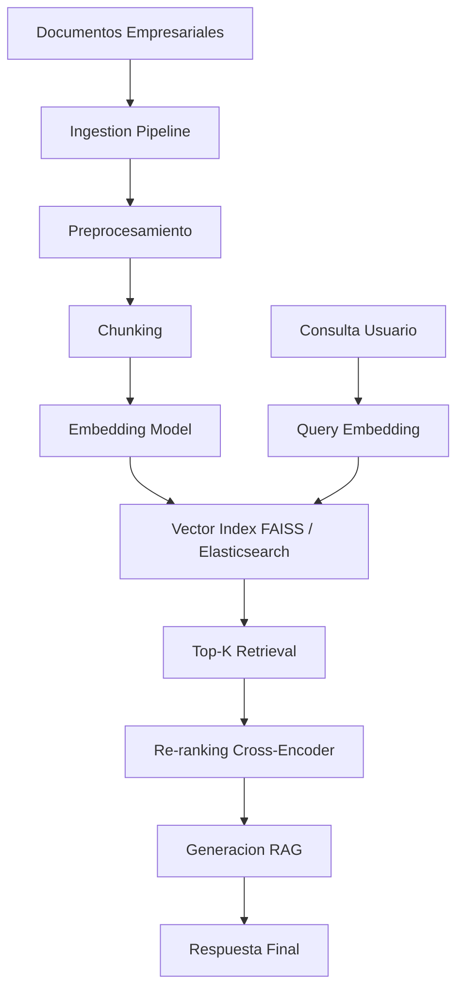

# 🔍 Caso Práctico: Motor de Búsqueda Semántica Empresarial

La búsqueda semántica representa el salto cualitativo más importante en recuperación de información desde el advenimiento de los motores de búsqueda web tradicionales. A diferencia de la búsqueda léxica (TF-IDF, BM25), la búsqueda semántica comprende el significado detrás de las consultas, permitiendo recuperar documentos conceptualmente relevantes incluso cuando no comparten palabras clave.


---

## 1. Requisitos Funcionales

Un motor de búsqueda semántica empresarial debe satisfacer los siguientes requisitos:

1. **Ingesta multiformato**: PDF, Word, HTML, correos electrónicos, tickets de soporte.
2. **Chunking inteligente**: Segmentación que preserve contexto semántico.
3. **Embeddings densos**: Representación vectorial de documentos y consultas en un espacio compartido.
4. **Recuperación eficiente**: Búsqueda por similitud en millones de vectores con latencia < 100ms.
5. **Re-ranking**: Modelo cross-encoder para refinar los top-k resultados.
6. **Generación de respuesta**: Opcionalmente, generar una respuesta sintetizada a partir de los documentos recuperados (RAG).
7. **Privacidad y control de acceso**: Filtrado de resultados según roles y permisos.

---

## 2. Arquitectura del Sistema



---

## 3. Pipeline de Ingesta y Chunking

### 3.1 Preprocesamiento

El preprocesamiento limpia y normaliza documentos:

- Extracción de texto (OCR para PDFs escaneados).
- Normalización Unicode.
- Eliminación de headers/footers repetitivos.

### 3.2 Chunking

El chunking divide documentos largos en unidades manejables para el modelo de embeddings. Estrategias:

- **Fixed-size**: Chunks de $n$ tokens con overlap.
- **Semantic chunking**: División por oraciones o párrafos completos.
- **Hierarchical**: Chunks pequeños con resumen del chunk padre.

⚠️ **Advertencia**: Chunks demasiado largos diluyen la representación semántica; chunks demasiado cortos pierden contexto. En producción, experimenta con tamaños entre 256 y 512 tokens para sentence-transformers.

```python
from langchain.text_splitter import RecursiveCharacterTextSplitter

text_splitter = RecursiveCharacterTextSplitter(
    chunk_size=512,
    chunk_overlap=50,
    separators=["\n\n", "\n", ".", " "]
)

chunks = text_splitter.split_text(large_document)
```

---

## 4. Embeddings con Sentence-Transformers

Los modelos de sentence-transformers (SBERT) generan embeddings densos donde la similitud semántica se mide con coseno:

$$
\text{sim}(q, d) = \frac{\phi(q)^T \phi(d)}{\|\phi(q)\| \|\phi(d)\|}
$$

Donde $\phi$ es el encoder de sentence-transformers.

Modelos recomendados por dominio:

| Dominio | Modelo | Dimensión |
|---|---|---|
| General | all-MiniLM-L6-v2 | 384 |
| General (alta calidad) | all-mpnet-base-v2 | 768 |
| Legal | nlpaueb/legal-bert-base-uncased + fine-tuning | 768 |
| Financiero | finbert-tone + SBERT fine-tuning | 768 |

```python
from sentence_transformers import SentenceTransformer

model = SentenceTransformer("all-MiniLM-L6-v2")

documents = [
    "El contrato de arrendamiento debe renovarse antes del 31 de diciembre.",
    "La política de vacaciones permite 20 días laborables al año.",
    "El reporte trimestral muestra un crecimiento del 15% en ingresos."
]

document_embeddings = model.encode(documents)
query_embedding = model.encode("¿Cuándo vence el contrato de alquiler?")
```

💡 **Tip**: Para dominios específicos, fine-tunea el modelo de sentence-transformers con pares de (consulta, documento relevante) usando MultipleNegativesRankingLoss.

---

## 5. Índice FAISS / Elasticsearch

### 5.1 FAISS

FAISS (Facebook AI Similarity Search) es una librería optimizada para búsqueda por similitud en vectores densos. Soporta:

- **IndexFlatIP/IndexFlatL2**: Búsqueda exacta (brute-force).
- **IndexIVFFlat**: Búsqueda aproximada con particionamiento Voronoi.
- **IndexHNSWFlat**: Graph-based approximate nearest neighbors.

La búsqueda en FAISS se define como:

$$
\text{ANN}(q, k) = \arg\max_{d \in D}^{(k)} \text{sim}(q, d)
$$

```python
import faiss
import numpy as np

dimension = document_embeddings.shape[1]
index = faiss.IndexFlatIP(dimension)  # Inner product = cosine para vectores normalizados

# Normalizar para que IP == cosine
faiss.normalize_L2(document_embeddings)
index.add(document_embeddings)

# Buscar
faiss.normalize_L2(query_embedding.reshape(1, -1))
D, I = index.search(query_embedding.reshape(1, -1), k=5)
print("Top documentos:", I[0])
```

### 5.2 Elasticsearch con Dense Vectors

Elasticsearch 8+ soporta `dense_vector` fields y búsqueda por `knn`:

```json
{
  "mappings": {
    "properties": {
      "title": {"type": "text"},
      "embedding": {
        "type": "dense_vector",
        "dims": 384,
        "index": true,
        "similarity": "cosine"
      }
    }
  }
}
```

| Característica | FAISS | Elasticsearch |
|---|---|---|
| Escalabilidad | Millones de vectores | Miles de millones con clustering |
| Filtrado híbrido | Limitado | Nativo (texto + vector) |
| Mantenimiento | Auto-hospedado | Gestión de cluster |
| Latencia p99 | ~10ms | ~50-100ms |

⚠️ **Advertencia**: En producción empresarial, considera soluciones gestionadas como Pinecone, Weaviate o Milvus si no tienes operadores especializados en índices vectoriales.

---

## 6. Re-ranking con Cross-Encoders

Los bi-encoders (sentence-transformers) son rápidos pero comparan query-documento de forma aislada. Los cross-encoders concatenan query y documento en una sola secuencia y pasan por un transformer, obteniendo una relevancia mucho más precisa:

$$
\text{score}(q, d) = \text{MLP}(\text{Transformer}([q; \text{SEP}; d])_{\text{CLS}})
$$

El pipeline típico es:

1. Bi-encoder recupera top-100 candidatos rápidamente.
2. Cross-encoder re-rankea los top-100 y selecciona top-5.

```python
from sentence_transformers import CrossEncoder

cross_encoder = CrossEncoder("cross-encoder/ms-marco-MiniLM-L-6-v2")

pairs = [["¿Cuándo vence el contrato?", documents[i]] for i in I[0]]
scores = cross_encoder.predict(pairs)

ranked = sorted(zip(I[0], scores), key=lambda x: x[1], reverse=True)
print("Re-ranking:", ranked)
```

💡 **Tip**: El cross-encoder es el cuello de botella de latencia. Nunca lo apliques a todo el corpus; úsalo solo sobre los top-k de la primera etapa.

---

## 7. Métricas de Evaluación

### 7.1 NDCG

NDCG (Normalized Discounted Cumulative Gain) mide la calidad del ranking considerando la relevancia gradual de los documentos:

$$
\text{DCG}_p = \sum_{i=1}^{p} \frac{2^{\text{rel}_i} - 1}{\log_2(i + 1)}
$$

$$
\text{NDCG}_p = \frac{\text{DCG}_p}{\text{IDCG}_p}
$$

Donde IDCG es el DCG ideal (documentos perfectamente ordenados por relevancia).

### 7.2 MRR

MRR (Mean Reciprocal Rank) calcula el inverso de la posición del primer documento relevante:

$$
\text{MRR} = \frac{1}{|Q|} \sum_{i=1}^{|Q|} \frac{1}{\text{rank}_i}
$$

### 7.3 Recall@k

Recall@k mide la proporción de documentos relevantes recuperados en los top-k:

$$
\text{Recall@}k = \frac{|\{\text{relevantes}\} \cap \{\text{top-}k\}|}{|\{\text{relevantes}\}|}
$$

| Métrica | Cuándo usarla | Ideal para |
|---|---|---|
| NDCG | Ranking con relevancia gradual | Búsqueda web, recomendación |
| MRR | Preguntas con una única respuesta correcta | FAQ, KBQA |
| Recall@k | Sistemas RAG donde se necesita cobertura | Generación con contexto |

```python
from sklearn.metrics import ndcg_score
import numpy as np

# Relevancias binarias o graduadas para top-5
relevances = np.array([[3, 2, 1, 0, 0]])
scores = np.array([[0.9, 0.8, 0.7, 0.6, 0.5]])

print("NDCG@5:", ndcg_score(relevances, scores))
```

---

## 8. Consideraciones de Privacidad

En entornos empresariales, la privacidad es no negociable:

1. **Control de acceso a nivel de documento**: Cada chunk debe heredar los permisos ACL del documento padre.
2. **Filtering post-retrieval**: Aplicar filtros de permisos antes de devolver resultados al usuario.
3. **On-premise vs cloud**: Modelos de embeddings y vectores pueden contener información sensible. Evalúa despliegue on-premise o VPC privada.
4. **Auditoría**: Registrar consultas y resultados para cumplimiento normativo (GDPR, HIPAA, SOX).

Caso real: **Goldman Sachs** despliega su motor de búsqueda semántica interno completamente on-premise, con modelos fine-tuneados en infraestructura air-gapped, para garantizar que ningún dato sensible salga de su red corporativa.

⚠️ **Advertencia**: Nunca envíes documentos confidenciales a APIs de embeddings de terceros sin acuerdos de procesamiento de datos (DPA) y evaluación de riesgos de privacidad.

---

## 9. Pipeline Completo en Python

```python
import faiss
import numpy as np
from sentence_transformers import SentenceTransformer, CrossEncoder
from langchain.text_splitter import RecursiveCharacterTextSplitter

class SemanticSearchEngine:
    def __init__(self, bi_model="all-MiniLM-L6-v2", cross_model="cross-encoder/ms-marco-MiniLM-L-6-v2"):
        self.bi_encoder = SentenceTransformer(bi_model)
        self.cross_encoder = CrossEncoder(cross_model)
        self.index = None
        self.chunks = []
        self.dimension = self.bi_encoder.get_sentence_embedding_dimension()

    def ingest(self, documents: list[str]):
        splitter = RecursiveCharacterTextSplitter(chunk_size=512, chunk_overlap=50)
        for doc in documents:
            self.chunks.extend(splitter.split_text(doc))

        embeddings = self.bi_encoder.encode(self.chunks, show_progress_bar=True)
        faiss.normalize_L2(embeddings)

        self.index = faiss.IndexFlatIP(self.dimension)
        self.index.add(embeddings)

    def search(self, query: str, top_k: int = 10, rerank_k: int = 5):
        query_emb = self.bi_encoder.encode([query])
        faiss.normalize_L2(query_emb)

        D, I = self.index.search(query_emb, top_k)
        candidates = [self.chunks[i] for i in I[0]]

        pairs = [[query, c] for c in candidates]
        scores = self.cross_encoder.predict(pairs)

        ranked = sorted(zip(candidates, scores), key=lambda x: x[1], reverse=True)
        return ranked[:rerank_k]

# Uso del motor
engine = SemanticSearchEngine()
engine.ingest(documents)
results = engine.search("política de vacaciones", top_k=20, rerank_k=5)
for doc, score in results:
    print(f"Score: {score:.4f} | {doc[:200]}...")
```

---

🎯 **Proyecto documentado**: Implementa un motor de búsqueda semántica para la base de conocimiento del departamento de RRHH de una empresa. El sistema debe:

1. Ingerir 500+ documentos PDF de políticas internas.
2. Generar chunks semánticos con metadata de departamento y nivel de acceso.
3. Indexar en FAISS con embeddings de sentence-transformers.
4. Re-ranquear con cross-encoder.
5. Exponer una API REST con FastAPI que filtre resultados según el rol del usuario autenticado.
6. Medir NDCG@10, MRR y Recall@10 sobre un conjunto de 50 queries etiquetadas manualmente.
7. Documentar latencias p95 y estrategias de escalado horizontal.

📦 **Código de compresión**:

```python
!pip install sentence-transformers faiss-cpu langchain fastapi uvicorn pypdf neo4j
```
