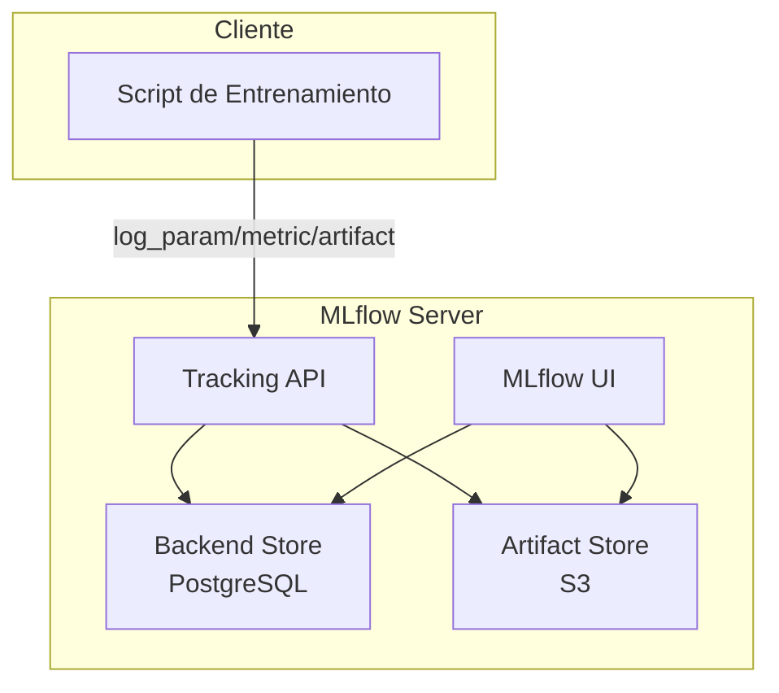
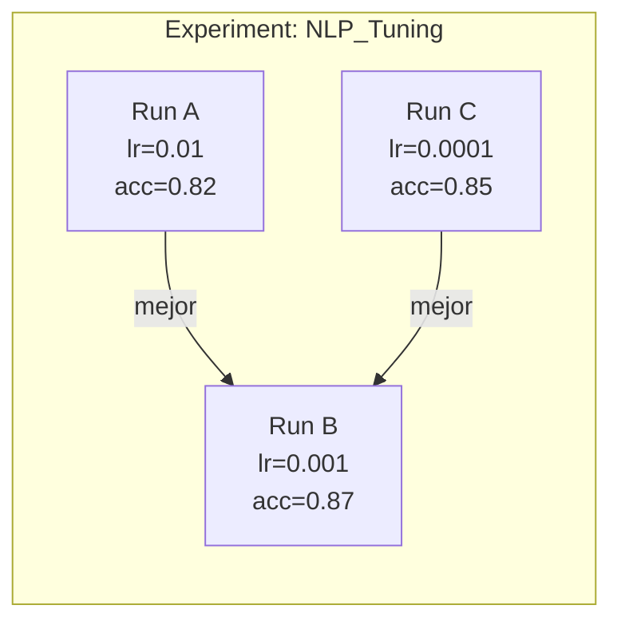

# 📊 MLflow y Tracking de Experimentos

En ingeniería de ML, la experimentación no es un evento único sino un proceso iterativo y colaborativo. Sin un sistema de tracking riguroso, los equipos pierden visibilidad sobre qué configuraciones produjeron qué resultados, generando "deuda técnica oculta" y dificultando la reproducibilidad.

MLflow Tracking resuelve este problema proporcionando una API unificada para registrar parámetros, métricas, artefactos y dependencias de cada ejecución.

---

## 1. Fundamentos de Experiment Tracking

El tracking de experimentos responde a tres preguntas fundamentales:

- **¿Qué se ejecutó?** (código, versión de datos, entorno)
- **¿Con qué configuración?** (hiperparámetros, preprocesamiento)
- **¿Qué resultado se obtuvo?** (métricas, modelos, logs)

La reproducibilidad exige que cualquier run pueda ser reconstruido. Formalmente, dado un run $R$, buscamos:

$$
\text{Reproducible}(R) \iff \text{Code}_R \times \text{Data}_R \times \text{Env}_R \times \text{Params}_R \rightarrow \text{Metrics}_R
$$

Donde $\times$ denota el producto cartesiano de factores controlados.

---

## 2. Arquitectura de MLflow Tracking

MLflow Tracking se compone de:

| Componente | Descripción |
|------------|-------------|
| **Tracking API** | Interfaces de Python, Java, REST para loggear información. |
| **Backend Store** | Almacena metadatos (params, metrics, tags). Soporta SQLAlchemy (SQLite, PostgreSQL, MySQL). |
| **Artifact Store** | Almacena archivos grandes (modelos, plots). Soporta filesystem local, S3, GCS, Azure Blob. |
| **UI** | Interfaz web para visualizar, comparar y filtrar runs. |




---

## 3. Experiments, Runs, Params, Metrics y Artifacts

- **Experiment:** Contenedor lógico de runs relacionados.
- **Run:** Ejecución individual con un `run_id` único.
- **Param:** Valor escalar registrado con `mlflow.log_param()`.
- **Metric:** Valor numérico registrado con `mlflow.log_metric()`, puede ser una serie temporal.
- **Artifact:** Archivo registrado con `mlflow.log_artifact()`.

### Código de Pipeline Tracked

```python
import mlflow
import mlflow.sklearn
from sklearn.datasets import load_iris
from sklearn.model_selection import train_test_split
from sklearn.ensemble import RandomForestClassifier
from sklearn.metrics import accuracy_score, f1_score

def main():
    # Configurar URI de tracking
    mlflow.set_tracking_uri("http://localhost:5000")
    mlflow.set_experiment("iris_classification")
    
    with mlflow.start_run(run_name="rf_experiment_01"):
        # Parámetros
        n_estimators = 200
        max_depth = 10
        random_state = 42
        
        mlflow.log_param("n_estimators", n_estimators)
        mlflow.log_param("max_depth", max_depth)
        mlflow.log_param("random_state", random_state)
        
        # Carga y split
        X, y = load_iris(return_X_y=True)
        X_train, X_test, y_train, y_test = train_test_split(
            X, y, test_size=0.2, random_state=random_state
        )
        
        # Entrenamiento
        clf = RandomForestClassifier(
            n_estimators=n_estimators,
            max_depth=max_depth,
            random_state=random_state
        )
        clf.fit(X_train, y_train)
        
        # Métricas
        y_pred = clf.predict(X_test)
        acc = accuracy_score(y_test, y_pred)
        f1 = f1_score(y_test, y_pred, average="weighted")
        
        mlflow.log_metric("accuracy", acc)
        mlflow.log_metric("f1_score", f1)
        
        # Artifact: modelo
        mlflow.sklearn.log_model(clf, "model")
        
        print(f"Run finalizado. Accuracy: {acc:.4f}, F1: {f1:.4f}")

if __name__ == "__main__":
    main()
```

---

## 4. MLflow UI

La interfaz web permite:

- Filtrar runs por métricas o parámetros.
- Comparar runs lado a lado.
- Descargar artefactos.
- Visualizar gráficos de métricas temporales.

Accede típicamente en `http://localhost:5000`.

---

## 5. Autologging

MLflow proporciona autologging para frameworks populares:

```python
import mlflow

mlflow.sklearn.autolog()  # Registra automáticamente params, metrics y modelo
mlflow.tensorflow.autolog()
mlflow.pytorch.autolog()
```

Esto reduce el código boilerplate, aunque para pipelines productivos se recomienda logging explícito para mayor control.

---

## 6. Comparativa de Runs y Herramientas Alternativas

| Característica | MLflow | Sacred | Weights & Biases |
|----------------|--------|--------|------------------|
| Open Source | ✅ | ✅ | ❌ (SaaS) |
| UI Integrada | ✅ | ❌ (requiere Omniboard) | ✅ |
| Autologging | ✅ | ❌ | ✅ |
| Model Registry | ✅ | ❌ | ✅ |
| Costo | Gratuito | Gratuito | Freemium |

Caso real: Spotify utiliza MLflow internamente para rastrear miles de experimentos diarios en sus pipelines de recomendación musical, permitiendo a los científicos de datos comparar variantes de embeddings sin duplicar infraestructura.

### Comparación Visual de Runs



---

## 7. Organización de Experimentos

Estrategias recomendadas:

- **Un experimento por proyecto/dataset.**
- **Nomenclatura de runs:** `{modelo}_{fecha}_{versión_datos}`.
- **Tags:** Utiliza `mlflow.set_tag("version_data", "v1.3")` para filtrado posterior.

---

## 8. Logging de Métricas Temporales

Para entrenamientos largos (ej. deep learning), registra métricas por epoch:

```python
for epoch in range(epochs):
    # ... entrenamiento ...
    loss = train_epoch(...)
    val_loss = validate(...)
    mlflow.log_metric("train_loss", loss, step=epoch)
    mlflow.log_metric("val_loss", val_loss, step=epoch)
```

Esto genera series temporales visibles en la UI.

---

## 9. Visualización de Resultados

Además de la UI nativa, puedes exportar runs a DataFrames:

```python
import mlflow
from mlflow.tracking import MlflowClient

client = MlflowClient()
experiment = client.get_experiment_by_name("iris_classification")
runs = client.search_runs(experiment.experiment_id)

df = pd.DataFrame([{**r.data.params, **r.data.metrics} for r in runs])
```

---

## ⚠️ Advertencias

⚠️ **Advertencia:** No logues datasets completos como artifacts si superan los límites de tu artifact store. Para grandes volúmenes, usa DVC y registra solo la referencia (hash).

⚠️ **Advertencia:** El autologging puede capturar parámetros sensibles del entorno. Revisa siempre qué se está registrando automáticamente.

## 💡 Tips

💡 **Tip:** Utiliza `mlflow.set_tag("git_commit", os.getenv("GIT_COMMIT"))` para vincular cada run con la versión exacta del código.

💡 **Tip:** Para experimentos en paralelo (ej. HPO), asegúrate de que cada worker tenga acceso al mismo backend store o usa `file://` únicamente para desarrollo local.

---

## 📦 Código de Compresión

```python
# Resumen ejecutable del pipeline tracked
import mlflow, mlflow.sklearn
from sklearn.datasets import load_iris
from sklearn.model_selection import train_test_split
from sklearn.ensemble import RandomForestClassifier
from sklearn.metrics import accuracy_score

mlflow.set_tracking_uri("http://localhost:5000")
mlflow.set_experiment("iris_quickstart")

with mlflow.start_run():
    X, y = load_iris(return_X_y=True)
    X_train, X_test, y_train, y_test = train_test_split(X, y, test_size=0.2)
    clf = RandomForestClassifier(n_estimators=100).fit(X_train, y_train)
    acc = accuracy_score(y_test, clf.predict(X_test))
    mlflow.log_param("n_estimators", 100)
    mlflow.log_metric("accuracy", acc)
    mlflow.sklearn.log_model(clf, "model")
    print(f"Accuracy: {acc:.4f}")
```
