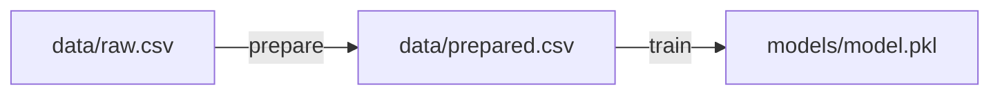
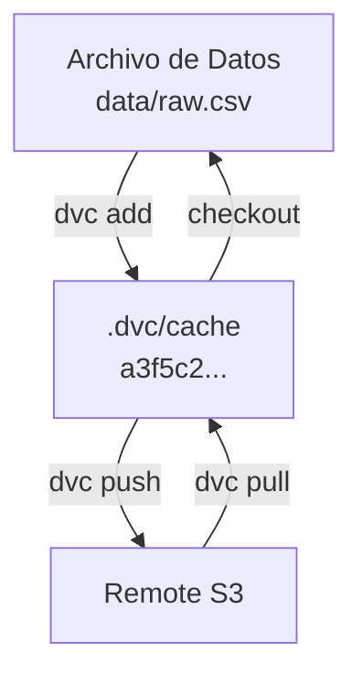

# 🗂️ Versionado de Datos con DVC

En ML, el código es solo una parte del estado del sistema. Los datos evolucionan constantemente: nuevas muestras, correcciones de etiquetas, cambios de distribución. Git no puede versionar eficientemente archivos de gran tamaño (CSV, Parquet, imágenes binarias). Aquí es donde DVC (Data Version Control) se convierte en una pieza crítica de la infraestructura de MLOps.

DVC extiende Git para manejar datasets, modelos y pipelines de ML de manera eficiente, utilizando un sistema de cache y referencias (punteros) en lugar de almacenar blobs binarios en el repositorio.

---

## 1. ¿Qué es DVC?

DVC es una herramienta de línea de comandos que permite:

- Versionar datasets y modelos grandes junto con el código.
- Definir pipelines reproducibles mediante archivos YAML.
- Gestionar almacenamiento remoto (S3, GCS, Azure, HDFS, local).
- Rastrear dependencias y salidas entre etapas del pipeline.

La fórmula fundamental de reproducibilidad con DVC es:

$$
\text{Pipeline Reproducible} \iff \forall s \in \text{Stages}, \text{Hash}(\text{deps}_s) + \text{Hash}(\text{code}_s) \rightarrow \text{Output}_s
$$

Donde cada stage se re-ejecuta únicamente si sus dependencias o código cambian.

---

## 2. Pipeline DVC (`dvc.yaml`)

El archivo `dvc.yaml` define el grafo de ejecución:

```yaml
stages:
  prepare:
    cmd: python src/prepare.py --input data/raw.csv --output data/prepared.csv
    deps:
      - src/prepare.py
      - data/raw.csv
    outs:
      - data/prepared.csv
  
  train:
    cmd: python src/train.py --input data/prepared.csv --model models/model.pkl
    deps:
      - src/train.py
      - data/prepared.csv
    outs:
      - models/model.pkl
    params:
      - train.n_estimators
      - train.max_depth
```




---

## 3. Stages, Dependencies y Outputs

- **Stage:** Tarea atómica del pipeline (preparación, entrenamiento, evaluación).
- **Dependency (deps):** Archivos o parámetros que, si cambian, invalidan el caché del stage.
- **Output (outs):** Artefactos generados por el stage, automáticamente añadidos a DVC.

Cuando ejecutas:

```bash
dvc repro
```

DVC recalcula el hash de cada dependencia. Si coincide con el caché, el stage se salta (incremental build).

---

## 4. Remotes (S3, GCS, Local)

Configurar un remote permite compartir datos y modelos con el equipo:

```bash
# Añadir remote S3
dvc remote add -d myremote s3://mybucket/dvcstore

# Subir datos
dvc push

# Descargar datos en otro clon
dvc pull
```

| Remote Type | Comando de ejemplo | Ideal para |
|-------------|-------------------|------------|
| Local | `dvc remote add myremote /mnt/shared/dvcstore` | Desarrollo en red local |
| S3 | `dvc remote add myremote s3://bucket/path` | Producción AWS |
| GCS | `dvc remote add myremote gs://bucket/path` | Producción GCP |
| Azure | `dvc remote add myremote azure://container/path` | Producción Azure |

---

## 5. Comparativa: DVC vs Git LFS

| Característica | DVC | Git LFS |
|----------------|-----|---------|
| Tamaño máximo de archivo | Ilimitado (stream a remote) | Limitado por memoria del cliente LFS |
| Pipelines reproducibles | ✅ Nativo | ❌ No soporta |
| Cache eficiente (deduplicación) | ✅ | ❌ |
| Versionado de datos + código | Referencias en Git, datos en remote | Referencias en Git, datos en LFS server |
| Parámetros de ML | Integrado (`params.yaml`) | ❌ |

Caso real: La empresa Iterative (creadora de DVC) reporta que equipos de visión por computadora reducen el tiempo de sincronización de datasets en un 70% al migrar de sistemas ad-hoc (copias manuales en NAS) a DVC con remotes S3.

---

## 6. Reproducibilidad de Pipelines

La reproducibilidad completa requiere versionar:

1. Código (Git).
2. Datos (DVC).
3. Parámetros (`params.yaml`).
4. Entorno (`requirements.txt`, Docker image).

DVC genera archivos `.dvc` y `dvc.lock` que capturan los hashes exactos:

```yaml
# dvc.lock (fragmento)
stages:
  prepare:
    cmd: python src/prepare.py ...
    deps:
      - path: data/raw.csv
        hash: md5
        md5: a3f5c2...
    outs:
      - path: data/prepared.csv
        hash: md5
        md5: b7e1d9...
```

---

## 7. Cache de Datos

DVC mantiene un caché local en `.dvc/cache`. Los archivos se almacenan por contenido (hash MD5), permitiendo deduplicación automática. Si un dataset de 10 GB tiene un cambio mínimo, solo el nuevo chunk se almacena.

Configuración del caché:

```bash
dvc cache dir /mnt/fast_ssd/dvc_cache
```

### Diagrama del Cache y Remote



---

## 8. `dvc metrics` y `dvc params`

Visualiza métricas y parámetros desde la línea de comandos:

```bash
# Mostrar métricas
dvc metrics show

# Comparar entre commits
dvc metrics diff

# Mostrar parámetros
dvc params diff
```

Integra esto en CI/CD para fallar builds si la métrica de validación cae por debajo de un umbral.

---

## Código con Pipeline Versionado

```python
# src/train.py
import yaml
import pickle
import pandas as pd
from sklearn.model_selection import train_test_split
from sklearn.ensemble import RandomForestClassifier
from sklearn.metrics import accuracy_score

# Cargar parámetros
with open("params.yaml") as f:
    params = yaml.safe_load(f)["train"]

# Cargar datos
df = pd.read_csv("data/prepared.csv")
X = df.drop("target", axis=1)
y = df["target"]

X_train, X_test, y_train, y_test = train_test_split(
    X, y, test_size=params["test_size"], random_state=params["random_state"]
)

# Entrenar
clf = RandomForestClassifier(
    n_estimators=params["n_estimators"],
    max_depth=params["max_depth"]
)
clf.fit(X_train, y_train)

# Evaluar
acc = accuracy_score(y_test, clf.predict(X_test))

# Guardar modelo
with open("models/model.pkl", "wb") as f:
    pickle.dump(clf, f)

print(f"Modelo entrenado. Accuracy: {acc:.4f}")
```

Archivos auxiliares:

`params.yaml`
```yaml
train:
  n_estimators: 200
  max_depth: 15
  test_size: 0.2
  random_state: 42
```

---

## ⚠️ Advertencias

⚠️ **Advertencia:** Nunca hagas `git add` de archivos de datos grandes sin DVC. Esto corrompe el repositorio y hace clones imposibles.

⚠️ **Advertencia:** Si cambias el remote, asegúrate de que todo el equipo ejecute `dvc pull` antes de `dvc repro` para evitar recomputar stages innecesariamente.

## 💡 Tips

💡 **Tip:** Usa `dvc run -n stage_name ...` para crear stages inicialmente, luego edita `dvc.yaml` manualmente para mayor claridad.

💡 **Tip:** Combina DVC con CML (Continuous Machine Learning) para ejecutar pipelines en CI/CD y reportar métricas automáticamente en pull requests.

---

## 📦 Código de Compresión

```bash
# Inicializar y ejecutar pipeline mínimo
dvc init
dvc run -n train -d data/prepared.csv -d src/train.py -o models/model.pkl python src/train.py
git add dvc.yaml dvc.lock .gitignore
dvc push
```

```python
# src/train_minimal.py
import pandas as pd, pickle, yaml
from sklearn.ensemble import RandomForestClassifier

params = yaml.safe_load(open("params.yaml"))["train"]
df = pd.read_csv("data/prepared.csv")
X, y = df.drop("target", axis=1), df["target"]
m = RandomForestClassifier(n_estimators=params["n_estimators"]).fit(X, y)
pickle.dump(m, open("models/model.pkl", "wb"))
```
