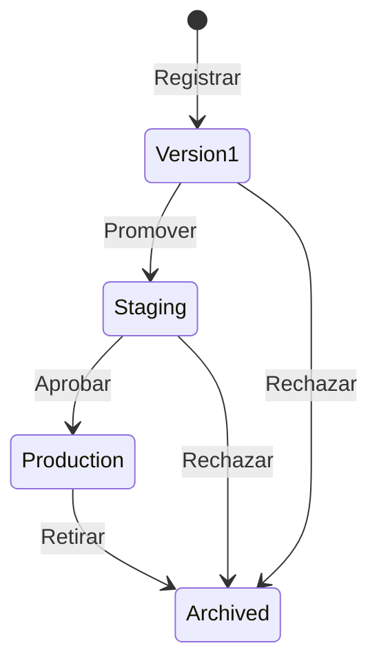
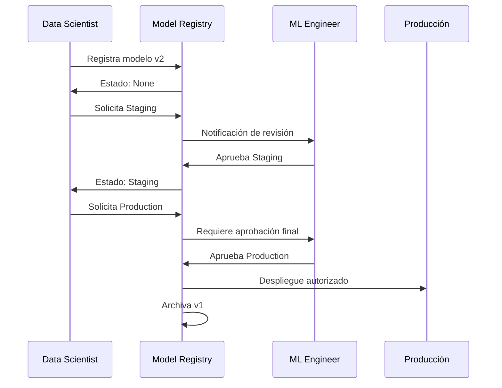

# 🏛️ Model Registry y Lifecycle

Un modelo entrenado no es un artefacto estático; es un activo que evoluciona a través de múltiples versiones, validaciones y estados operativos. El Model Registry proporciona la infraestructura para gobernar este ciclo de vida, asegurando que solo modelos validados y aprobados lleguen a producción.

MLflow Model Registry es una de las soluciones open-source más adoptadas para este propósito, integrándose nativamente con MLflow Tracking.

---

## 1. MLflow Model Registry

El Registry es un repositorio centralizado donde cada modelo se registra con:

- **Nombre:** Identificador único del modelo (ej. `sklearn_iris_classifier`).
- **Version:** Entero secuencial (1, 2, 3...).
- **Stage:** Estado del ciclo de vida (None, Staging, Production, Archived).
- **Source Run:** Run de tracking que generó el modelo.




---

## 2. Versiones y Stages

El flujo estándar de transición es:

$$
\text{None} \xrightarrow{\text{registro}} \text{Staging} \xrightarrow{\text{validación}} \text{Production} \xrightarrow{\text{deprecación}} \text{Archived}
$$

| Stage | Propósito |
|-------|-----------|
| **None** | Modelo recién registrado, no validado. |
| **Staging** | Modelo candidato para pruebas A/B o shadow. |
| **Production** | Modelo activo sirviendo predicciones en producción. |
| **Archived** | Modelo obsoleto, conservado por auditoría. |

Cada cambio de stage puede requerir aprobación según la configuración del servidor.

---

## 3. Transiciones y Approval Process

En MLflow, las transiciones se gestionan mediante la API o UI:

```python
from mlflow.tracking import MlflowClient

client = MlflowClient()

# Transicionar a Staging
client.transition_model_version_stage(
    name="sklearn_iris_classifier",
    version=2,
    stage="Staging"
)

# Transicionar a Production (requiere descripción)
client.transition_model_version_stage(
    name="sklearn_iris_classifier",
    version=2,
    stage="Production",
    archive_existing_versions=True  # Archiva versiones previas en Production
)
```

Para entornos empresariales, se recomienda implementar un hook de aprobación (ej. mediante un servicio externo o políticas de IAM) antes de permitir la transición a Production.

Caso real: En Uber, el registro de modelos de demanda (fare prediction) requiere aprobación de un Data Scientist y un ML Engineer antes de pasar a Production, con un registro de auditoría inmutable en su plataforma Michelangelo (concepto análogo a MLflow Registry).

### Diagrama de Approval Workflow



---

## 4. Model Signatures

Las signatures definen el esquema de entrada y salida del modelo, previniendo errores de inferencia por cambios en el formato de datos:

```python
import mlflow
from mlflow.models.signature import infer_signature
from sklearn.datasets import load_iris

X, y = load_iris(return_X_y=True)
signature = infer_signature(X, y)

with mlflow.start_run():
    mlflow.sklearn.log_model(
        sk_model=clf,
        artifact_path="model",
        signature=signature,
        input_example=X[:5]
    )
```

La signature se almacena como `model/MLmodel`:

```yaml
signature:
  inputs: '[{"type": "tensor", "tensor-spec": {"dtype": "float64", "shape": [-1, 4]}}]'
  outputs: '[{"type": "tensor", "tensor-spec": {"dtype": "int64", "shape": [-1]}}]'
```

⚠️ **Advertencia:** Sin signature, un modelo puede desplegarse con un servicio que espera columnas en orden diferente, generando predicciones silenciosamente incorrectas.

---

## 5. Comparativa: MLflow vs AWS SageMaker Model Registry

| Característica | MLflow Model Registry | AWS SageMaker Model Registry |
|----------------|----------------------|------------------------------|
| Costo | Open source / gratuito | Pago por uso (AWS) |
| Multi-cloud | ✅ (cloud-agnostic) | ❌ (AWS only) |
| Integración con tracking | Nativa (MLflow) | Nativa (SageMaker Experiments) |
| Aprobaciones personalizadas | Mediante webhooks/API | Mediante SageMaker Projects |
| Lineage de datos | Parcial (vía runs) | Integrado con SageMaker Lineage |
| Despliegue directo | Requiere orquestación externa | Integrado con SageMaker Endpoints |

---

## 6. Versionado Semántico de Modelos

Aunque MLflow usa versionado entero automático, muchos equipos adoptan versionado semántico (SemVer) a nivel conceptual:

| Versión MLflow | Versión SemVer | Significado |
|----------------|----------------|-------------|
| 1 | 1.0.0 | Primer modelo estable en producción. |
| 2 | 1.1.0 | Mejora de rendimiento (mismo algoritmo, nuevos datos). |
| 3 | 2.0.0 | Cambio de arquitectura (ej. RandomForest → XGBoost). |

Para implementar esto, utiliza tags del registry:

```python
client.set_model_version_tag(
    name="sklearn_iris_classifier",
    version=3,
    key="semver",
    value="2.0.0"
)
```

---

## Código con Registry

```python
import mlflow
from mlflow.tracking import MlflowClient

mlflow.set_tracking_uri("http://localhost:5000")

def register_and_promote(run_id, model_name):
    # Registrar modelo
    model_uri = f"runs:/{run_id}/model"
    mv = mlflow.register_model(model_uri, model_name)
    
    client = MlflowClient()
    
    # Esperar a que el estado del registro sea READY
    import time
    for _ in range(10):
        version = client.get_model_version(model_name, mv.version)
        if version.status == "READY":
            break
        time.sleep(1)
    
    # Promover a Production
    client.transition_model_version_stage(
        name=model_name,
        version=mv.version,
        stage="Production",
        archive_existing_versions=True
    )
    print(f"Modelo {model_name} v{mv.version} promovido a Production.")

# Uso
# register_and_promote("abc123...", "sklearn_iris_classifier")
```

---

## ⚠️ Advertencias

⚠️ **Advertencia:** `archive_existing_versions=True` en Production puede interrumpir servicios que referencian versiones antiguas por ID numérico. Usa siempre alias o nombres de stage en tus servicios de inferencia.

⚠️ **Advertencia:** Las transiciones de stage no son transacciones distribuidas. Si tu pipeline de CI/CD falla después de la transición, el modelo puede quedar en Production sin despliegue efectivo. Implementa rollback automático.

## 💡 Tips

💡 **Tip:** Usa el alias "Champion" para la versión en Production y "Challenger" para la candidata en Staging. Esto facilita la lógica de enrutamiento en tu servicio de inferencia.

💡 **Tip:** Programa un job periódico que archive modelos antiguos (ej. > 6 meses) para reducir costos de almacenamiento en el artifact store.

---

## 📦 Código de Compresión

```python
import mlflow
from mlflow.tracking import MlflowClient

def registry_minimal(run_id: str, name: str):
    mv = mlflow.register_model(f"runs:/{run_id}/model", name)
    client = MlflowClient()
    client.transition_model_version_stage(name, mv.version, "Production", archive_existing_versions=True)
    return mv.version

# Ejemplo
# version = registry_minimal("a1b2c3d4", "my_model")
```
