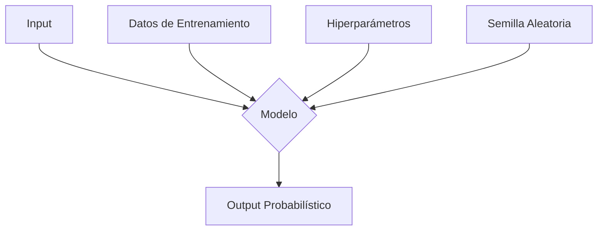
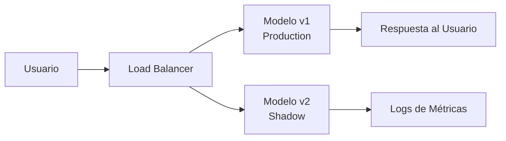

# 🧪 Testing de Machine Learning

El testing en ML difiere radicalmente del testing de software tradicional. Mientras que una función `sum(a, b)` siempre debe devolver `a+b`, un modelo de ML produce salidas probabilísticas que dependen de datos no deterministas. Esto exige un enfoque de validación multidimensional: datos, modelo, integración y comportamiento en producción.

La calidad de un sistema de ML no se mide únicamente por la accuracy en test, sino por su robustez ante datos corruptos, cambios de distribución y sesgos ocultos.

---

## 1. Testing Tradicional vs ML

| Dimensión | Software Tradicional | Machine Learning |
|-----------|---------------------|------------------|
| Especificación | Requisitos funcionales claros | Especificación implícita en los datos |
| Determinismo | Output fijo para input dado | Output probabilístico |
| Fallos | Bugs lógicos (crash, excepciones) | Degradación silenciosa (drift, overfitting) |
| Cobertura ideal | Cobertura de código (code coverage) | Cobertura de comportamiento (scenario coverage) |
| Entorno | Controlado (unit tests) | Datos del mundo real impredecibles |




---

## 2. Data Tests

Antes de entrenar, valida la calidad y consistencia de tus datos.

### Great Expectations

```python
import great_expectations as gx

context = gx.get_context()
datasource = context.sources.add_pandas("my_datasource")
data_asset = datasource.add_csv_asset("my_asset", filepath_or_buffer="data.csv")

batch_request = data_asset.build_batch_request()
validator = context.get_validator(
    batch_request=batch_request,
    expectation_suite_name="my_suite"
)

validator.expect_column_values_to_not_be_null("feature_1")
validator.expect_column_values_to_be_between("feature_2", min_value=0, max_value=100)
validator.expect_table_row_count_to_be_between(min_value=1000, max_value=10000)

validator.save_expectation_suite(discard_failed_expectations=False)
```

### Pandera

```python
import pandera as pa
import pandas as pd
from pandera.typing import DataFrame, Series

class InputSchema(pa.DataFrameModel):
    feature_1: Series[float] = pa.Field(nullable=False, ge=0, le=100)
    feature_2: Series[str] = pa.Field(isin=["A", "B", "C"])
    target: Series[int] = pa.Field(ge=0, le=1)

df = pd.read_csv("data.csv")
validated_df = InputSchema.validate(df)
```

Caso real: Airbnb ejecuta validaciones de Great Expectations en sus pipelines ETL de listados. Detectaron que un cambio en el scraper de propiedades introdujo valores nulos en el campo `price` antes de que el modelo de pricing recomendara tarifas erróneas.

---

## 3. Model Tests

Validan propiedades del comportamiento del modelo, no solo métricas agregadas.

### Invariance Test

El output no debe cambiar ante transformaciones irrelevantes:

```python
def test_invariance_scaler():
    X_base, y = load_test_data()
    pred_base = model.predict(X_base)
    
    # Escalar una feature no debería afectar (si el modelo es invariante a escala, ej. árbol)
    # O si aplicamos standard scaler, el resultado debe ser idéntico
    scaler = StandardScaler()
    X_scaled = scaler.fit_transform(X_base)
    pred_scaled = model.predict(X_scaled)
    
    # Para modelos lineales con scaler entrenado, deberían ser iguales
    assert np.allclose(pred_base, pred_scaled)
```

### Directional Test

Un cambio en una feature debe mover la predicción en la dirección esperada:

```python
def test_directional_income():
    # Mayor ingreso debería aumentar probabilidad de aprobación de crédito
    X_low = np.array([[25, 30000, 2]])
    X_high = np.array([[25, 90000, 2]])
    
    prob_low = model.predict_proba(X_low)[0][1]
    prob_high = model.predict_proba(X_high)[0][1]
    
    assert prob_high > prob_low
```

### Minimum Functionality Test

El modelo debe clasificar correctamente casos obvios:

```python
def test_minimum_functionality():
    # Un cliente con ingreso extremadamente alto y sin deudas debe ser aprobado
    X = np.array([[60, 500000, 0]])
    pred = model.predict(X)
    assert pred[0] == 1
```

---

## 4. Integration Tests para Pipelines

Validan que todo el flujo (preprocesamiento + modelo) funcione en conjunto:

```python
def test_pipeline_end_to_end():
    raw_data = {
        "age": 30,
        "income": 50000,
        "debt_ratio": 0.2
    }
    
    # Simular llamada al servicio de inferencia
    response = client.post("/predict", json=raw_data)
    
    assert response.status_code == 200
    assert "prediction" in response.json()
    assert response.json()["prediction"] in [0, 1]
```

---

## 5. Shadow Testing

Despliega el nuevo modelo en paralelo al modelo actual, enviando tráfico real pero sin exponer sus predicciones:



Caso real: Netflix realiza shadow testing de sus modelos de recomendación. El modelo en shadow recibe las mismas solicitudes que el modelo productivo, permitiendo comparar métricas de engagement offline antes de exponer a los usuarios a nuevas recomendaciones.

---

## 6. Flaky Tests en ML

Un test flaky es aquel que pasa o falla de manera no determinista. En ML, las causas comunes son:

- **Semillas aleatorias no fijadas.**
- **Datos de test que cambian entre ejecuciones.**
- **Condiciones de carrera en pipelines paralelos.**

Mitigación:

```python
import numpy as np
import random
import tensorflow as tf

def set_seeds(seed=42):
    random.seed(seed)
    np.random.seed(seed)
    tf.random.set_seed(seed)
```

---

## 7. Cobertura de Tests

La cobertura de código tradicional ($C$) se define como:

$$
C = \frac{\text{Líneas ejecutadas por tests}}{\text{Líneas totales}} \times 100
$$

En ML, es insuficiente. Propongamos una métrica de **cobertura de escenarios** ($S$):

$$
S = \frac{\text{Escenarios de datos validados}}{\text{Escenarios de datos esperados}} \times 100
$$

Donde un escenario incluye: datos nulos, outliers, clases desbalanceadas, drift, etc.

| Tipo de Test | Herramientas | Frecuencia |
|--------------|--------------|------------|
| Unit tests (utils) | pytest | Cada commit |
| Data tests | pandera, Great Expectations | Cada cambio de datos |
| Model tests | pytest-ml, custom | Cada entrenamiento |
| Integration tests | pytest + requests | Cada despliegue |
| Shadow tests | Istio/Envoy + logging | Continuo |

---

## Código con Tests de Modelo

```python
# tests/test_model.py
import pytest
import numpy as np
from sklearn.datasets import load_iris
from sklearn.model_selection import train_test_split
from sklearn.ensemble import RandomForestClassifier
import pickle

@pytest.fixture
def model():
    with open("models/model.pkl", "rb") as f:
        return pickle.load(f)

@pytest.fixture
def data():
    X, y = load_iris(return_X_y=True)
    return train_test_split(X, y, test_size=0.2, random_state=42)

def test_model_accuracy(model, data):
    X_train, X_test, y_train, y_test = data
    acc = model.score(X_test, y_test)
    assert acc > 0.85, f"Accuracy demasiado bajo: {acc}"

def test_prediction_shape(model, data):
    X_train, X_test, y_train, y_test = data
    preds = model.predict(X_test)
    assert preds.shape == y_test.shape

def test_invariance_permutation(model, data):
    # Permutar columnas (si el modelo es un árbol, no debería importar el orden de features?)
    # En realidad, para RF el orden sí importa. Este es un ejemplo conceptual.
    X_train, X_test, y_train, y_test = data
    pred_orig = model.predict(X_test)
    # Este test es ilustrativo; en producción, valida propiedades reales de tu modelo
    assert len(pred_orig) == len(y_test)
```

---

## ⚠️ Advertencias

⚠️ **Advertencia:** Un modelo con 99% de accuracy en test puede fallar catastróficamente en producción si los datos de entrada violan las expectativas de preprocesamiento. Los data tests son más críticos que los model tests.

⚠️ **Advertencia:** Los tests de integración que dependen de servicios externos (ej. base de datos de features) deben usar mocks o entornos efímeros (testcontainers) para evitar side effects.

## 💡 Tips

💡 **Tip:** Implementa un "contrato de datos" (data contract) entre el equipo de ingeniería de datos y el de ML. Pandera o Great Expectations pueden servir como la fuente única de verdad.

💡 **Tip:** Ejecuta tests de modelo con diferentes semillas aleatorias (ej. 10 seeds distintas) para detectar varianza excesiva en el rendimiento.

---

## 📦 Código de Compresión

```python
# tests_minimal.py
import pickle, numpy as np
from sklearn.datasets import load_iris
from sklearn.metrics import accuracy_score

model = pickle.load(open("models/model.pkl", "rb"))
X, y = load_iris(return_X_y=True)
preds = model.predict(X)
assert accuracy_score(y, preds) > 0.90
assert preds.shape == y.shape
print("Tests pasados.")
```
