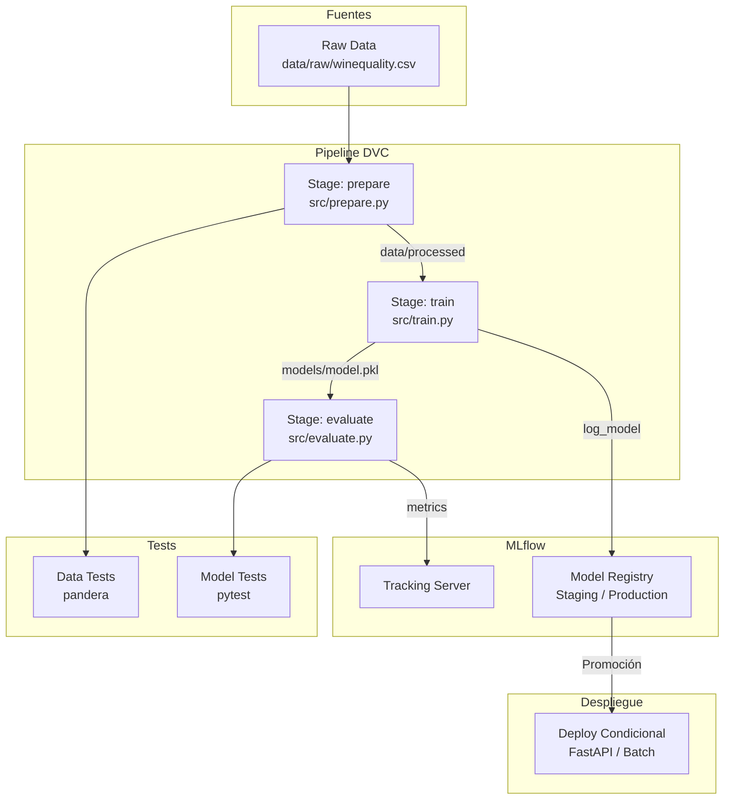
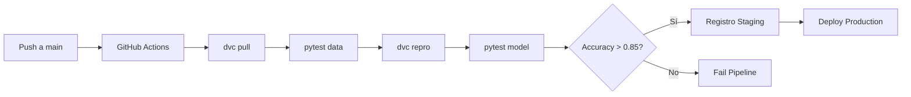

# 🎯 Caso Práctico: Pipeline de Entrenamiento Versionado

Este caso práctico integra todas las disciplinas vistas en el curso: tracking de experimentos (MLflow), versionado de datos (DVC), gestión del ciclo de vida de modelos (Model Registry) y testing de ML. El objetivo es construir un pipeline end-to-end reproducible, auditable y desplegable automáticamente.

---

## 1. Descripción del Proyecto

**Nombre:** Clasificador de Calidad de Vinos (Wine Quality Classifier)

**Dominio:** Industria vitivinícola / Retail de bebidas

**Problemática:** Una cadena de distribución de vinos necesita automatizar la clasificación de lotes en calidades "Alta", "Media" y "Baja" a partir de propiedades fisicoquímicas (acidez, pH, alcohol, azúcar residual). El modelo debe reentrenarse trimestralmente con nuevos lotes analizados en laboratorio.

**Objetivo:** Entregar un pipeline que, ante nuevos datos, entrene un modelo, valide su calidad mediante tests automáticos, registre métricas y artefactos, y despliegue condicionalmente a producción.

---

## 2. Requisitos

| ID | Requisito | Prioridad |
|----|-----------|-----------|
| R1 | Los datos de entrenamiento deben versionarse con DVC. | Alta |
| R2 | Cada entrenamiento debe loggearse en MLflow con parámetros, métricas y modelo. | Alta |
| R3 | El modelo debe pasar tests de calidad de datos (pandera) y tests de rendimiento mínimo. | Alta |
| R4 | Solo modelos con accuracy > 0.85 y sin drift de datos detectado pueden promoverse a Staging. | Media |
| R5 | La transición a Production requiere aprobación explícita vía API del Model Registry. | Media |
| R6 | El pipeline debe ser reproducible mediante `dvc repro` desde cualquier máquina con acceso al remote. | Alta |

---

## 3. Arquitectura




---

## 4. Dataset Versionado con DVC

```bash
# Inicializar DVC
dvc init

# Añadir dataset raw
dvc add data/raw/winequality.csv
git add data/raw/winequality.csv.dvc .gitignore

# Configurar remote S3 (ejemplo)
dvc remote add -d myremote s3://mlops-wine/dvcstore
dvc push
```

`dvc.yaml`
```yaml
stages:
  prepare:
    cmd: python src/prepare.py
    deps:
      - src/prepare.py
      - data/raw/winequality.csv
    outs:
      - data/processed/wine_train.csv
      - data/processed/wine_test.csv

  train:
    cmd: python src/train.py
    deps:
      - src/train.py
      - data/processed/wine_train.csv
    params:
      - train.max_depth
      - train.n_estimators
    outs:
      - models/model.pkl

  evaluate:
    cmd: python src/evaluate.py
    deps:
      - src/evaluate.py
      - models/model.pkl
      - data/processed/wine_test.csv
    metrics:
      - metrics.json:
          cache: false
```

---

## 5. Entrenamiento con Tracking Automático (MLflow)

`src/train.py`
```python
import os
import yaml
import pickle
import mlflow
import mlflow.sklearn
import pandas as pd
from sklearn.ensemble import RandomForestClassifier

mlflow.set_tracking_uri(os.getenv("MLFLOW_TRACKING_URI", "http://localhost:5000"))
mlflow.set_experiment("wine_quality_classifier")

with open("params.yaml") as f:
    params = yaml.safe_load(f)

with mlflow.start_run():
    # Log params
    for k, v in params["train"].items():
        mlflow.log_param(k, v)
    
    # Load data
    train_df = pd.read_csv("data/processed/wine_train.csv")
    X_train = train_df.drop("quality", axis=1)
    y_train = train_df["quality"]
    
    # Train
    clf = RandomForestClassifier(
        n_estimators=params["train"]["n_estimators"],
        max_depth=params["train"]["max_depth"],
        random_state=42
    )
    clf.fit(X_train, y_train)
    
    # Save model artifact
    with open("models/model.pkl", "wb") as f:
        pickle.dump(clf, f)
    
    mlflow.sklearn.log_model(clf, "model")
    print("Entrenamiento completado y trackeado.")
```

---

## 6. Registro en Model Registry

`src/register.py`
```python
import os
import json
import mlflow
from mlflow.tracking import MlflowClient

mlflow.set_tracking_uri(os.getenv("MLFLOW_TRACKING_URI", "http://localhost:5000"))

def register_if_passes(run_id: str, threshold: float = 0.85):
    with open("metrics.json") as f:
        metrics = json.load(f)
    
    accuracy = metrics.get("accuracy", 0)
    if accuracy < threshold:
        print(f"Accuracy {accuracy:.4f} inferior a {threshold}. Registro cancelado.")
        return False
    
    model_uri = f"runs:/{run_id}/model"
    mv = mlflow.register_model(model_uri, "wine_quality_classifier")
    
    client = MlflowClient()
    client.transition_model_version_stage(
        name="wine_quality_classifier",
        version=mv.version,
        stage="Staging"
    )
    print(f"Modelo registrado en Staging (v{mv.version}).")
    return True

# Uso típico en CI/CD
# register_if_passes(os.getenv("MLFLOW_RUN_ID"))
```

---

## 7. Tests de Calidad de Datos

`tests/test_data.py`
```python
import pytest
import pandas as pd
import pandera as pa
from pandera.typing import Series

class WineSchema(pa.DataFrameModel):
    fixed_acidity: Series[float] = pa.Field(nullable=False, ge=0)
    volatile_acidity: Series[float] = pa.Field(ge=0)
    alcohol: Series[float] = pa.Field(ge=0, le=20)
    quality: Series[int] = pa.Field(ge=3, le=9)

def test_train_data_schema():
    df = pd.read_csv("data/processed/wine_train.csv")
    WineSchema.validate(df)

def test_no_duplicate_rows():
    df = pd.read_csv("data/processed/wine_train.csv")
    assert not df.duplicated().any(), "El dataset contiene filas duplicadas"

def test_class_distribution():
    df = pd.read_csv("data/processed/wine_train.csv")
    counts = df["quality"].value_counts(normalize=True)
    assert counts.max() < 0.8, "Distribución de clases demasiado desbalanceada"
```

---

## 8. Despliegue Condicional

`src/deploy.py`
```python
import os
import requests
from mlflow.tracking import MlflowClient

MLFLOW_URI = os.getenv("MLFLOW_TRACKING_URI", "http://localhost:5000")
client = MlflowClient(tracking_uri=MLFLOW_URI)

def deploy_production(model_name: str = "wine_quality_classifier"):
    versions = client.get_latest_versions(model_name, stages=["Staging"])
    if not versions:
        print("No hay modelo en Staging.")
        return
    
    latest = versions[0]
    
    # Validaciones adicionales podrían ir aquí (A/B test, shadow)
    client.transition_model_version_stage(
        name=model_name,
        version=latest.version,
        stage="Production",
        archive_existing_versions=True
    )
    
    # Notificar al servicio de inferencia (ej. FastAPI reload)
    requests.post("http://inference-service:8080/reload", json={"model_version": latest.version})
    print(f"Modelo v{latest.version} desplegado a Production.")

if __name__ == "__main__":
    deploy_production()
```

---

## 9. Métricas de Éxito

El éxito del proyecto se mide mediante:

| Métrica | Definición | Umbral |
|---------|-----------|--------|
| **Reproducibilidad** | Capacidad de reconstruir el pipeline en < 10 min desde un nuevo clon. | 100% |
| **Tiempo de ciclo** | Tiempo desde nuevo dataset hasta modelo en Staging. | < 2 horas |
| **Accuracy en test** | Accuracy del modelo en hold-out set. | > 0.85 |
| **Cobertura de tests** | Porcentaje de stages con tests automatizados. | 100% |
| **Rollback time** | Tiempo para revertir a versión anterior en Production. | < 5 min |

---

## 🎯 Proyecto Documentado

### Estructura de Carpetas

```
wine-quality-mlops/
├── .dvc/
├── .github/
│   └── workflows/
│       └── pipeline.yml
├── data/
│   ├── raw/
│   │   └── winequality.csv.dvc
│   └── processed/
├── models/
│   └── model.pkl.dvc
├── src/
│   ├── prepare.py
│   ├── train.py
│   ├── evaluate.py
│   └── deploy.py
├── tests/
│   ├── test_data.py
│   └── test_model.py
├── dvc.yaml
├── params.yaml
├── requirements.txt
└── README.md
```

### Pipeline CI/CD (GitHub Actions)

```yaml
# .github/workflows/pipeline.yml
name: ML Pipeline

on:
  push:
    branches: [main]
  pull_request:
    branches: [main]

jobs:
  pipeline:
    runs-on: ubuntu-latest
    steps:
      - uses: actions/checkout@v3
      - uses: iterative/setup-dvc@v1
      
      - name: Setup Python
        uses: actions/setup-python@v4
        with:
          python-version: "3.10"
      
      - name: Install dependencies
        run: pip install -r requirements.txt
      
      - name: Pull data
        run: dvc pull
      
      - name: Run data tests
        run: pytest tests/test_data.py -v
      
      - name: Reproduce pipeline
        run: dvc repro
      
      - name: Run model tests
        run: pytest tests/test_model.py -v
      
      - name: Register model
        if: github.ref == 'refs/heads/main'
        run: python src/register.py
        env:
          MLFLOW_TRACKING_URI: ${{ secrets.MLFLOW_TRACKING_URI }}
```

### Comandos Esenciales

| Comando | Descripción |
|---------|-------------|
| `dvc repro` | Ejecuta el pipeline completo de forma incremental. |
| `mlflow ui` | Lanza la interfaz de tracking local. |
| `pytest tests/` | Ejecuta la batería de tests. |
| `dvc push` | Sincroniza datos y modelos con el remote. |

### Diagrama del Flujo CI/CD



Caso real: La bodega "Viña del Futuro" (ficticia para este ejemplo) implementó este pipeline y redujo el tiempo de puesta en producción de nuevos modelos de 3 semanas a 2 horas, eliminando errores manuales de despliegue y garantizando trazabilidad regulatoria ante la DGI (Dirección General de Industria Alimentaria).

---

## ⚠️ Advertencias

⚠️ **Advertencia:** No expongas el puerto de MLflow UI directamente a Internet sin autenticación. Utiliza un reverse proxy (nginx/traefik) con OAuth2 o IP whitelisting.

⚠️ **Advertencia:** El dataset `winequality.csv` puede contener sesgos geográficos (vinos de una sola región). Documenta las limitaciones de generalización en el README del proyecto.

## 💡 Tips

💡 **Tip:** Configura alertas en MLflow (o vía webhook) cuando la métrica de validación cae más de un 5% respecto al modelo en Production. Esto puede ser indicio temprano de data drift.

💡 **Tip:** Utiliza `dvc metrics diff` en los pull requests para mostrar automáticamente cómo cambian las métricas entre versiones de datos.

---

## 📦 Código de Compresión

```bash
# One-liner para ejecutar todo el pipeline
dvc pull && pytest tests/test_data.py && dvc repro && pytest tests/test_model.py && python src/register.py && python src/deploy.py
```

```python
# src/run_all.py (orquestación mínima)
import subprocess

commands = [
    "dvc pull",
    "pytest tests/test_data.py",
    "dvc repro",
    "pytest tests/test_model.py",
    "python src/register.py",
    "python src/deploy.py"
]

for cmd in commands:
    result = subprocess.run(cmd, shell=True)
    if result.returncode != 0:
        print(f"Fallo en: {cmd}")
        break
else:
    print("Pipeline completado exitosamente.")
```
