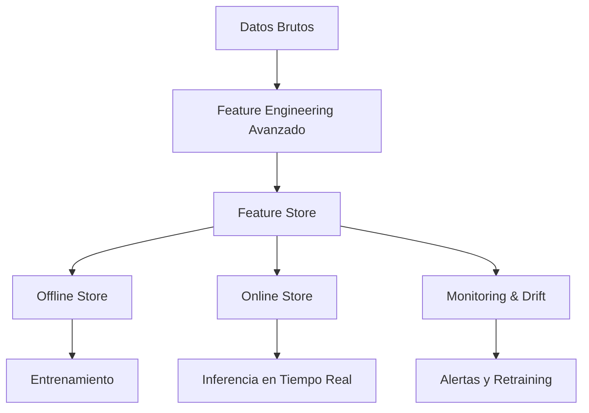

# 🎓 Bienvenida a Feature Engineering y Feature Stores

La ingeniería de características y su gestión centralizada mediante *feature stores* constituyen uno de los pilares fundamentales del ML/AI Engineering moderno. Mientras que los algoritmos capturan patrones, son las features —representaciones estructuradas de los datos brutos— las que determinan el techo de precisión de cualquier modelo. En entornos de producción, la capacidad de compartir, versionar y servir features de forma consistente entre entrenamiento e inferencia es crítica para escalar operaciones de machine learning.


## 1. Propósito del Curso

Este módulo tiene como meta transformar al estudiante en un especialista capaz de diseñar pipelines de features robustos, implementar arquitecturas de feature stores y monitorear la salud de las características en tiempo real. No se trata solo de crear columnas nuevas, sino de gobernar su ciclo de vida completo.


## 2. Estructura del Módulo

A continuación se presenta el índice de notas que componen este curso:

| Nota | Título | Descripción | Enlace |
|------|--------|-------------|--------|
| 01 | Feature Engineering Avanzado | Técnicas de transformación numérica, categórica, temporal y textual | [[01 - Feature Engineering Avanzado]] |
| 02 | Feature Stores (Feast, Tecton) | Arquitectura y herramientas líderes de almacenamiento de features | [[02 - Feature Stores (Feast, Tecton)]] |
| 03 | Online vs Offline Features | Diferencias, sincronización y point-in-time correctness | [[03 - Online vs Offline Features]] |
| 04 | Feature Monitoring y Drift | Detección de degradación estadística y estrategias de mitigación | [[04 - Feature Monitoring y Drift]] |
| 05 | Caso Práctico - Feature Store para E-commerce | Proyecto integrador de recomendación en comercio electrónico | [[05 - Caso Practico - Feature Store para E-commerce]] |


## 3. Glosario

A lo largo del curso se emplearán los siguientes términos técnicos:

- **Feature engineering**: Proceso de creación, selección y transformación de variables a partir de datos brutos para maximizar el rendimiento predictivo de un modelo.
- **Feature store**: Sistema de gestión de características que centraliza el almacenamiento, versionado y servicio de features para entrenamiento e inferencia.
- **Feast**: Plataforma open-source de feature store diseñada para operar sobre data lakes y bases de datos transaccionales.
- **Tecton**: Solución comercial (SaaS) de feature store orientada a la colaboración entre ingenieros de datos y científicos de ML en entornos enterprise.
- **Online feature**: Característica servida en milisegundos para predicción en tiempo real, típicamente almacenada en bases de datos de baja latencia.
- **Offline feature**: Característica computada sobre grandes volúmenes históricos de datos, utilizada para entrenamiento y batch scoring.
- **Feature drift**: Cambio en la distribución estadística de una característica a lo largo del tiempo, lo que puede degradar la performance del modelo.
- **Point-in-time correctness**: Propiedad que garantiza que las features utilizadas en el entrenamiento reflejen únicamente información disponible hasta el momento de la etiqueta, evitando data leakage.
- **Entity**: Entidad de negocio (por ejemplo, `user_id`, `product_id`) sobre la cual se agrupan y computan features.
- **Feature view**: Definición lógica en Feast que vincula entidades, fuentes de datos y transformaciones para generar un conjunto de features.
- **Transformation**: Operación matemática o lógica aplicada sobre datos brutos para derivar una feature (agregaciones, codificaciones, etc.).
- **Monitoring**: Conjunto de procesos, métricas y alertas destinados a observar la calidad, latencia y drift de las features en producción.


## 4. Objetivos de Aprendizaje

Al finalizar este curso, serás capaz de:

1. Diseñar pipelines de feature engineering avanzados que integren transformaciones numéricas, categóricas y temporales sin introducir leakage.
2. Arquitectar e implementar un feature store sobre Feast, definiendo entidades, feature views y fuentes de datos.
3. Diferenciar entre servicio de features online y offline, garantizando point-in-time correctness en datasets de entrenamiento.
4. Detectar y mitigar feature drift mediante pruebas estadísticas (KS, PSI, KL divergence) en entornos de producción.
5. Desplegar un caso práctico end-to-end de feature store para un sistema de recomendación de e-commerce.


## 5. Mapa Conceptual del Módulo




## 6. Recursos Visuales

A continuación se presentan recursos ilustrativos que contextualizan el ecosistema de MLOps y feature stores:


*Figura 1: Flujo general del aprendizaje automático. Fuente: Wikimedia Commons.*


*Figura 2: Símbolo representativo de inteligencia artificial. Fuente: Wikimedia Commons.*


## 7. Próximos Pasos

Te recomendamos iniciar con la [[01 - Feature Engineering Avanzado]] para consolidar las bases de transformación antes de abordar la arquitectura de feature stores.

💡 *Tip*: Mantén siempre un cuaderno de experimentos donde registres cada transformación aplicada y su impacto en la métrica objetivo.

📦 Código de compresión:

```python
# Resumen de imports utilizados en el módulo
import pandas as pd
import numpy as np
from sklearn.preprocessing import StandardScaler, MinMaxScaler, OneHotEncoder
from sklearn.compose import ColumnTransformer
from sklearn.pipeline import Pipeline
import feast
from feast import Entity, Feature, FeatureView, ValueType, FileSource
import great_expectations as ge
```


*Fin de la nota de bienvenida. Continúa en [[01 - Feature Engineering Avanzado]].*
