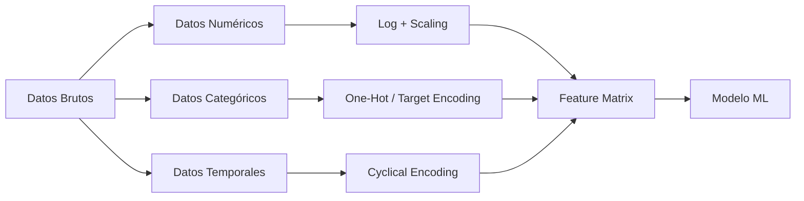

# 🔧 Feature Engineering Avanzado

El feature engineering es el arte y la ciencia de moldear los datos brutos en representaciones que los algoritmos de ML puedan explotar eficientemente. En ingeniería de ML/AI, un pipeline de features bien diseñado no solo mejora la precisión, sino que reduce la complejidad del modelo, acelera el entrenamiento y facilita la interpretabilidad. Esta nota profundiza en técnicas avanzadas aplicables a datos numéricos, categóricos, temporales, textuales y en interacciones multicampo.


## 1. Transformaciones Numéricas

Las variables numéricas suelen requerir ajustes de escala, forma o discretización para cumplir con los supuestos de los modelos o para resaltar patrones no lineales.

### 1.1 Escalado y Normalización

El escalado es esencial cuando algoritmos sensibles a magnitudes (SVM, redes neuronales, regresión regularizada) consumen features de rangos heterogéneos.

**Min-Max Scaling** transforma los valores al intervalo $[0, 1]$:

$$x' = \frac{x - \min(X)}{\max(X) - \min(X)}$$

**Estandarización Z-score** centra la media en 0 y la varianza en 1:

$$z = \frac{x - \mu}{\sigma}$$

### 1.2 Transformaciones Logarítmicas y de Potencia

Para distribuciones sesgadas positivamente (ingresos, tiempos de sesión), la transformación logarítmica comprime la cola derecha:

$$x_{\text{log}} = \log(x + 1)$$

La transformación de Box-Cox generaliza esta idea mediante la búsqueda del exponente $\lambda$ que maximiza la normalidad:

$$
x_{\text{boxcox}} = 
\begin{cases}
\frac{x^\lambda - 1}{\lambda} & \lambda \neq 0 \\
\log(x) & \lambda = 0
\end{cases}
$$

### 1.3 Binning (Discretización)

El binning convierte una variable continua en categórica ordinal, lo que puede capturar no linealidades y reducir el efecto de outliers:

- **Equal-width**: divide el rango en $k$ intervalos de igual tamaño.
- **Quantile-based**: asigna a cada bin aproximadamente el mismo número de muestras.
- **Clustering (K-means)**: utiliza centroides para definir fronteras naturales.

| Técnica | Ventaja | Desventaja |
|---------|---------|------------|
| Equal-width | Simple, rápido | Sensible a outliers |
| Quantile | Distribución uniforme | Puede perder separabilidad en densidades altas |
| K-means | Adaptativo a la distribución | Costoso computacionalmente |

Caso real: En un modelo de predicción de churn para telecomunicaciones, la variable `monthly_charges` presentaba una cola larga hacia valores altos. Aplicar $\log(x+1)$ mejoró el AUC en un 3.2 % respecto a la escala original.

⚠️ **Advertencia**: No aplique escalado antes de dividir en entrenamiento y validación. El escalado debe ajustarse únicamente sobre el conjunto de entrenamiento para evitar data leakage.


## 2. Transformaciones Categóricas

Las variables categóricas codifican información cualitativa que debe traducirse a representaciones numéricas sin introducir orden espurio.

### 2.1 One-Hot Encoding (OHE)

Para variables nominales de baja cardinalidad ($k \leq 10-15$), OHE genera vectores binarios:

$$\mathbf{v}_i \in \{0,1\}^k, \quad \sum_{j=1}^{k} v_{i,j} = 1$$

### 2.2 Target Encoding (Mean Encoding)

Para alta cardinalidad (ciudades, IDs de producto), se reemplaza cada categoría por la media condicional de la variable objetivo, suavizada para evitar overfitting:

$$\hat{x}_i = \frac{\sum_{j \in D_i} y_j + \alpha \cdot \mu_{\text{global}}}{|D_i| + \alpha}$$

donde $D_i$ es el subconjunto de muestras de la categoría $i$, $\mu_{\text{global}}$ es la media global y $\alpha$ es el parámetro de suavizado.

### 2.3 Embeddings

En deep learning, los embeddings proyectan categorías de alta cardinalidad en un espacio denso de baja dimensionalidad $d \ll k$:

$$\mathbf{e}_i = \mathbf{W} \cdot \mathbf{v}_i, \quad \mathbf{W} \in \mathbb{R}^{d \times k}$$

La matriz $\mathbf{W}$ se aprende conjuntamente con la red neuronal.

Caso real: Netflix utiliza embeddings de usuarios y películas para reducir dimensionalidades de millones de IDs a vectores de 50-200 dimensiones, capturando relaciones latentes de gusto cinematográfico.

💡 **Tip**: Combine target encoding con cross-validation (ej. 5-fold) para calcular las medias sobre folds distintos al de entrenamiento, eliminando leakage.


## 3. Transformaciones Temporales

Los datos temporales encapsulan patrones cíclicos y tendencias que los modelos tabulares no capturan de forma nativa.

### 3.1 Extracción de Componentes

Dado un timestamp $t$, se extraen:

- Hora del día: $h(t) \in \{0, \dots, 23\}$
- Día de la semana: $d(t) \in \{1, \dots, 7\}$
- Mes: $m(t) \in \{1, \dots, 12\}$

### 3.2 Codificación Cíclica

Para preservar la continuidad entre extremos (ej. 23h y 0h), se proyectan componentes temporales sobre la circunferencia unitaria:

$$x_{\sin} = \sin\left(\frac{2\pi x}{x_{\max}}\right), \quad x_{\cos} = \cos\left(\frac{2\pi x}{x_{\max}}\right)$$

La distancia euclidiana entre dos puntos $(x_{\sin}, x_{\cos})$ refleja correctamente la cercanía temporal.

Caso real: En predicción de demanda eléctrica, codificar la hora del día de forma cíclica redujo el MAPE en un 8 % comparado con el uso de enteros crudos, ya que el modelo pudo interpretar la proximidad entre las 23:00 y las 00:00.


## 4. Transformaciones Textuales

Aunque los LLMs dominan el procesamiento de lenguaje natural, en ML clásico tabular es común representar texto mediante features numéricas simples.

### 4.1 Bag-of-Words y TF-IDF

La frecuencia de término (TF) cuenta apariciones de una palabra $t$ en un documento $d$:

$$\text{tf}(t,d) = \frac{f_{t,d}}{\sum_{t' \in d} f_{t',d}}$$

La frecuencia inversa de documento (IDF) penaliza términos comunes:

$$\text{idf}(t, D) = \log \frac{N}{|\{d \in D : t \in d\}|}$$

El producto define TF-IDF:

$$\text{TF-IDF}(t,d,D) = \text{tf}(t,d) \times \text{idf}(t,D)$$

### 4.2 Conteos y Estadísticas de Texto

- Longitud del texto (número de caracteres/palabras).
- Ratio de palabras en mayúsculas.
- Frecuencia de signos de puntuación.
- N-gramas de caracteres para capturar patrones morfológicos.


## 5. Interacciones y Features Polinomiales

Muchas relaciones predictivas emergen de la combinación de variables, no de aisladas.

### 5.1 Features Polinomiales

Dado un vector de entrada $\mathbf{x} = (x_1, x_2)$, las features de grado 2 son:

$$\phi(\mathbf{x}) = [x_1, x_2, x_1^2, x_2^2, x_1 x_2]$$

Generalizando, para grado $p$ y $n$ variables originales, el número de términos es $\binom{n+p}{p}$.

### 5.2 Ratios y Diferencias

En dominios financieros y de riesgo de crédito, los ratios suelen ser más predictivos que las variables absolutas:

$$\text{ratio}_i = \frac{x_i}{x_j}, \quad \text{dif}_i = x_i - x_j$$

Caso real: Un modelo de scoring crediticio mejoró su KS en 5 puntos al incluir el ratio `deuda_ingreso` en lugar de mantener deuda e ingreso como features separadas.


## 6. Automatización con Featuretools

Featuretools es una biblioteca de Python para ingeniería de features automatizada (AutoFE) mediante *Deep Feature Synthesis* (DFS). Genera agregaciones y transformaciones de forma recursiva sobre múltiples entidades relacionadas.

```python
import featuretools as ft

es = ft.EntitySet(id="ecommerce")
es = es.add_dataframe(
    dataframe_name="transactions",
    dataframe=df_transactions,
    index="transaction_id",
    time_index="timestamp"
)

feature_matrix, feature_defs = ft.dfs(
    entityset=es,
    target_dataframe_name="transactions",
    agg_primitives=["mean", "max", "count"],
    trans_primitives=["day", "month", "diff"]
)
```

💡 **Tip**: Utilice `ft.selection` para filtrar features irrelevantes antes de entrenar, evitando la maldición de la dimensionalidad.


## 7. Prevención de Data Leakage

El data leakage ocurre cuando información del futuro o del conjunto de validación se filtra hacia el entrenamiento, produciendo estimaciones de performance irreales.

### 7.1 Fuentes Comunes de Leakage

- Escalado o imputación global antes del split.
- Target encoding sin validación cruzada.
- Uso de features derivadas de la variable objetivo.
- Inclusión de IDs correlacionados espurios con el target.

### 7.2 Estrategias de Mitigación

1. Aislar el conjunto de prueba antes de cualquier transformación.
2. Encapsular todas las transformaciones dentro de un `Pipeline` de scikit-learn.
3. Validar temporalmente (time-based split) en series de tiempo.
4. Revisar la correlación entre features y target en busca de valores imposibles.

⚠️ **Advertencia**: Un pipeline que filtra leakage en entrenamiento pero no en inferencia genera un *training-serving skew* catastrófico. Asegúrese de que las transformaciones en producción sean idénticas a las del pipeline de entrenamiento.


## 8. Pipeline Integrado de Transformaciones

El siguiente bloque de código consolida las técnicas vistas en un pipeline reproducible:

```python
from sklearn.pipeline import Pipeline
from sklearn.compose import ColumnTransformer
from sklearn.preprocessing import (
    StandardScaler, MinMaxScaler, OneHotEncoder, FunctionTransformer
)
import pandas as pd
import numpy as np

# Definir columnas
numeric_features = ["age", "income", "session_duration"]
categorical_features = ["city", "product_category"]
temporal_features = ["hour_of_day", "day_of_week"]

# Transformaciones numéricas
numeric_transformer = Pipeline(steps=[
    ("log", FunctionTransformer(np.log1p, validate=False)),
    ("scaler", StandardScaler())
])

# Transformaciones categóricas
categorical_transformer = Pipeline(steps=[
    ("onehot", OneHotEncoder(handle_unknown="ignore"))
])

# Transformaciones temporales (cíclicas)
def cyclical_encode(X, max_vals):
    X_sin = np.sin(2 * np.pi * X / max_vals)
    X_cos = np.cos(2 * np.pi * X / max_vals)
    return np.hstack([X_sin, X_cos])

temporal_transformer = Pipeline(steps=[
    ("cyclical", FunctionTransformer(
        cyclical_encode,
        kw_args={"max_vals": np.array([24, 7])},
        validate=False
    ))
])

# Combinar
preprocessor = ColumnTransformer(transformers=[
    ("num", numeric_transformer, numeric_features),
    ("cat", categorical_transformer, categorical_features),
    ("temp", temporal_transformer, temporal_features)
])

pipeline = Pipeline(steps=[("preprocessor", preprocessor)])

# Uso
# X_processed = pipeline.fit_transform(X_train)
```


## 9. Diagrama del Pipeline de Feature Engineering




## 10. Recursos Visuales


*Figura 1: Representación esquemática de una red neuronal. Fuente: Wikimedia Commons.*


*Figura 2: Esquema de flujo de datos en un centro de procesamiento. Fuente: Wikimedia Commons.*


📦 Código de compresión:

```python
import pandas as pd
import numpy as np
from sklearn.pipeline import Pipeline
from sklearn.compose import ColumnTransformer
from sklearn.preprocessing import StandardScaler, OneHotEncoder, FunctionTransformer
import featuretools as ft

# Pipeline avanzado de feature engineering
def build_feature_pipeline(num_cols, cat_cols, temp_cols):
    numeric = Pipeline([
        ("log", FunctionTransformer(np.log1p, validate=False)),
        ("scale", StandardScaler())
    ])
    categorical = Pipeline([
        ("ohe", OneHotEncoder(handle_unknown="ignore"))
    ])
    temporal = Pipeline([
        ("cyclical", FunctionTransformer(
            lambda X: np.hstack([
                np.sin(2 * np.pi * X / [24, 7]),
                np.cos(2 * np.pi * X / [24, 7])
            ]),
            validate=False
        ))
    ])
    return ColumnTransformer([
        ("num", numeric, num_cols),
        ("cat", categorical, cat_cols),
        ("temp", temporal, temp_cols)
    ])
```


*Continúa en [[02 - Feature Stores (Feast, Tecton)]].*
