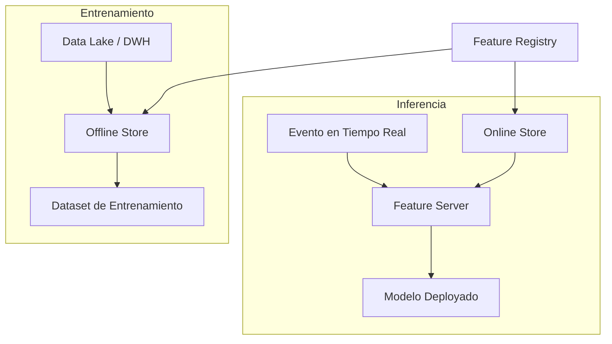
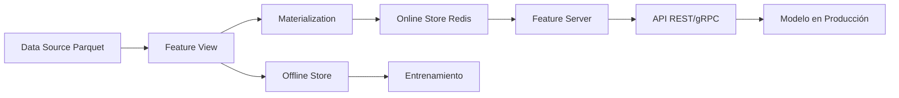

# 🏛️ Feature Stores: Feast y Tecton

En la práctica de ML/AI Engineering, los equipos desperdician entre un 60 % y 80 % de su tiempo en tareas de preparación de datos, muchas de ellas redundantes entre proyectos. Un *feature store* abstrae esta complejidad centralizando la definición, computación y servicio de características, garantizando consistencia entre entrenamiento (*offline*) e inferencia (*online*). Esta nota explora la arquitectura conceptual y las herramientas dominantes del ecosistema.


## 1. Arquitectura de un Feature Store

Un feature store moderno se descompone en cuatro componentes fundamentales:

### 1.1 Offline Store

Repositorio de alta capacidad (data lake, data warehouse, objetos S3/ADLS) destinado a almacenar historiales completos de features. Soporta operaciones de lectura masiva para generar datasets de entrenamiento y batch inference.

### 1.2 Online Store

Base de datos de baja latencia (Redis, DynamoDB, Bigtable, Cassandra) que mantiene el valor más reciente de cada feature por entidad. Su objetivo es servir vectores de features en milisegundos para modelos en tiempo real.

### 1.3 Feature Registry

Catálogo centralizado de metadatos que documenta qué features existen, quién las creó, su esquema, su fuente de datos, su frecuencia de actualización y sus propietarios. Actúa como la *source of truth* semántica del sistema.

### 1.4 Feature Server

Servicio de red (gRPC/REST) que expone endpoints para recuperar features online mediante identificadores de entidad, abstrayendo la lógica de unión y filtrado al modelo cliente.




## 2. Feast: Feature Store Open Source

Feast es la solución open-source más adoptada en la industria, mantenida por la comunidad y respaldada por empresas como Tecton, Snowflake y Redis. Su diseño es agnóstico a la infraestructura subyacente.

### 2.1 Entidades

Una entidad representa el objeto de negocio sobre el cual se computan features. Ejemplo:

```python
from feast import Entity, ValueType

user = Entity(
    name="user_id",
    value_type=ValueType.INT64,
    description="Identificador único del usuario"
)
```

### 2.2 Fuentes de Datos (Data Sources)

Feast soporta fuentes batch (BigQuery, Snowflake, Redshift, archivos Parquet) y stream (Kafka, Kinesis).

```python
from feast import FileSource

user_transactions_source = FileSource(
    path="s3://bucket/features/transactions.parquet",
    event_timestamp_column="timestamp"
)
```

### 2.3 Feature Views

Un *feature view* vincula entidades, fuentes de datos y transformaciones para producir un conjunto semántico de features:

```python
from feast import FeatureView, Feature
from datetime import timedelta

user_stats_fv = FeatureView(
    name="user_transaction_stats",
    entities=["user_id"],
    ttl=timedelta(days=1),
    features=[
        Feature(name="total_spend_7d", dtype=ValueType.FLOAT),
        Feature(name="transaction_count_30d", dtype=ValueType.INT64)
    ],
    online=True,
    source=user_transactions_source
)
```

### 2.4 Materialización

La materialización es el proceso de computar las features definidas en un feature view y escribirlas en el online store para servicio de baja latencia:

```bash
feast materialize-incremental $(date -u +"%Y-%m-%dT%H:%M:%S")
```

En Python:

```python
from feast import FeatureStore

store = FeatureStore(repo_path=".")
store.materialize_incremental(end_date=datetime.utcnow())
```


## 3. Tecton: Solución Enterprise

Tecton es la empresa original detrás de Feast y ofrece una plataforma comercial (SaaS) que extiende los conceptos open-source con capacidades avanzadas:

- **Transformaciones en tiempo real**: Agregaciones en ventanas deslizantes sobre streams de eventos con exactitud garantizada.
- **Orquestación integrada**: Pipelines de materialización automatizados con dependencias y scheduling nativos.
- **Seguridad y gobernanza**: RBAC, linaje de datos y masking de PII a nivel de feature.
- **Colaboración**: Interfaces para que ingenieros de datos publiquen features y científicos las consuman mediante un catálogo centralizado.

Tecton es la elección preferida en organizaciones que requieren SLAs estrictos de latencia (< 10 ms) y necesitan gobernanza enterprise sin operar infraestructura de feature stores manualmente.


## 4. Comparativa de Plataformas

| Dimensión | Feast | Tecton | SageMaker Feature Store |
|-----------|-------|--------|-------------------------|
| **Licencia** | Open-source (Apache 2.0) | Comercial / SaaS | Servicio gestionado AWS |
| **Online Store** | Redis, DynamoDB, Datastore | Gestionado por Tecton | DynamoDB |
| **Offline Store** | BigQuery, Snowflake, S3, etc. | Gestionado por Tecton | S3 (via Glue/Athena) |
| **Transformaciones** | Batch vía SQL/Python | Batch + Streaming en tiempo real | Batch vía Spark/Flink |
| **Point-in-time Joins** | Sí (vía `get_historical_features`) | Sí, optimizado | Sí |
| **Latencia típica** | ~5-50 ms (depende del store) | < 10 ms SLA | ~10-100 ms |
| **Gobernanza** | Básica (vía metadatos) | Avanzada (RBAC, linaje) | IAM + AWS Lake Formation |
| **Curva de aprendizaje** | Media | Baja (plataforma gestionada) | Media-Alta |

Caso real: Uber desarrolló internamente Michelangelo Palette, uno de los primeros feature stores a escala industrial, para compartir features entre cientos de modelos de estimación de tarifas, tiempos de llegada y detección de fraude. Esta arquitectura redujo el tiempo de desarrollo de nuevos modelos en un 50 %.


## 5. Casos de Uso Industriales

### 5.1 Recomendaciones en Tiempo Real

Un sistema de recomendación de contenido requiere features de usuario (últimos clicks, preferencias históricas) y de ítem (popularidad, embeddings) servidas en < 20 ms. El feature store materializa agregaciones cada minuto mientras el modelo consulta el online store por `user_id` e `item_id`.

### 5.2 Detección de Fraude

En pagos digitales, la latencia es crítica. Features como `monto_promedio_ultima_hora` o `numero_transacciones_ultimos_5_minutos` se computan sobre streams de Kafka y se materializan en Redis. El modelo de fraude evalúa cada transacción en milisegundos.

⚠️ **Advertencia**: Un feature store mal configurado puede introducir *training-serving skew* si las transformaciones aplicadas en el pipeline offline difieren ligeramente de las operaciones en el servicio online. Mantenga una única definición de transformación (single source of truth).


## 6. Ejemplo Práctico con Feast

El siguiente script configura un repositorio mínimo de Feast:

```python
# feature_repo/example.py
from datetime import timedelta
from feast import Entity, Feature, FeatureView, ValueType, FileSource
from feast.types import Float32, Int64

# Entidad
driver = Entity(name="driver_id", value_type=ValueType.INT64)

# Fuente de datos
driver_stats_source = FileSource(
    path="data/driver_stats.parquet",
    event_timestamp_column="event_timestamp"
)

# Feature View
driver_stats_fv = FeatureView(
    name="driver_hourly_stats",
    entities=["driver_id"],
    ttl=timedelta(hours=2),
    schema=[
        Feature(name="conv_rate", dtype=Float32),
        Feature(name="acc_rate", dtype=Float32),
        Feature(name="avg_daily_trips", dtype=Int64)
    ],
    source=driver_stats_source
)
```

```python
# training.py
from feast import FeatureStore

store = FeatureStore(repo_path="feature_repo")

training_df = store.get_historical_features(
    entity_df=entity_df,
    features=[
        "driver_hourly_stats:conv_rate",
        "driver_hourly_stats:acc_rate"
    ]
).to_df()
```

💡 **Tip**: Versione su repositorio de Feast con Git. El feature registry se almacena en un archivo `registry.db` que debe trackearse o sincronizarse entre entornos para evitar inconsistencias.


## 7. Diagrama de Arquitectura Feast




## 8. Recursos Visuales


*Figura 1: Esquema de flujo de datos en arquitecturas distribuidas. Fuente: Wikimedia Commons.*


*Figura 2: Símbolo representativo de inteligencia artificial aplicada a ingeniería. Fuente: Wikimedia Commons.*


📦 Código de compresión:

```python
from feast import Entity, Feature, FeatureView, ValueType, FileSource, FeatureStore
from datetime import timedelta

# Definición compacta de entidad, fuente y feature view
def create_driver_feature_view(repo_path: str):
    driver = Entity(name="driver_id", value_type=ValueType.INT64)
    source = FileSource(path="data/driver_stats.parquet", event_timestamp_column="event_timestamp")
    fv = FeatureView(
        name="driver_hourly_stats",
        entities=["driver_id"],
        ttl=timedelta(hours=2),
        schema=[
            Feature(name="conv_rate", dtype=ValueType.FLOAT),
            Feature(name="acc_rate", dtype=ValueType.FLOAT),
            Feature(name="avg_daily_trips", dtype=ValueType.INT64)
        ],
        source=source
    )
    store = FeatureStore(repo_path=repo_path)
    return store, fv
```


*Continúa en [[03 - Online vs Offline Features]].*
