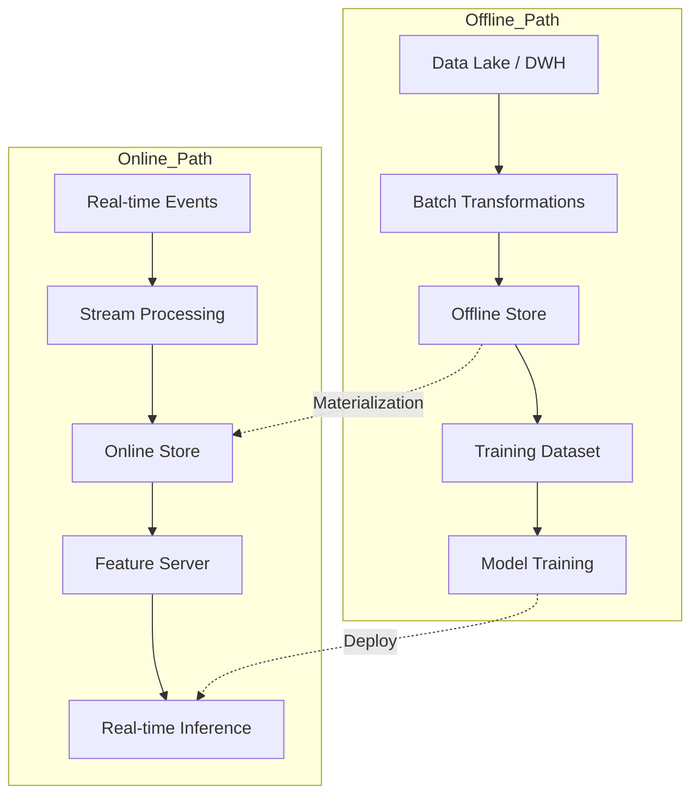

# ⚡ Online vs Offline Features

La dicotomía entre features *offline* (batch) y *online* (tiempo real) es el corazón de la arquitectura de un feature store. En ML/AI Engineering, comprender sus diferencias, garantizar la *point-in-time correctness* y gestionar tradeoffs de latencia y consistencia son competencias esenciales para desplegar modelos robustos en producción.


## 1. Features Offline: El Mundo del Batch

Las features offline se computan sobre grandes volúmenes históricos de datos, típicamente almacenados en data warehouses o data lakes. Su propósito principal es el entrenamiento de modelos y la generación de predicciones batch (ej. segmentación de clientes realizada una vez al día).

### 1.1 Características Distintivas

- **Volumen masivo**: pueden abarcar años de historial.
- **Latencia tolerante**: tiempos de consulta de segundos a minutos son aceptables.
- **Complejidad computacional**: permiten agregaciones complejas (ventanas de 90 días, join de múltiples tablas).
- **Formato tabular**: suelen exportarse como DataFrames o archivos Parquet.

### 1.2 Almacenamiento Típico

Data warehouses (Snowflake, BigQuery, Redshift), sistemas de ficheros distribuidos (S3, ADLS) o bases analíticas (ClickHouse, Druid).


## 2. Features Online: El Mundo del Tiempo Real

Las features online son servidas durante la inferencia en tiempo real, donde cada milisegundo cuenta. Representan el estado actual o muy reciente de una entidad.

### 2.1 Características Distintivas

- **Baja latencia**: requerimientos típicos de $< 20-50$ ms (p95).
- **Último valor conocido**: priorizan la frescura sobre el volumen histórico.
- **Alta concurrencia**: deben soportar miles de QPS.
- **Consistencia eventual**: aceptan pequeños retrasos de sincronización respecto al sistema fuente.

### 2.2 Almacenamiento Típico

Bases clave-valor de alta velocidad: Redis, DynamoDB, Aerospike, Google Cloud Bigtable, Cassandra.

Caso real: LinkedIn utiliza features online para su sistema de "People You May Know". Cada vez que un usuario carga su feed, el modelo consulta en milisegundos features como `numero_conexiones_comun` y `score_ultima_interaccion` desde su infraestructura de baja latencia.


## 3. Point-in-Time Correctness

El principio de *point-in-time correctness* (PITC) asegura que, para cualquier evento histórico utilizado en el entrenamiento, las features reflejen únicamente información disponible **hasta** ese momento. Violaciones de PITC generan data leakage y estimaciones de performance optimistas e irreales.

### 3.1 Formulación del Problema

Sea $t_e$ el timestamp del evento de entrenamiento y $t_f$ el timestamp de la feature. La condición de corrección temporal exige:

$$t_f \leq t_e$$

En la práctica, esto se implementa mediante *as-of joins* que, para cada fila del dataset de entidades, recuperan el valor de la feature más reciente no posterior al evento.

### 3.2 Consecuencias del Incumplimiento

Si se incluye información futura (ej. una compra que ocurrió después del click) como feature para predecir el click, el modelo aprenderá una correlación espuria que no existirá en producción.

⚠️ **Advertencia**: Los DataFrames de pandas ordenados por índice no garantizan PITC de forma nativa. Siempre utilice mecanismos de join temporal explícitos (como `get_historical_features` en Feast) o ventanas de rolling con límites estrictos de fecha.


## 4. Materialización y Backfilling

### 4.1 Materialización

Es el proceso de transformar features definidas en el *offline store* hacia el *online store* para su servicio en tiempo real. Puede ser:

- **Completa**: recalcula todo el historial.
- **Incremental**: actualiza solo el delta desde la última materialización.

### 4.2 Backfilling

El *backfill* consiste en recalcular features históricas para cubrir un periodo pasado. Es necesario cuando:

- Se crea una feature nueva y se requiere historial para reentrenar.
- Se detecta un bug en la lógica de transformación y se debe corregir retroactivamente.
- Se migra a un nuevo sistema de feature store.

La complejidad del backfill radica en mantener PITC: deben reconstruirse los valores que efectivamente habrían estado disponibles en cada instante histórico, no aplicar transformaciones con datos actuales.

💡 **Tip**: Diseñe sus transformaciones como funciones puras determinísticas. Una función determinística permite reejecutar el backfill en cualquier momento y obtener resultados idénticos, facilitando la auditoría.


## 5. Feature Freshness y Latency

### 5.1 Freshness

La frescura mide el tiempo transcurrido desde la última actualización de una feature en el online store hasta el momento de la consulta:

$$\text{freshness} = t_{\text{query}} - t_{\text{last\_update}}$$

En sistemas de recomendación, una freshness mayor a 5 minutos puede hacer que el modelo recomiende productos ya agotados.

### 5.2 Latency

La latencia de servicio mide el tiempo entre la solicitud del cliente y la respuesta del feature server. Se descompone en:

$$\text{latency}_{\text{total}} = \text{RTT}_{\text{red}} + \text{latency}_{\text{online\_store}} + \text{latency}_{\text{serialización}}$$

| Métrica | Offline | Online |
|---------|---------|--------|
| Freshness tolerable | Horas / días | Segundos / minutos |
| Latencia esperada | Segundos - minutos | $< 50$ ms |
| Volumen de lectura | Millones de filas | Decenas de features por entidad |


## 6. Tradeoffs: Consistencia vs Velocidad

No existe una solución única; la arquitectura debe adaptarse al caso de uso.

| Escenario | Enfoque Recomendado | Justificación |
|-----------|---------------------|---------------|
| Entrenamiento de modelo de churn mensual | Offline puro | No requiere latencia; agregaciones complejas de 6-12 meses |
| Predicción de fraude en pagos POS | Online puro con freshness $< 1$ min | La decisión debe tomarse en $< 100$ ms |
| Recomendación de productos en home | Híbrido: online para features de contexto, offline para embeddings precomputados | Balance entre frescura y complejidad |
| Retraining continuo con nuevas features | Backfill offline + materialización incremental online | Mantiene consistencia histórica y servicio actual |

Caso real: Spotify combina features offline (perfil musical acumulado en semanas) con features online (canción recién escuchada hace 30 segundos) para generar la fila de reproducción "DJ". El sistema prioriza la inmediatez del contexto sin perder la personalización histórica.


## 7. Diagrama de Arquitectura Dual




## 8. Recursos Visuales


*Figura 1: Redes de procesamiento de información, analogía a flujos online/offline. Fuente: Wikimedia Commons.*


*Figura 2: Esquema de arquitectura de datos distribuida. Fuente: Wikimedia Commons.*


📦 Código de compresión:

```python
from feast import FeatureStore
from datetime import datetime, timedelta

def serve_and_train_consistently(store_path: str, entity_df):
    store = FeatureStore(repo_path=store_path)

    # Offline: point-in-time correct training data
    training_df = store.get_historical_features(
        entity_df=entity_df,
        features=["user_stats:total_spend_7d", "user_stats:click_count_1h"]
    ).to_df()

    # Online: low-latency feature retrieval
    online_features = store.get_online_features(
        features=["user_stats:total_spend_7d", "user_stats:click_count_1h"],
        entity_rows=[{"user_id": 123}, {"user_id": 456}]
    ).to_dict()

    return training_df, online_features
```


*Continúa en [[04 - Feature Monitoring y Drift]].*
