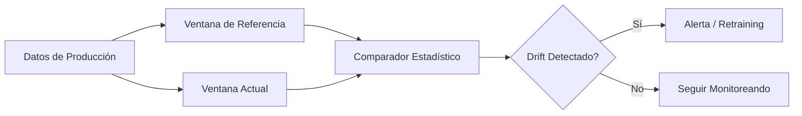

# 📊 Feature Monitoring y Drift

Un modelo de ML entrenado es una fotografía de la realidad en un instante dado. Cuando la realidad cambia —y lo hace inevitablemente— las features que alimentan al modelo pueden degradar su distribución, su relación con el target o su correlación interna. En ML/AI Engineering, el monitoreo continuo de features no es opcional: es una capa de defensa contra la obsolescencia silenciosa de los sistemas predictivos.


## 1. Tipos de Drift

El drift describe cualquier cambio en la distribución de los datos o en la relación entrada-salida a lo largo del tiempo. Se clasifica en tres categorías principales.

### 1.1 Feature Drift (Covariate Shift)

Ocurre cuando la distribución marginal de las features de entrada $P(X)$ cambia entre el entrenamiento y la producción, pero la relación condicional $P(Y|X)$ permanece estable.

$$P_{\text{train}}(X) \neq P_{\text{prod}}(X), \quad P_{\text{train}}(Y|X) = P_{\text{prod}}(Y|X)$$

Ejemplo: Un modelo de scoring crediticio entrenado durante una recesión económica se despliega en periodo de expansión; la distribución de ingresos de los solicitantes cambia.

### 1.2 Concept Drift

La relación subyacente entre entradas y salida se modifica, de modo que $P(Y|X)$ ya no es válida.

$$P_{\text{train}}(Y|X) \neq P_{\text{prod}}(Y|X)$$

Ejemplo: Durante la pandemia COVID-19, los patrones de compra online cambiaron drásticamente; modelos de predicción de demanda basados en 2019 se volvieron obsoletos en semanas.

### 1.3 Label Drift (Prior Probability Shift)

La distribución de la variable objetivo cambia:

$$P_{\text{train}}(Y) \neq P_{\text{prod}}(Y)$$

Aunque $P(X|Y)$ se mantenga, la nueva prevalencia de clases puede desplazar el umbral óptimo de decisión.


## 2. Detección Estadística de Drift

Para detectar drift de forma programática, los equipos de ML utilizan pruebas estadísticas y métricas de distancia entre distribuciones.

### 2.1 Kolmogorov-Smirnov Test (KS Test)

Prueba no paramétrica que compara la función de distribución acumulada (CDF) de dos muestras. La hipótesis nula establece que ambas muestras provienen de la misma distribución.

Estadístico KS:

$$D_{n,m} = \sup_x |F_{1,n}(x) - F_{2,m}(x)|$$

donde $F_{1,n}$ y $F_{2,m}$ son las CDF empíricas. Un $p$-valor bajo ($< 0.05$) indica drift.

### 2.2 Population Stability Index (PSI)

Métrica ampliamente utilizada en riesgo crediticio para cuantificar el cambio entre una distribución esperada (entrenamiento) y una actual (producción). Se calcula sobre bins de una variable:

$$\text{PSI} = \sum_{i=1}^{N} (A_i - E_i) \cdot \ln\left(\frac{A_i}{E_i}\right)$$

donde:
- $N$ = número de bins.
- $A_i$ = proporción actual en el bin $i$.
- $E_i$ = proporción esperada en el bin $i$.

| Rango PSI | Interpretación |
|-----------|----------------|
| PSI $< 0.1$ | Sin cambio significativo |
| $0.1 \leq$ PSI $< 0.25$ | Drift moderado, monitorear |
| PSI $\geq 0.25$ | Drift severo, requiere acción |

### 2.3 Wasserstein Distance (Earth Mover's Distance)

Mide el costo mínimo de transformar una distribución en otra. Es particularmente robusta para distribuciones continuas y multidimensionales:

$$W_1(P, Q) = \inf_{\gamma \in \Gamma(P,Q)} \int_{\mathbb{R} \times \mathbb{R}} |x - y| \, d\gamma(x,y)$$

### 2.4 Kullback-Leibler Divergence

Mide la diferencia de información entre dos distribuciones. No es simétrica y requiere que ambas distribuciones compartan el soporte:

$$D_{KL}(P \| Q) = \sum_{x \in \mathcal{X}} P(x) \log\left(\frac{P(x)}{Q(x)}\right)$$

Una variante simétrica es la divergencia de Jensen-Shannon:

$$\text{JS}(P \| Q) = \frac{1}{2} D_{KL}(P \| M) + \frac{1}{2} D_{KL}(Q \| M), \quad M = \frac{P+Q}{2}$$

Caso real: El banco JPMorgan Chase implementa monitoreo de PSI en todos sus modelos de riesgo de crédito. Si el PSI de la variable `loan_to_income` supera 0.2 en un trimestre, se dispara automáticamente un proceso de re-evaluación del modelo.


## 3. Monitoreo Continuo y Alerting

Un sistema de monitoreo operativo debe ejecutar las pruebas anteriores de forma periódica (batch) o en tiempo real (streaming).

### 3.1 Arquitectura de Monitoreo



### 3.2 Dimensiones a Monitorear

- **Univariado**: cada feature por separado (PSI, KS).
- **Multivariado**: covarianza global entre features (detección de anomalías con Isolation Forest, autoencoders).
- **Importancia de features**: si la importancia SHAP de una feature cambia drásticamente, puede indicar concept drift.


## 4. Feature Importance Drift

Además de la distribución marginal, es crítico observar si la contribución predictiva de una feature se ha erosionado. Se calcula la importancia en ventanas temporales sucesivas:

$$\Delta \text{Importance}_j = |\text{SHAP}_j^{\text{train}} - \text{SHAP}_j^{\text{current}}|$$

Una caída repentina sugiere que la feature ha perdido relevancia o que ha aparecido una variable confusora.


## 5. Correlación Drift

Las relaciones entre features también pueden degradarse. El cambio en la matriz de correlación de Pearson entre entrenamiento ($\Sigma_{\text{train}}$) y producción ($\Sigma_{\text{prod}}$) se puede resumir mediante la norma de Frobenius:

$$\|\Delta \Sigma\|_F = \sqrt{\sum_{i,j} (\sigma_{ij}^{\text{train}} - \sigma_{ij}^{\text{prod}})^2}$$

⚠️ **Advertencia**: Un cambio en la correlación entre features puede activar multicolinealidad no presente en entrenamiento, volviendo inestables los coeficientes de modelos lineales.


## 6. Estrategias de Mitigación

| Estrategia | Descripción | Cuándo Aplicar |
|------------|-------------|----------------|
| **Retraining programado** | Reentrenar periódicamente (semanal/mensual) | Drift lento y predecible |
| **Retraining triggered** | Reentrenar solo cuando PSI/KS exceden umbral | Drift esporádico; costo de entrenamiento alto |
| **Weighting temporal** | Dar más peso a datos recientes en el entrenamiento | Drift gradual; suficientes datos históricos |
| **Online learning** | Actualizar pesos del modelo con cada nuevo batch | Latencia de actualización crítica; datos no estacionarios |
| **Feature dropping** | Eliminar features con drift severo irreversible | Feature no recuperable (ej. cambio de regulación) |

Caso real: La plataforma de streaming Twitch monitorea la correlación entre features de engagement (minutos vistos, chats enviados) y descubrió que durante eventos especiales (E3, TwitchCon), las correlaciones se rompían temporalmente. Implementaron un sistema de "modo evento" que aplica un modelo alternativo pre-entrenado con datos de eventos pasados.


## 7. Recursos Visuales


*Figura 1: Representación del flujo de monitoreo en pipelines de ML. Fuente: Wikimedia Commons.*


*Figura 2: Inteligencia artificial y la detección de anomalías. Fuente: Wikimedia Commons.*


📦 Código de compresión:

```python
import numpy as np
from scipy.stats import ks_2samp

def detect_drift(reference, current, method="ks", threshold=0.05):
    """
    Detecta drift entre dos muestras unidimensionales.
    """
    if method == "ks":
        stat, p_value = ks_2samp(reference, current)
        return {"drift": p_value < threshold, "statistic": stat, "p_value": p_value}
    elif method == "psi":
        # Simplificación: bins deciles
        bins = np.percentile(reference, np.linspace(0, 100, 11))
        bins[-1] += 1e-9
        expected_perc = np.histogram(reference, bins=bins)[0] / len(reference)
        actual_perc = np.histogram(current, bins=bins)[0] / len(current)
        # Evitar division por cero
        expected_perc = np.clip(expected_perc, 1e-10, 1)
        actual_perc = np.clip(actual_perc, 1e-10, 1)
        psi = np.sum((actual_perc - expected_perc) * np.log(actual_perc / expected_perc))
        return {"drift": psi > 0.25, "psi": psi}
    else:
        raise ValueError("Método no soportado")

# Ejemplo de uso
# result = detect_drift(train_df["feature_a"], prod_df["feature_a"], method="psi")
```


*Continúa en [[05 - Caso Practico - Feature Store para E-commerce]].*
