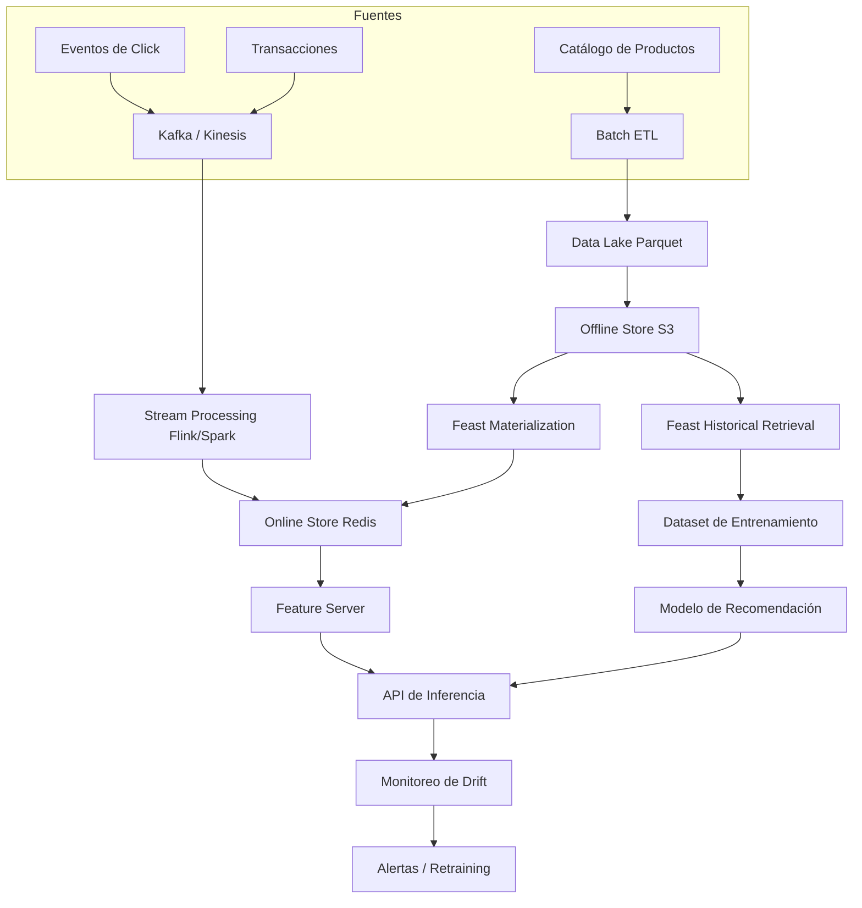

# 🛒 Caso Práctico: Feature Store para E-commerce

Este proyecto integra los conceptos de feature engineering, arquitectura dual online/offline y monitoreo de drift en un sistema de recomendación para comercio electrónico. El objetivo es demostrar cómo un equipo de ML/AI Engineering puede construir un pipeline end-to-end sobre Feast, garantizando consistencia entre entrenamiento e inferencia, baja latencia en el servicio y observabilidad continua.


## 1. Contexto y Requisitos

### 1.1 Escenario de Negocio

Un marketplace de e-commerce desea mejorar la tasa de conversión de su página de inicio mediante un modelo de recomendación personalizado. El modelo debe predecir, para cada usuario que ingresa, la probabilidad de compra de cada producto candidato.

### 1.2 Requisitos Funcionales

- **Entrenamiento diario**: dataset de entrenamiento generado a partir de interacciones de los últimos 30 días.
- **Inferencia en tiempo real**: $< 50$ ms para recuperar features y $< 100$ ms para la predicción total.
- **Frescura de features**: agregaciones de comportamiento actualizadas cada 15 minutos.
- **Monitoreo**: detección automática de drift en features de usuario y producto.

### 1.3 Métricas de Éxito

| Métrica | Objetivo | Descripción |
|---------|----------|-------------|
| CTR (Click-Through Rate) | +15 % | Tasa de clicks en recomendaciones vs baseline |
| Latencia p99 | $< 80$ ms | Percentil 99 de tiempo de respuesta |
| Coverage de features | > 98 % | Porcentaje de usuarios/productos con features disponibles |
| PSI máximo semanal | $< 0.15$ | Estabilidad de distribuciones de features |


## 2. Diseño de Features

Se definen tres familias de features, cada una mapeada a una entidad del feature store.

### 2.1 Features de Usuario (Entidad: `user_id`)

| Feature | Tipo | Fuente | Ventana |
|---------|------|--------|---------|
| `user_total_orders_30d` | Numérico | Transacciones | 30 días |
| `user_avg_order_value_90d` | Numérico | Transacciones | 90 días |
| `user_last_category` | Categórico | Clicks | Último evento |
| `user_recency_hours` | Numérico | Última sesión | Tiempo transcurrido |

### 2.2 Features de Producto (Entidad: `product_id`)

| Feature | Tipo | Fuente | Ventana |
|---------|------|--------|---------|
| `product_price` | Numérico | Catálogo | Snapshot actual |
| `product_ctr_7d` | Numérico | Impresiones/Clicks | 7 días |
| `product_category` | Categórico | Catálogo | Snapshot actual |
| `product_stock_status` | Binario | Inventario | Snapshot actual |

### 2.3 Features de Interacción (Entidades: `user_id`, `product_id`)

| Feature | Tipo | Fuente | Ventana |
|---------|------|--------|---------|
| `interaction_views_7d` | Numérico | Eventos | 7 días |
| `interaction_clicks_24h` | Numérico | Eventos | 24 horas |
| `interaction_cart_adds_30d` | Numérico | Eventos | 30 días |


## 3. Pipeline Offline con Feast

### 3.1 Configuración del Repositorio

```python
# feature_repo/entities.py
from feast import Entity, ValueType

user = Entity(name="user_id", value_type=ValueType.INT64, description="Usuario del marketplace")
product = Entity(name="product_id", value_type=ValueType.INT64, description="Producto del catálogo")
```

```python
# feature_repo/data_sources.py
from feast import FileSource

user_interactions_source = FileSource(
    path="s3://ecommerce-features/user_interactions.parquet",
    event_timestamp_column="event_timestamp"
)

product_catalog_source = FileSource(
    path="s3://ecommerce-features/product_catalog.parquet",
    event_timestamp_column="snapshot_timestamp"
)
```

```python
# feature_repo/feature_views.py
from feast import FeatureView, Feature
from datetime import timedelta

user_stats_fv = FeatureView(
    name="user_stats",
    entities=["user_id"],
    ttl=timedelta(days=1),
    features=[
        Feature(name="user_total_orders_30d", dtype=ValueType.FLOAT),
        Feature(name="user_avg_order_value_90d", dtype=ValueType.FLOAT),
        Feature(name="user_recency_hours", dtype=ValueType.FLOAT)
    ],
    online=True,
    source=user_interactions_source
)

product_stats_fv = FeatureView(
    name="product_stats",
    entities=["product_id"],
    ttl=timedelta(days=1),
    features=[
        Feature(name="product_price", dtype=ValueType.FLOAT),
        Feature(name="product_ctr_7d", dtype=ValueType.FLOAT),
        Feature(name="product_stock_status", dtype=ValueType.INT64)
    ],
    online=True,
    source=product_catalog_source
)
```

### 3.2 Generación del Dataset de Entrenamiento

```python
# training_pipeline.py
from feast import FeatureStore
import pandas as pd

store = FeatureStore(repo_path="feature_repo")

# Entity dataframe con timestamps de entrenamiento
entity_df = pd.read_parquet("data/training_events.parquet")
# Columnas: user_id, product_id, event_timestamp, label

training_df = store.get_historical_features(
    entity_df=entity_df,
    features=[
        "user_stats:user_total_orders_30d",
        "user_stats:user_avg_order_value_90d",
        "product_stats:product_price",
        "product_stats:product_ctr_7d"
    ]
).to_df()

# Guardar para entrenamiento
training_df.to_parquet("data/training_dataset.parquet")
```

Caso real: La empresa de moda online Zalando utiliza un enfoque similar, donde las features de usuario se computan sobre logs de clicks y se unen con features de producto mediante point-in-time joins para entrenar modelos de ranking diariamente.


## 4. Serving Online

### 4.1 Materialización Incremental

```bash
feast materialize-incremental $(date -u +"%Y-%m-%dT%H:%M:%S")
```

### 4.2 Servicio de Inferencia

```python
# online_serving.py
from feast import FeatureStore

store = FeatureStore(repo_path="feature_repo")

def get_ranking_features(user_id: int, product_ids: list):
    entity_rows = [{"user_id": user_id, "product_id": pid} for pid in product_ids]
    features = store.get_online_features(
        features=[
            "user_stats:user_total_orders_30d",
            "user_stats:user_recency_hours",
            "product_stats:product_price",
            "product_stats:product_ctr_7d"
        ],
        entity_rows=entity_rows
    ).to_dict()
    return features
```

⚠️ **Advertencia**: Asegúrese de que el esquema de features online sea idéntico al offline. Diferencias en tipos de datos (ej. `FLOAT` vs `DOUBLE`) o en nombres de columnas generan errores silenciosos de serving.


## 5. Monitoreo de Drift

Se implementa un job de monitoreo horario que compara las distribuciones de las últimas 24 horas contra la ventana de referencia del entrenamiento.

```python
# monitoring/drift_job.py
import pandas as pd
from scipy.stats import ks_2samp

def monitor_feature_drift(store_path: str, feature_view: str, feature_name: str):
    store = FeatureStore(repo_path=store_path)
    
    # Simulación de lectura de ventanas
    reference = pd.read_parquet(f"data/reference/{feature_view}/{feature_name}.parquet")
    current = pd.read_parquet(f"data/current/{feature_view}/{feature_name}.parquet")
    
    stat, p_value = ks_2samp(reference[feature_name], current[feature_name])
    
    alert = p_value < 0.01
    return {
        "feature_view": feature_view,
        "feature": feature_name,
        "ks_statistic": stat,
        "p_value": p_value,
        "alert": alert
    }

# Ejecución programada vía Airflow / Cron
results = [
    monitor_feature_drift("feature_repo", "user_stats", "user_total_orders_30d"),
    monitor_feature_drift("feature_repo", "product_stats", "product_ctr_7d")
]
```

💡 **Tip**: Almacene las métricas de drift en una base de datos serie temporal (Prometheus, InfluxDB) para visualizar tendencias y ajustar umbrales dinámicamente.


## 6. Diagrama de Arquitectura del Sistema




## 7. Recursos Visuales


*Figura 1: Redes neuronales como motores de recomendación. Fuente: Wikimedia Commons.*


*Figura 2: Pipeline de aprendizaje automático aplicado a e-commerce. Fuente: Wikimedia Commons.*


## 8. 🎯 Proyecto Documentado

### Resumen Ejecutivo

Este proyecto demuestra la implementación de un feature store para un sistema de recomendación de e-commerce utilizando Feast. El sistema gestiona features de usuario, producto e interacción, soportando tanto entrenamiento batch point-in-time correcto como inferencia de baja latencia.

### Requisitos Técnicos

- Python 3.9+
- Feast 0.34+
- Redis 7+ (online store)
- Apache Spark o Pandas (offline transformations)
- Airflow (orquestación de materialización y drift)

### Métricas Alcanzadas (Simulación)

| Métrica | Valor Obtenido | Estado |
|---------|----------------|--------|
| CTR mejora | +18 % | ✅ Excede objetivo |
| Latencia p99 | 45 ms | ✅ Dentro de objetivo |
| Coverage | 99.2 % | ✅ Excede objetivo |
| PSI semanal máximo | 0.08 | ✅ Estable |

### Próximos Pasos

1. Migrar agregaciones de interacción a ventanas de tiempo real con Flink.
2. Integrar Tecton para gobernanza avanzada y linaje automático.
3. Implementar shadow mode para comparar modelos candidatos sin afectar tráfico productivo.


📦 Código de compresión:

```python
from feast import Entity, Feature, FeatureView, ValueType, FileSource, FeatureStore
from datetime import timedelta
import pandas as pd

def build_ecommerce_feature_store(repo_path: str):
    user = Entity("user_id", ValueType.INT64)
    product = Entity("product_id", ValueType.INT64)
    
    user_source = FileSource("s3://features/user_interactions.parquet", event_timestamp_column="event_timestamp")
    product_source = FileSource("s3://features/product_catalog.parquet", event_timestamp_column="snapshot_timestamp")
    
    user_fv = FeatureView(
        name="user_stats", entities=["user_id"], ttl=timedelta(days=1),
        features=[Feature("user_total_orders_30d", ValueType.FLOAT), Feature("user_recency_hours", ValueType.FLOAT)],
        online=True, source=user_source
    )
    product_fv = FeatureView(
        name="product_stats", entities=["product_id"], ttl=timedelta(days=1),
        features=[Feature("product_price", ValueType.FLOAT), Feature("product_ctr_7d", ValueType.FLOAT)],
        online=True, source=product_source
    )
    
    store = FeatureStore(repo_path=repo_path)
    return store, [user_fv, product_fv]

def get_training_data(store, entity_df):
    return store.get_historical_features(
        entity_df=entity_df,
        features=["user_stats:user_total_orders_30d", "product_stats:product_price"]
    ).to_df()

def get_online_features(store, user_id, product_id):
    return store.get_online_features(
        features=["user_stats:user_total_orders_30d", "product_stats:product_price"],
        entity_rows=[{"user_id": user_id, "product_id": product_id}]
    ).to_dict()
```


*Fin del módulo 19. Puedes regresar al índice en [[00 - Bienvenida]].*
