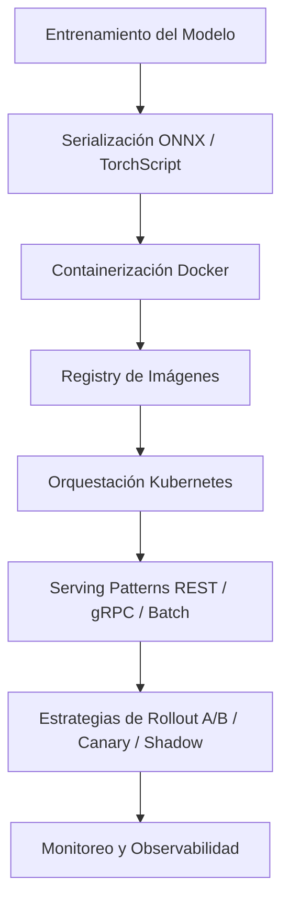
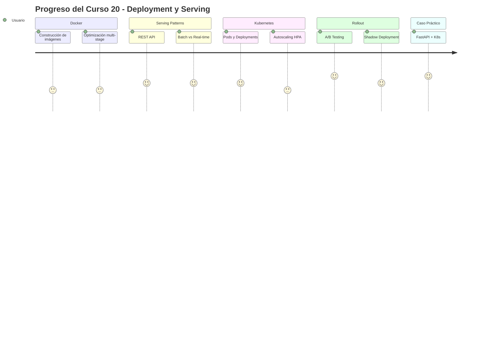

# 🚀 20 - Deployment y Serving

Bienvenida al módulo que transforma modelos de experimentos en productos escalables. En ML/AI Engineering, el deployment no es el último paso: es el ciclo de vida mismo. Sin serving confiable, el mejor modelo es inútil.

Este curso conecta el entrenamiento con la producción, abordando contenedores, orquestación, patrones de inferencia y estrategias de rollout seguras.

---

## 1. Índice del Curso

Explora cada unidad técnica del módulo:

- [[01 - Docker para ML]]
- [[02 - Model Serving Patterns]]
- [[03 - Kubernetes para ML]]
- [[04 - A-B Testing y Shadow Deployment]]
- [[05 - Caso Practico - API de ML con FastAPI y K8s]]

---

## 2. Glosario Esencial

| Término | Definición |
|---------|------------|
| **Docker** | Plataforma de contenedorización que empaqueta código, dependencias y configuración en una imagen portable. |
| **Container** | Instancia ejecutable aislada de una imagen Docker, compartiendo el kernel del host. |
| **Serving** | Proceso de exponer un modelo entrenado para recibir solicitudes de inferencia y devolver predicciones. |
| **REST API** | Interfaz basada en HTTP/JSON para comunicación stateless entre cliente y servidor de inferencia. |
| **gRPC** | Framework RPC de alto rendimiento basado en HTTP/2 y Protocol Buffers, ideal para microservicios. |
| **Batch Inference** | Inferencia sobre grandes volúmenes de datos acumulados, priorizando throughput sobre latencia. |
| **Real-Time Inference** | Predicciones síncronas con latencia baja (<100 ms), típicas vía API REST o gRPC. |
| **Kubernetes (K8s)** | Orquestador de contenedores para automatizar despliegue, escalado y gestión de aplicaciones. |
| **Pod** | Unidad mínima desplegable en K8s, puede contener uno o más contenedores que comparten red y almacenamiento. |
| **Deployment** | Recurso de K8s que declara el estado deseado de réplicas de una aplicación. |
| **Service** | Abstracción de red en K8s que expone un conjunto de pods mediante una IP estable y balanceo de carga. |
| **Ingress** | Controlador de enrutamiento HTTP/HTTPS en K8s que gestiona el tráfico externo hacia services internos. |
| **A/B Testing** | Técnica de comparación estadística entre dos versiones de un modelo expuestas a subpoblaciones distintas. |
| **Shadow Deployment** | Estrategia donde el tráfico de producción se replica hacia una nueva versión sin afectar la respuesta al usuario. |
| **Canary** | Despliegue gradual donde un porcentaje creciente de usuarios recibe la nueva versión del modelo. |
| **Blue-Green** | Estrategia de dos entornos idénticos (blue=producción, green=nuevo) con switch instantáneo de tráfico. |

---

## 3. Diagrama de Arquitectura del Módulo



---

## 4. Objetivos de Aprendizaje

Al finalizar este módulo serás capaz de:

1. Construir imágenes Docker optimizadas para cargas de trabajo ML, incluyendo soporte GPU.
2. Seleccionar el patrón de serving adecuado según requisitos de latencia y throughput.
3. Desplegar modelos en Kubernetes gestionando recursos, autoscaling y GPU scheduling.
4. Diseñar experimentos de A/B testing con rigor estadístico y desplegar con shadow, canary y blue-green.
5. Implementar un caso práctico end-to-end: API FastAPI containerizada en Kubernetes con métricas y autoscaling.

---

## 5. Caso Real: Netflix Recommendation Serving

**Caso real:** Netflix atiende más de 450 millones de dispositivos con recomendaciones personalizadas. Su infraestructura combina modelos embebidos en edge caches, microservicios de inferencia en AWS y despliegues canary controlados por Spinnaker. Cada cambio de modelo pasa por A/B testing estadístico antes del rollout global.


---

## 6. Roadmap Visual del Módulo



---

⚠️ **Advertencia:** No omitas las secciones de seguridad y monitoreo. Un modelo en producción sin observabilidad es un riesgo operacional.

💡 **Tip:** Mantén un notebook de verificación (smoke tests) que ejecutes automáticamente tras cada despliegue para validar latencia p99 y error rate.

---

## 📦 Código de Compresión

```bash
# Estructura de directorios recomendada para el módulo
20-deployment-serving/
├── 00-bienvenida.md
├── 01-docker-ml/
│   ├── Dockerfile
│   ├── docker-compose.yml
│   └── .dockerignore
├── 02-serving-patterns/
│   ├── fastapi_app.py
│   └── bentofile.yaml
├── 03-kubernetes/
│   ├── deployment.yaml
│   ├── service.yaml
│   └── hpa.yaml
├── 04-ab-testing/
│   ├── experiment_design.py
│   └── shadow_ingress.yaml
└── 05-caso-practico/
    ├── app/
    ├── k8s/
    └── prometheus/
```
