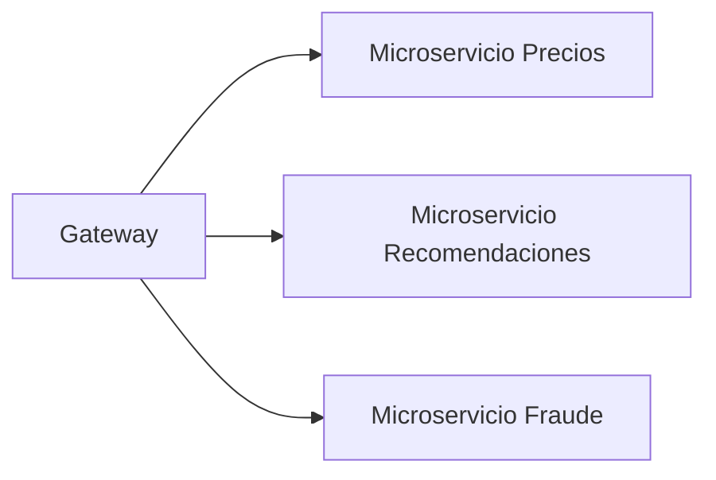

# ⚡ Model Serving Patterns

Un modelo entrenado no genera valor hasta que predice sobre datos nuevos. El serving es la disciplina de exponer modelos a solicitudes de inferencia de forma eficiente, escalable y confiable. La elección del patrón determina si tu sistema atenderá 10 o 10 millones de predicciones por segundo.

En AI Engineering, el serving no es solo "correr un script de predict": implica latencia, throughput, serialización, desacoplamiento y gestión de versiones.

---

## 1. Patrones de Arquitectura de Serving

### 1.1 Embedded Model (Monolito)

El modelo se carga en memoria dentro de la aplicación principal. Es el patrón más simple y de menor latencia para un solo modelo.

**Ventajas:** Cero overhead de red, latencia mínima.

**Desventajas:** Acoplamiento fuerte, imposibilidad de actualizar el modelo sin redeployar toda la app.

```python
# Embedded: modelo cargado en el mismo proceso FastAPI
from fastapi import FastAPI
import joblib

app = FastAPI()
model = joblib.load("model.pkl")

@app.post("/predict")
def predict(features: dict):
    return {"prediction": model.predict([features]).tolist()}
```

**Caso real:** Uber usa modelos embebidos en sus aplicaciones de routing para predicciones de tiempo de llegada con latencia <5 ms, donde cada milisegundo cuenta.

### 1.2 Model-as-a-Service (REST API)

El modelo reside en un servicio independiente accesible vía HTTP. Desacopla el ciclo de vida del modelo de la aplicación cliente.


### 1.3 Model-as-a-Microservice

Evolución del patr anterior donde cada modelo (o versión) es un microservicio independiente, permitiendo escalado selectivo y equipos autónomos.



---

## 2. Modalidades de Inferencia

### 2.1 Batch Prediction

Procesamiento de grandes volúmenes de datos en intervalos programados (hourly, nightly). Prioriza throughput sobre latencia.

Fórmula de throughput para batch:

$$
\text{Throughput} = \frac{N}{T_{\text{total}}} = \frac{N}{T_{\text{io}} + T_{\text{compute}} + T_{\text{overhead}}}
$$

Donde $N$ es el número de registros, $T_{\text{total}}$ el tiempo total del job.

**Caso real:** Airbnb ejecuta jobs de batch inference en Apache Spark cada hora para calcular embeddings de listados, alimentando su motor de búsqueda con datos frescos sin impactar la latencia de las consultas en tiempo real.

### 2.2 Real-Time Inference

Solicitudes síncronas donde el usuario espera la respuesta. La métrica clave es la latencia percentil (p50, p95, p99).

La latencia total de una solicitud REST se descompone como:

$$
L_{\text{total}} = L_{\text{network}} + L_{\text{deserialize}} + L_{\text{preprocess}} + L_{\text{inference}} + L_{\text{postprocess}} + L_{\text{serialize}}
$$

### 2.3 Streaming Inference

El modelo consume eventos de un stream (Kafka, Kinesis, Pub/Sub) y emite predicciones hacia otro tópico. Desacopla productores y consumidores.


⚠️ **Advertencia:** El streaming inference requiere manejo explícito de late arrivals y watermarks. Sin ellos, predicciones sobre eventos desordenados serán incorrectas.

---

## 3. Comparativa Latencia vs Throughput

| Patrón | Latencia Típica | Throughput | Complejidad | Uso Ideal |
|--------|----------------|------------|-------------|-----------|
| Embedded | <1 ms | Media | Baja | Edge devices, móviles |
| REST API | 10-100 ms | Media | Baja | Aplicaciones web |
| gRPC | 5-50 ms | Alta | Media | Microservicios internos |
| Batch | Minutos-horas | Masiva | Media | Reportes, ETL |
| Streaming | Segundos | Alta | Alta | Detección de fraude en vivo |

---

## 4. Frameworks de Serving

| Framework | Lenguaje | Protocolo | Optimización | Ideal Para |
|-----------|----------|-----------|--------------|------------|
| **FastAPI** | Python | REST | Asyncio, pydantic | Prototipos y APIs medianas |
| **BentoML** | Python | REST/gRPC | Batch serving, adaptive batching | MLOps unificado |
| **NVIDIA Triton** | C++/Python | REST/gRPC | TensorRT, dynamic batching, GPU | Alta performance GPU |
| **TorchServe** | Python | REST/gRPC | Default handlers, model archiver | Modelos PyTorch |
| **TF Serving** | C++ | gRPC/REST | Batching, model versioning | Modelos TensorFlow |

💡 **Tip:** Para latencia crítica en GPU, preferir Triton con TensorRT. Para flexibilidad y velocidad de desarrollo, FastAPI o BentoML.

---

## 5. Serialización de Modelos

La serialización determina cómo se almacena y carga el grafo computacional del modelo.

### 5.1 Formatos Principales

| Formato | Framework Origen | Ventaja | Limitación |
|---------|------------------|---------|------------|
| **ONNX** | Universal | Interoperable, optimizable con ONNX Runtime | No soporta todas las ops dinámicas |
| **TorchScript** | PyTorch | Serializa `nn.Module` sin Python dependency | Depuración más compleja |
| **SavedModel** | TensorFlow | Format nativo, signing contracts | Acoplado al ecosistema TF |
| **Pickle/Joblib** | Scikit-learn | Simplicidad | Inseguro, solo Python |

### 5.2 Conversión a ONNX

```python
import torch
import torch.onnx

model = MyModel()
dummy_input = torch.randn(1, 3, 224, 224)

torch.onnx.export(
    model,
    dummy_input,
    "model.onnx",
    input_names=["input"],
    output_names=["output"],
    dynamic_axes={"input": {0: "batch_size"}, "output": {0: "batch_size"}}
)
```

⚠️ **Advertencia:** Nunca deserialices pickles de fuentes no confiables. `joblib.load()` ejecuta código arbitrario. Usa ONNX o formatos seguros en producción.

---

## 6. Implementación Completa con FastAPI

Servicio de inferencia REST con async batching, health check y métricas básicas.

```python
import asyncio
import time
from typing import List
from fastapi import FastAPI
from pydantic import BaseModel
import numpy as np
import onnxruntime as ort

app = FastAPI(title="ML Inference API")

# Carga del modelo ONNX
session = ort.InferenceSession("model.onnx", providers=["CUDAExecutionProvider", "CPUExecutionProvider"])
input_name = session.get_inputs()[0].name

class PredictionRequest(BaseModel):
    instances: List[List[float]]

class PredictionResponse(BaseModel):
    predictions: List[float]
    latency_ms: float

@app.post("/predict", response_model=PredictionResponse)
async def predict(req: PredictionRequest):
    start = time.perf_counter()
    # Preprocesamiento
    X = np.array(req.instances, dtype=np.float32)
    # Inferencia
    outputs = session.run(None, {input_name: X})
    latency = (time.perf_counter() - start) * 1000
    return PredictionResponse(
        predictions=outputs[0].tolist(),
        latency_ms=round(latency, 2)
    )

@app.get("/health")
async def health():
    return {"status": "ok", "model_loaded": session is not None}
```

**Caso real:** Stripe utiliza una arquitectura de microservicios de inferencia con ONNX Runtime para detección de fraude. Su API interna procesa millones de solicitudes diarias con latencia p99 <20 ms mediante batching dinámico y GPU compartidas.

---

## 📦 Código de Compresión

```bash
serving-patterns/
├── embedded/
│   └── monolith_app.py
├── rest_api/
│   ├── main.py
│   ├── model.onnx
│   └── requirements.txt
├── microservices/
│   ├── gateway/
│   ├── pricing_svc/
│   └── fraud_svc/
├── batch/
│   └── spark_inference.py
└── streaming/
    └── kafka_consumer.py
```
