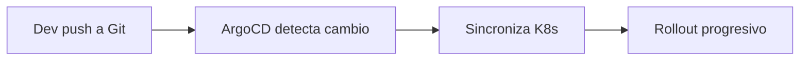
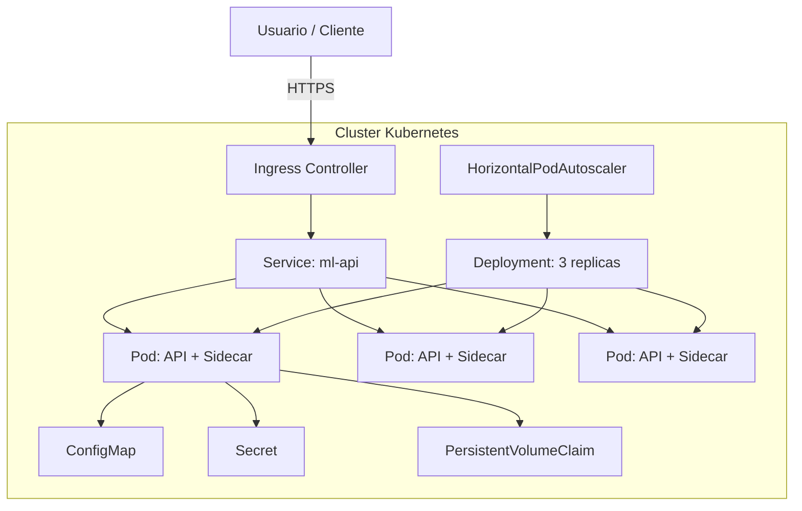

# ☸️ Kubernetes para ML

Kubernetes (K8s) es el estándar de facto para orquestar cargas de trabajo de ML a escala. Mientras Docker resuelve el problema de "funciona en mi máquina", K8s resuelve "funciona a escala, se recupera de fallos y optimiza recursos". Desde el scheduling de GPUs hasta el autoscaling basado en métricas personalizadas, K8s transforma modelos estáticos en sistemas resilientes.

Para un AI Engineer, dominar K8s no es opcional: es el puente entre el notebook experimental y la infraestructura de producción.

---

## 1. Conceptos Fundamentales de K8s para ML

### 1.1 Pods

Un **Pod** es la unidad mínima desplegable en K8s. En ML, un pod típico contiene:

- Un contenedor con la aplicación de serving (FastAPI/Triton).
- Opcionalmente, un sidecar para exportación de métricas (Prometheus exporter).

```yaml
apiVersion: v1
kind: Pod
metadata:
  name: ml-inference-pod
  labels:
    app: ml-api
spec:
  containers:
    - name: api
      image: registry/ml-api:v1.2.0
      ports:
        - containerPort: 8000
      resources:
        requests:
          memory: "2Gi"
          cpu: "1000m"
        limits:
          memory: "4Gi"
          cpu: "2000m"
```

### 1.2 Deployments

Un **Deployment** declara el estado deseado: número de réplicas, imagen y estrategia de actualización. Permite rolling updates sin downtime.

```yaml
apiVersion: apps/v1
kind: Deployment
metadata:
  name: ml-api-deployment
spec:
  replicas: 3
  selector:
    matchLabels:
      app: ml-api
  template:
    metadata:
      labels:
        app: ml-api
    spec:
      containers:
        - name: api
          image: registry/ml-api:v1.2.0
          ports:
            - containerPort: 8000
```

### 1.3 Services

Un **Service** expone un conjunto de pods mediante una IP virtual y balanceo de carga interno.

```yaml
apiVersion: v1
kind: Service
metadata:
  name: ml-api-service
spec:
  selector:
    app: ml-api
  ports:
    - protocol: TCP
      port: 80
      targetPort: 8000
  type: ClusterIP
```

### 1.4 Ingress

El **Ingress** gestiona el enrutamiento HTTP/HTTPS externo hacia services internos, típicamente con un controlador como NGINX o Traefik.

```yaml
apiVersion: networking.k8s.io/v1
kind: Ingress
metadata:
  name: ml-api-ingress
  annotations:
    nginx.ingress.kubernetes.io/rewrite-target: /
spec:
  rules:
    - host: api.mlplatform.io
      http:
        paths:
          - path: /
            pathType: Prefix
            backend:
              service:
                name: ml-api-service
                port:
                  number: 80
```

---

## 2. Configuración y Secretos

Los **ConfigMaps** almacenan configuración no sensible (URLs, flags de features). Los **Secrets** almacenan credenciales, tokens y claves de API.

```yaml
apiVersion: v1
kind: ConfigMap
metadata:
  name: ml-config
data:
  MODEL_NAME: "resnet50"
  BATCH_SIZE: "32"
  LOG_LEVEL: "info"
---
apiVersion: v1
kind: Secret
metadata:
  name: ml-secrets
type: Opaque
stringData:
  AWS_ACCESS_KEY_ID: "AKIA..."
  AWS_SECRET_ACCESS_KEY: "..."
```

Montaje en el pod:

```yaml
envFrom:
  - configMapRef:
      name: ml-config
  - secretRef:
      name: ml-secrets
```

⚠️ **Advertencia:** Nunca comitees Secrets en repositorios Git. Usa herramientas como Sealed Secrets, External Secrets Operator o Vault para gestión segura.

---

## 3. Autoscaling Horizontal (HPA)

El **Horizontal Pod Autoscaler** ajusta el número de réplicas basado en métricas como CPU, memoria o métricas personalizadas (latencia, cola de requests).

```yaml
apiVersion: autoscaling/v2
kind: HorizontalPodAutoscaler
metadata:
  name: ml-api-hpa
spec:
  scaleTargetRef:
    apiVersion: apps/v1
    kind: Deployment
    name: ml-api-deployment
  minReplicas: 2
  maxReplicas: 20
  metrics:
    - type: Resource
      resource:
        name: cpu
        target:
          type: Utilization
          averageUtilization: 70
    - type: Resource
      resource:
        name: memory
        target:
          type: Utilization
          averageUtilization: 80
  behavior:
    scaleDown:
      stabilizationWindowSeconds: 300
```

💡 **Tip:** Para cargas de ML con alta varianza, configura `stabilizationWindowSeconds` alto en scale-down para evitar el thrashing de pods.

---

## 4. Scheduling de GPUs

K8s no gestiona GPUs de forma nativa. Requiere **device plugins** (NVIDIA Device Plugin) que exponen GPUs como recursos programables.

```yaml
spec:
  containers:
    - name: api
      image: registry/ml-api:v1.2.0
      resources:
        limits:
          nvidia.com/gpu: 1  # Solicita 1 GPU
        requests:
          nvidia.com/gpu: 1
```

Verifica que los nodos tengan la etiqueta GPU:

```bash
kubectl describe node gpu-node-01 | grep nvidia.com/gpu
```

**Caso real:** Google Cloud Anthos gestiona clusters híbridos donde nodos on-premise con T4/V100 ejecutan inferencia y nodos CPU en cloud manejan preprocesamiento, todo orquestado por K8s con GPU scheduling.

---

## 5. Helm Charts para ML

Helm es el gestor de paquetes de K8s. Un **Helm Chart** parametriza despliegues de ML, permitiendo reutilizar templates entre entornos (dev, staging, prod).

Estructura de un chart para serving:

```
ml-api-chart/
├── Chart.yaml
├── values.yaml
├── values-staging.yaml
└── templates/
    ├── deployment.yaml
    ├── service.yaml
    ├── ingress.yaml
    ├── hpa.yaml
    └── configmap.yaml
```

Instalación con valores sobrescritos:

```bash
helm install ml-api ./ml-api-chart -f values-staging.yaml
helm upgrade --install ml-api ./ml-api-chart --set replicas=5
```

---

## 6. Kubeflow y Ecosistema ML sobre K8s

**Kubeflow** es una plataforma ML nativa de K8s que integra:

- **Pipelines:** Orquestación de workflows de entrenamiento (basado en Argo).
- **KServe:** Serving serverless de modelos con autoscaling a cero.
- **Katib:** Optimización de hiperparámetros.
- **Notebooks:** Entornos Jupyter gestionados por K8s.

**Caso real:** Spotify utiliza Kubeflow Pipelines para ejecutar miles de pipelines de entrenamiento semanales, cada uno orquestado como un grafo de tareas en K8s con recursos GPU asignados dinámicamente.

---

## 7. CI/CD con ArgoCD

ArgoCD implementa **GitOps**: el estado deseado del cluster se declara en un repositorio Git. Cada cambio en el chart de Helm desencadena una sincronización automática.



⚠️ **Advertencia:** ArgoCD no reemplaza las pruebas de modelos. Un pipeline CI/CD completo debe incluir tests de integración (smoke tests) antes de permitir que ArgoCD sincronice a producción.

---

## 8. Comparativa: Self-Hosted vs Managed K8s

| Característica | Self-Hosted (kubeadm) | Managed (EKS/GKE/AKS) |
|----------------|----------------------|-----------------------|
| Control total | ✅ Alta | ⚠️ Limitada por el provider |
| Operación de control plane | Equipo propio | Gestiónada por el cloud |
| Costo de infraestructura | Variable (CAPEX) | OPEX por hora de nodo |
| Integración GPU | Manual | Preconfigurada en GKE/EKS |
| Escalado de nodos | Cluster Autoscaler manual | Node Auto-provisioning |
| Cumplimiento/seguridad | Totalmente customizable | Shared responsibility |
| Ideal para | HPC on-premise, edge | Startups, empresas cloud-native |

---

## 9. Diagrama de Arquitectura K8s para ML



---

## 📦 Código de Compresión

```bash
k8s-ml-deployment/
├── base/
│   ├── deployment.yaml
│   ├── service.yaml
│   ├── ingress.yaml
│   ├── hpa.yaml
│   ├── configmap.yaml
│   └── secret.yaml
├── overlays/
│   ├── dev/
│   ├── staging/
│   └── prod/
├── helm/
│   └── ml-api-chart/
└── argocd/
    └── application.yaml
```
