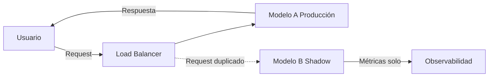
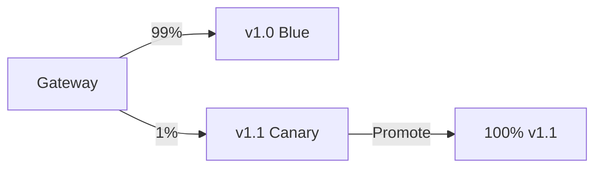
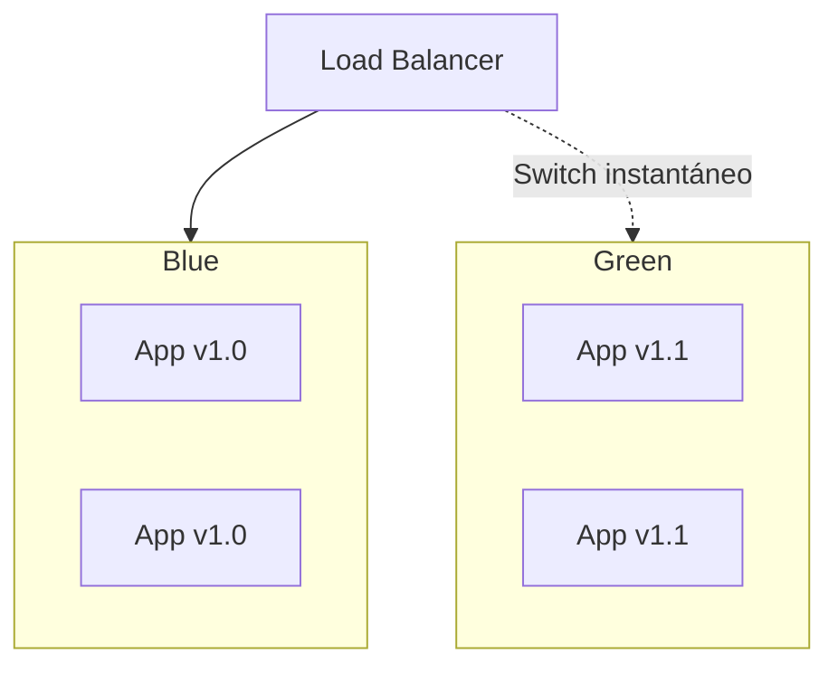

# 🧪 A/B Testing y Shadow Deployment

Desplegar un nuevo modelo de ML en producción sin validación estadística es equivalente a realizar una cirugía sin anestesia: puedes obtener resultados catastróficos sin darte cuenta. Las estrategias de rollout —A/B testing, shadow deployment, canary y blue-green— proporcionan el marco riguroso para introducir cambios minimizando el riesgo operacional y validando hipótesis cuantitativas.

Para el AI Engineer, estas técnicas trascienden la ingeniería de software: implican diseño experimental, inferencia estadística y toma de decisiones bajo incertidumbre.

---

## 1. A/B Testing Estadístico para Modelos de ML

El A/B testing en ML compara una métrica de negocio (conversion rate, revenue, engagement) entre el modelo de control (A) y el modelo de tratamiento (B).

### 1.1 Hipótesis y Significancia

Definimos la hipótesis nula y alternativa:

- $H_0: \mu_B - \mu_A = 0$ (el modelo B no tiene efecto).
- $H_1: \mu_B - \mu_A \neq 0$ (el modelo B tiene efecto diferente).

El **p-value** es la probabilidad de observar una diferencia al menos tan extrema como la medida, asumiendo que $H_0$ es verdadera:

$$
p\text{-value} = P(|\bar{X}_B - \bar{X}_A| \geq |\bar{x}_B - \bar{x}_A| \mid H_0)
$$

Rechazamos $H_0$ si $p\text{-value} < \alpha$, típicamente $\alpha = 0.05$.

⚠️ **Advertencia:** Un p-value bajo no implica que el efecto sea prácticamente significativo. Siempre reporta el tamaño del efecto (effect size) junto con la significancia estadística.

### 1.2 Tamaño de Muestra

Para detectar un efecto mínimo detectable (MDE) con poder estadístico $1-\beta$ y nivel de significancia $\alpha$, el tamaño de muestra por grupo es:

$$
n = \frac{2\sigma^2 (Z_{1-\alpha/2} + Z_{1-\beta})^2}{\text{MDE}^2}
$$

Donde:

- $\sigma^2$: varianza de la métrica.
- $Z_{1-\alpha/2}$: cuantil de la normal para el nivel de confianza (1.96 para 95%).
- $Z_{1-\beta}$: cuantil para el poder estadístico (0.84 para 80%).

**Caso real:** Booking.com ejecuta más de 1,000 experimentos A/B simultáneos. Su plataforma calcula automáticamente el sample size requerido antes de lanzar un experimento, evitando decisiones con datos insuficientes (peeking problem).

---

## 2. Randomization y Stratification

### 2.1 Randomización Simple

Los usuarios se asignan aleatoriamente a los buckets A o B con probabilidad $0.5$. Es simple pero vulnerable a desbalance en covariables.

### 2.2 Stratified Randomization

Los usuarios se dividen en estratos (e.g., país, dispositivo, cohorte) y dentro de cada estrato se randomiza. Garantiza balance en variables conocidas:

$$
P(\text{assign}=B \mid \text{estrato}=s) = 0.5 \quad \forall s
$$

💡 **Tip:** Siempre verifica el balance de covariables post-randomización mediante standardized mean difference (SMD). Un SMD > 0.1 sugiere desbalance problemático.

---

## 3. Shadow Deployment (Shadow Traffic)

En shadow deployment, el tráfico de producción se **duplica** y se envía a la versión candidata (shadow), pero las respuestas del shadow no se devuelven al usuario. Permite evaluar latencia, errores y predicciones sin riesgo.



**Caso real:** LinkedIn utiliza shadow deployment para validar nuevos modelos de feed ranking. Comparan las decisiones del modelo shadow contra el modelo de producción offline y online antes de exponerlo a usuarios reales.

⚠️ **Advertencia:** El shadow traffic duplica la carga de computación. Asegúrate de que la infraestructura del shadow pueda soportar el throughput sin degradar el modelo de producción.

---

## 4. Canary Deployment

El tráfico se enruta gradualmente al nuevo modelo. Empieza con un 1%, valida métricas, y aumenta hasta el 100%.

| Etapa | % Tráfico a Nuevo Modelo | Gate de Aprobación |
|-------|-------------------------|-------------------|
| 1     | 1%                      | Error rate < 0.1% |
| 2     | 5%                      | Latencia p99 < 100ms |
| 3     | 25%                     | Métrica de negocio estable |
| 4     | 50%                     | Sin alertas críticas |
| 5     | 100%                    | Full rollout |



---

## 5. Blue-Green Deployment

Se mantienen dos entornos idénticos: **Blue** (producción actual) y **Green** (nueva versión). El tráfico se switcha instantáneamente de Blue a Green.

Ventaja: rollback instantáneo. Desventaja: costo duplicado de infraestructura.



**Caso real:** AWS utiliza blue-green deployments internamente para actualizar servicios de ML como Amazon Rekognition. La transición se realiza mediante DNS switch o reconfiguración de Elastic Load Balancer.

---

## 6. Feature Flags para Modelos

Las feature flags permiten activar/desactivar modelos o funcionalidades sin redeployment. Útil para:

- Activar un modelo solo para un segmento de usuarios (targeting).
- Apagar un modelo si detectas degradación (kill switch).

Implementación simple:

```python
# Configuración desde ConfigMap o LaunchDarkly
MODEL_VERSION = os.getenv("MODEL_VERSION", "v1")

def predict(features):
    if MODEL_VERSION == "v2" and is_user_in_experiment(features["user_id"]):
        return model_v2.predict(features)
    return model_v1.predict(features)
```

---

## 7. Comparativa de Estrategias de Rollout

| Estrategia | Riesgo de Usuario | Costo Infra | Velocidad Rollback | Requiere Análisis Estadístico | Ideal Para |
|------------|------------------|-------------|--------------------|------------------------------|------------|
| **Shadow** | Cero | Alto (2x compute) | N/A | No (solo sanity checks) | Validación de estabilidad |
| **Canary** | Bajo-Moderado | Moderado | Rápido (revertir %)| Parcial (métricas técnicas) | Despliegues frecuentes |
| **Blue-Green** | Moderado | Alto (2x capacidad)| Instantáneo | No | Cambios críticos, compliance |
| **A/B Test** | Moderado | Moderado | Medio | Sí (riguroso) | Decisiones basadas en métricas de negocio |
| **Feature Flags** | Bajo | Bajo | Instantáneo | No | Experimentación continua |

---

## 8. Fórmulas de Significancia para Proporciones

Para métricas binarias (conversion rate, click-through rate), usamos el test Z para dos proporciones:

$$
Z = \frac{\hat{p}_B - \hat{p}_A}{\sqrt{\hat{p}(1-\hat{p})\left(\frac{1}{n_A} + \frac{1}{n_B}\right)}}
$$

Donde $\hat{p} = \frac{x_A + x_B}{n_A + n_B}$ es la proporción agrupada.

Intervalo de confianza para la diferencia:

$$
CI = (\hat{p}_B - \hat{p}_A) \pm Z_{1-\alpha/2} \sqrt{\frac{\hat{p}_A(1-\hat{p}_A)}{n_A} + \frac{\hat{p}_B(1-\hat{p}_B)}{n_B}}
$$

💡 **Tip:** Utiliza siempre un intervalo de confianza en lugar de solo el p-value. El IC cuantifica la incertidumbre del efecto observado.

---

## 📦 Código de Compresión

```python
# experiment_analysis.py
import numpy as np
from scipy import stats

def ab_test_z_test(conversions_a, total_a, conversions_b, total_b, alpha=0.05):
    p_a = conversions_a / total_a
    p_b = conversions_b / total_b
    p_pooled = (conversions_a + conversions_b) / (total_a + total_b)
    
    se = np.sqrt(p_pooled * (1 - p_pooled) * (1/total_a + 1/total_b))
    z = (p_b - p_a) / se
    p_value = 2 * (1 - stats.norm.cdf(abs(z)))
    
    significant = p_value < alpha
    return {
        "p_a": p_a,
        "p_b": p_b,
        "difference": p_b - p_a,
        "z_score": z,
        "p_value": p_value,
        "significant": significant
    }
```
