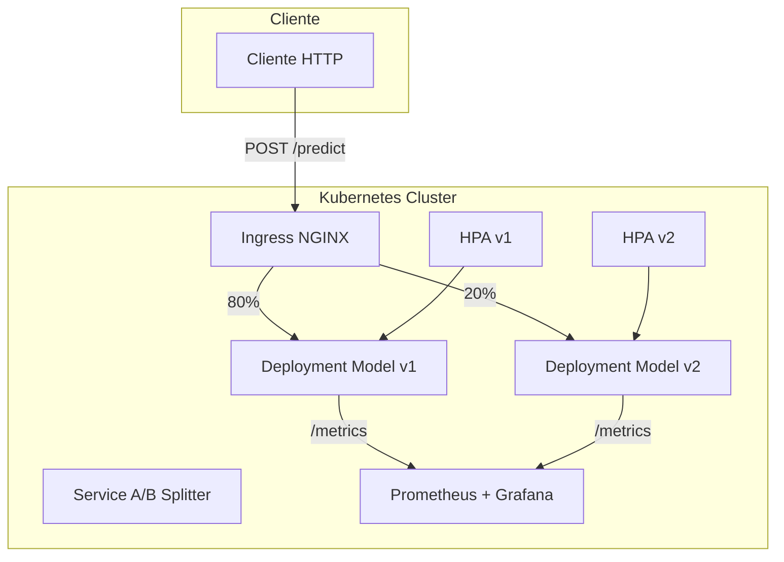
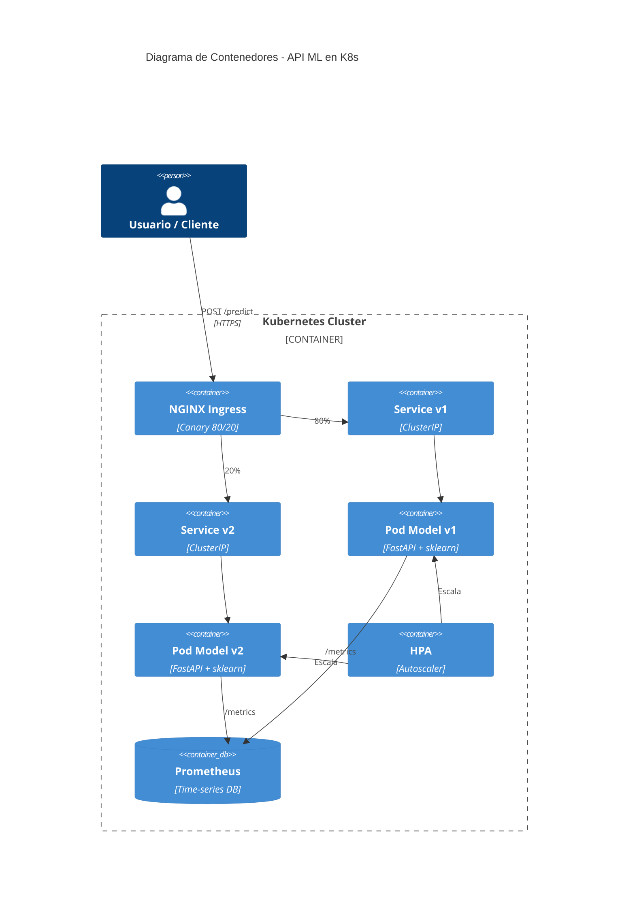

# 🎯 Caso Práctico: API de ML con FastAPI y K8s

Este caso práctico integra todo el conocimiento del módulo. Construiremos una API REST para servir un modelo de ML con FastAPI, la containerizaremos con Docker, la desplegaremos en Kubernetes con autoscaling, health checks, métricas Prometheus y una estrategia de A/B testing entre dos versiones del modelo.

Este es el proyecto tipo que un AI Engineer debe ser capaz de entregar en una organización cloud-native.

---

## 1. Arquitectura del Sistema



---

## 2. Aplicación FastAPI

### 2.1 Código Principal (`main.py`)

```python
import os
import time
import logging
from contextlib import asynccontextmanager
from typing import List

import joblib
import numpy as np
from fastapi import FastAPI, HTTPException
from pydantic import BaseModel
from prometheus_client import Counter, Histogram, generate_latest, CONTENT_TYPE_LATEST
from starlette.responses import Response

MODEL_VERSION = os.getenv("MODEL_VERSION", "v1")
MODEL_PATH = os.getenv("MODEL_PATH", f"/app/models/model_{MODEL_VERSION}.pkl")

# Métricas Prometheus
REQUEST_COUNT = Counter("ml_requests_total", "Total requests", ["model_version", "status"])
REQUEST_LATENCY = Histogram("ml_request_duration_seconds", "Request latency", ["model_version"])
PREDICTION_DIST = Histogram("ml_prediction_values", "Distribution of predictions", ["model_version"])

# Lifecycle: carga del modelo
@asynccontextmanager
async def lifespan(app: FastAPI):
    global model
    if not os.path.exists(MODEL_PATH):
        raise RuntimeError(f"Modelo no encontrado: {MODEL_PATH}")
    model = joblib.load(MODEL_PATH)
    logging.info(f"Modelo {MODEL_VERSION} cargado desde {MODEL_PATH}")
    yield
    logging.info("Shutdown limpio")

app = FastAPI(title="ML Inference API", version=MODEL_VERSION, lifespan=lifespan)

class PredictRequest(BaseModel):
    features: List[List[float]]

class PredictResponse(BaseModel):
    predictions: List[float]
    model_version: str
    latency_ms: float

@app.post("/predict", response_model=PredictResponse)
async def predict(req: PredictRequest):
    start = time.perf_counter()
    try:
        X = np.array(req.features, dtype=np.float32)
        preds = model.predict(X).tolist()
        latency = time.perf_counter() - start
        
        REQUEST_COUNT.labels(model_version=MODEL_VERSION, status="200").inc()
        REQUEST_LATENCY.labels(model_version=MODEL_VERSION).observe(latency)
        for p in preds:
            PREDICTION_DIST.labels(model_version=MODEL_VERSION).observe(p)
        
        return PredictResponse(
            predictions=preds,
            model_version=MODEL_VERSION,
            latency_ms=round(latency * 1000, 2)
        )
    except Exception as e:
        REQUEST_COUNT.labels(model_version=MODEL_VERSION, status="500").inc()
        raise HTTPException(status_code=500, detail=str(e))

@app.get("/health")
async def health():
    return {
        "status": "healthy",
        "model_loaded": model is not None,
        "model_version": MODEL_VERSION
    }

@app.get("/metrics")
async def metrics():
    return Response(content=generate_latest(), media_type=CONTENT_TYPE_LATEST)
```

### 2.2 Dockerfile Optimizado

```dockerfile
FROM python:3.11-slim AS builder
WORKDIR /build
COPY requirements.txt .
RUN pip install --no-cache-dir --user -r requirements.txt

FROM python:3.11-slim
ENV PYTHONDONTWRITEBYTECODE=1 \
    PYTHONUNBUFFERED=1 \
    PATH=/root/.local/bin:$PATH
WORKDIR /app
COPY --from=builder /root/.local /root/.local
COPY src/ ./src/
COPY models/ ./models/
EXPOSE 8000
CMD ["uvicorn", "src.main:app", "--host", "0.0.0.0", "--port", "8000"]
```

### 2.3 `requirements.txt`

```text
fastapi==0.110.0
uvicorn[standard]==0.27.0
pydantic==2.6.0
numpy==1.26.0
scikit-learn==1.4.0
prometheus-client==0.19.0
joblib==1.3.2
```

---

## 3. Manifests de Kubernetes

### 3.1 Deployment Modelo v1

```yaml
apiVersion: apps/v1
kind: Deployment
metadata:
  name: ml-api-v1
  labels:
    app: ml-api
    version: v1
spec:
  replicas: 2
  selector:
    matchLabels:
      app: ml-api
      version: v1
  template:
    metadata:
      labels:
        app: ml-api
        version: v1
    spec:
      containers:
        - name: api
          image: registry/ml-api:v1.0.0
          ports:
            - containerPort: 8000
          env:
            - name: MODEL_VERSION
              value: "v1"
            - name: MODEL_PATH
              value: "/app/models/model_v1.pkl"
          resources:
            requests:
              memory: "512Mi"
              cpu: "250m"
            limits:
              memory: "1Gi"
              cpu: "500m"
          livenessProbe:
            httpGet:
              path: /health
              port: 8000
            initialDelaySeconds: 10
            periodSeconds: 15
          readinessProbe:
            httpGet:
              path: /health
              port: 8000
            initialDelaySeconds: 5
            periodSeconds: 5
```

### 3.2 Deployment Modelo v2 (A/B Test)

```yaml
apiVersion: apps/v1
kind: Deployment
metadata:
  name: ml-api-v2
  labels:
    app: ml-api
    version: v2
spec:
  replicas: 2
  selector:
    matchLabels:
      app: ml-api
      version: v2
  template:
    metadata:
      labels:
        app: ml-api
        version: v2
    spec:
      containers:
        - name: api
          image: registry/ml-api:v2.0.0
          ports:
            - containerPort: 8000
          env:
            - name: MODEL_VERSION
              value: "v2"
            - name: MODEL_PATH
              value: "/app/models/model_v2.pkl"
          resources:
            requests:
              memory: "512Mi"
              cpu: "250m"
            limits:
              memory: "1Gi"
              cpu: "500m"
          livenessProbe:
            httpGet:
              path: /health
              port: 8000
            initialDelaySeconds: 10
            periodSeconds: 15
          readinessProbe:
            httpGet:
              path: /health
              port: 8000
            initialDelaySeconds: 5
            periodSeconds: 5
```

### 3.3 Service para A/B Splitting

```yaml
apiVersion: v1
kind: Service
metadata:
  name: ml-api-service
spec:
  selector:
    app: ml-api
  ports:
    - protocol: TCP
      port: 80
      targetPort: 8000
```

### 3.4 Ingress con Split de Tráfico (NGINX Canary)

```yaml
apiVersion: networking.k8s.io/v1
kind: Ingress
metadata:
  name: ml-api-ingress
  annotations:
    nginx.ingress.kubernetes.io/canary: "true"
    nginx.ingress.kubernetes.io/canary-weight: "20"
spec:
  rules:
    - host: api.mlprod.io
      http:
        paths:
          - path: /
            pathType: Prefix
            backend:
              service:
                name: ml-api-v2-service
                port:
                  number: 80
---
apiVersion: networking.k8s.io/v1
kind: Ingress
metadata:
  name: ml-api-ingress-stable
spec:
  rules:
    - host: api.mlprod.io
      http:
        paths:
          - path: /
            pathType: Prefix
            backend:
              service:
                name: ml-api-v1-service
                port:
                  number: 80
```

⚠️ **Advertencia:** El canary de NGINX Ingress actúa a nivel de request, no de usuario. Si necesitas sticky sessions por usuario (e.g., evitar que un usuario vea ambos modelos), usa cookies de canary (`canary-by-cookie`) o un service mesh como Istio.

### 3.5 Horizontal Pod Autoscaler

```yaml
apiVersion: autoscaling/v2
kind: HorizontalPodAutoscaler
metadata:
  name: ml-api-hpa
spec:
  scaleTargetRef:
    apiVersion: apps/v1
    kind: Deployment
    name: ml-api-v1
  minReplicas: 2
  maxReplicas: 10
  metrics:
    - type: Resource
      resource:
        name: cpu
        target:
          type: Utilization
          averageUtilization: 70
  behavior:
    scaleUp:
      stabilizationWindowSeconds: 60
      policies:
        - type: Percent
          value: 100
          periodSeconds: 60
    scaleDown:
      stabilizationWindowSeconds: 300
```

---

## 4. Métricas de Éxito

### 4.1 Métricas Técnicas (SLOs)

| Métrica | Objetivo (SLO) | Instrumento |
|---------|----------------|-------------|
| Latencia p99 | < 100 ms | Prometheus Histogram |
| Throughput | > 1,000 RPS | Prometheus Counter rate |
| Error Rate | < 0.1% | Prometheus Counter |
| Disponibilidad | 99.9% | Uptime probe |

### 4.2 Métricas de Negocio (A/B Test)

| Métrica | v1 (Control) | v2 (Tratamiento) | Significancia |
|---------|--------------|------------------|---------------|
| Conversion Rate | 12.5% | 13.2% | p < 0.05 |
| Revenue per User | $4.20 | $4.55 | p < 0.01 |

Fórmula de decisión de rollout:

$$
\text{Rollout v2 si } \quad \Delta_{\text{metric}} > 0 \quad \text{y} \quad p\text{-value} < 0.05 \quad \text{y} \quad L_{\text{p99}} < 100\text{ms}
$$

---

## 5. Rolling Updates

K8s realiza rolling updates por defecto. Configura `maxSurge` y `maxUnavailable` para controlar la velocidad:

```yaml
spec:
  strategy:
    type: RollingUpdate
    rollingUpdate:
      maxSurge: 1
      maxUnavailable: 0
```

💡 **Tip:** `maxUnavailable: 0` garantiza que nunca haya menos réplicas disponibles que las deseadas, evitando degradación durante el despliegue.

---

## 6. Prometheus ServiceMonitor

```yaml
apiVersion: monitoring.coreos.com/v1
kind: ServiceMonitor
metadata:
  name: ml-api-monitor
  labels:
    release: prometheus
spec:
  selector:
    matchLabels:
      app: ml-api
  endpoints:
    - port: http
      path: /metrics
      interval: 15s
```

**Caso real:** DoorDash monitoriza más de 500 microservicios de ML con Prometheus y Grafana. Cada servicio expone métricas de latencia, throughput y drift de predicciones. Alertas automáticas pausan deployments canary si la latencia p99 excede el SLO.

---

## 📦 Código de Compresión

```bash
ml-fastapi-k8s/
├── src/
│   ├── __init__.py
│   └── main.py              # FastAPI app con métricas Prometheus
├── models/
│   ├── model_v1.pkl
│   └── model_v2.pkl
├── tests/
│   ├── test_health.py
│   └── test_predict.py
├── docker/
│   ├── Dockerfile
│   ├── .dockerignore
│   └── requirements.txt
├── k8s/
│   ├── namespace.yaml
│   ├── configmap.yaml
│   ├── secret.yaml
│   ├── deployment-v1.yaml
│   ├── deployment-v2.yaml
│   ├── service-v1.yaml
│   ├── service-v2.yaml
│   ├── ingress-canary.yaml
│   ├── hpa.yaml
│   └── servicemonitor.yaml
├── scripts/
│   ├── build.sh
│   ├── deploy.sh
│   └── rollback.sh
└── README.md
```

---

## 🎯 Proyecto Documentado

### Objetivo

Construir y operar un servicio de inferencia ML escalable con garantías de disponibilidad y capacidad de experimentación continua.

### Alcance

- API REST con endpoint `/predict` y `/health`.
- Containerización Docker multi-stage.
- Despliegue en Kubernetes con 2 versiones del modelo.
- Split de tráfico 80/20 para A/B testing.
- Autoscaling basado en CPU.
- Métricas Prometheus para latencia, throughput y error rate.

### Requisitos No Funcionales

- Latencia p99 < 100 ms.
- Error rate < 0.1%.
- Disponibilidad 99.9%.
- Rollback automatizado en < 2 minutos.

### Diagrama de Componentes Final



### Referencias Cruzadas

- Configuración de Docker: [[01 - Docker para ML]]
- Patrones de serving: [[02 - Model Serving Patterns]]
- Conceptos de K8s: [[03 - Kubernetes para ML]]
- Diseño del A/B test: [[04 - A-B Testing y Shadow Deployment]]


