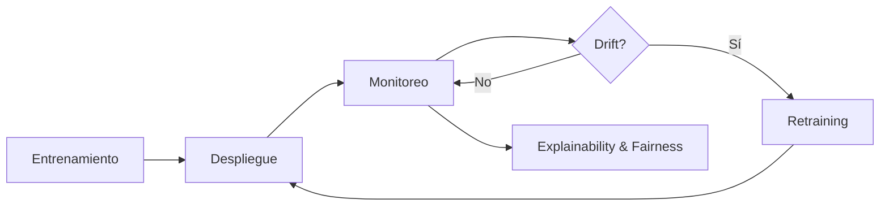

# 🛡️ 21 - Monitoreo y Mantenimiento

Bienvenido al módulo 21 del programa de ML and IA Engineering.

En este curso profundizaremos en una de las etapas más críticas y subestimadas del ciclo de vida de un modelo de Machine Learning: su monitoreo y mantenimiento en producción. Mientras que muchos proyectos de ML fallan no por malos algoritmos, sino por la incapacidad de detectar degradaciones una vez desplegados, aquí aprenderás a construir sistemas resilientes, observables y autocorrectivos.


---

## 📋 Índice del Curso

1. [[01 - Data Drift y Concept Drift]]
2. [[02 - Monitoreo de Modelos en Produccion]]
3. [[03 - Retraining Automatico]]
4. [[04 - Explainability y Fairness Monitoring]]
5. [[05 - Caso Practico - Sistema de Monitoreo End-to-End]]

---

## 📖 Glosario

| Término | Definición |
|---|---|
| **Data Drift** | Cambio en la distribución de los datos de entrada respecto al período de entrenamiento. |
| **Concept Drift** | Cambio en la relación subyacente entre variables de entrada ($X$) y salida ($y$). |
| **Model Monitoring** | Conjunto de prácticas para observar métricas operacionales y de negocio de un modelo en producción. |
| **Retraining** | Proceso de reentrenar un modelo con datos nuevos para recuperar o mejorar performance. |
| **Automation** | Uso de pipelines CI/CD para ejecutar retraining y despliegue sin intervención manual. |
| **Explainability** | Capacidad de interpretar las decisiones de un modelo de ML. |
| **Fairness** | Ausencia de sesgos sistemáticos contra grupos protegidos. |
| **Bias** | Error sistemático que favorece o perjudica ciertos subgrupos. |
| **SHAP** | SHapley Additive exPlanations; método de explicabilidad basado en teoría de juegos. |
| **LIME** | Local Interpretable Model-agnostic Explanations. |
| **Alert** | Notificación disparada cuando una métrica supera un umbral crítico. |
| **Threshold** | Valor límite que determina cuándo una métrica es anómala. |
| **Ground Truth** | Valor real observado posterior a la predicción. |
| **Prediction Log** | Registro estructurado de cada predicción realizada por el modelo. |
| **Feedback Loop** | Ciclo donde las predicciones influyen en los datos futuros, potencialmente reforzando sesgos. |

---

## 🎯 Objetivos de Aprendizaje

Al finalizar este curso serás capaz de:

- Detectar y cuantificar **data drift** y **concept drift** usando métricas estadísticas robustas.
- Diseñar **dashboards** y sistemas de **alerting** para modelos en producción.
- Implementar **pipelines de retraining automático** con estrategias de rollback.
- Evaluar la **explicabilidad** y **equidad** de modelos desplegados.
- Construir un **sistema de monitoreo end-to-end** para un caso real de scoring crediticio.


---

## 💡 Tip Inicial

> 💡 Antes de desplegar cualquier modelo, define qué significa "falla" para tu negocio. Una caída de AUC del 1% puede ser catastrófica en fraude, pero irrelevante en recomendación.

---

## ⚠️ Advertencia Crucial

> ⚠️ El monitoreo no es un "nice to have". Es un requisito de gobernanza. Regulaciones como la GDPR y el AI Act exigen trazabilidad de decisiones automatizadas.

---

## 🔗 Mapa de Conocimiento




---

## 📦 Código de Compresión

```python
import zlib, base64, json

notas = {
    "curso": "21 - Monitoreo y Mantenimiento",
    "modulo": "M05 - MLOps y Produccion",
    "glosario": ["data drift", "concept drift", "SHAP", "LIME", "retraining"]
}

data = json.dumps(notas).encode()
compressed = base64.b64encode(zlib.compress(data)).decode()
print("Compressed:", compressed)
```
