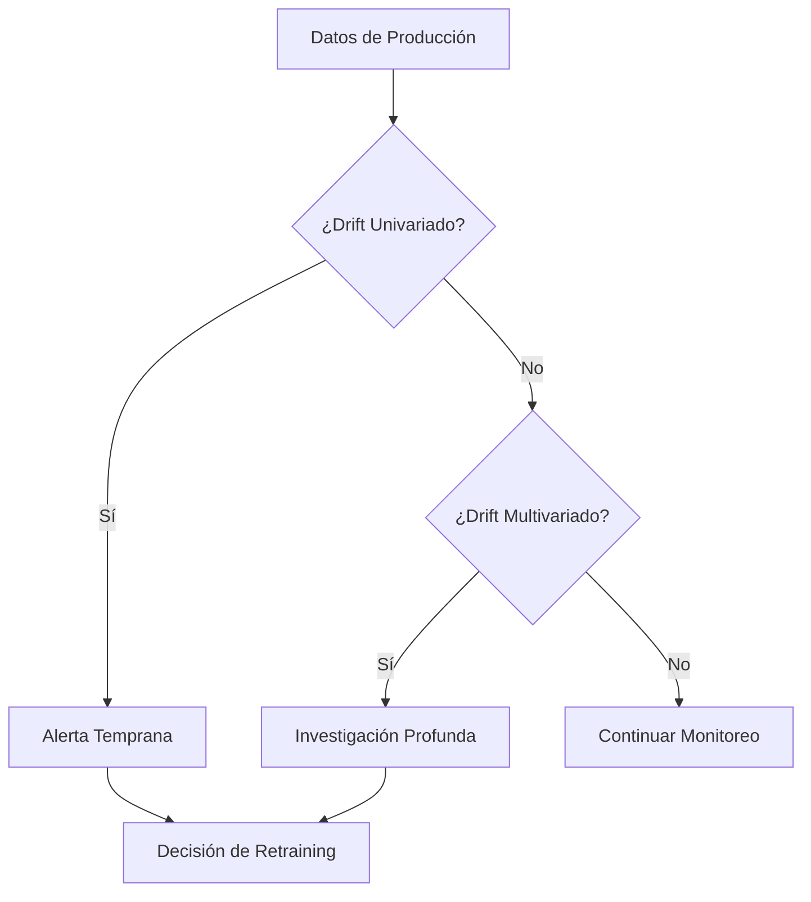

# 🌊 01 - Data Drift y Concept Drift

En producción, los modelos de Machine Learning enfrentan entornos dinámicos donde las distribuciones de datos y las relaciones subyacientes cambian con el tiempo. Ignorar estos cambios es uno de los principales motivos de degradación de modelos. Comprender, detectar y mitigar el drift es una competencia esencial para cualquier ML/AI Engineer.


---

## 1. Fundamentos del Drift

El drift se refiere a cualquier cambio en los datos o en la relación entrada-salida que invalida las suposiciones hechas durante el entrenamiento. Formalmente, si durante el entrenamiento asumimos $P_{train}(X, y) = P_{train}(X) P_{train}(y|X)$, en producción podemos tener:

$$P_{prod}(X, y) \neq P_{train}(X, y)$$

Este cambio puede descomponerse en dos componentes principales: cambios en $P(X)$ (data drift) y cambios en $P(y|X)$ (concept drift).

---

## 2. Tipos de Drift

### 2.1 Covariate Shift

Ocurre cuando la distribución de las variables de entrada cambia, pero la relación condicional se mantiene:

$$P_{train}(y|X) = P_{prod}(y|X) \quad \text{pero} \quad P_{train}(X) \neq P_{prod}(X)$$

**Ejemplo:** Un modelo de scoring crediticio entrenado en una población urbana se despliega en una población rural con diferentes distribuciones de ingresos.

### 2.2 Prior Probability Shift

Cambio en la distribución marginal de la variable objetivo:

$$P_{train}(y) \neq P_{prod}(y)$$

**Ejemplo:** Durante una recesión, la tasa de incumplimiento crediticio aumenta drásticamente, alterando la prevalencia de la clase positiva.

### 2.3 Concept Drift

Cambio en la propia relación entre $X$ y $y$:

$$P_{train}(y|X) \neq P_{prod}(y|X)$$

**Ejemplo:** Tras una reforma regulatoria, los factores que antes predecían el riesgo crediticio ya no son válidos porque cambió el comportamiento del mercado.

| Tipo de Drift | ¿Cambia $P(X)$? | ¿Cambia $P(y)$? | ¿Cambia $P(y|X)$? |
|---|---|---|---|
| Covariate Shift | Sí | Posiblemente | No |
| Prior Probability Shift | Posiblemente | Sí | No |
| Concept Drift | Posiblemente | Posiblemente | Sí |

---

## 3. Detección de Drift

### 3.1 Enfoque Univariado

Analiza cada característica por separado. Es computacionalmente eficiente pero ignora interacciones multidimensionales.

### 3.2 Enfoque Multivariado

Considera el espacio completo de características simultáneamente. Es más sensible a drift en combinaciones de variables pero más costoso.

Caso real: En 2020, un modelo de predicción de demanda de Netflix detectó drift multivariado cuando la pandemia cambió simultáneamente horarios de visualización, géneros preferidos y dispositivos utilizados.

---

## 4. Métricas Estadísticas para Detección

### 4.1 Kolmogorov-Smirnov (KS) Test

Prueba no paramétrica que compara dos distribuciones continuas. La estadística KS se define como:

$$D_{n,m} = \sup_x |F_{1,n}(x) - F_{2,m}(x)|$$

donde $F_{1,n}$ y $F_{2,m}$ son las funciones de distribución empírica de las muestras de referencia y producción.

### 4.2 Population Stability Index (PSI)

Mide la estabilidad relativa de una población entre dos períodos. Es ampliamente usado en riesgo crediticio.

$$\text{PSI} = \sum_{i=1}^{N} (A_i - E_i) \ln\left(\frac{A_i}{E_i}\right)$$

Donde:
- $A_i$: porcentaje actual en el bucket $i$
- $E_i$: porcentaje esperado (entrenamiento) en el bucket $i$

**Interpretación:**
- PSI < 0.1: Sin cambio significativo
- 0.1 ≤ PSI < 0.25: Cambio moderado
- PSI ≥ 0.25: Cambio significativo, requiere investigación

### 4.3 Chi-Square Test

Para variables categóricas:

$$\chi^2 = \sum_{i=1}^{k} \frac{(O_i - E_i)^2}{E_i}$$

### 4.4 Wasserstein Distance (Earth Mover's Distance)

Mide el costo mínimo de transformar una distribución en otra. Para distribuciones unidimensionales:

$$W_1(P, Q) = \int_{-\infty}^{\infty} |F_P(x) - F_Q(x)| \, dx$$

O equivalentemente, usando la formulación de Kantorovich:

$$W_1(P, Q) = \inf_{\gamma \in \Gamma(P,Q)} \mathbb{E}_{(x,y)\sim\gamma}[|x-y|]$$

donde $\Gamma(P,Q)$ es el conjunto de todas las copulas con marginales $P$ y $Q$.

| Métrica | Tipo de Variable | Sensibilidad | Complejidad |
|---|---|---|---|
| KS Test | Continua | Media | Baja |
| PSI | Continua / Categórica | Media | Baja |
| Chi-Square | Categórica | Media | Baja |
| Wasserstein | Continua | Alta | Media |

---

## 5. Causas del Drift

### 5.1 Seasonality (Estacionalidad)

Patrones que se repiten en ciclos temporales predecibles (diarios, semanales, anuales). No siempre constituyen drift problemático si el modelo fue entrenado con datos que capturan la estacionalidad.

### 5.2 Trends (Tendencias)

Cambios direccionales a largo plazo en la media o varianza de las variables. Ejemplo: inflación sostenida que eleva los montos de crédito promedio.

### 5.3 Eventos Externos

Puntos de quiebre causados por fenómenos no predecibles: pandemias, crisis financieras, cambios regulatorios, guerras comerciales.

Caso real: En 2022, múltiples modelos de pricing de energía en Europa experimentaron drift severo debido a la volatilidad geopolítica. Las métricas de PSI de variables de costo de gas superaron 0.5 en cuestión de semanas.

---

## 6. Estrategias de Mitigación

1. **Ventanas temporales deslizantes:** Entrenar solo con los últimos $N$ días de datos.
2. **Ponderación temporal:** Dar más peso a observaciones recientes.
3. **Online Learning:** Actualizar el modelo con cada nueva observación.
4. **Ensemble de modelos temporales:** Combinar modelos entrenados en diferentes ventanas de tiempo.
5. **Feature engineering robusto:** Crear features invariantes a ciertos cambios de escala.

---

## 7. Frecuencia de Detección

La frecuencia debe alinearse con la velocidad de cambio del dominio:

| Dominio | Frecuencia Recomendada |
|---|---|
| Publicidad digital (RTB) | Minuto a minuto |
| Recomendación de contenido | Horaria |
| Scoring crediticio | Diaria / Semanal |
| Predicción de churn mensual | Semanal / Mensual |

⚠️ **Advertencia:** Detectar drift con demasiada frecuencia genera falsos positivos. Usa corrección de Bonferroni o FDR (False Discovery Rate) cuando ejecutes múltiples pruebas simultáneas.

💡 **Tip:** Combina métricas de drift univariado con una métrica multivariado de respaldo. El drift puede ser invisible en variables individuales pero evidente en el espacio conjunto.

---

## 8. Implementación en Python

```python
import numpy as np
import pandas as pd
from scipy import stats

def calculate_psi(expected, actual, buckets=10):
    """
    Calcula el Population Stability Index (PSI).
    """
    def scale_range(input, min_val, max_val):
        return (input - min_val) / (max_val - min_val)
    
    breakpoints = np.linspace(0, 1, buckets + 1)
    expected_scaled = scale_range(expected, expected.min(), expected.max())
    actual_scaled = scale_range(actual, actual.min(), actual.max())
    
    expected_percents = np.histogram(expected_scaled, breakpoints)[0] / len(expected)
    actual_percents = np.histogram(actual_scaled, breakpoints)[0] / len(actual)
    
    def sub_psi(e_perc, a_perc):
        if a_perc == 0:
            a_perc = 0.0001
        if e_perc == 0:
            e_perc = 0.0001
        return (e_perc - a_perc) * np.log(e_perc / a_perc)
    
    psi = sum(sub_psi(e, a) for e, a in zip(expected_percents, actual_percents))
    return psi

# Ejemplo de uso
np.random.seed(42)
reference = np.random.normal(100, 10, 1000)
current = np.random.normal(105, 12, 1000)

psi_value = calculate_psi(reference, current)
print(f"PSI: {psi_value:.4f}")

# KS Test
ks_stat, p_value = stats.ks_2samp(reference, current)
print(f"KS Statistic: {ks_stat:.4f}, p-value: {p_value:.4f}")
```

---

## 9. Diagrama de Detección de Drift




---

## 📦 Código de Compresión

```python
import zlib, base64

code = '''
import numpy as np
from scipy import stats

def psi(expected, actual, buckets=10):
    bp = np.linspace(0, 1, buckets+1)
    e_pct = np.histogram(expected, bp)[0] / len(expected)
    a_pct = np.histogram(actual, bp)[0] / len(actual)
    return sum((e-a)*np.log(e/a) if e and a else 0 for e,a in zip(e_pct+1e-4, a_pct+1e-4))
'''

compressed = base64.b64encode(zlib.compress(code.encode())).decode()
print(compressed)
```
