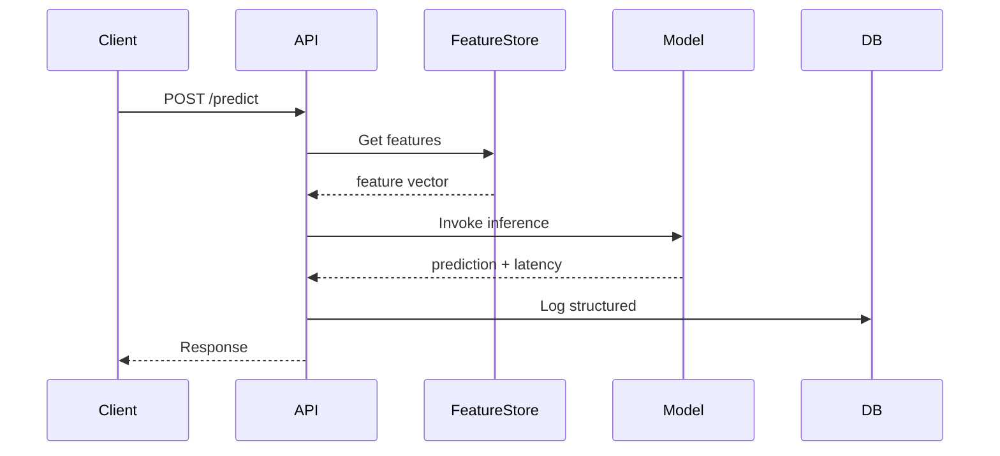
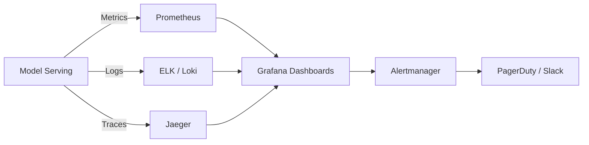

# 📡 02 - Monitoreo de Modelos en Produccion

Un modelo desplegado no es una entidad estática. Requiere observabilidad continua tanto a nivel operacional como de performance de negocio. El monitoreo efectivo permite detectar degradaciones antes de que impacten métricas de negocio y proporciona la trazabilidad exigida por regulaciones modernas.


---

## 1. Métricas Operacionales

Estas métricas responden a la pregunta: ¿El modelo está disponible y respondiendo correctamente como servicio?

### 1.1 Latencia

Tiempo transcurrido entre el envío de una solicitud y la recepción de la respuesta. Se mide típicamente en percentiles:

- **p50 (mediana):** Latencia típica.
- **p95 / p99:** Latencia en el peor caso, crítica para SLAs.

$$\text{Latency}_{p99} = \inf\{t : P(T \leq t) \geq 0.99\}$$

### 1.2 Throughput

Número de predicciones por unidad de tiempo:

$$\text{Throughput} = \frac{\text{Número de predicciones}}{\text{Ventana temporal}}$$

### 1.3 Error Rate

Proporción de solicitudes que resultan en errores (HTTP 5xx, excepciones, timeouts):

$$\text{Error Rate} = \frac{\text{Solicitudes fallidas}}{\text{Solicitudes totales}} \times 100$$

### 1.4 Resource Usage

CPU, memoria, GPU utilization y I/O de red. Un incremento sostenido en el uso de recursos puede indicar memory leaks o aumento inesperado de carga.

---

## 2. Métricas de Modelo con Ground Truth

Cuando contamos con la verdad real (ground truth) posterior a la predicción, podemos calcular métricas de calidad directamente.

### 2.1 Accuracy

$$\text{Accuracy} = \frac{TP + TN}{TP + TN + FP + FN}$$

### 2.2 Precision y Recall

$$\text{Precision} = \frac{TP}{TP + FP} \quad , \quad \text{Recall} = \frac{TP}{TP + FN}$$

### 2.3 F1-Score

$$F_1 = 2 \cdot \frac{\text{Precision} \cdot \text{Recall}}{\text{Precision} + \text{Recall}}$$

### 2.4 AUC-ROC

Área bajo la curva ROC, insensible al desbalance de clases:

$$\text{AUC} = \int_{0}^{1} \text{TPR}(\text{FPR}^{-1}(x)) \, dx$$

Caso real: Un banco norteamericano monitorea semanalmente el AUC de su modelo de detección de lavado de dinero. Un drop del AUC por debajo de 0.85 dispara automáticamente un pipeline de investigación de datos.

---

## 3. Proxy Metrics sin Ground Truth

En muchos escenarios, la verdad real tarda semanas o meses en llegar (ej. default crediticio). En estos casos, usamos métricas proxy:

| Proxy Metric | Descripción | Cuándo Usar |
|---|---|---|
| **Prediction Distribution** | Histograma de scores de salida. Cambios indican drift. | Siempre |
| **Confidence Scores** | Media de probabilidades predichas para la clase mayoritaria. | Clasificación probabilística |
| **Upstream Metrics** | Métricas de negocio correlacionadas (tasa de aprobación). | Cuando hay correlación conocida |
| **Human-in-the-loop Labels** | Muestras auditadas manualmente. | Alta criticidad |

⚠️ **Advertencia:** Los proxy metrics pueden ser engañosos. Una distribución de predicciones estable no garantiza ausencia de concept drift.

---

## 4. Dashboards y Herramientas

### 4.1 Grafana + Prometheus

Prometheus recolecta métricas en formato time-series. Grafana las visualiza. Es el estándar de facto en monitoreo de infraestructura y se extiende fácilmente a ML.

### 4.2 Estructura de Logs

Cada predicción debe loguearse de forma estructurada:

```json
{
  "timestamp": "2024-01-15T10:23:00Z",
  "model_version": "v2.3.1",
  "request_id": "uuid-1234",
  "features": {"income": 45000, "age": 34},
  "prediction": 0.82,
  "latency_ms": 45,
  "region": "EU-WEST"
}
```

### 4.3 Distributed Tracing

Usando OpenTelemetry o Jaeger, podemos trazar una solicitud a través de múltiples servicios: API Gateway → Feature Store → Model Serving → Post-procesamiento.



---

## 5. Alerting Efectivo

Un sistema de alertas debe minimizar el ruido (falsos positivos) y no perder señales reales.

### 5.1 Tipos de Umbrales

- **Estático:** Valor fijo (ej. Latencia p99 > 500ms).
- **Dinámico:** Basado en desviaciones de la media móvil (ej. AUC < media_7d - 2*std).
- **Basado en ML:** Modelo de anomalías sobre las métricas mismas.

### 5.2 Severidad

| Severidad | Condición | Acción |
|---|---|---|
| P0 | Error rate > 10% o Latencia p99 > 5s | Página al on-call |
| P1 | AUC drop > 5% o PSI > 0.25 | Ticket prioritario |
| P2 | Drift leve o uso de recursos alto | Alerta por Slack |

💡 **Tip:** Usa el principio de "alertas sintéticas": en lugar de alertar por cada métrica, crea una métrica compuesta de "salud del modelo" ponderada por criticidad de negocio.

---

## 6. Implementación de Métricas en Python

```python
import time
from functools import wraps
from prometheus_client import Counter, Histogram, Gauge, start_http_server

# Métricas de Prometheus
REQUEST_COUNT = Counter('model_requests_total', 'Total requests', ['model_version', 'status'])
REQUEST_LATENCY = Histogram('model_request_latency_seconds', 'Request latency')
PREDICTION_GAUGE = Gauge('model_prediction_score', 'Last prediction score')

def monitor(func):
    @wraps(func)
    def wrapper(*args, **kwargs):
        start = time.time()
        try:
            result = func(*args, **kwargs)
            status = 'success'
            if isinstance(result, dict) and 'prediction' in result:
                PREDICTION_GAUGE.set(result['prediction'])
            return result
        except Exception as e:
            status = 'error'
            raise e
        finally:
            latency = time.time() - start
            REQUEST_LATENCY.observe(latency)
            REQUEST_COUNT.labels(model_version='v1', status=status).inc()
    return wrapper

@monitor
def predict(features):
    # Simulación de inferencia
    time.sleep(0.05)
    return {"prediction": 0.85, "version": "v1"}

if __name__ == "__main__":
    start_http_server(8000)
    predict({"income": 50000})
```

---

## 7. Arquitectura de Monitoreo




---

## 📦 Código de Compresión

```python
import zlib, base64, json

metrics_config = {
    "latency_p99_threshold": 0.5,
    "error_rate_threshold": 0.05,
    "auc_threshold": 0.80,
    "psi_threshold": 0.25
}

raw = json.dumps(metrics_config).encode()
compressed = base64.b64encode(zlib.compress(raw)).decode()
print("Config comprimida:", compressed)
```
