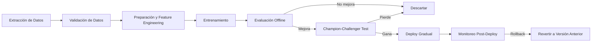

# 🔄 03 - Retraining Automatico

El retraining automático es la capacidad de un sistema MLOps para detectar degradación, entrenar un nuevo modelo y desplegarlo con mínima o nula intervención humana. Sin embargo, la automatización completa conlleva riesgos que deben mitigarse mediante patrones de validación, pruebas y rollback.


---

## 1. Estrategias de Trigger (Disparadores)

### 1.1 Schedule-Based

El retraining ocurre en intervalos fijos (diario, semanal, mensual). Es predecible pero puede ser ineficiente si no hay cambios significativos.

### 1.2 Performance-Based

Se dispara cuando una métrica de performance (AUC, F1, RMSE) cae por debajo de un umbral:

$$\text{Trigger} = \mathbb{1}[\text{Metric}_{actual} < \text{Threshold}]$$

### 1.3 Data Drift-Based

Se activa cuando métricas de drift (PSI, KS, Wasserstein) superan umbrales críticos. Es proactivo porque actúa antes de que la performance se degrade visiblemente.

### 1.4 Event-Based

Disparado por eventos de negocio: lanzamiento de producto, cambio regulatorio, adquisición de nueva fuente de datos.

| Estrategia | Ventaja | Desventaja |
|---|---|---|
| Schedule-Based | Simple, predecible | Puede ser innecesario o tardío |
| Performance-Based | Directo al impacto de negocio | Requiere ground truth con latencia |
| Drift-Based | Proactivo | Puede generar retraininges innecesarios |
| Event-Based | Alineado a negocio | Requiere integración con sistemas externos |

---

## 2. Pipeline de Retraining

Un pipeline robusto de retraining debe seguir el siguiente flujo:



### 2.1 Extracción

Selección de la ventana temporal de datos. Debe incluir suficientes ejemplos de todas las clases y subgrupos relevantes.

### 2.2 Preparación

Aplicación de transformaciones, imputación, encoding y feature engineering. Las transformaciones deben ser consistentes con el pipeline de entrenamiento original.

### 2.3 Entrenamiento

Puede ser **warm start** (inicializar pesos desde el modelo anterior) o **cold start** (entrenar desde cero).

### 2.4 Validación

Validación cruzada temporal para series temporales, o validación estratificada para datos i.i.d.

---

## 3. Champion-Challenger Pattern

En lugar de reemplazar directamente el modelo en producción (champion), se despliega el candidato (challenger) en paralelo. Se comparan sus predicciones en tiempo real (shadow mode) o se asigna un porcentaje de tráfico (canary release).

$$\text{Ganador} = \arg\max_{m \in \{champion, challenger\}} \text{Metric}_{online}(m)$$

Caso real: Amazon utiliza champion-challenger de forma masiva. Cada día ejecutan miles de experimentos A/B donde modelos candidatos compiten contra el modelo productivo actual antes de ser promovidos.

---

## 4. Rollback Strategies

Si un nuevo modelo degradado se despliega, el sistema debe poder revertir rápidamente:

1. **Blue-Green Deployment:** Mantener la versión anterior activa en standby. El switch es instantáneo.
2. **Canary Rollback:** Si el canary muestra degradación, detener el tráfico al nuevo modelo.
3. **Versionado de Modelos:** Cada modelo debe ser inmutable y versionado (ej. MLflow Model Registry).

⚠️ **Advertencia:** Nunca elimines la versión anterior del modelo inmediatamente después del despliegue. Conserva al menos $N$ versiones previas con capacidad de rollback.

---

## 5. Testing Antes del Despliegue

### 5.1 Unit Tests

Pruebas sobre funciones de preprocesamiento y postprocesamiento.

### 5.2 Model Contract Tests

Verificar que el modelo espera exactamente las features que le envía el cliente:

```python
assert set(input_features) == set(model_expected_features)
assert all(input_features[f].dtype == expected_dtype[f] for f in input_features)
```

### 5.3 Integration Tests

Validar el flujo completo: request → feature store → modelo → response → log.

### 5.4 Bias Testing

Ejecutar fairness metrics sobre el nuevo conjunto de datos antes de autorizar el despliegue.

---

## 6. Costos de Retraining

El retraining no es gratis. Debe considerarse:

- **Costo computacional:** GPU/CPU horas para entrenamiento.
- **Costo de datos:** Extracción y almacenamiento de grandes volúmenes.
- **Costo operacional:** Tiempo del equipo de ML para investigar falsos triggers.
- **Costo de oportunidad:** Degradación del modelo mientras se ejecuta el pipeline.

| Factor | Cold Start | Warm Start |
|---|---|---|
| Tiempo de entrenamiento | Alto | Bajo |
| Riesgo de overfitting a datos recientes | Menor | Mayor |
| Capacidad de escape de mínimos locales | Mayor | Menor |
| Recomendado para | Drift severo | Drift leve / actualización incremental |

💡 **Tip:** Implementa un "circuit breaker" en tu pipeline de retraining: si el costo estimado supera un umbral o el dataset nuevo es menor a un tamaño mínimo, aborta y alerta.

---

## 7. Warm Start vs Cold Start

### Warm Start

Inicializa los parámetros del modelo con los pesos del modelo anterior. Es ideal para adaptaciones incrementales:

```python
from sklearn.linear_model import SGDClassifier

model = SGDClassifier(warm_start=True)
model.fit(X_old, y_old)
model.partial_fit(X_new, y_new)  # Warm start update
```

### Cold Start

Entrenamiento desde pesos aleatorios o default. Es necesario cuando la arquitectura cambia o se sospecha que el modelo anterior está severamente sesgado.

---

## 📦 Código de Compresión

```python
import zlib, base64

pipeline_code = '''
def retraining_pipeline(trigger, data_window):
    if trigger == 'performance' and auc < 0.80:
        df = extract(data_window)
        X, y = prepare(df)
        challenger = train(X, y, warm_start=True)
        if champion_challenger(challenger) > current:
            deploy(challenger, strategy='canary')
'''

compressed = base64.b64encode(zlib.compress(pipeline_code.encode())).decode()
print("Pipeline comprimido:", compressed)
```
