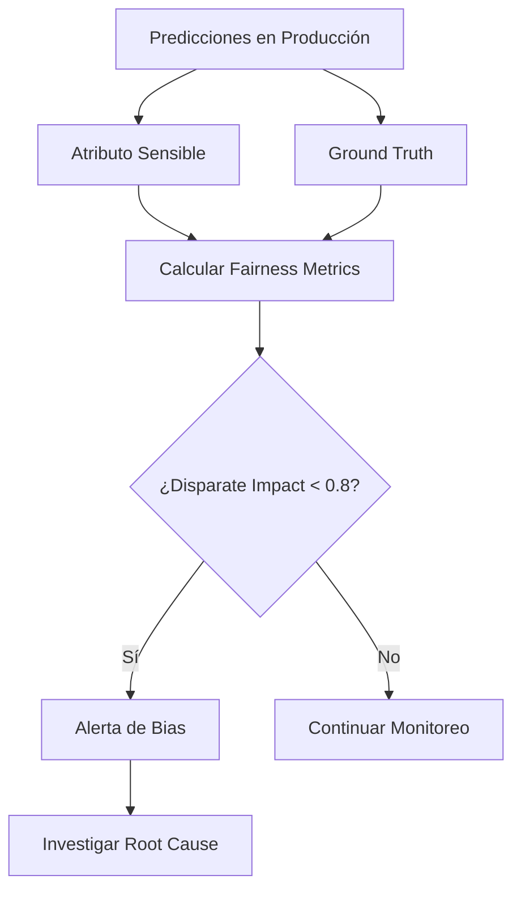

# 🧠 04 - Explainability y Fairness Monitoring

Los modelos de ML en producción no solo deben ser precisos, sino también explicables y justos. La incapacidad de explicar una decisión puede resultar en sanciones regulatorias, mientras que un modelo sesgado puede causar daño reputacional y social. El monitoreo de explainability y fairness es una disciplina obligatoria en MLOps maduro.


---

## 1. Explainability Post-Hoc

La explainability post-hoc busca interpretar un modelo ya entrenado sin modificar su arquitectura.

### 1.1 SHAP Values

Basado en la teoría de juegos cooperativos, SHAP asigna a cada feature una contribución marginal a la predicción.

El valor de Shapley para la feature $i$ se define como:

$$\phi_i(f) = \sum_{S \subseteq N \setminus \{i\}} \frac{|S|!(|N|-|S|-1)!}{|N|!} [f_{S \cup \{i\}}(x_{S \cup \{i\}}) - f_S(x_S)]$$

Donde:
- $N$ es el conjunto de todas las features.
- $S$ es un subconjunto de features sin la feature $i$.
- $f_S(x_S)$ es la predicción del modelo entrenado solo con el subconjunto $S$.

**Propiedades clave:**
- **Eficiencia:** $\sum_{i=1}^{M} \phi_i(f) = f(x) - \mathbb{E}[f(X)]$
- **Simetría:** Features idénticas reciben valores idénticos.
- **Dummy:** Una feature que no cambia la predicción recibe valor cero.

Caso real: En 2018, Apple Card fue acusado de sesgo de género en límites de crédito. La falta de explainability dificultó la defensa inicial. Posteriormente, las instituciones financieras adoptaron SHAP para documentar cada decisión crediticia.

### 1.2 LIME

LIME explica predicciones individuales aproximando localmente el modelo complejo con un modelo interpretable (ej. regresión lineal) en el vecindario de la instancia:

$$\xi(x) = \arg\min_{g \in G} \mathcal{L}(f, g, \pi_x) + \Omega(g)$$

Donde $\mathcal{L}$ mide la fidelidad local, $\pi_x$ define el vecindario y $\Omega(g)$ penaliza la complejidad de la explicación.

### 1.3 Permutation Importance

Mide la disminución de performance al permutar aleatoriamente una feature. Es modelo-agnóstico y fácil de implementar.

### 1.4 Partial Dependence Plots (PDP)

Muestra el efecto marginal de una feature sobre la predicción promedio:

$$\hat{f}_S(x_S) = \mathbb{E}_{X_C}[\hat{f}(x_S, X_C)] = \int \hat{f}(x_S, x_C) \, dP(x_C)$$

Donde $S$ es el conjunto de features de interés y $C$ es el complemento.

---

## 2. Fairness Metrics

La fairness busca garantizar que el modelo no discrimine sistemáticamente contra grupos protegidos definidos por atributos sensibles $A$ (género, raza, edad).

### 2.1 Demographic Parity

La tasa de predicción positiva debe ser igual entre grupos:

$$P(\hat{Y}=1 | A=0) = P(\hat{Y}=1 | A=1)$$

### 2.2 Equalized Odds

La tasa de verdaderos positivos y falsos positivos debe ser igual:

$$P(\hat{Y}=1 | Y=y, A=0) = P(\hat{Y}=1 | Y=y, A=1) \quad \text{para } y \in \{0,1\}$$

### 2.3 Equal Opportunity

Igualdad en la tasa de verdaderos positivos (caso particular de Equalized Odds):

$$P(\hat{Y}=1 | Y=1, A=0) = P(\hat{Y}=1 | Y=1, A=1)$$

### 2.4 Calibration

La probabilidad predicha debe reflejar la frecuencia real del evento en cada grupo:

$$P(Y=1 | \hat{Y}=p, A=0) = P(Y=1 | \hat{Y}=p, A=1) = p$$

| Métrica | Definición Intuitiva | Cuándo Priorizar |
|---|---|---|
| Demographic Parity | Igual aprobación entre grupos | Cuando la distribución de decisiones debe ser neutra |
| Equalized Odds | Igual error rate en ambos grupos | Cuando el costo de errores es simétrico |
| Equal Opportunity | Igual recall entre grupos | Cuando no queremos omitir positivos en un grupo |
| Calibration | Las probabilidades son correctas | Cuando se usan scores para ranking o pricing |

⚠️ **Advertencia:** Es matemáticamente imposible satisfacer Demographic Parity, Equalized Odds y Calibration simultáneamente cuando las prevalencias de clase difieren entre grupos (resultado probado por Kleinberg et al., 2016).

---

## 3. Bias Detection e Intersectional Fairness

El bias puede ser más severo en intersecciones de atributos protegidos. Por ejemplo, mujeres mayores de 60 años pueden ser doblemente discriminadas.

La **intersectional fairness** evalúa métricas no solo por grupo individual sino por combinaciones:

$$\text{Disparate Impact}_{intersectional} = \frac{P(\hat{Y}=1 | A_1=a_1, A_2=a_2)}{P(\hat{Y}=1 | A_1=\text{referencia}, A_2=\text{referencia})}$$

Un umbral común es la "regla del 80%": si el ratio es menor a 0.8, existe evidencia de impacto disparatado (disparate impact).

---

## 4. Regulación y Cumplimiento

### 4.1 GDPR

Artículo 22: Los sujetos tienen derecho a no ser objeto de decisiones automatizadas con efectos legales significativos, salvo que haya intervención humana, contrato necesario o consentimiento explícito. Exige el derecho a obtener una explicación significativa.

### 4.2 AI Act (UE)

Regula sistemas de IA de alto riesgo (incluyendo scoring crediticio y selección de candidatos). Exige:
- Transparencia y provision de información a usuarios.
- Monitoreo de sesgos post-despliegue.
- Registro de incidentes y logging.

Caso real: En 2023, la Comisión Europea impuso multas preliminares a una fintech por no poder demostrar la ausencia de sesgo de género en su modelo de aprobación de préstamos, citando incumplimiento del borrador del AI Act.

---

## 5. Tradeoffs: Accuracy vs Fairness

Restringir un modelo para que sea justo puede reducir su accuracy global. Este tradeoff debe ser una decisión de negocio, no solo técnica.

$$\min_{\theta} \mathcal{L}(\theta) + \lambda \cdot \text{FairnessPenalty}(\theta)$$

Donde $\lambda$ controla el compromiso entre performance y equidad.

💡 **Tip:** Documenta siempre el tradeoff accuracy-fairness en un PDD (Performance and Fairness Declaration) accesible para auditores y stakeholders.

---

## 6. Implementación en Python

```python
import shap
import numpy as np
from sklearn.ensemble import RandomForestClassifier
from sklearn.metrics import confusion_matrix

# Entrenamiento simple
X_train = np.random.rand(1000, 5)
y_train = (X_train[:, 0] + X_train[:, 1] > 1).astype(int)
model = RandomForestClassifier(n_estimators=50)
model.fit(X_train, y_train)

# SHAP
explainer = shap.TreeExplainer(model)
shap_values = explainer.shap_values(X_train[:100])
shap.summary_plot(shap_values[1], X_train[:100])

# Fairness básica: Equal Opportunity
sensitive = (X_train[:, 2] > 0.5).astype(int)  # atributo protegido simulado
y_pred = model.predict(X_train)

def equal_opportunity(y_true, y_pred, sensitive):
    groups = np.unique(sensitive)
    tprs = []
    for g in groups:
        mask = sensitive == g
        cm = confusion_matrix(y_true[mask], y_pred[mask])
        tn, fp, fn, tp = cm.ravel()
        tprs.append(tp / (tp + fn))
    return tprs

tprs = equal_opportunity(y_train, y_pred, sensitive)
print(f"TPR Grupo 0: {tprs[0]:.3f}, TPR Grupo 1: {tprs[1]:.3f}")
```

---

## 7. Diagrama de Monitoreo de Fairness




---

## 📦 Código de Compresión

```python
import zlib, base64

code = '''
import shap
from sklearn.metrics import confusion_matrix

def fairness_report(model, X, y, sensitive):
    pred = model.predict(X)
    for g in [0,1]:
        mask = sensitive == g
        tn,fp,fn,tp = confusion_matrix(y[mask], pred[mask]).ravel()
        print(f"Group {g} TPR: {tp/(tp+fn):.3f}")
'''

compressed = base64.b64encode(zlib.compress(code.encode())).decode()
print("Fairness code compressed:", compressed)
```
