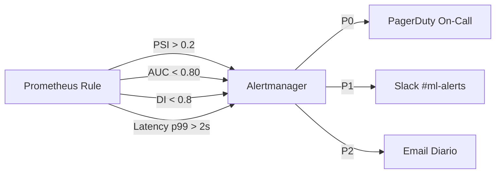
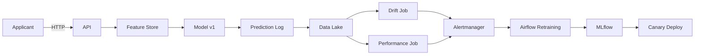

# 🎯 05 - Caso Practico - Sistema de Monitoreo End-to-End

Este caso práctico integra todos los conceptos del curso en un sistema de monitoreo real para un modelo de **scoring de crédito**. El objetivo es construir una arquitectura que detecte drift, monitoree performance, evalúe fairness, explique decisiones y dispare retraining automático.


---

## 1. Contexto del Proyecto

**Dominio:** Banca digital.

**Modelo:** Clasificador binario que predice la probabilidad de incumplimiento (default) en préstamos personales.

**Impacto:** Decisiones de aprobación/rechazo afectan directamente a clientes y al riesgo de la institución.

**Regulación:** Sujeto a GDPR y al AI Act de la UE.

Caso real: Un neobanco europeo con 2 millones de clientes experimentó una caída del 12% en AUC durante la crisis energética de 2022 porque no tenía monitoreo de drift en ingresos regionales. Este proyecto evita esa situación.

---

## 2. Requisitos Funcionales

| ID | Requisito | Prioridad |
|---|---|---|
| RF-01 | Detectar data drift en features de ingreso, deuda y historial crediticio. | Alta |
| RF-02 | Monitorear AUC semanal con ground truth de defaults a 90 días. | Alta |
| RF-03 | Evaluar disparate impact por género y rango etario. | Alta |
| RF-04 | Generar explicaciones SHAP para cada decisión de rechazo. | Media |
| RF-05 | Disparar pipeline de retraining si PSI > 0.2 o AUC < 0.80. | Alta |
| RF-06 | Dashboard unificado en Grafana con métricas operacionales y de negocio. | Media |
| RF-07 | Alertas P0 por latencia p99 > 2s o error rate > 1%. | Alta |
| RF-08 | Rollback automático si el challenger pierde en canary deployment. | Media |

---

## 3. Arquitectura del Sistema

```mermaid
graph TB
    subgraph Cliente
        A[Solicitud de Crédito]
    end
    
    subgraph API
        B[API Gateway]
        C[Auth & Rate Limit]
    end
    
    subgraph FeatureStore
        D[Feature Store (Feast)]
    end
    
    subgraph ModelServing
        E[Model v1 Champion]
        F[Model v2 Challenger]
    end
    
    subgraph Observability
        G[Prometheus]
        H[Grafana Dashboard]
        I[Alertmanager]
        J[Jaeger Tracing]
    end
    
    subgraph DataPlatform
        K[Data Lake]
        L[Spark Job Drift Detection]
        M[MLflow Registry]
    end
    
    subgraph PipelineRetraining
        N[Airflow DAG]
        O[Validación]
        P[Entrenamiento]
        Q[Champion-Challenger]
    end
    
    A --> B
    B --> C
    C --> D
    D --> E
    D --> F
    E --> J
    F --> J
    E --> G
    G --> H
    G --> I
    E --> K
    K --> L
    L --> I
    I --> N
    N --> O
    O --> P
    P --> M
    M --> Q
    Q --> F
```

---

## 4. Componentes Detallados

### 4.1 Drift Detection

Ejecutado diariamente sobre las features de las solicitudes del último día vs el dataset de entrenamiento.

```python
from scipy.stats import ks_2samp
import pandas as pd

def daily_drift_check(reference_df, current_df, features, threshold=0.05):
    alerts = []
    for feat in features:
        stat, pvalue = ks_2samp(reference_df[feat], current_df[feat])
        if pvalue < threshold:
            alerts.append({"feature": feat, "ks_stat": stat, "pvalue": pvalue})
    return alerts
```

### 4.2 Performance Tracking

Cada semana, cuando los defaults a 90 días se materializan, se calcula el AUC:

```python
from sklearn.metrics import roc_auc_score

def weekly_performance(y_true, y_pred_proba):
    auc = roc_auc_score(y_true, y_pred_proba)
    return {"auc": auc, "trigger_retrain": auc < 0.80}
```

### 4.3 Fairness Monitoring

Evaluación semanal de disparate impact por género:

```python
def disparate_impact(y_pred, sensitive_attr):
    approval_rate = y_pred.groupby(sensitive_attr).mean()
    return approval_rate.min() / approval_rate.max()
```

Umbral: si el ratio es < 0.8, se dispara alerta P1 y se congela el modelo hasta investigación.

### 4.4 Explainability Dashboard

Cada predicción de rechazo genera un objeto SHAP que se almacena para consulta regulatoria:

```python
import shap
import json

def explain_rejection(model, applicant_features):
    explainer = shap.TreeExplainer(model)
    shap_values = explainer.shap_values(applicant_features)
    explanation = {
        "base_value": explainer.expected_value[1],
        "shap_values": dict(zip(applicant_features.columns, shap_values[1].tolist())),
        "prediction": model.predict_proba(applicant_features)[0][1]
    }
    return json.dumps(explanation)
```

### 4.5 Retraining Pipeline Automático

Airflow DAG que se dispara por webhook desde Alertmanager:

```python
from airflow import DAG
from airflow.operators.python import PythonOperator
from datetime import datetime

def extract(): pass
def validate(): pass
def train(): pass
def evaluate(): pass
def deploy_canary(): pass

with DAG("credit_retraining", start_date=datetime(2024,1,1), schedule_interval=None, catchup=False) as dag:
    t1 = PythonOperator(task_id="extract", python_callable=extract)
    t2 = PythonOperator(task_id="validate", python_callable=validate)
    t3 = PythonOperator(task_id="train", python_callable=train)
    t4 = PythonOperator(task_id="evaluate", python_callable=evaluate)
    t5 = PythonOperator(task_id="deploy_canary", python_callable=deploy_canary)
    t1 >> t2 >> t3 >> t4 >> t5
```

---

## 5. Métricas de Éxito del Proyecto

| Métrica | Objetivo | Medición |
|---|---|---|
| MTTD (Mean Time to Detect Drift) | < 24 horas | Timestamp de inicio de drift vs timestamp de alerta |
| MTTR (Mean Time to Retrain) | < 7 días | Alerta de performance hasta despliegue de nuevo modelo |
| AUC en producción | > 0.85 | Calculado semanalmente con ground truth |
| Disparate Impact | > 0.80 | Ratio de aprobación entre grupos protegidos |
| Latencia p99 | < 500 ms | Prometheus histogram |
| Uptime del servicio | > 99.9% | Métrica operacional |

---

## 6. Alertas y Escalamiento



⚠️ **Advertencia:** En scoring crediticio, un falso positivo de drift puede costar decenas de miles en retraininges innecesarios. Calibra los umbrales con datos históricos antes de activar alertas P0.

💡 **Tip:** Implementa un "kill switch" manual en el API Gateway que permita desactivar el modelo en menos de 30 segundos si se detecta un sesgo extremo en producción.

---

## 7. Diagrama de Flujo de Datos




---

## 🎯 Proyecto Documentado

**Nombre del Proyecto:** CreditGuard Monitoring System

**Repositorio:** `git@github.com:org/creditguard-monitoring.git`

**Stack Tecnológico:**
- Serving: FastAPI + Docker + Kubernetes
- Feature Store: Feast
- Model Registry: MLflow
- Orchestration: Apache Airflow
- Observability: Prometheus + Grafana + Jaeger
- Drift: Custom Spark jobs + Evidently AI
- Explainability: SHAP + custom dashboard React

**Estructura de Carpetas:**

```
creditguard-monitoring/
├── api/
│   ├── main.py
│   └── monitoring_middleware.py
├── drift_detection/
│   ├── psi_job.py
│   └── ks_job.py
├── fairness/
│   ├── disparate_impact.py
│   └── intersectional.py
├── retraining/
│   └── dags/credit_retraining.py
├── explainability/
│   └── shap_service.py
└── dashboards/
    └── grafana/
```

**Runbook de Incidentes:**
1. **Drift Detectado:** Verificar fecha de corte de datos. Si los datos son correctos, ejecutar DAG de retraining manualmente.
2. **AUC Drop:** Confirmar que el ground truth no tiene errores de ingestión. Si es válido, investigar champion-challenger.
3. **Fairness Alert:** Congelar aprobaciones automáticas para el grupo afectado y activar revisión manual humana.
4. **Latencia Alta:** Escalar pods horizontalmente. Verificar feature store por hotspots.

---

## 📦 Código de Compresión Completo

```python
import zlib, base64, json

full_system = {
    "project": "CreditGuard Monitoring System",
    "components": {
        "drift": {"threshold": 0.2, "metric": "PSI"},
        "performance": {"threshold": 0.80, "metric": "AUC"},
        "fairness": {"threshold": 0.80, "metric": "DisparateImpact"},
        "latency": {"threshold": 2.0, "metric": "p99"}
    },
    "pipeline": ["extract", "validate", "train", "evaluate", "canary_deploy"]
}

raw = json.dumps(full_system, indent=2).encode()
compressed = base64.b64encode(zlib.compress(raw)).decode()
print("=== CODIGO DE COMPRESION DEL SISTEMA ===")
print(compressed)
```
