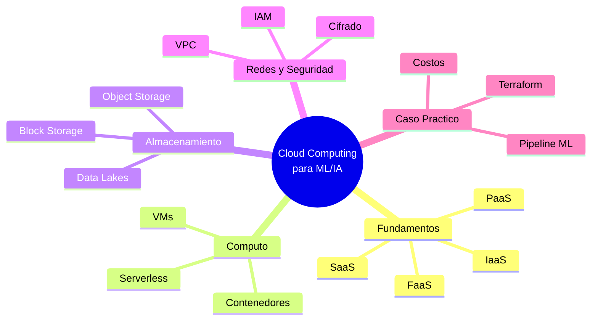

# ☁️ 22 - Cloud Computing

Bienvenido al módulo **22 - Cloud Computing**, parte del programa de **ML and IA Engineering**. En esta serie de notas exploraremos los fundamentos, servicios, redes, seguridad y casos prácticos de la computación en la nube aplicados a proyectos de Machine Learning e Inteligencia Artificial.

La nube no es solo infraestructura: es el lienzo sobre el cual se despliegan modelos que atienden millones de usuarios, se procesan petabytes de datos y se entrenan redes neuronales de miles de millones de parámetros. Dominar el cloud es, hoy por hoy, una competencia transversal para cualquier ingeniero de ML.

---

## 1. Objetivos del Curso

Al finalizar este curso serás capaz de:

1. Diseñar arquitecturas cloud escalables y rentables para pipelines de ML.
2. Seleccionar el modelo de servicio adecuado (IaaS, PaaS, SaaS, FaaS) según el caso de uso.
3. Gestionar cómputo, almacenamiento y bases de datos en los principales proveedores.
4. Implementar redes seguras (VPC, subnets, IAM) y cumplir con estándares de compliance.
5. Estimar costos y optimizar el TCO de soluciones cloud para IA.

---

## 2. Índice de Notas

| Nota | Título | Descripción |
|------|--------|-------------|
| 00 | **Bienvenida** | Índice, glosario y objetivos del curso. |
| 01 | [[01 - Fundamentos de Cloud y Modelos de Servicio]] | Historia, modelos de servicio, proveedores, TCO, multi-cloud. |
| 02 | [[02 - Computo en la Nube]] | VMs, auto-scaling, serverless, contenedores, batch processing. |
| 03 | [[03 - Almacenamiento y Bases de Datos Cloud]] | Object/block/file storage, data warehouses, data lakes. |
| 04 | [[04 - Redes y Seguridad en Cloud]] | VPC, IAM, cifrado, compliance, WAF, DDoS. |
| 05 | [[05 - Caso Practico - Arquitectura Cloud para ML]] | Proyecto end-to-end: diseño, costos e implementación. |

---

## 3. Glosario

A continuación se definen los términos más relevantes que aparecerán a lo largo del curso.

| Término | Definición |
|---------|------------|
| **IaaS** | Infrastructure as a Service. Provee recursos de computación virtualizados (servidores, redes, almacenamiento) bajo demanda. |
| **PaaS** | Platform as a Service. Capa de abstracción sobre la infraestructura; gestiona el runtime, middleware y sistema operativo. |
| **SaaS** | Software as a Service. Aplicaciones terminadas accesibles vía web o API. |
| **FaaS** | Function as a Service. Ejecución de funciones sin gestión de servidores (serverless). |
| **Región** | Área geográfica donde el proveedor cloud tiene uno o más data centers. |
| **AZ (Availability Zone)** | Uno o más data centers aislados dentro de una región, con energía y red independientes. |
| **VPC** | Virtual Private Cloud. Red virtual aislada lógicamente dentro del cloud público. |
| **Subnet** | Segmento de una VPC con un rango IP definido; puede ser pública o privada. |
| **IAM** | Identity and Access Management. Servicio para controlar quién puede hacer qué en la nube. |
| **EC2** | Elastic Compute Cloud. Servicio de VMs de AWS. |
| **S3** | Simple Storage Service. Almacenamiento de objetos de AWS. |
| **Bucket** | Contenedor lógico en S3/GCS/Azure Blob para almacenar objetos. |
| **VM** | Virtual Machine. Emulación de un sistema informático que ejecuta un sistema operativo. |
| **Container** | Unidad ligera de software que empaqueta código y dependencias para ejecutarse de forma aislada. |
| **Serverless** | Modelo donde el proveedor gestiona la infraestructura; el usuario solo aporta código. |
| **Load Balancer** | Distribuidor de tráfico entre múltiples instancias para alta disponibilidad. |
| **CDN** | Content Delivery Network. Red de servidores distribuidos geográficamente para entregar contenido con baja latencia. |
| **Latency** | Tiempo que tarda un paquete en viajar desde el origen hasta el destino. Se mide en milisegundos (ms). |
| **Throughput** | Cantidad de datos procesados o transferidos por unidad de tiempo (MB/s, Gbps). |
| **TCO** | Total Cost of Ownership. Costo total de adquisición y operación de una solución tecnológica. |

---

## 4. Mapa Mental del Curso

---

## 5. ¿Por qué Cloud para ML/IA?

El entrenamiento de modelos de deep learning puede requerir horas o días en clusters de GPUs de alto rendimiento. La nube permite:

- **Elasticidad**: escalar de 1 a 1000 GPUs en minutos.
- **Experimentación rápida**: probar hipótesis sin comprar hardware.
- **Serving global**: desplegar modelos cerca de los usuarios finales.

Caso real: OpenAI entrena GPT-4 utilizando clusters de GPUs en Microsoft Azure, aprovechando la elasticidad de la nube para ejecutar miles de experimentos en paralelo.

---

## 6. Recursos Adicionales

- [Wikimedia Commons - Cloud Computing](https://commons.wikimedia.org/wiki/Cloud_computing)
- [Wikimedia Commons - Data Center](https://commons.wikimedia.org/wiki/Data_center)

---

📦 Código de compresión al final de esta nota no aplica (es nota introductoria). Dirígete a las siguientes notas para código y ejemplos prácticos.
