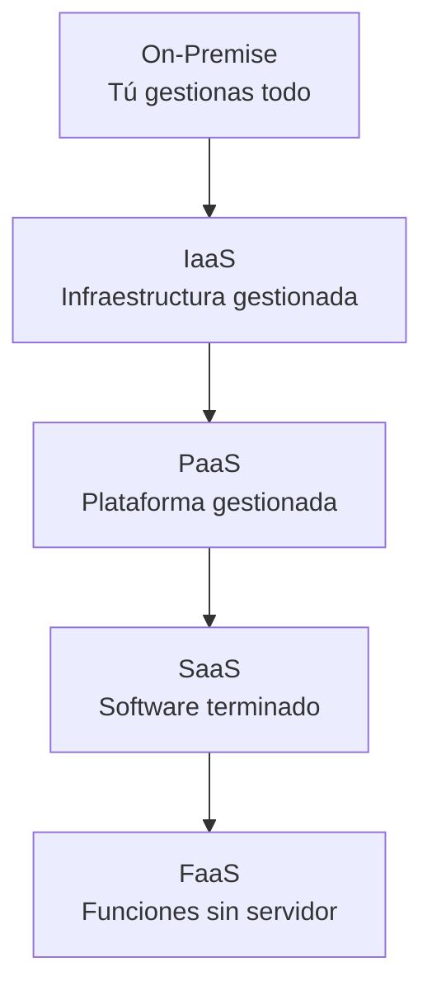
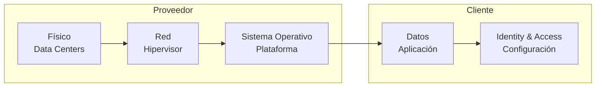

# ☁️ 01 - Fundamentos de Cloud y Modelos de Servicio

El cloud computing revolucionó la forma en que las empresas despliegan, escalan y operan sus sistemas. Para un ingeniero de ML, entender los modelos de servicio, la geografía de la nube y los costos asociados es tan importante como conocer el descenso del gradiente.


---

## 1. Historia del Cloud Computing

El concepto de computación en red nace en los años 60 con J.C.R. Licklider y su visión de una "Galactic Network". Sin embargo, el cloud moderno emerge en 2006 con el lanzamiento de Amazon EC2 y S3.

| Año | Hitos |
|-----|-------|
| 1999 | Salesforce.com lanza el primer SaaS empresarial. |
| 2006 | AWS lanza EC2 y S3, marcando el inicio del IaaS moderno. |
| 2008 | Google App Engine (PaaS) entra en escena. |
| 2010 | Microsoft Azure se hace público. |
| 2014 | AWS Lambda introduce el modelo FaaS/serverless. |
| 2020+ | Multi-cloud y edge computing se consolidan como estándar. |

Caso real: Netflix migra su infraestructura completa de data centers propios a AWS entre 2008 y 2016, logrando una elasticidad que le permite atender picos de tráfico de millones de usuarios simultáneos.


---

## 2. Modelos de Servicio: IaaS vs PaaS vs SaaS vs FaaS

La pirámide del cloud se divide en capas según el nivel de abstracción y control.



### 2.1 Comparativa Detallada

| Característica | IaaS | PaaS | SaaS | FaaS |
|----------------|------|------|------|------|
| **Ejemplos** | EC2, Compute Engine, Azure VMs | App Engine, Elastic Beanstalk, Heroku | Gmail, Salesforce, Google Workspace | AWS Lambda, Cloud Functions, Azure Functions |
| **Control sobre OS** | Total | Limitado | Ninguno | Ninguno |
| **Escalado** | Manual/Auto-scaling groups | Automático (plataforma) | Automático (proveedor) | Automático (event-driven) |
| **Tiempo de despliegue** | Minutos/horas | Minutos | Segundos | Milisegundos |
| **Modelo de precio** | Por hora de uso de recursos | Por uso de plataforma | Suscripción mensual/anual | Por invocación y duración |
| **Caso de uso en ML** | Clusters de entrenamiento con GPUs | Despliegue de APIs de inferencia | Herramientas de anotación de datos | Preprocesamiento de eventos, feature engineering en streaming |

💡 **Tip**: Si tu equipo necesita control total de drivers de GPU y bibliotecas de sistema, elige IaaS. Si solo necesitas exponer un modelo vía API, PaaS o FaaS aceleran el time-to-market.

⚠️ **Advertencia**: FaaS tiene límites de tiempo de ejecución (ej. 15 min en AWS Lambda). No es adecuado para entrenar modelos, pero sí para inferencia liviana o preprocesamiento.


---

## 3. Proveedores Principales

| Proveedor | Servicio IaaS | Servicio PaaS | FaaS | Ventaja diferencial |
|-----------|---------------|---------------|------|---------------------|
| **AWS** | EC2 | Elastic Beanstalk | Lambda | Mayor madurez y cantidad de servicios. |
| **GCP** | Compute Engine | App Engine | Cloud Functions | Integración nativa con BigQuery y TensorFlow. |
| **Azure** | Azure VMs | Azure App Service | Azure Functions | Sinergia con ecosistema Microsoft y empresas. |
| **Oracle Cloud** | OCI Compute | Oracle Cloud App Dev | Oracle Functions | Fuerte en bases de datos y workloads empresariales. |
| **IBM Cloud** | IBM Cloud Virtual Servers | IBM Cloud Foundry | IBM Cloud Functions | Enfoque en hybrid cloud y mainframes. |

Caso real: Spotify utiliza GCP para su infraestructura de datos y recomendación, aprovechando BigQuery para análisis masivo de patrones de escucha.


---

## 4. Regiones y Availability Zones (AZ)

Una **región** es una ubicación geográfica. Una **Availability Zone (AZ)** es un data center (o grupo de ellos) aislado dentro de esa región.

### 4.1 Fórmula de Latencia de Red

La latencia de transmisión puede modelarse como:

$$
L_{total} = L_{propagacion} + L_{transmision} + L_{procesamiento}
$$

Donde:
- $L_{propagacion}$: tiempo que tarda la señal en viajar físicamente.
- $L_{transmision}$: tiempo para poner todos los bits en el medio.
- $L_{procesamiento}$: overhead de routers, firewalls y balanceadores.

💡 **Tip**: Despliega tus modelos de inferencia en la región más cercana a tus usuarios para minimizar $L_{propagacion}$.

⚠️ **Advertencia**: Algunos servicios (como S3 buckets) son globales o regionales. No confundas la redundancia de AZ con la replicación multi-región.


---

## 5. Shared Responsibility Model

La seguridad en la nube es responsabilidad compartida entre el proveedor y el cliente.



| Modelo | Responsabilidad del Proveedor | Responsabilidad del Cliente |
|--------|------------------------------|-----------------------------|
| IaaS | Hipervisor, red física, data center | SO, parches, aplicación, datos, IAM |
| PaaS | Runtime, middleware, SO | Código, datos, configuración de acceso |
| SaaS | Todo el stack | Configuración de usuarios, datos ingresados |
| FaaS | Infraestructura, runtime de funciones | Código de la función, permisos IAM |


---

## 6. TCO: Cloud vs On-Premise

El **Total Cost of Ownership (TCO)** compara el costo real de operar en la nube versus un data center propio.

### 6.1 Fórmula de TCO Cloud

$$
TCO_{cloud} = \sum_{t=1}^{n} \frac{C_{infra,t} + C_{licencias,t} + C_{red,t} + C_{personas,t}}{(1 + r)^t}
$$

Donde:
- $C_{infra,t}$: costos de computo, almacenamiento y red en el año $t$.
- $C_{licencias,t}$: costos de software y servicios gestionados.
- $C_{personas,t}$: costos de ingenieros de DevOps/SRE.
- $r$: tasa de descuento.

### 6.2 Capex vs Opex

| Concepto | Capex (On-Premise) | Opex (Cloud) |
|----------|--------------------|--------------|
| **Definición** | Inversión inicial en hardware y edificios | Gastos operativos mensuales por uso |
| **Escalabilidad** | Lenta (compra física) | Inmediata (API/cli) |
| **Obsolescencia** | Riesgo del comprador | Riesgo del proveedor |
| **Cash flow** | Alto desembolso inicial | Gastos recurrentes predecibles |

Caso real: Dropbox realizó una migración "reverse cloud" en 2016, moviendo parte de su infraestructura de AWS a data centers propios para reducir TCO a largo plazo tras alcanzar escala masiva y predecible.


---

## 7. Vendor Lock-in y Estrategias Multi-Cloud

El **vendor lock-in** ocurre cuando una organización depende tanto de un proveedor que cambiar resulta prohibitivamente costoso.

### 7.1 Estrategias de Mitigación

1. **Uso de contenedores (Docker/Kubernetes)**: abstrae el runtime del proveedor.
2. **Infraestructura como Código (Terraform/Pulumi)**: proveedores multi-cloud con sintaxis unificada.
3. **Arquitectura desacoplada**: evita usar servicios propietarios cuando existen alternativas open source.

### 7.2 Multi-Cloud vs Hybrid Cloud

| Modelo | Descripción | Caso de uso en ML |
|--------|-------------|-------------------|
| **Multi-Cloud** | Usar múltiples proveedores públicos simultáneamente | Entrenar en AWS (SageMaker), inferir en GCP (TPU) |
| **Hybrid Cloud** | Combinar nube pública con infraestructura on-premise | Datos sensibles on-premise, entrenamiento en cloud |


---

## 8. Calculadora de Costos Cloud

El siguiente script en Python permite estimar costos mensuales de cómputo básico.

```python
# calculadora_costos_cloud.py

def calcular_costo_mensual(
    horas_por_dia: float,
    dias_por_mes: int,
    precio_por_hora: float,
    num_instancias: int = 1,
    descuento_reserva: float = 0.0  # 0.0 a 0.6
) -> dict:
    """
    Estima el costo mensual de instancias cloud.
    """
    horas_mes = horas_por_dia * dias_por_mes
    costo_bruto = horas_mes * precio_por_hora * num_instancias
    costo_neto = costo_bruto * (1 - descuento_reserva)
    
    return {
        "horas_mes": horas_mes,
        "costo_bruto_usd": round(costo_bruto, 2),
        "descuento_aplicado": f"{descuento_reserva*100:.0f}%",
        "costo_neto_usd": round(costo_neto, 2)
    }


if __name__ == "__main__":
    # Ejemplo: 2 instancias GPU p3.2xlarge (~$3.06/hr) corriendo 8h/día
    resultado = calcular_costo_mensual(
        horas_por_dia=8,
        dias_por_mes=22,
        precio_por_hora=3.06,
        num_instancias=2,
        descuento_reserva=0.30  # Reserved Instances 1 año
    )
    
    print("Estimación de costos mensuales:")
    for k, v in resultado.items():
        print(f"  {k}: {v}")
```

Salida esperada:
```
Estimación de costos mensuales:
  horas_mes: 176
  costo_bruto_usd: 1077.12
  descuento_aplicado: 30%
  costo_neto_usd: 753.98
```

💡 **Tip**: Usa las calculadoras oficiales de AWS, GCP y Azure para estimar costos reales incluyendo egress, storage y soporte.


---

## 9. Enlaces Internos

- [[00 - Bienvenida]]
- [[02 - Computo en la Nube]]
- [[03 - Almacenamiento y Bases de Datos Cloud]]
- [[04 - Redes y Seguridad en Cloud]]
- [[05 - Caso Practico - Arquitectura Cloud para ML]]


---

📦 Código de compresión al final de esta nota:
```python
# Resumen de fórmulas de esta nota
formulas = {
    "latencia_total": "L_total = L_prop + L_trans + L_proc",
    "tco_cloud": "TCO = sum( (C_infra + C_lic + C_red + C_pers) / (1+r)^t )",
    "costo_mensual": "horas * precio_hora * instancias * (1 - descuento)"
}
```
