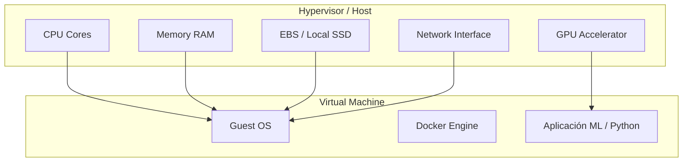

# ⚙️ 02 - Computo en la Nube

El cómputo es el corazón de cualquier pipeline de ML: desde el preprocesamiento de datos hasta el entrenamiento distribuido en GPUs y el serving de modelos. Elegir el tipo de instancia, el modelo de compra y la tecnología de despliegue (VMs, contenedores, serverless) define el rendimiento y el costo de tu solución.


---

## 1. Virtual Machines (VMs)

Las VMs son la unidad básica de cómputo en la nube. Cada proveedor ofrece familias de instancias optimizadas para diferentes cargas de trabajo.

### 1.1 Tipos de Instancias

| Tipo | Optimización | Caso de uso en ML | Ejemplo AWS |
|------|-------------|-------------------|-------------|
| **General Purpose** | Balance CPU/memoria | Notebooks, desarrollo | m6i, t3 |
| **Compute Optimized** | Alto ratio CPU/memoria | Inferencia de baja latencia | c6i |
| **Memory Optimized** | Alta memoria RAM | Feature stores, caches | r6i, x2idn |
| **GPU / Accelerated** | GPUs, TPUs, FPGAs | Entrenamiento de deep learning | p4d, g5, inf1 |
| **High Performance Computing (HPC)** | Red de alta velocidad | Simulaciones, ML distribuido | hpc6id |

### 1.2 Arquitectura de una VM en Cloud



Caso real: Stability AI entrena su modelo Stable Diffusion en clusters de instancias GPU (NVIDIA A100) en AWS, utilizando miles de horas de cómputo distribuido.


---

## 2. Modelos de Compra: On-Demand vs Reserved vs Spot

El costo de una VM varía drásticamente según el compromiso de uso.

| Modelo | Descripción | Descuento | Riesgo | Ideal para |
|--------|-------------|-----------|--------|------------|
| **On-Demand** | Pago por hora/segundo sin compromiso | 0% | Ninguno | Desarrollo, cargas impredecibles |
| **Reserved** | Compromiso 1-3 años | Hasta 72% | Bajo | Workloads estables de entrenamiento |
| **Spot / Preemptible** | Capacidad sobrante del proveedor | Hasta 90% | Alto (interrupción) | Experimentos, procesamiento batch tolerante a fallos |
| **Savings Plans** | Compromiso de gasto por hora | Hasta 72% | Bajo | Flexibilidad entre familias de instancias |

### 2.1 Fórmula de Throughput de Entrenamiento

El throughput de un modelo durante el entrenamiento se puede estimar como:

$$
Throughput = \frac{Batch\_Size \times GPU\_Count}{Tiempo\_por\_Batch}
$$

Donde:
- $Batch\_Size$: ejemplos procesados en paralelo por GPU.
- $GPU\_Count$: número de aceleradores.
- $Tiempo\_por\_Batch$: latencia de forward + backward pass.

💡 **Tip**: Usa Spot Instances para grid search de hiperparámetros. Si una instancia es interrumpida, reanuda el experimento desde el último checkpoint en S3.

⚠️ **Advertencia**: Las instancias Spot pueden ser interrumpidas con solo 2 minutos de aviso. Nunca uses Spot para servicios de producción críticos.


---

## 3. Serverless Compute

El cómputo serverless abstrae completamente la gestión de servidores. El usuario sube código y el proveedor se encarga del aprovisionamiento, escalado y patching.

| Servicio | Proveedor | Límite de tiempo | Caso de uso ML |
|----------|-----------|------------------|----------------|
| AWS Lambda | AWS | 15 min | Feature engineering en streaming, inferencia liviana |
| Cloud Functions | GCP | 60 min | Preprocesamiento de eventos de Pub/Sub |
| Azure Functions | Azure | 10 min (consumption) | Integración con Azure ML pipelines |

### 3.1 Costo de Serverless

$$
Costo_{serverless} = N_{invocaciones} \times Costo_{invocacion} + Tiempo_{ejecucion} \times Memoria_{asignada} \times Costo_{GB-s}
$$

Caso real: La startup Primer.ai utiliza AWS Lambda para ejecutar docenas de modelos NLP pequeños en paralelo, pagando solo por las invocaciones reales y evitando el costo fijo de mantener VMs idle.


---

## 4. Contenedores y Orquestación

Los contenedores empaquetan aplicaciones ML con todas sus dependencias (CUDA, Python, bibliotecas C++), garantizando reproducibilidad entre entrenamiento e inferencia.

| Servicio | Proveedor | Tecnología | Descripción |
|----------|-----------|------------|-------------|
| Amazon ECS | AWS | Docker + AWS Fargate | Orquestación de contenedores serverless o con EC2 |
| Amazon EKS | AWS | Kubernetes | Kubernetes gestionado |
| Google GKE | GCP | Kubernetes | Kubernetes gestionado con auto-scaling avanzado |
| Azure AKS | Azure | Kubernetes | Kubernetes gestionado con integración Azure DevOps |

### 4.1 Serverless Containers

| Servicio | Proveedor | Caso de uso ML |
|----------|-----------|----------------|
| AWS Fargate | AWS | Jobs de entrenamiento containerizados sin gestionar clusters |
| Google Cloud Run | GCP | Servicios de inferencia auto-escalables desde un container |
| Azure Container Instances | Azure | Despliegue rápido de contenedores para pruebas |


💡 **Tip**: Convierte tus modelos a ONNX para reducir el tamaño del container y acelerar la inferencia en CPU.


---

## 5. Batch Processing

El procesamiento por lotes es ideal para reentrenamientos periódicos, transformaciones masivas de datasets y evaluación offline.

| Servicio | Proveedor | Descripción |
|----------|-----------|-------------|
| AWS Batch | AWS | Gestiona jobs containerizados con orquestación dinámica de recursos |
| GCP Batch | GCP | Jobs de larga duración con VMs preemptibles |
| Azure Batch | Azure | Procesamiento paralelo masivo con pools de VMs |

Caso real: Airbnb utiliza AWS Batch para ejecutar miles de jobs de feature engineering diariamente sobre sus logs de usuario, alimentando sus modelos de recomendación.


---

## 6. Comparativa de Precios y Casos de Uso

| Escenario | Recomendación | Estimación aproximada |
|-----------|---------------|-----------------------|
| Entrenamiento DL (1 semana) | Spot GPUs (p3/p4 en AWS) | ~$500-2000 |
| API de inferencia (24/7) | Reserved CPU o Fargate | ~$100-300/mes |
| Preprocesamiento eventos | Lambda / Cloud Functions | ~$10-50/mes (depende volumen) |
| Experimentos ML (ad-hoc) | On-Demand GPU | ~$3-5/hora |


---

## 7. Código con Boto3 para Gestionar VMs

```python
# gestionar_vms.py
import boto3

ec2 = boto3.client('ec2')


def lanzar_instancia_entrenamiento():
    """
    Lanza una instancia GPU para entrenamiento de ML.
    """
    response = ec2.run_instances(
        ImageId='ami-0c55b159cbfafe1f0',  # Deep Learning AMI (ejemplo)
        InstanceType='p3.2xlarge',
        MinCount=1,
        MaxCount=1,
        KeyName='mi-keypair',
        SecurityGroupIds=['sg-12345678'],
        SubnetId='subnet-12345678',
        InstanceMarketOptions={
            'MarketType': 'spot',
            'SpotOptions': {
                'MaxPrice': '3.50',  # Límite de precio por hora
                'SpotInstanceType': 'one-time',
                'InstanceInterruptionBehavior': 'terminate'
            }
        },
        TagSpecifications=[
            {
                'ResourceType': 'instance',
                'Tags': [
                    {'Key': 'Name', 'Value': 'ml-training-spot'},
                    {'Key': 'Project', 'Value': 'stable-diffusion-finetune'}
                ]
            }
        ]
    )
    return response['Instances'][0]['InstanceId']


def detener_instancias_por_tag(tag_key: str, tag_value: str):
    """
    Detiene instancias filtrando por tag para ahorrar costos.
    """
    response = ec2.describe_instances(
        Filters=[
            {'Name': f'tag:{tag_key}', 'Values': [tag_value]},
            {'Name': 'instance-state-name', 'Values': ['running']}
        ]
    )
    
    instance_ids = []
    for reservation in response['Reservations']:
        for instance in reservation['Instances']:
            instance_ids.append(instance['InstanceId'])
    
    if instance_ids:
        ec2.stop_instances(InstanceIds=instance_ids)
        print(f"Detenidas: {instance_ids}")
    else:
        print("No hay instancias running con ese tag.")


if __name__ == "__main__":
    # Ejemplo de uso
    # instance_id = lanzar_instancia_entrenamiento()
    # print(f"Lanzada instancia: {instance_id}")
    detener_instancias_por_tag('Project', 'stable-diffusion-finetune')
```

⚠️ **Advertencia**: Asegúrate de que tu IAM user/role tenga permisos `ec2:RunInstances`, `ec2:DescribeInstances` y `ec2:StopInstances`.


---

## 8. Enlaces Internos

- [[00 - Bienvenida]]
- [[01 - Fundamentos de Cloud y Modelos de Servicio]]
- [[03 - Almacenamiento y Bases de Datos Cloud]]
- [[04 - Redes y Seguridad en Cloud]]
- [[05 - Caso Practico - Arquitectura Cloud para ML]]


---

📦 Código de compresión al final de esta nota:
```python
# snippets_computo.py
# 1. Lanzar Spot Instance GPU
# 2. Detener instancias por tag
# 3. Calcular throughput de entrenamiento

def throughput(batch_size, gpu_count, time_per_batch_ms):
    return (batch_size * gpu_count) / (time_per_batch_ms / 1000.0)
```
