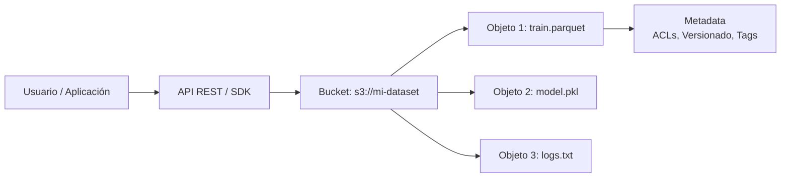
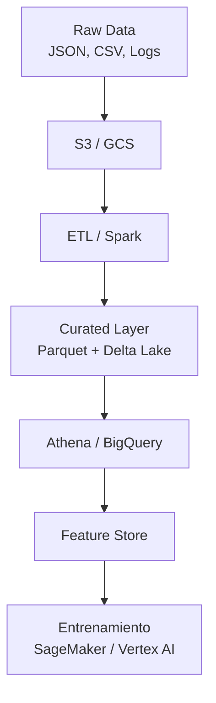

# 💾 03 - Almacenamiento y Bases de Datos Cloud

Los sistemas de almacenamiento en la nube son la columna vertebral de cualquier pipeline de datos. Un ingeniero de ML debe entender cómo almacenar datasets masivos, gestionar checkpoints de modelos, alimentar feature stores y consultar data warehouses con latencias aceptables.


---

## 1. Object Storage

El almacenamiento de objetos guarda datos como objetos inmutables con metadatos y un identificador único. Es el estándar para datasets, artefactos de modelos y logs.

| Servicio | Proveedor | Durabilidad | Latencia típica |
|----------|-----------|-------------|-----------------|
| Amazon S3 | AWS | 99.999999999% (11 nueves) | 100-200 ms (first byte) |
| Google Cloud Storage | GCP | 99.999999999% | 100-200 ms |
| Azure Blob Storage | Azure | 99.999999999% | 100-200 ms |

### 1.1 Arquitectura de Object Storage




---

## 2. Tiers de Almacenamiento

No todos los datos requieren el mismo nivel de accesibilidad. Mover datos entre tiers reduce costos significativamente.

| Tier | AWS S3 | GCP GCS | Azure Blob | Costo relativo | Acceso típico |
|------|--------|---------|------------|----------------|---------------|
| **Hot** | S3 Standard | Standard | Hot | 1x | Frecuente, latencia baja |
| **Warm** | S3 Standard-IA | Nearline | Cool | ~0.5x | Mensual, backups |
| **Cold** | S3 Glacier | Coldline | Archive | ~0.2x | Trimestral, compliance |
| **Deep Archive** | S3 Glacier Deep Archive | Archive | Archive | ~0.1x | Anual, legal hold |

### 2.1 Fórmula de Costo de Almacenamiento

$$
Costo_{almacenamiento} = \sum_{i} Volumen_i \times Tarifa_i + Costo_{acceso} + Costo_{egress}
$$

Donde:
- $Volumen_i$: cantidad de datos en el tier $i$ (GB).
- $Tarifa_i$: precio por GB/mes del tier.
- $Costo_{acceso}$: tarifas por recuperación (relevante en Glacier).
- $Costo_{egress}$: datos transferidos fuera de la región o de Internet.

Caso real: La empresa de genómica 23andMe almacena terabytes de secuencias genéticas en S3 Glacier para cumplimiento regulatorio, manteniendo solo los datos analíticos recientes en S3 Standard.

💡 **Tip**: Implementa políticas de lifecycle management para mover automáticamente datasets antiguos a tiers más baratos después de N días.

⚠️ **Advertencia**: Los costos de egress (salida de datos) de la nube pueden ser sorprendentemente altos. Minimiza transferencias innecesarias entre regiones o hacia Internet.


---

## 3. Block Storage

El almacenamiento en bloques proporciona volúmenes de baja latencia conectados a VMs, similares a discos duros físicos.

| Servicio | Proveedor | Caso de uso ML |
|----------|-----------|----------------|
| Amazon EBS | AWS | Volúmenes de datos para entrenamiento en EC2, checkpoints |
| Persistent Disk | GCP | Discos SSD para notebooks de Jupyter en GCE |
| Azure Disk Storage | Azure | Discos para VMs de entrenamiento en Azure |

| Tipo de volumen | Latencia | Throughput | Ideal para |
|-----------------|----------|------------|------------|
| SSD (gp3/io2) | < 10 ms | Alto | Bases de datos, checkpoints frecuentes |
| HDD (st1/sc1) | > 10 ms | Medio | Logs secuenciales, datasets de solo lectura |


---

## 4. File Systems en la Nube

Los sistemas de archivos compartidos permiten que múltiples VMs accedan a los mismos datos simultáneamente, útil para entrenamiento distribuido.

| Servicio | Proveedor | Protocolo | Caso de uso ML |
|----------|-----------|-----------|----------------|
| Amazon EFS | AWS | NFS | Compartir datasets entre nodos de entrenamiento |
| Amazon FSx for Lustre | AWS | Lustre | HPC, entrenamiento distribuido de alta velocidad |
| Google Filestore | GCP | NFS | Compartir volúmenes entre instancias GCE |
| Azure Files | Azure | SMB/NFS | Notebooks colaborativos |


---

## 5. Managed Databases

Las bases de datos gestionadas eliminan la sobrecarga operativa de backups, parches y replicación.

| Servicio | Proveedor | Tipo | Caso de uso ML |
|----------|-----------|------|----------------|
| Amazon RDS | AWS | Relacional (PostgreSQL, MySQL) | Metadatos de experimentos, tablas de usuarios |
| Google Cloud SQL | GCP | Relacional | Feature store tabular ligero |
| Azure Cosmos DB | Azure | NoSQL (documentos, grafos) | Features semiestructuradas, perfiles de usuario |
| Amazon DynamoDB | AWS | NoSQL (key-value) | Feature store de baja latencia, lookups online |

Caso real: Uber utiliza DynamoDB como parte de su feature store interno (Michelangelo) para servir features en tiempo real a sus modelos de pricing y ETAs.


---

## 6. Data Warehouses

Los data warehouses optimizan consultas analíticas masivas sobre datos estructurados.

| Servicio | Proveedor | Modelo de precio | Diferencial ML |
|----------|-----------|------------------|----------------|
| Amazon Redshift | AWS | Por nodo/hora | Integración con SageMaker para consultas SQL a features |
| Google BigQuery | GCP | Por TB escaneado | ML.INNER para entrenar modelos directamente con SQL |
| Snowflake | Multi-cloud | Por crédito de computo | Zero-copy cloning para experimentos reproducibles |

### 6.1 Fórmula de Costo de BigQuery

$$
Costo_{BigQuery} = Datos_{escaneados\_TB} \times Tarifa_{por\_TB}
$$

💡 **Tip**: Usa particiones y clustering en BigQuery/Redshift para reducir la cantidad de datos escaneados y, por tanto, el costo.


---

## 7. Data Lakes

Un data lake almacena datos en su formato original (estructurados, semiestructurados, no estructurados) y permite consultarlos sin un esquema rígido previo.

| Componente | Función |
|------------|---------|
| **Almacenamiento** | S3, GCS, Azure Data Lake Storage (ADLS) |
| **Metastore** | AWS Glue Data Catalog, Hive Metastore |
| **Motor de consultas** | Amazon Athena, Google BigLake, Azure Synapse |
| **Formato optimizado** | Parquet, ORC, Delta Lake, Iceberg |

### 7.1 Arquitectura de Data Lake para ML



### 7.2 Delta Lake

Delta Lake añade transacciones ACID, metadatos escalables y time-travel sobre data lakes basados en object storage.

Caso real: Databricks (creadores de Delta Lake) procesa exabytes de datos para sus clientes, permitiendo rollback de datasets de entrenamiento si se detecta data drift o corrupción.


---

## 8. Código con Upload/Download a S3

```python
# s3_storage.py
import boto3
import os

s3 = boto3.client('s3')


def subir_dataset(local_path: str, bucket: str, s3_key: str):
    """
    Sube un archivo local a S3.
    """
    s3.upload_file(local_path, bucket, s3_key)
    print(f"Subido: s3://{bucket}/{s3_key}")


def descargar_dataset(bucket: str, s3_key: str, local_path: str):
    """
    Descarga un archivo de S3 a local.
    """
    os.makedirs(os.path.dirname(local_path), exist_ok=True)
    s3.download_file(bucket, s3_key, local_path)
    print(f"Descargado: {local_path}")


def listar_objetos(bucket: str, prefix: str):
    """
    Lista objetos en un bucket con un prefijo dado.
    """
    paginator = s3.get_paginator('list_objects_v2')
    for page in paginator.paginate(Bucket=bucket, Prefix=prefix):
        for obj in page.get('Contents', []):
            print(f"  {obj['Key']} ({obj['Size']} bytes)")


def mover_a_glacier(bucket: str, s3_key: str):
    """
    Cambia la clase de almacenamiento de un objeto a Glacier.
    """
    s3.copy_object(
        Bucket=bucket,
        Key=s3_key,
        CopySource={'Bucket': bucket, 'Key': s3_key},
        StorageClass='GLACIER',
        MetadataDirective='COPY'
    )
    print(f"Movido a Glacier: s3://{bucket}/{s3_key}")


if __name__ == "__main__":
    BUCKET = 'mi-ml-datasets'
    
    # Subir dataset
    subir_dataset('./data/train.parquet', BUCKET, 'v1/train.parquet')
    
    # Listar objetos
    print("Objetos en el bucket:")
    listar_objetos(BUCKET, 'v1/')
    
    # Mover a tier frío después de entrenamiento
    mover_a_glacier(BUCKET, 'v1/train.parquet')
```

⚠️ **Advertencia**: Nunca almacenes credenciales de AWS en el código. Usa roles de IAM, AWS SSO o variables de entorno.


---

## 9. Enlaces Internos

- [[00 - Bienvenida]]
- [[01 - Fundamentos de Cloud y Modelos de Servicio]]
- [[02 - Computo en la Nube]]
- [[04 - Redes y Seguridad en Cloud]]
- [[05 - Caso Practico - Arquitectura Cloud para ML]]


---

📦 Código de compresión al final de esta nota:
```python
# storage_utils.py
import boto3

def sync_local_to_s3(local_dir: str, bucket: str, prefix: str):
    """
    Sincroniza un directorio local con un prefijo de S3.
    Requiere: pip install awscli (o usar s3 boto3 con listado recursivo)
    """
    import subprocess
    subprocess.run([
        'aws', 's3', 'sync', local_dir, f's3://{bucket}/{prefix}'
    ], check=True)
```
