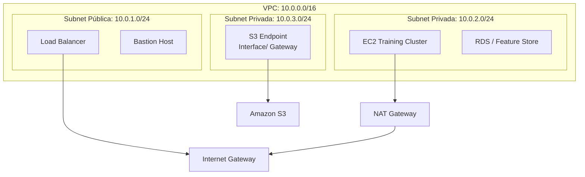
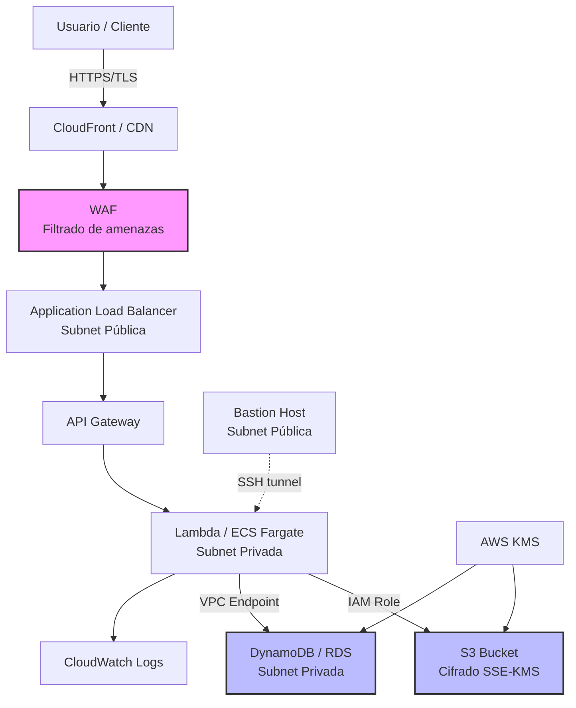

# 🔐 04 - Redes y Seguridad en Cloud

La seguridad en la nube no es un producto que se compra, sino un proceso que se diseña. Para un ingeniero de ML, proteger datos de entrenamiento, restringir acceso a modelos y cumplir con regulaciones es tan crítico como optimizar la precisión del modelo.


---

## 1. VPC, Subnets y Route Tables

Una **VPC (Virtual Private Cloud)** es una red virtual aislada dentro de la nube pública. Dentro de ella, las **subnets** segmentan el espacio de direcciones IP.

### 1.1 Componentes de Red

| Componente | Función | Caso de uso ML |
|------------|---------|----------------|
| **VPC** | Red virtual privada | Aislar el entorno de entrenamiento del público |
| **Subnet pública** | Tiene ruta a Internet Gateway | Balanceadores de carga, bastion hosts |
| **Subnet privada** | Sin ruta directa a Internet | Nodos de entrenamiento, bases de datos |
| **Route Table** | Define el enrutamiento de paquetes | Controlar tráfico entre subnets y hacia Internet |
| **NAT Gateway** | Permite salida a Internet desde subnets privadas | Descargar datasets o paquetes Python desde instancias privadas |
| **Internet Gateway** | Punto de entrada/salida a Internet para la VPC | Acceso público a APIs de inferencia |

### 1.2 Arquitectura de VPC para ML



💡 **Tip**: Usa VPC Endpoints (Gateway o Interface) para acceder a S3 desde subnets privadas sin salir por Internet. Reduce costos de NAT Gateway y mejora seguridad.


---

## 2. VPN y Peering

| Servicio | Descripción | Caso de uso |
|----------|-------------|-------------|
| **VPN Site-to-Site** | Túnel cifrado entre on-premise y VPC | Transferir datos sensibles desde data center local |
| **VPC Peering** | Conexión privada entre dos VPCs | Compartir feature stores entre cuentas de AWS |
| **Transit Gateway** | Hub central para conectar múltiples VPCs y on-premise | Arquitecturas multi-cuenta empresariales |


---

## 3. Security Groups vs NACLs

Ambos controlan el tráfico, pero a diferente nivel.

| Característica | Security Group | NACL (Network ACL) |
|----------------|----------------|--------------------|
| **Nivel** | Instancia (VM) | Subnet |
| **Tipo** | Stateful (respuesta automática permitida) | Stateless (debe definirse regla de retorno) |
| **Reglas** | Solo permite (allow) | Permite (allow) y deniega (deny) |
| **Aplicación** | A una o más instancias | A toda la subnet |

⚠️ **Advertencia**: Un Security Group mal configurado (ej. puerto 22 abierto a 0.0.0.0/0) es una de las causas más comunes de brechas de seguridad en la nube.

Caso real: En 2019, Capital One sufrió una brecha masiva de datos debido a una configuración incorrecta de firewall (Security Group + WAF) en AWS, exponiendo datos de 100 millones de clientes.


---

## 4. IAM: Identity and Access Management

IAM define **quién** puede hacer **qué** sobre **cuáles** recursos.

### 4.1 Componentes de IAM

| Componente | Descripción | Ejemplo en ML |
|------------|-------------|---------------|
| **User** | Entidad con credenciales permanentes | Ingeniero de datos con acceso a S3 |
| **Role** | Identidad temporal asumida por servicios | EC2 asume un role para leer de S3 |
| **Policy** | Documento JSON que define permisos | Permitir `s3:GetObject` en `arn:aws:s3:::mi-bucket/*` |
| **Group** | Colección de usuarios | Grupo "DataScientists" con acceso a SageMaker |
| **MFA** | Autenticación multifactor | Requerir MFA para eliminar buckets o modificar IAM |

### 4.2 Política de IAM de Ejemplo (Least Privilege)

```json
{
  "Version": "2012-10-17",
  "Statement": [
    {
      "Sid": "AllowS3ReadForTrainingData",
      "Effect": "Allow",
      "Action": [
        "s3:GetObject",
        "s3:ListBucket"
      ],
      "Resource": [
        "arn:aws:s3:::ml-datasets-prod",
        "arn:aws:s3:::ml-datasets-prod/training/*"
      ]
    },
    {
      "Sid": "AllowCloudWatchLogs",
      "Effect": "Allow",
      "Action": [
        "logs:CreateLogGroup",
        "logs:CreateLogStream",
        "logs:PutLogEvents"
      ],
      "Resource": "arn:aws:logs:us-east-1:123456789012:log-group:/aws/sagemaker/*"
    },
    {
      "Sid": "DenyDangerousActions",
      "Effect": "Deny",
      "Action": [
        "s3:DeleteBucket",
        "iam:DeleteUser"
      ],
      "Resource": "*"
    }
  ]
}
```

💡 **Tip**: Aplica el principio de **mínimo privilegio (least privilege)**. Una instancia de entrenamiento solo necesita leer datos y escribir checkpoints, no administrar usuarios.


---

## 5. Cifrado: At Rest vs In Transit

| Tipo | Descripción | Servicios/Tecnologías |
|------|-------------|----------------------|
| **Encryption at Rest** | Datos cifrados cuando están almacenados | AWS KMS, Azure Key Vault, Google Cloud KMS, AES-256 |
| **Encryption in Transit** | Datos cifrados cuando se mueven por la red | TLS 1.2+, HTTPS, VPN, mTLS |

### 5.1 KMS y Gestión de Claves

- **Customer Managed Keys (CMK)**: El cliente controla la rotación, permisos y eliminación.
- **AWS Managed Keys**: Rotación automática cada 3 años, menos control.
- **Cloud HSM**: Módulos de hardware para requisitos FIPS 140-2 Level 3.

⚠️ **Advertencia**: Si eliminas una CMK de KMS, los datos cifrados con ella se vuelven irreversibles. Usa deletion waiting period (mínimo 7 días).


---

## 6. Secrets Managers

Nunca hardcodees credenciales en notebooks o scripts de entrenamiento.

| Servicio | Proveedor | Característica destacada |
|----------|-----------|--------------------------|
| AWS Secrets Manager | AWS | Rotación automática de credenciales de RDS |
| HashiCorp Vault | Multi-cloud | Dynamic secrets, PKI, encryption as a service |
| Azure Key Vault | Azure | Integración con Azure AD y certificados SSL |
| Google Secret Manager | GCP | Versionado de secretos y acceso por IAM |

```python
# secrets_example.py
import boto3
import json

secrets = boto3.client('secretsmanager')

def obtener_credenciales_db(secret_name: str) -> dict:
    response = secrets.get_secret_value(SecretId=secret_name)
    return json.loads(response['SecretString'])

# Uso
# creds = obtener_credenciales_db('prod/ml-feature-store/postgres')
```


---

## 7. Compliance y Regulaciones

| Estándar | Descripción | Relevancia para ML |
|----------|-------------|--------------------|
| **SOC 2** | Controles de seguridad, disponibilidad y confidencialidad | Requerido por empresas SaaS que procesan datos de clientes |
| **HIPAA** | Protección de datos de salud en EE.UU. | Modelos de diagnóstico médico, imágenes clínicas |
| **GDPR** | Regulación de privacidad de la UE | Derecho al olvido, explicabilidad de modelos |
| **ISO 27001** | Gestión de seguridad de la información | Marco general para startups que escalan |

Caso real: DeepMind Health (Google) tuvo que rediseñar su arquitectura de datos para cumplir HIPAA y GDPR antes de desplegar modelos de detección de enfermedades oculares en hospitales del Reino Unido.


---

## 8. WAF y Protección DDoS

| Servicio | Proveedor | Función |
|----------|-----------|---------|
| AWS WAF | AWS | Firewall de aplicaciones web: reglas contra SQLi, XSS |
| AWS Shield | AWS | Protección DDoS estándar (Shield Standard) y avanzada |
| Cloud Armor | GCP | WAF y protección DDoS integrada con Cloud Load Balancing |
| Azure DDoS Protection | Azure | Protección contra ataques volumétricos y de protocolo |

💡 **Tip**: Coloca tu API de inferencia detrás de un Load Balancer + WAF. Configura rate limiting para evitar abuso y sobrecostos por invocaciones masivas.


---

## 9. Diagrama Mermaid de Arquitectura Segura




---

## 10. Enlaces Internos

- [[00 - Bienvenida]]
- [[01 - Fundamentos de Cloud y Modelos de Servicio]]
- [[02 - Computo en la Nube]]
- [[03 - Almacenamiento y Bases de Datos Cloud]]
- [[05 - Caso Practico - Arquitectura Cloud para ML]]


---

📦 Código de compresión al final de esta nota:
```python
# security_utils.py
import boto3

def audit_security_groups():
    ec2 = boto3.client('ec2')
    sgs = ec2.describe_security_groups()['SecurityGroups']
    risky = []
    for sg in sgs:
        for rule in sg.get('IpPermissions', []):
            for ip_range in rule.get('IpRanges', []):
                if ip_range.get('CidrIp') == '0.0.0.0/0':
                    risky.append(sg['GroupId'])
    return risky

# Uso: identificar SGs con acceso abierto a Internet
# print(audit_security_groups())
```
