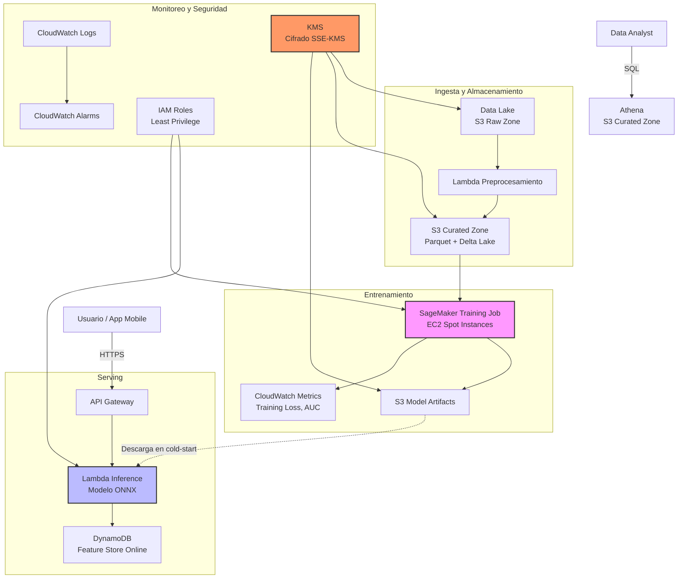

# 🏗️ 05 - Caso Practico - Arquitectura Cloud para ML

En esta nota diseñaremos e implementaremos una arquitectura cloud completa para un pipeline de Machine Learning end-to-end. Desde la ingesta de datos hasta el serving de predicciones, pasando por el entrenamiento, monitoreo y seguridad.


---

## 1. Requisitos del Proyecto

Imaginemos una startup de fintech que necesita predecir el riesgo de default de préstamos personales.

### 1.1 Requisitos Funcionales

- Ingesta diaria de datos de aplicaciones de préstamo (CSV/JSON).
- Pipeline de preprocesamiento automático (limpieza, feature engineering).
- Entrenamiento semanal de un modelo XGBoost con validación cruzada.
- API REST para inferencia en tiempo real (< 200 ms p99).
- Dashboard de monitoreo de drift y métricas de negocio.

### 1.2 Requisitos No Funcionales

- **Escalabilidad**: Soportar picos de 10,000 req/s en campañas de marketing.
- **Seguridad**: Cumplir PCI-DSS (datos financieros) y GDPR.
- **Disponibilidad**: 99.9% uptime en la API de inferencia.
- **Costo**: Menos de $3,000/mes en infraestructura base.


---

## 2. Diagrama de Arquitectura




---

## 3. Estimación de Costos

### 3.1 Componentes y Costos Mensuales Estimados

| Componente | Servicio AWS | Configuración | Costo Mensual (USD) |
|------------|--------------|---------------|---------------------|
| Almacenamiento Raw | S3 Standard | 5 TB | $115 |
| Almacenamiento Curado | S3 Standard | 2 TB | $46 |
| Modelos y Checkpoints | S3 Standard | 500 GB | $11.50 |
| Preprocesamiento | Lambda | 1M invocaciones, 512 MB, 30s avg | $25 |
| Entrenamiento | SageMaker + Spot p3.2xlarge | 40 hrs/semana | $450 |
| API Gateway | API Gateway | 10M req/mes | $35 |
| Inferencia | Lambda | 10M invocaciones, 3 GB, 500 ms | $120 |
| Feature Store Online | DynamoDB on-demand | 10M reads, 5M writes | $80 |
| Monitoreo | CloudWatch Logs + Metrics | 100 GB logs, 50 alarmas | $60 |
| NAT Gateway | NAT Gateway | 1 NAT, 100 GB procesados | $35 |
| KMS | KMS | 10,000 req/mes | $3 |
| **Total estimado** | | | **~$980/mes** |

💡 **Tip**: El entrenamiento en Spot Instances reduce el costo de cómputo en un 70%. Para cargas de trabajo críticas de inferencia, considera Reserved Capacity en Lambda o provisioned concurrency.

⚠️ **Advertencia**: Los costos de data egress (salida a Internet) no están incluidos en la tabla anterior. Si tu app mobile descarga muchos datos, el egress puede duplicar la factura.

### 3.2 Fórmula de Costo Total del Pipeline

$$
TCO_{pipeline} = C_{storage} + C_{compute} + C_{network} + C_{monitoring}
$$

Donde:
- $C_{storage} = \sum_{tier} GB_{tier} \times tarifa_{tier}$
- $C_{compute} = horas_{training} \times precio_{spot} + invocaciones_{lambda} \times tarifa_{lambda}$
- $C_{network} = GB_{egress} \times tarifa_{egress} + NAT_{horas} \times tarifa_{NAT}$


---

## 4. Implementación con Terraform

A continuación se presenta una configuración básica de Terraform para aprovisionar los componentes principales.

```hcl
# main.tf
terraform {
  required_providers {
    aws = {
      source  = "hashicorp/aws"
      version = "~> 5.0"
    }
  }
}

provider "aws" {
  region = "us-east-1"
}

# S3 Buckets
resource "aws_s3_bucket" "raw_data" {
  bucket = "ml-fintech-raw-data"
}

resource "aws_s3_bucket" "curated_data" {
  bucket = "ml-fintech-curated-data"
}

resource "aws_s3_bucket" "models" {
  bucket = "ml-fintech-models"
}

resource "aws_s3_bucket_server_side_encryption_configuration" "raw_encryption" {
  bucket = aws_s3_bucket.raw_data.id
  rule {
    apply_server_side_encryption_by_default {
      sse_algorithm     = "aws:kms"
      kms_master_key_id = aws_kms_key.ml_key.arn
    }
  }
}

# KMS Key
resource "aws_kms_key" "ml_key" {
  description             = "KMS key para datos y modelos de ML"
  deletion_window_in_days = 30
  enable_key_rotation     = true
}

# IAM Role para SageMaker
resource "aws_iam_role" "sagemaker_role" {
  name = "SageMakerExecutionRole"

  assume_role_policy = jsonencode({
    Version = "2012-10-17"
    Statement = [
      {
        Action = "sts:AssumeRole"
        Effect = "Allow"
        Principal = {
          Service = "sagemaker.amazonaws.com"
        }
      }
    ]
  })
}

resource "aws_iam_role_policy" "sagemaker_s3_policy" {
  name = "SageMakerS3Access"
  role = aws_iam_role.sagemaker_role.id

  policy = jsonencode({
    Version = "2012-10-17"
    Statement = [
      {
        Effect = "Allow"
        Action = [
          "s3:GetObject",
          "s3:PutObject",
          "s3:ListBucket"
        ]
        Resource = [
          aws_s3_bucket.curated_data.arn,
          "${aws_s3_bucket.curated_data.arn}/*",
          aws_s3_bucket.models.arn,
          "${aws_s3_bucket.models.arn}/*"
        ]
      }
    ]
  })
}

# Lambda para inferencia
resource "aws_lambda_function" "inference_api" {
  function_name = "ml-inference-api"
  role          = aws_iam_role.lambda_role.arn
  handler       = "lambda_handler.handler"
  runtime       = "python3.11"
  timeout       = 30
  memory_size   = 3008

  filename         = "inference_lambda.zip"
  source_code_hash = filebase64sha256("inference_lambda.zip")

  environment {
    variables = {
      MODEL_BUCKET = aws_s3_bucket.models.id
      MODEL_KEY    = "production/model.onnx"
    }
  }
}

resource "aws_iam_role" "lambda_role" {
  name = "LambdaInferenceRole"

  assume_role_policy = jsonencode({
    Version = "2012-10-17"
    Statement = [
      {
        Action = "sts:AssumeRole"
        Effect = "Allow"
        Principal = {
          Service = "lambda.amazonaws.com"
        }
      }
    ]
  })
}

# API Gateway
resource "aws_api_gateway_rest_api" "ml_api" {
  name        = "ml-fintech-api"
  description = "API para inferencia de riesgo de default"
}

resource "aws_api_gateway_resource" "predict" {
  rest_api_id = aws_api_gateway_rest_api.ml_api.id
  parent_id   = aws_api_gateway_rest_api.ml_api.root_resource_id
  path_part   = "predict"
}

resource "aws_api_gateway_method" "predict_post" {
  rest_api_id   = aws_api_gateway_rest_api.ml_api.id
  resource_id   = aws_api_gateway_resource.predict.id
  http_method   = "POST"
  authorization = "NONE"
}

# DynamoDB Feature Store
resource "aws_dynamodb_table" "feature_store" {
  name           = "ml-feature-store"
  billing_mode   = "PAY_PER_REQUEST"
  hash_key       = "user_id"
  range_key      = "feature_timestamp"

  attribute {
    name = "user_id"
    type = "S"
  }

  attribute {
    name = "feature_timestamp"
    type = "S"
  }

  point_in_time_recovery {
    enabled = true
  }
}

# CloudWatch Alarm para latencia de Lambda
resource "aws_cloudwatch_metric_alarm" "high_latency" {
  alarm_name          = "ml-inference-high-latency"
  comparison_operator = "GreaterThanThreshold"
  evaluation_periods  = 2
  metric_name         = "Duration"
  namespace           = "AWS/Lambda"
  period              = 60
  statistic           = "p99"
  threshold           = 200
  alarm_description   = "Latencia p99 de inferencia > 200ms"
  dimensions = {
    FunctionName = aws_lambda_function.inference_api.function_name
  }
}
```

⚠️ **Advertencia**: Antes de ejecutar `terraform apply`, revisa el plan con `terraform plan`. Los costos de recursos como NAT Gateway y SageMaker pueden ser significativos.


---

## 5. Código de la Lambda de Inferencia

```python
# lambda_handler.py
import json
import boto3
import os
import numpy as np

# Asumiendo que el modelo está en ONNX y usamos onnxruntime
import onnxruntime as ort

s3 = boto3.client('s3')

# Descargar modelo en cold-start (se mantiene en /tmp entre invocaciones)
MODEL_PATH = "/tmp/model.onnx"


def download_model():
    if not os.path.exists(MODEL_PATH):
        s3.download_file(
            os.environ['MODEL_BUCKET'],
            os.environ['MODEL_KEY'],
            MODEL_PATH
        )


def handler(event, context):
    download_model()
    
    # Cargar sesión ONNX
    session = ort.InferenceSession(MODEL_PATH)
    input_name = session.get_inputs()[0].name
    
    # Parsear entrada
    body = json.loads(event.get('body', '{}'))
    features = np.array(body['features'], dtype=np.float32).reshape(1, -1)
    
    # Inferencia
    outputs = session.run(None, {input_name: features})
    prediction = float(outputs[0][0][0])
    
    return {
        'statusCode': 200,
        'headers': {'Content-Type': 'application/json'},
        'body': json.dumps({
            'default_probability': prediction,
            'risk_level': 'high' if prediction > 0.7 else 'medium' if prediction > 0.4 else 'low'
        })
    }
```


---

## 6. Script de Entrenamiento en SageMaker

```python
# train.py (entrypoint para SageMaker Training Job)
import os
import argparse
import pandas as pd
import xgboost as xgb
from sklearn.model_selection import train_test_split
from sklearn.metrics import roc_auc_score
import joblib


def main():
    parser = argparse.ArgumentParser()
    parser.add_argument('--model-dir', type=str, default=os.environ.get('SM_MODEL_DIR', '/tmp'))
    parser.add_argument('--train', type=str, default=os.environ.get('SM_CHANNEL_TRAIN', '/tmp/data'))
    parser.add_argument('--output-data-dir', type=str, default=os.environ.get('SM_OUTPUT_DATA_DIR', '/tmp'))
    parser.add_argument('--max-depth', type=int, default=6)
    parser.add_argument('--eta', type=float, default=0.1)
    parser.add_argument('--objective', type=str, default='binary:logistic')
    args = parser.parse_args()
    
    # Cargar datos
    train_path = os.path.join(args.train, 'train.csv')
    df = pd.read_csv(train_path)
    
    X = df.drop('target', axis=1)
    y = df['target']
    
    X_train, X_val, y_train, y_val = train_test_split(X, y, test_size=0.2, random_state=42)
    
    dtrain = xgb.DMatrix(X_train, label=y_train)
    dval = xgb.DMatrix(X_val, label=y_val)
    
    params = {
        'max_depth': args.max_depth,
        'eta': args.eta,
        'objective': args.objective,
        'eval_metric': 'auc',
        'tree_method': 'gpu_hist'  # Usar GPU si está disponible
    }
    
    model = xgb.train(
        params,
        dtrain,
        num_boost_round=500,
        evals=[(dval, 'validation')],
        early_stopping_rounds=20
    )
    
    # Guardar modelo
    model_path = os.path.join(args.model_dir, 'model.pkl')
    joblib.dump(model, model_path)
    
    # Métricas
    preds = model.predict(dval)
    auc = roc_auc_score(y_val, preds)
    
    with open(os.path.join(args.output_data_dir, 'metrics.json'), 'w') as f:
        f.write(json.dumps({'validation_auc': auc}))
    
    print(f"Entrenamiento completado. AUC: {auc:.4f}")


if __name__ == '__main__':
    main()
```


---

## 7. Pipeline CI/CD Básico

```yaml
# .github/workflows/ml-pipeline.yml
name: ML Pipeline

on:
  push:
    branches: [main]
  schedule:
    - cron: '0 2 * * 0'  # Entrenamiento semanal los domingos a las 2 AM

jobs:
  preprocess:
    runs-on: ubuntu-latest
    steps:
      - uses: actions/checkout@v4
      - name: Preprocesar datos
        run: python preprocess.py
      - name: Sincronizar con S3
        run: aws s3 sync ./data/curated s3://ml-fintech-curated-data/

  train:
    needs: preprocess
    runs-on: ubuntu-latest
    steps:
      - uses: actions/checkout@v4
      - name: Lanzar SageMaker Training Job
        run: python launch_sagemaker_job.py

  deploy:
    needs: train
    runs-on: ubuntu-latest
    steps:
      - uses: actions/checkout@v4
      - name: Desplegar Lambda
        run: |
          zip -r inference_lambda.zip lambda_handler.py model.onnx
          aws lambda update-function-code --function-name ml-inference-api --zip-file fileb://inference_lambda.zip
```


---

## 8. Monitoreo y Alertas

| Métrica | Servicio | Umbral de alerta |
|---------|----------|------------------|
| Latencia p99 | CloudWatch | > 200 ms |
| Error rate | CloudWatch | > 1% |
| Data drift | CloudWatch + Lambda personalizada | PSI > 0.2 |
| Costo diario | AWS Budgets | > $150/día |
| GPU utilization | CloudWatch (SageMaker) | < 50% durante entrenamiento |


---

## 9. Enlaces Internos

- [[00 - Bienvenida]]
- [[01 - Fundamentos de Cloud y Modelos de Servicio]]
- [[02 - Computo en la Nube]]
- [[03 - Almacenamiento y Bases de Datos Cloud]]
- [[04 - Redes y Seguridad en Cloud]]


---

## 🎯 Proyecto: Arquitectura Cloud para ML

Como proyecto final de este módulo, implementa lo siguiente:

1. **Infraestructura base**: Crea un bucket S3, una tabla DynamoDB y una función Lambda usando Terraform o la consola AWS.
2. **Pipeline de datos**: Sube un dataset público (ej. [UCI Adult](https://archive.ics.uci.edu/ml/datasets/adult)) a S3, escribe una Lambda que lo preprocese y guarde el resultado en formato Parquet.
3. **Entrenamiento**: Entrena un modelo simple (scikit-learn o XGBoost) en una instancia EC2 Spot o SageMaker Notebook, guarda el artefacto en S3.
4. **Serving**: Despliega el modelo como una API usando API Gateway + Lambda. Mide la latencia con `curl` o `locust`.
5. **Seguridad**: Configura un bucket policy que niegue acceso público, cifra los datos con KMS y usa IAM roles en lugar de access keys.
6. **Documentación**: Escribe un README con el diagrama de arquitectura, la estimación de costos y las lecciones aprendidas.

Caso real: La fintech Nubank despliega cientos de modelos de riesgo en AWS utilizando Lambda, API Gateway y DynamoDB, procesando millones de inferencias diarias con latencias inferiores a 100 ms.


---

📦 Código de compresión al final de esta nota:
```bash
# Comandos de compresión para el proyecto
# 1. Empaquetar Lambda
zip -r inference_lambda.zip lambda_handler.py requirements.txt model.onnx

# 2. Inicializar Terraform
cd terraform/
terraform init
terraform plan -out=tfplan
terraform apply tfplan

# 3. Sincronizar datos
aws s3 sync ./data s3://ml-fintech-raw-data/

# 4. Lanzar entrenamiento
python launch_sagemaker_job.py --instance-type p3.2xlarge --use-spot
```
