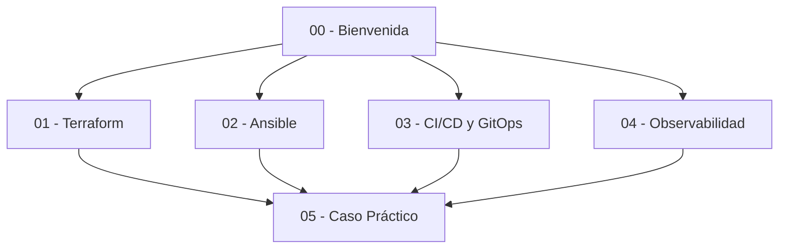
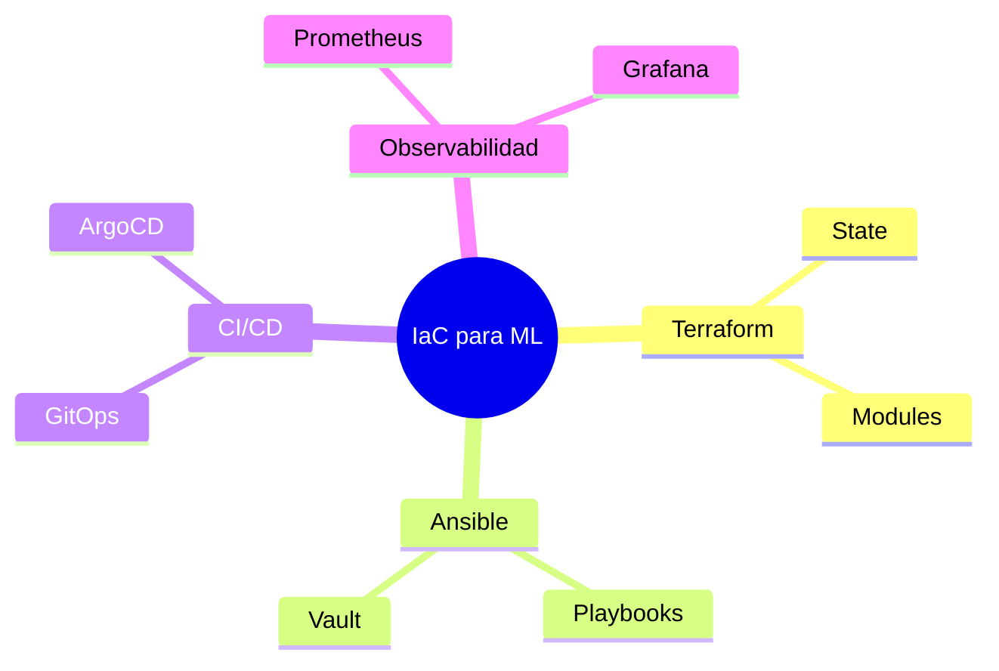

# 🏗️ 23 - Infraestructura como Código

Bienvenido al módulo 23 del programa de ML & AI Engineering.

En el mundo del Machine Learning, la infraestructura es tan crítica como los algoritmos. Desplegar modelos en producción, escalar clusters de entrenamiento y garantizar la reproducibilidad de experimentos requiere disciplina de ingeniería de software. La Infraestructura como Código (IaC) permite gestionar toda esta complejidad de forma declarativa, versionable y automatizada.

> 💡 **Relevancia para ML/AI Engineering**: Un pipeline de entrenamiento que funciona en tu laptop pero no en la nube es un proyecto, no un producto. IaC convierte la infraestructura en un artefacto más del código fuente, permitiendo replicar entornos de staging y producción con precisión milimétrica.


---

## 1. Objetivos del curso

Al finalizar este módulo serás capaz de:

1. Diseñar infraestructura declarativa con Terraform y gestionar su estado de forma remota.
2. Configurar servidores y clusters de forma idempotente con Ansible.
3. Construir pipelines CI/CD y adoptar flujos GitOps para despliegues continuos.
4. Implementar observabilidad completa (métricas, logs, trazas) aplicando principios de SRE.
5. Orquestar un proyecto end-to-end que integre todas las herramientas anteriores.

La curva de aprendizaje puede modelarse como:

$$Mastery = \sum_{i=1}^{n} Practice_i \times Feedback_i$$

Donde cada iteración de práctica con retroalimentación acelera la comprensión de IaC.

---

## 2. Estructura del módulo

| Nota | Título | Descripción |
|------|--------|-------------|
| [[01 - Terraform en Profundidad]] | Terraform en Profundidad | Declaración de infraestructura con HCL, estado remoto y módulos. |
| [[02 - Ansible y Configuracion de Servidores]] | Ansible y Configuración de Servidores | Orquestación de configuración de servidores. |
| [[03 - CI/CD y GitOps]] | CI/CD y GitOps | Pipelines automatizados y despliegue declarativo con GitOps. |
| [[04 - Observabilidad y Monitoreo de Infraestructura]] | Observabilidad y Monitoreo | Métricas, logs, trazas y prácticas SRE. |
| [[05 - Caso Practico - Infraestructura Completa como Codigo]] | Caso Práctico | Proyecto integrador de infraestructura completa. |



---

## 3. Glosario de términos esenciales

| Término | Definición |
|---------|------------|
| **IaC** | Infraestructura como Código; gestión de infraestructura mediante archivos de configuración en lugar de procesos manuales. |
| **Terraform** | Herramienta de IaC declarativa desarrollada por HashiCorp. |
| **HCL** | HashiCorp Configuration Language; lenguaje nativo de Terraform. |
| **Provider** | Plugin que permite a Terraform interactuar con una API de cloud (AWS, GCP, Azure). |
| **Resource** | Componente de infraestructura gestionado por Terraform (ej. `aws_instance`). |
| **State** | Archivo que mapea la configuración declarativa con los recursos reales desplegados. |
| **Module** | Paquete reutilizable de recursos de Terraform. |
| **Ansible** | Herramienta de automatización de configuración sin agentes (agentless). |
| **Playbook** | Script YAML que define una serie de tareas de configuración en Ansible. |
| **Inventory** | Lista de hosts gestionados por Ansible. |
| **CI/CD** | Integración Continua / Entrega Continua; automatización de build, test y deploy. |
| **GitOps** | Paradigma de despliegue donde Git es la única fuente de verdad del estado deseado. |
| **ArgoCD** | Herramienta de GitOps para Kubernetes. |
| **Observability** | Capacidad de inferir el estado interno de un sistema a partir de sus salidas externas. |
| **Monitoring** | Recolección y análisis de métricas para conocer la salud del sistema. |
| **Logging** | Registro de eventos y mensajes de aplicaciones e infraestructura. |
| **Tracing** | Seguimiento distribuido de solicitudes a través de múltiples servicios. |
| **SRE** | Site Reliability Engineering; disciplina que aplica ingeniería de software a problemas de operaciones. |

---

## 4. Cómo usar estas notas

Cada nota está diseñada para ser autónoma pero interconectada. Te recomendamos:

1. Lee la introducción para contextualizar el tema en ML/AI.
2. Estudia las secciones numeradas y ejecuta los bloques de código.
3. Presta atención a las ⚠️ **advertencias** y 💡 **tips**.
4. Consulta los diagramas Mermaid para visualizar arquitecturas.
5. Revisa el 📦 **código de compresión** al final de cada nota para una versión resumida.



---

## 📦 Código de compresión

```hcl
# iac-course-summary.tf
module "course" {
  source   = "./modules/learning"
  topic    = "Infrastructure as Code"
  tools    = ["Terraform", "Ansible", "GitHub Actions", "Prometheus"]
  goal     = "Production-ready ML infrastructure"
}
```

> Caso real: En Netflix, los equipos de ML utilizan Terraform y Spinnaker para desplegar miles de nodos de entrenamiento diariamente, versionando cada cambio de infraestructura con la misma rigurosidad que el código de sus modelos de recomendación.
