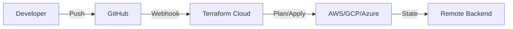
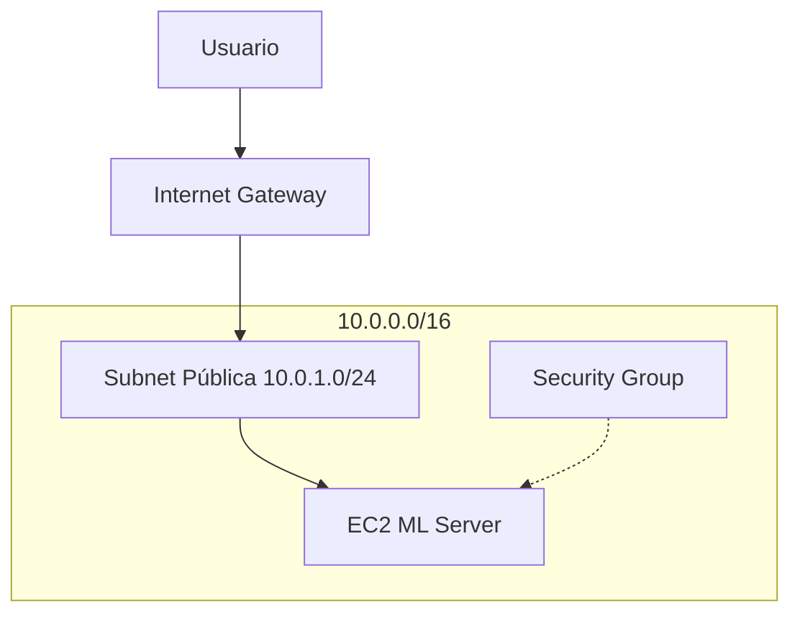

# 🌍 Terraform en Profundidad

El ciclo de vida de un modelo de Machine Learning no termina con el entrenamiento. Para poner un modelo en producción, necesitamos redes, máquinas virtuales, almacenamiento, balanceadores y políticas de seguridad. Terraform convierte esta complejidad en una receta declarativa que puede versionarse, revisarse y reutilizarse.

> 💡 **Relevancia para ML/AI Engineering**: Cuando entrenas un modelo en un cluster de 20 GPUs con AWS, necesitas asegurarte de que cada ingeniero del equipo pueda recrear ese entorno exacto. Terraform elimina la configuración manual y el "funciona en mi máquina".


---

## 1. HashiCorp Configuration Language (HCL)

HCL es un lenguaje de configuración declarativo diseñado por HashiCorp. Su sintaxis es legible por humanos y amigable para herramientas.

Un bloque básico tiene la forma:

```hcl
BLOCK_TYPE "BLOCK_LABEL" "BLOCK_LABEL" {
  # Bloque de configuración
}
```

**Elementos clave**:

- **Attributes**: Asignaciones de valor (`key = value`).
- **Blocks**: Contenedores de configuración (`resource`, `module`, `provider`).
- **Expressions**: Valores dinámicos usando interpolación o funciones.

---

## 2. Providers: AWS, GCP y Azure

Los providers son plugins que traducen la configuración HCL en llamadas a APIs de cloud.

| Provider | Recursos típicos | Plugin oficial |
|----------|-----------------|--------------|
| AWS | `aws_vpc`, `aws_instance`, `aws_s3_bucket` | hashicorp/aws |
| GCP | `google_compute_instance`, `google_storage_bucket` | hashicorp/google |
| Azure | `azurerm_resource_group`, `azurerm_linux_virtual_machine` | hashicorp/azurerm |

⚠️ **Advertencia**: Nunca hardcodees credenciales en archivos `.tf`. Usa variables de entorno o roles de IAM.

---

## 3. Resources y Data Sources

- **Resource**: Representa un componente de infraestructura que Terraform crea, modifica o destruye.
- **Data Source**: Permite leer información de recursos existentes fuera del control de Terraform.

```hcl
data "aws_ami" "ubuntu" {
  most_recent = true
  filter {
    name   = "name"
    values = ["ubuntu/images/hvm-ssd/ubuntu-jammy-22.04-amd64-server-*"]
  }
  owners = ["099720109477"] # Canonical
}

resource "aws_instance" "ml_node" {
  ami           = data.aws_ami.ubuntu.id
  instance_type = "p3.2xlarge" # GPU para entrenamiento

  tags = {
    Name = "ML-Training-Node"
  }
}
```

---

## 4. Variables y Outputs

Las variables parametrizan la configuración. Los outputs exponen información útil.

```hcl
variable "instance_type" {
  description = "Tipo de instancia EC2"
  type        = string
  default     = "t3.medium"
}

output "instance_public_ip" {
  description = "IP pública del nodo ML"
  value       = aws_instance.ml_node.public_ip
}
```

💡 **Tip**: Usa archivos `terraform.tfvars` para separar los valores por entorno.

---

## 5. State File: local vs remoto y locking

El state file (`terraform.tfstate`) es el mapa entre tu configuración y el mundo real.

| Aspecto | State Local | State Remoto |
|---------|-------------|--------------|
| Ubicación | Disco local | S3, GCS, Azure Blob, Terraform Cloud |
| Colaboración | Imposible en equipo | Centralizado |
| Locking | No nativo | Soportado (DynamoDB, etc.) |
| Seguridad | Riesgo de exposición | Cifrado en reposo |

⚠️ **Advertencia**: Perder el state file puede convertirse en un desastre. Terraform perderá la referencia de los recursos creados.

La fórmula de consistencia del estado puede modelarse como:

$$Consistency = \frac{DesiredState \cap ActualState}{DesiredState \cup ActualState}$$

Cuando $Consistency \to 1$, la infraestructura está sincronizada.

---

## 6. Workspaces

Los workspaces permiten mantener múltiples instancias del mismo estado.

```bash
terraform workspace new staging
terraform workspace select staging
terraform workspace list
```

💡 **Tip**: Usa workspaces para entornos ligeros. Para proyectos grandes, prefer módulos o repositorios separados.

---

## 7. Modules y el Terraform Registry

Un módulo es un contenedor reutilizable de recursos. El Terraform Registry alberga miles de módulos verificados.

```hcl
module "vpc" {
  source  = "terraform-aws-modules/vpc/aws"
  version = "5.0.0"

  name = "ml-vpc"
  cidr = "10.0.0.0/16"

  azs             = ["us-east-1a", "us-east-1b"]
  private_subnets = ["10.0.1.0/24", "10.0.2.0/24"]
  public_subnets  = ["10.0.101.0/24", "10.0.102.0/24"]
}
```

---

## 8. Ciclo de vida: plan, apply, destroy, import, taint

| Comando | Propósito |
|---------|-----------|
| `terraform plan` | Muestra los cambios previstos sin ejecutarlos |
| `terraform apply` | Aplica los cambios a la infraestructura |
| `terraform destroy` | Elimina todos los recursos gestionados |
| `terraform import` | Trae recursos existentes bajo gestión de Terraform |
| `terraform taint` | Fuerza la recreación de un recurso en el siguiente apply |

---

## 9. Provisioners

Los provisioners ejecutan acciones locales o remotas durante la creación de recursos.

```hcl
resource "aws_instance" "web" {
  # ... configuración ...

  provisioner "remote-exec" {
    inline = [
      "sudo apt-get update",
      "sudo apt-get install -y python3-pip"
    ]
  }
}
```

⚠️ **Advertencia**: Los provisioners rompen la idempotencia pura. Para configuración compleja, prefer Ansible después del despliegue.

---

## 10. Remote Backend con S3 y DynamoDB

Configurar un backend remoto en AWS garantiza colaboración segura:

```hcl
terraform {
  backend "s3" {
    bucket         = "terraform-state-ml-project"
    key            = "global/s3/terraform.tfstate"
    region         = "us-east-1"
    encrypt        = true
    dynamodb_table = "terraform-locks"
  }
}
```

DynamoDB actúa como mecanismo de locking para evitar ejecuciones simultáneas.

---

## 11. Terraform Cloud

Terraform Cloud ofrece ejecución remota, políticas Sentinel, variables seguras y cost estimation.

> Caso real: Un equipo de MLOps en Spotify utiliza Terraform Cloud para estandarizar la creación de namespaces de Kubernetes donde corren sus jobs de entrenamiento con Kubeflow, aplicando políticas de seguridad automáticas antes de cada `apply`.



---

## 📦 Código de compresión

```hcl
# main.tf - VPC + EC2 completo
terraform {
  required_providers {
    aws = { source = "hashicorp/aws", version = "~> 5.0" }
  }
}

provider "aws" {
  region = var.aws_region
}

variable "aws_region" { default = "us-east-1" }
variable "instance_type" { default = "t3.micro" }

data "aws_ami" "ubuntu" {
  most_recent = true
  filter {
    name   = "name"
    values = ["ubuntu/images/hvm-ssd/ubuntu-jammy-22.04-amd64-server-*"]
  }
  owners = ["099720109477"]
}

resource "aws_vpc" "main" {
  cidr_block           = "10.0.0.0/16"
  enable_dns_hostnames = true
  tags = { Name = "ml-vpc" }
}

resource "aws_subnet" "public" {
  vpc_id                  = aws_vpc.main.id
  cidr_block              = "10.0.1.0/24"
  map_public_ip_on_launch = true
  availability_zone       = "${var.aws_region}a"
  tags = { Name = "ml-public-subnet" }
}

resource "aws_internet_gateway" "gw" {
  vpc_id = aws_vpc.main.id
  tags = { Name = "ml-igw" }
}

resource "aws_route_table" "public" {
  vpc_id = aws_vpc.main.id
  route {
    cidr_block = "0.0.0.0/0"
    gateway_id = aws_internet_gateway.gw.id
  }
}

resource "aws_route_table_association" "public" {
  subnet_id      = aws_subnet.public.id
  route_table_id = aws_route_table.public.id
}

resource "aws_security_group" "allow_ssh" {
  name_prefix = "allow_ssh"
  vpc_id      = aws_vpc.main.id
  ingress {
    from_port   = 22
    to_port     = 22
    protocol    = "tcp"
    cidr_blocks = ["0.0.0.0/0"]
  }
  egress {
    from_port   = 0
    to_port     = 0
    protocol    = "-1"
    cidr_blocks = ["0.0.0.0/0"]
  }
}

resource "aws_instance" "ml_server" {
  ami                    = data.aws_ami.ubuntu.id
  instance_type          = var.instance_type
  subnet_id              = aws_subnet.public.id
  vpc_security_group_ids = [aws_security_group.allow_ssh.id]

  tags = {
    Name = "ML-Server"
  }
}

output "server_public_ip" {
  value = aws_instance.ml_server.public_ip
}
```


